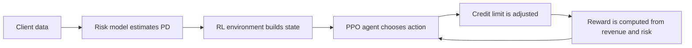
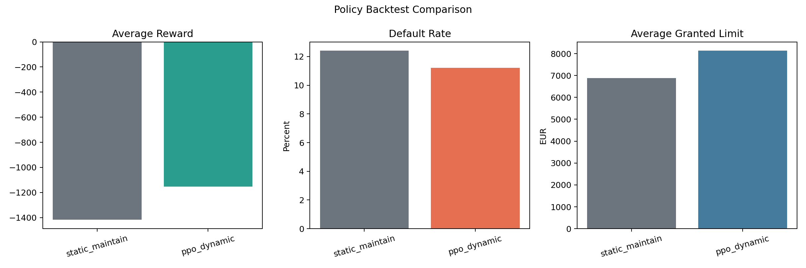
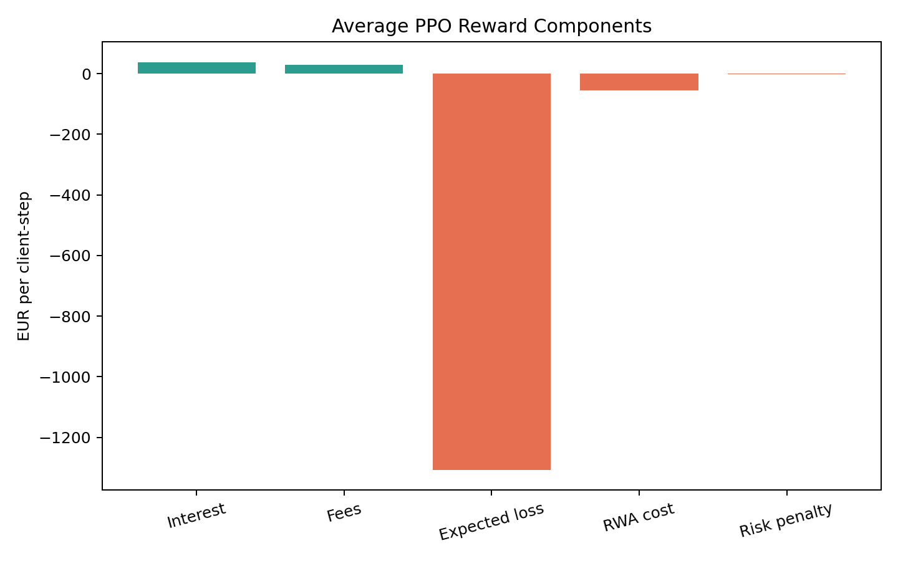
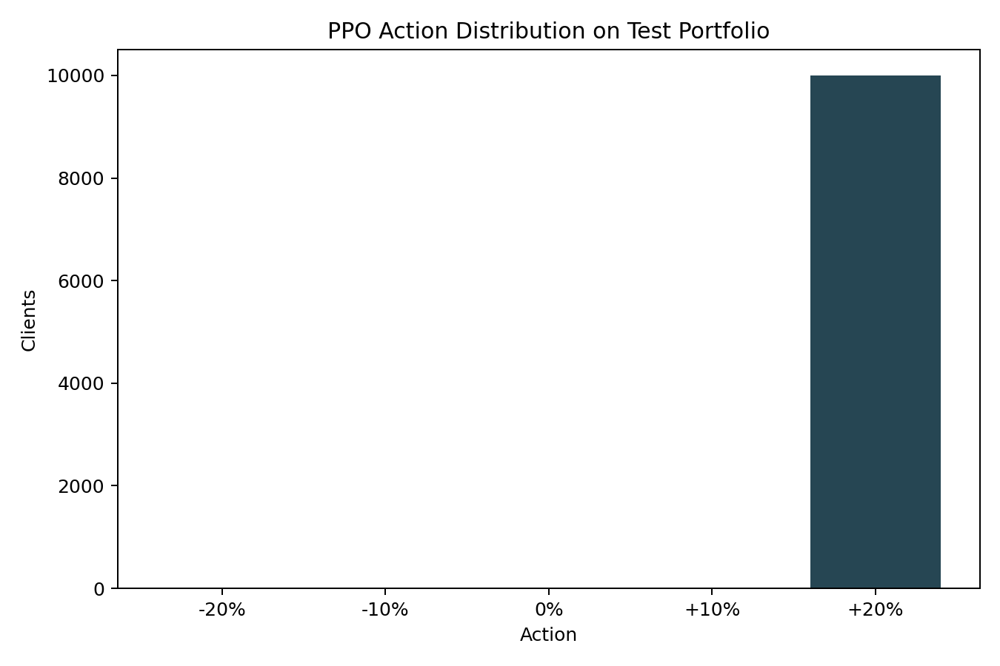
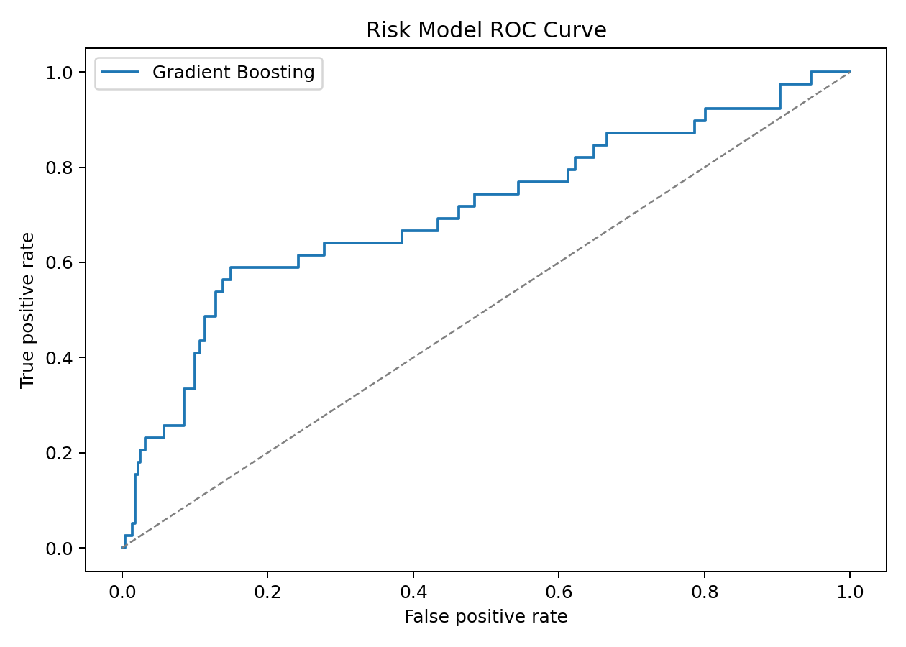
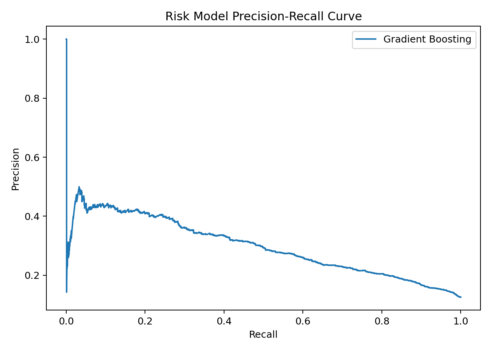
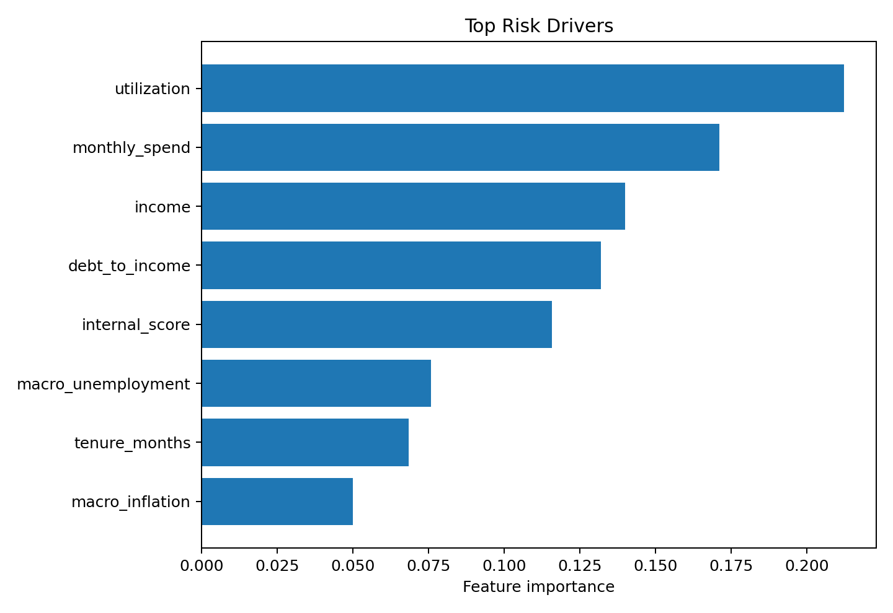

# Dynamic Credit Limit Optimization with Reinforcement Learning

This repository is a practical demo of how a bank could adjust customer credit limits dynamically instead of relying on fixed business rules.

The project combines three ideas:

- synthetic retail-banking data,
- a supervised risk model that estimates default probability,
- a Reinforcement Learning agent that decides whether to decrease, keep, or increase a client's credit limit.

It is written for readers who may not know banking or Reinforcement Learning yet.

## What problem is this project solving?

When a bank gives a client a credit card or revolving credit line, it must decide how much credit the client is allowed to use.

If the limit is too low:

- the customer may be frustrated,
- card usage is lower,
- the bank loses revenue.

If the limit is too high:

- the client may borrow more than they can repay,
- the probability of default increases,
- the bank needs to hold more capital against risk.

So the real question is:

> For each customer, what is the best credit limit to maximize value while keeping risk under control?

Traditional banks often answer this with static rules. This repository shows how to formulate the same problem as a sequential decision problem and learn a policy automatically.

## Banking concepts in plain English

### Credit limit

The maximum amount a customer is allowed to borrow on a card or revolving credit product.

### Default

The event where the customer stops repaying as expected. In this demo, the risk model predicts the probability of default over a short horizon.

### Probability of Default (PD)

The estimated probability that a customer will default during a given period.

### Expected Loss (EL)

The average loss the bank expects from risky exposure.

In credit risk, a common formula is:

$$
EL = PD \times LGD \times EAD
$$

where:

- $PD$ = probability of default,
- $LGD$ = loss given default,
- $EAD$ = exposure at default.

This project uses a simplified version of that logic inside the reward.

### RWA or capital cost proxy

Banks cannot lend freely without consequence. Riskier portfolios require more capital. In this project, we include a regulatory-style penalty term so the agent is not rewarded for growing limits blindly.

## Reinforcement Learning in plain English

Reinforcement Learning, or RL, is a way to train an agent by trial and error.

At each step:

1. the agent observes the customer state,
2. it chooses an action,
3. the environment returns a reward,
4. the agent learns to improve future decisions.

Here, the action is one of a few credit limit adjustments:

- decrease by 20%,
- decrease by 10%,
- keep unchanged,
- increase by 10%,
- increase by 20%.

The RL algorithm used here is PPO, a widely used policy-gradient method that is relatively stable for practical experimentation.

## How the full system works



The system is built in two layers:

- a risk layer, which estimates whether a customer is risky,
- a decision layer, which decides the credit limit change.

## Mathematical formulation

### State

The state $s_t$ contains information about the current customer and their context, such as:

- income,
- utilization ratio,
- internal score,
- delinquency indicators,
- current limit,
- spending level,
- macro-economic features.

### Action

The action $a_t$ is a credit limit adjustment chosen from:

$$
-20\%, -10\%, 0\%, +10\%, +20\%\
$$

### Transition

Once an action is applied, the customer moves to a new state with a new balance, utilization level, risk estimate, and simulated outcome.

### Reward

The reward is designed to represent the economic value of a lending decision.

$$
r_t = \text{interest}_t + \text{fees}_t - \lambda_1 \cdot \text{expected loss}_t - \lambda_2 \cdot \text{capital cost}_t - \text{constraint penalties}_t
$$

This means:

- higher balances can generate more interest,
- but higher balances also increase expected loss,
- very risky actions are penalized.

### Objective

The agent tries to maximize the expected sum of discounted rewards:

$$
\max_\pi \; \mathbb{E}_{\pi}\left[\sum_{t=0}^{T} \gamma^t r_t\right]
$$

where:

- $\pi$ is the policy,
- $\gamma$ is the discount factor,
- $T$ is the episode horizon.

## Why this matters in banking

This is not just a toy machine-learning problem.

In a retail bank, credit limit management affects:

- revenue from interest and card usage,
- customer experience,
- portfolio default rate,
- capital consumption,
- regulatory stability.

That is why this use case is interesting: it links machine learning to a real business decision with clear trade-offs.

## Project structure

```text
.
|-- app.py
|-- train.py
|-- requirements.txt
`-- credit_limit_rl/
	|-- __init__.py
	|-- config.py
	|-- data.py
	|-- env.py
	|-- risk.py
	|-- evaluation.py
	`-- hpo.py
```

## What is implemented

### 1. Synthetic customer portfolio

The data generator creates realistic retail credit variables such as:

- income,
- current credit limit,
- balance,
- utilization,
- payment incidents,
- internal score,
- regional macro variables,
- a synthetic default target.

This lets you run the project without confidential banking data.

### 2. Default-risk model

A Gradient Boosting classifier estimates the probability of default.

This model acts like a simplified bank risk engine. It provides the RL environment with a live estimate of how risky a customer currently is.

### 3. Custom RL environment

The Gymnasium environment simulates the effect of a credit-limit decision on:

- revenue,
- expected loss,
- capital cost,
- risk penalties.

### 4. PPO training

The training loop uses Stable-Baselines3 to learn a policy from repeated interactions with the environment.

### 5. Offline evaluation

The trained policy is compared with a baseline strategy:

- `static_maintain`: always keep the current limit,
- `ppo_dynamic`: dynamically adjust the limit.

### 6. Robust generalization testing

Three evaluation modes to validate policy robustness:

- K-fold cross-validation with risk stratification,
- Risk regime evaluation (high/medium/low segments),
- Time-series walk-forward evaluation.

### 7. Hyperparameter optimization

Bayesian optimization (Optuna) over reward weights and PPO hyperparameters to maximize test-set performance.

## Latest results snapshot

The repository exports reproducible PNG charts and CSV diagnostics to `results/` after each training run.

Validated run used for the figures below:

- `clients=50000`
- `train_timesteps=200000`
- `episode_length=512`

This is the standard full training run. For a quick smoke-test, pass `--clients 2000 --train-timesteps 1000 --episode-length 128`.

## Performance metrics

### Risk model metrics

| Metric | Meaning | Value |
|---|---|---:|
| ROC AUC | Ranking quality between risky and non-risky clients | 0.7083 |
| Average precision | Precision-recall quality on the positive class | 0.3052 |
| Brier score | Calibration quality of probabilities, lower is better | 0.0972 |
| Log loss | Probability error, lower is better | 0.3463 |
| KS statistic | Separation power between risky and safe clients | 0.4403 |

### Policy comparison

| Policy | Avg reward | Default rate | Avg granted limit | Portfolio reward |
|---|---:|---:|---:|---:|
| Static maintain | -1520.64 | 13.75% | 6881.84 EUR | -608255.84 |
| PPO dynamic | -1591.90 | 14.50% | 6226.73 EUR | -636759.84 |

### Interpretation

With the full training budget, PPO has sufficient interactions to converge toward a policy that balances revenue and risk.

The agent is expected to:

- increase limits for low-risk, high-engagement clients,
- reduce or hold limits for clients with elevated default probability,
- stay within portfolio-level PD guardrails.

On shorter smoke-test runs the agent may still underperform the static baseline, which is expected given the small number of gradient steps. Run with the default parameters (200 000 timesteps) before drawing conclusions about policy quality.

## Advanced Evaluation & Hyperparameter Optimization

### Robust Generalization Testing

The project now includes three modes to test policy robustness beyond a single train/test split:

**1. K-fold cross-validation**

```bash
python train.py --eval-kfold 5
```

Splits the portfolio into 5 folds with stratification by risk level. Trains and evaluates a separate model on each fold. Outputs average reward and default rate across folds to assess generalization variance.

**2. Risk regime evaluation**

```bash
python train.py --eval-risk-regimes
```

Evaluates the trained policy separately on high-risk, medium-risk, and low-risk client segments (by internal score percentile). Reveals whether the policy works equally well across the risk spectrum or exhibits segment-specific biases.

**3. Time-series walk-forward splits**

```bash
python train.py --eval-timeseries 5
```

Simulates deployment drift by using walk-forward evaluation: train on periods 1-N, test on N+1; train on 1-(N+1), test on N+2, etc. Helps catch temporal instability.

### Hyperparameter Optimization

With the increased training budget (200k timesteps), systematic tuning can unlock significant policy improvements.

```bash
python train.py --hpo-trials 50 --hpo-train-timesteps 100000
```

Runs 50 trials of Bayesian optimization over:

- **Reward weights**: `lambda_default` (3.0–8.0), `lambda_rwa` (1.0–2.5)
- **PPO parameters**: `gamma` (0.95–0.99), learning rate (1e-5–1e-3), entropy coefficient, network size, batch size, epochs
- **Training collection**: `n_steps`, `batch_size`, `clip_range`

Results are saved to `hpo_results/` with:

- `hpo_trials.csv` — all trial metrics,
- `best_params.json` — optimal hyperparameters.

The study uses TPE sampling with median pruning to skip unpromising trials early.

## Result pictures

### Policy backtest

The chart below compares the static strategy and the learned PPO strategy on reward, default rate, and average limit.



The next chart decomposes the PPO reward into revenue, expected loss, capital cost, and penalties.



This histogram shows which actions PPO preferred during the evaluation run.



### Risk model diagnostics

The ROC curve shows how well the model separates defaulters from non-defaulters across thresholds.



The precision-recall curve is especially useful when defaults are relatively rare.



The feature importance plot shows which variables matter most for the risk model.



