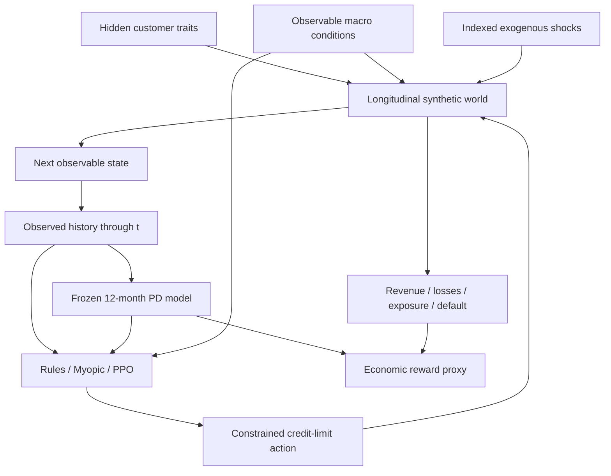
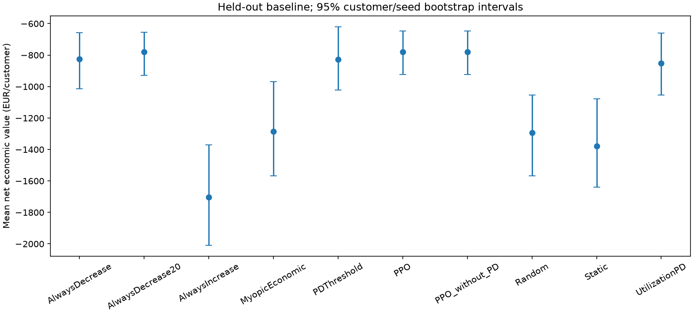
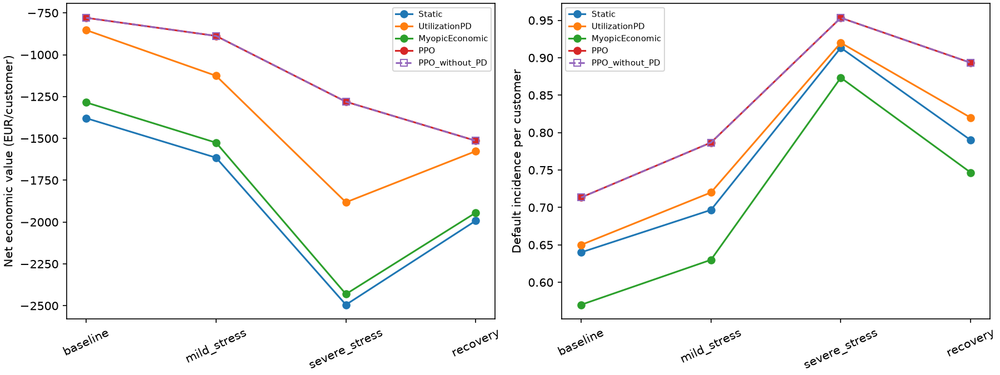
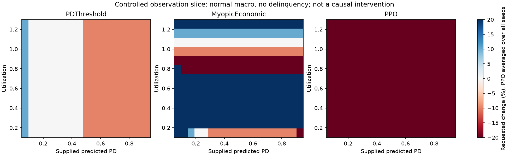

# Dynamic Credit Limit Optimization with Reinforcement Learning

A reproducible experimental platform for **sequential credit-limit decisions under partially observed risk**. A synthetic longitudinal world, an imperfect observable probability-of-default model, and decision policies are separate components.

**Measured finding:** on the held-out baseline, all five PPO seeds reproduce the economic outcomes of always requesting a 20% limit reduction. They reduce losses relative to Static, but increase default incidence. The experiment does **not** establish an advantage from sequential learning or from supplying PD to PPO.

## The decision problem

Credit availability affects purchases, balances, utilization, delinquency and future risk. Each month, a policy observes 21 public features and requests −20%, −10%, unchanged, +10% or +20%. One episode follows one customer until first default or 24 months. PPO maximizes expected discounted reward with **γ = 0.98**.

Limits remain between EUR 500 and 15,000. In the benchmark, three consecutive delinquency months block increases. Reducing a limit never removes outstanding debt. Requested and effective actions are both recorded.


```mermaid
flowchart TD
    Hidden[Hidden customer traits] --> World[Longitudinal synthetic world]
    Macro[Observable macro conditions] --> World
    Shocks[Indexed exogenous shocks] --> World
    History[Observed history through t] --> Risk[Frozen 12-month PD model]
    History --> Policy[Rules / Myopic / PPO]
    Risk --> Policy
    Macro --> Policy
    Policy --> Action[Constrained credit-limit action]
    Action --> World
    World --> Next[Next observable state]
    Next --> History
    World --> Outcomes[Revenue / losses / exposure / default]
    Risk --> Reward[Economic reward proxy]
    Outcomes --> Reward
```

The world generates defaults from hidden customer dynamics. The risk estimator forecasts from observable history; it does not determine the true default mechanism. Deployable policies cannot access hidden traits, true hazard, future shocks or future macro states.

## Synthetic world and observable risk

Persistent creditworthiness, spending propensity, payment propensity and income stability produce heterogeneous behavior. Monthly principal accounting is `next balance = balance − repayment + purchases`. Expansion, normal and stress regimes affect income, spending and default risk. The coefficients are stylized, not fitted to a bank portfolio.

The risk pipeline predicts first default in the next **12 months**, conditional on being active and on history available at the decision. It uses 25 explicit current/history features, chronological customer-disjoint training/validation/calibration/test/OOT cohorts, mature labels and dedicated calibration. Logistic and histogram boosting models are compared using discrimination, calibration and customer-cluster uncertainty.

The benchmark freezes `logistic_calibrated.joblib`. Its PD-model test ROC-AUC is **0.842**, Brier **0.162**; OOT Brier is **0.172**. A useful ranking does not imply calibration under a new action policy. Future actions affect both inputs and outcomes, so PD is policy-dependent rather than a causal estimate for a proposed action. See [risk methodology](docs/pd_model.md) and [risk results](docs/pd_results.md).

## Policies

Every policy runs through the same evaluator and admission rules.

| Deployable information set | Decision |
|---|---|
| Static | Keep the limit |
| AlwaysDecrease / AlwaysDecrease20 | Reduce by 10% / 20% when feasible |
| AlwaysIncrease | Increase by 10% when feasible |
| Random | Uniform among feasible actions; independent reproducible RNG |
| PDThreshold | Increase below PD 0.10; decrease at or above 0.50; otherwise maintain |
| UtilizationPD | Combine those thresholds with utilization ≥0.75 and delinquency |
| MyopicEconomic | Maximize an observable one-step expected-reward surrogate |
| PPO | Trained categorical actor, deterministic evaluation, all five seeds |
| PPO_without_PD | Same training budget and seeds, explicit actor PD coordinate removed |

The myopic baseline estimates repayment, purchases and action-sensitive risk from public information and declared approximations. It never calls the hidden DGP. Its complete equations and all rules are in [policy methodology](docs/policy_evaluation.md).

A separate **SIMULATOR-ONLY ORACLE** uses hidden traits and independent hypothetical shocks for one-step decisions. It is neither deployable nor an upper bound on multi-period performance; its results are separated from same-information comparisons.

## Controlled evaluation

- **Populations:** 1,500 training, 100 validation and 300 final test customers with disjoint IDs and seed namespaces. An additional 300-customer Markov cohort is independent synthetic generalization, not an empirical calendar OOT test.
- **Pairing:** policies receive identical initial observed/latent states, macro paths and indexed exogenous shocks. Different actions change endogenous states without shifting future random draws.
- **Selection:** thresholds and two PPO pilot settings use validation only. Five seeds with PD and five without PD each train for 32,768 transitions. Each actor/critic has two 64-unit tanh layers. The selected checkpoint maximizes validation discounted raw reward, earliest on a tie.
- **Scaling:** fixed bounded public observations and a fixed EUR-to-kEUR reward conversion. No normalization statistics are learned from test customers.
- **Uncertainty:** 300 bootstrap replicates resample whole customers, jointly across PPO seeds, with seed resampling. Paired differences subtract outcomes for the same customer. Shared macro-path uncertainty is outside these intervals.
- **Robustness:** baseline, mild stress, severe stress, recovery, the independent Markov cohort, and actor-visible PD halved while reward and world inputs remain unchanged.

## Economic and risk results

Baseline results use 300 held-out customers over up to 24 months. PPO rows average **all five training seeds**. Values are EUR per initial customer. Default incidence is defaults divided by initial customers.

| Policy | Net economic value | Revenue | Credit loss | Default incidence |
|---|---:|---:|---:|---:|
| Static | −1,379.3 | 1,012.6 | 2,237.3 | 64.0% |
| AlwaysDecrease | −826.2 | 600.5 | 1,336.4 | 65.3% |
| AlwaysDecrease20 | −779.4 | 385.3 | 1,105.9 | 71.3% |
| AlwaysIncrease | −1,703.1 | 1,103.2 | 2,638.0 | 59.3% |
| Random | −1,294.6 | 912.7 | 2,068.4 | 64.3% |
| PDThreshold | −828.0 | 802.7 | 1,511.5 | 64.0% |
| UtilizationPD | −852.9 | 799.0 | 1,533.0 | 65.0% |
| MyopicEconomic | −1,285.2 | 1,066.2 | 2,191.3 | 57.0% |
| PPO | −779.4 | 385.3 | 1,105.9 | 71.3% |
| PPO_without_PD | −779.4 | 385.3 | 1,105.9 | 71.3% |

**Net economic value** is recognized interest plus fees, minus realized credit losses and funding. It excludes the synthetic capital charge and risk penalty. **Reward** subtracts those additional terms: PPO cumulative reward is −2,363.5 EUR/customer versus −5,588.6 for Static. No terminal loan valuation is included. These proxies are not accounting profit.

PPO's baseline value has a 95% customer/seed bootstrap interval of **[−923.6, −646.3] EUR**. Its paired value difference versus Static is **+599.9 [405.2, 801.4] EUR**, alongside **+7.3 [3.8, 11.2] percentage points of default incidence**. Across training seeds, the standard deviation of the baseline value is zero because deterministic outcomes coincide; customer uncertainty remains substantial.

Compared with MyopicEconomic, PPO gains **505.8 [276.5, 706.1] EUR** but increases defaults by **14.3 [10.5, 19.2] points**. The constant −20% rule reproduces the gain. This provides no evidence of learned continuation value. Cutting limits reduces exposure but can push outstanding balances above limits and worsen utilization-driven risk. Increasing limits produces more revenue and larger losses here, while sometimes lowering default frequency.





Under severe stress, PPO reaches **95.3% defaults** with value **−1,280.8 EUR/customer**; recovery produces **89.3% defaults** and **−1,514.1 EUR**. Its constant action does not adapt to recovery. On the independent Markov cohort, the −10% rule has a better mean value than PPO (−703.4 versus −738.3 EUR), with fewer defaults. These results remain conditional on the synthetic scenarios.



The [complete measured report](docs/policy_results.md) includes stress outcomes, risk alerts, all seed results, churn, trajectories, PD feedback and runtime. [Machine-readable summary](outputs/results/policy_evaluation/summary.csv), [paired comparisons](outputs/results/policy_evaluation/paired_comparisons.csv) and [individual seeds](outputs/results/policy_evaluation/seed_metrics.csv) retain the full evidence. Large models and trajectories are generated locally and excluded from Git.

## Reproduction

Python 3.11+ with pip and setuptools is required. Run from the repository root:

```shell
python -m pip install -e ".[dev,experiments,rl]" --no-build-isolation
python -m pytest -q
python -m experiments.train_pd
python -m experiments.pd_env_smoke
python -m experiments.compare_policies --stage audit
python -m experiments.compare_policies --stage smoke
python -m experiments.compare_policies --stage train
python -m experiments.compare_policies --stage evaluate
python -m experiments.compare_policies --stage figures
```

The local tested interpreter is `.venv\Scripts\python.exe`; use it instead of `python` when the Windows application alias is unresolved. Dependencies need installation access; experiments then run locally without external datasets or services. `--stage all` composes audit, train, evaluate and figures. Completed training agents are reused when input fingerprints match. Use `--output` for a separate experiment directory.

The executed suite has **108 passing tests**. Main training completed all ten runs; final evaluation covers 102 policy/seed/scenario combinations and 341,051 transitions. The report records timings and the checks performed.

Settings are centralized in `configs/simulation.yaml`, its macro configuration, `configs/pd_model.yaml` and `configs/policy_evaluation.yaml`. Manifests record configuration, package versions, source hashes and PD artifact identity. The [experiment guide](experiments/README.md) describes independent stages and artifact requirements.

## Repository

```text
src/credit_rl/simulation/   Hidden dynamics, customer states, macro paths and shocks
src/credit_rl/risk/         Observable features, labels, PD fitting and diagnostics
src/credit_rl/envs/         Gymnasium interface, observations and action projection
src/credit_rl/policies/     Rules, myopic/oracle adapters, PPO training and validation
src/credit_rl/evaluation/   Shared scenarios, paired metrics and policy diagnostics
experiments/               Executable risk and policy experiments
configs/                   Centralized simulation, risk and policy settings
tests/                     Leakage, accounting, pairing and saved-model checks
docs/                      Equations, audits and measured reports
outputs/                   Models, detailed traces, tables, manifests and figures
```

## Limits and research priorities

The synthetic portfolio has very high default rates. Reward capital charges use a stylized monthly proxy driven by a 12-month PD; their magnitude materially shapes incentives. Terminal valuation, customer welfare, operational adjustment costs and detailed recovery timing are absent. Portfolio risk alerts are experimental, not regulatory, and do not guarantee feasibility. The myopic surrogate has assumed action sensitivities; PPO has a modest budget, one pilot seed and fixed training trajectories.

Customer/seed intervals do not capture uncertainty in the DGP or common macro scenarios. Policy-induced PD shift remains unresolved, and decisions after month 12 lack a full 12-month outcome window within these episodes. Results establish neither real-world profitability nor a deployable lending policy.

Priorities are horizon-consistent economic validation, terminal accounting, independent macro-path replication, stronger observable transition estimates, policy-conditioned risk calibration, and empirical validation. The [full report](docs/policy_results.md) ranks concrete next steps without expanding the algorithm list.
