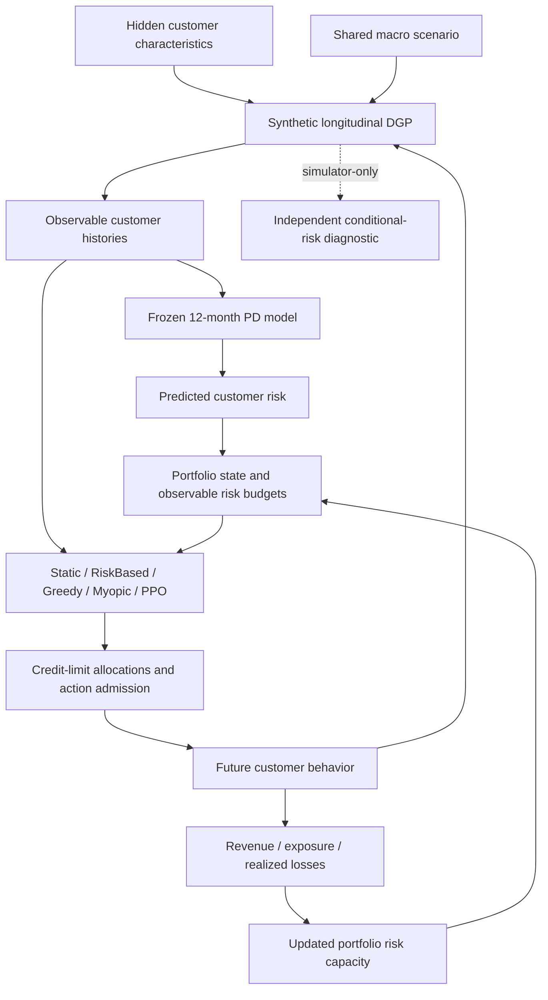
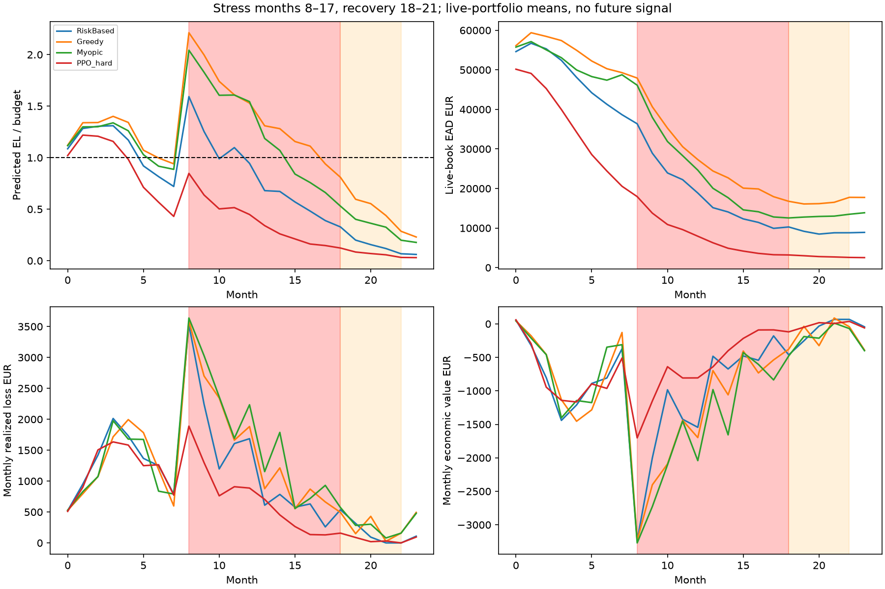
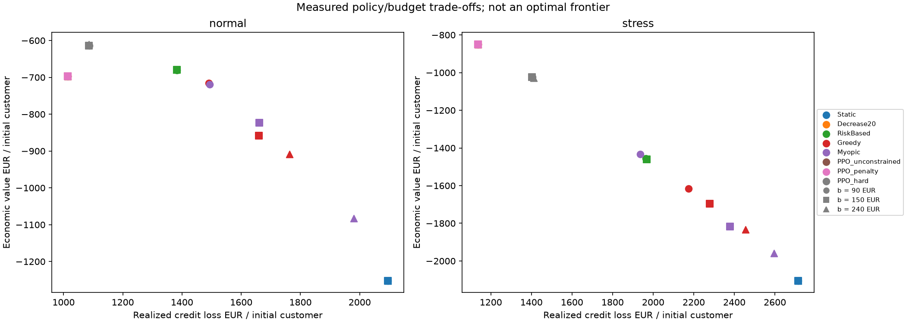

# Risk-Constrained Sequential Credit Decisioning

Dynamic credit-limit allocation as a **partially observed, risk-constrained sequential decision problem**. This research repository combines longitudinal credit simulation, an imperfect ML probability-of-default model, shared portfolio capacity, observable allocation baselines and standard PPO. Decisions affect future behavior, exposure, losses and the capacity available for subsequent allocations.

Mathematically, credit-limit allocation is a **sequential decision-making problem under uncertainty**. At allocation step $t$, the policy observes $O_t$, combining the current customer's credit, behavioral, predicted-risk and macroeconomic features with the portfolio's exposure and remaining risk capacity, and requests an action $A_t$. The full simulator state $X_t$ additionally contains latent customer characteristics and the allocation context. A stochastic **Data Generating Process (DGP)** governs customer behavior, repayment and default, inducing the controlled transition distribution $P(X_{t+1}\mid X_t,A_t)$; customer dynamics advance only after all active clients receive their monthly allocation. The full-state process admits an MDP representation $\mathcal{M}=(\mathcal{X},\mathcal{A},P,R,\gamma)$, while the decision-maker faces partial observability because $O_t$ does not reveal $X_t$. The implemented policy $\pi_\theta(A_t\mid O_t)$ seeks to maximize

$$
J(\pi_\theta)=\mathbb{E}_{\pi_\theta}\left[\sum_{t=0}^{T-1}\gamma^tR_t\right],\qquad \gamma=1.
$$

Here $T$ is the terminal allocation step at portfolio extinction or the 24-month horizon. Reward is zero within monthly allocation and then equals scaled portfolio revenue minus realized credit losses and funding; the penalized formulation additionally subtracts the EL-budget shortfall penalty, while hard admission constrains effective actions. For the observable history $H_t$, the finite-horizon Bellman recursion and advantage are

$$
V_t^\pi(h)=\mathbb{E}_\pi\left[R_t+\gamma V_{t+1}^\pi(H_{t+1})\mid H_t=h\right],\qquad V_T^\pi=0,
\qquad A_t^\pi(h,a)=Q_t^\pi(h,a)-V_t^\pi(h).
$$

**Proximal Policy Optimization (PPO)** uses a clipped policy objective and **Generalized Advantage Estimation (GAE)** to estimate improvements over the critic's expected return. The implemented actor and critic use the compact observation $O_t$, not the complete history or hidden state; this approximation does not make the observable process fully Markov or guarantee optimality. Evaluation compares learned policies with non-RL baselines under matched stochastic scenarios, with explicit attention to **DGP misspecification, partial observability, reward specification, model risk, simulator overfitting, distribution shift and loss tails**: strong performance in a synthetic world does not establish robustness in the underlying economic system.

**Measured finding:** hard-admission PPO improves mean value over the Myopic surrogate, but does not establish an advantage over constant contraction or learned reuse of future risk capacity. Deterministic portfolio OPE has zero effective trajectory support.

## Decision system


```mermaid
flowchart TD
    Hidden[Hidden customer characteristics] --> DGP[Synthetic longitudinal DGP]
    Macro[Shared macro scenario] --> DGP
    DGP --> Public[Observable customer histories]
    Public --> PD[Frozen 12-month PD model]
    PD --> Risk[Predicted customer risk]
    Risk --> Book[Portfolio state and observable risk budgets]
    Public --> Policy[Static / RiskBased / Greedy / Myopic / PPO]
    Book --> Policy
    Policy --> Allocation[Credit-limit allocations and action admission]
    Allocation --> Behavior[Future customer behavior]
    Behavior --> DGP
    Behavior --> Outcomes[Revenue / exposure / realized losses]
    Outcomes --> Update[Updated portfolio risk capacity]
    Update --> Book
    DGP -. simulator-only .-> Diagnostic[Independent conditional-risk diagnostic]
```

One episode follows a closed portfolio for up to 24 months. Each month, active clients receive commands in a reproducible random order; accepted limits immediately affect shared capacity. All clients then advance together under common macro and indexed shocks. Defaults are absorbing and their losses remain recorded. No future customer transition is revealed during allocation.

The economic objective is `max_pi E[sum_t (interest + fees - credit losses - funding)]`. With current balance B, proposed limit L, visible PD p and safety factor s:

```text
EAD_i = B_i + 0.5 * max(L_i - B_i, 0)
q_i = 1 - (1 - min(s * p_i, 1))^(1/12)
EL_i = q_i * 0.55 * EAD_i
portfolio_EL = sum_i EL_i <= monthly risk budget
remaining capacity = max(0, budget - portfolio_EL)
shortfall = max(0, portfolio_EL - budget)
```

EAD includes drawn debt and half the undrawn commitment; reducing a limit does not erase debt. The monthly PD conversion is a flat-hazard approximation, not a calibrated monthly or action-specific forecast. Budgets are synthetic risk stocks, recomputed each month, rather than cash balances permanently depleted by estimated loss.

The experiment varies monthly EL allowance across 90, 150 and 240 EUR per initial customer. A configurable current-stress rule multiplies it by 0.75. Separate limits cap EAD at 8,000 EUR per initial customer and high-risk EAD at 80% of total EAD (PD>0.6). Individual commands are −20%, −10%, unchanged, +10%, +20%; limits stay within 500–15,000 EUR and severe delinquency blocks increases.

**Hard admission means no new immediate breach and no worsening of an inherited breach.** It does not guarantee that the portfolio is always feasible: existing debt, worsening PDs and a shrinking macro budget can produce deficits. Remaining capacity and uncensored shortfalls are both recorded. No claim of general safe RL or regulatory compliance is made. [Exact equations and chronology](docs/portfolio_decisioning.md).

## Policies and information

| Policy | Allocation mechanism |
|---|---|
| Static / Decrease20 | No-change / constant maximum-contraction controls |
| RiskBased / BufferedRiskBased | PD-threshold requests with hard admission; optional validation-selected reserve factor |
| Greedy | Positive one-step economic gain per incremental expected loss |
| Myopic | Multiple-choice integer optimization under EL, EAD and concentration ceilings |
| PPO_unconstrained | Standard PPO with individual action guards |
| PPO_penalty | Standard PPO with a monthly EL-shortfall penalty |
| PPO_hard | Standard PPO with the common hard admission rule |

The Myopic proposal is optimal when the solver certifies it; sequential execution can reject proposals before a later customer's capacity release. Its surrogate uses observable information and frozen nominal assumptions. PPO receives 21 customer features plus 13 portfolio features, including remaining budget and shortfall. Batch baselines can inspect the public book; PPO has a compact representation, not an information advantage. Every requested command, effective change and rejection reason is logged.

The calibrated PD pipeline uses point-in-time history, mature 12-month labels, customer-disjoint temporal cohorts and separate calibration. The frozen model's PD-test AUC is 0.842 and Brier score 0.162. [PD methodology](docs/pd_model.md); [PD measurements](docs/pd_results.md).

## Evaluation design

Held-out portfolios share initial customers, latent traits, macro paths and indexed exogenous shocks across policies. The standard protocol evaluates three PPO seeds (101,202,303) for each formulation, using 24 paired portfolios per main case, N=12, three budgets and normal/stress macro. Each final model trains for 24,576 allocation decisions with gamma=1 and a finite terminal horizon. Lambda and the buffer are selected on eight validation portfolios, independently of final evaluation.

Separate tests cover PD intercept/slope/noise errors, reserve factors, constant/dynamic budgets, portfolio sizes 8/24, decision order and three sampled DGP worlds. Monetary contributions and default incidence divide by initial population. Violation rates average observed portfolio-months before extinction. Confidence intervals resample whole paired portfolios and training seeds, never independent customer-months. Independent loss replications preserve individual seed distributions; unsupported tail quantiles are withheld.

## Measured portfolio results

The verified standard panel contains **4,680 portfolio episodes** across 21 cases;
nine PPO checkpoints represent all three seeds and formulations. At the medium
budget under normal macro:

| Policy | Value EUR/client | Loss EUR/client | EL / budget | EL breach months |
| --- | --- | --- | --- | --- |
| Static | -1,251.78 | 2,095.15 | 0.87 | 38.19% |
| Decrease20 | -696.56 | 1,014.55 | 0.30 | 10.76% |
| RiskBased | -679.37 | 1,382.11 | 0.57 | 19.27% |
| BufferedRiskBased | -679.37 | 1,382.11 | 0.57 | 19.27% |
| Greedy | -857.72 | 1,659.88 | 0.86 | 36.46% |
| Myopic | -822.81 | 1,661.01 | 0.86 | 33.33% |
| PPO_unconstrained | -696.76 | 1,014.55 | 0.30 | 10.76% |
| PPO_penalty | -696.76 | 1,014.55 | 0.30 | 10.76% |
| PPO_hard | -613.40 | 1,085.53 | 0.39 | 13.83% |

PPO_hard minus Myopic has paired value difference **+209.41 [+35.89, +396.60] EUR/client**
(95% crossed portfolio/seed bootstrap). Against fixed −20%, the difference is
**+83.16 [-20.04, +235.12]**. Two hard-PPO seeds use fixed contraction;
the third mainly alternates holding and reducing. There is no demonstrated strategy
of preserving capacity and deploying it later.
Compared with Myopic, nominal hard PPO also has **7.06 percentage points more defaults [0.80, 13.19]**, despite lower realized losses.

Under stress, PPO_hard value is **-1,022.9 EUR/client** versus
**-1,816.8** for Myopic and **-849.9**
for fixed −20%. Its predicted EL violation rate is **19.3%**;
hard admission does not remove inherited or exogenous deficits.





Independent loss evaluation adds 200 portfolios per policy instance: P90 is reported,
while P95/P99 are withheld for insufficient tail support. The complete [A–W report](docs/portfolio_results.md)
contains all seeds, budget levels, diagnostic mismatches, stress, shifted worlds,
paired intervals and limitations. [Machine-readable summary](outputs/results/portfolio/standard/summary.csv).

## Simulator-only risk diagnostics

The policy and admission layer use **predicted risk**. A separate diagnostic integrates the hidden DGP over 16 independent hypothetical shocks per active client to estimate next-month expected realized loss, with Monte Carlo uncertainty. It does not reveal future realized shocks and never feeds observation, action admission or reward. Comparing it to the same budget distinguishes both-safe, predicted-only-safe, simulator-only-safe and both-violated states.

In the matched eight-portfolio PD-underestimation test, RiskBased reports **10.94 percentage points fewer predicted breach months**, while the simulator diagnostic reports **5.21 points more** and value falls **244.65 EUR/client**. Apparent feasibility can improve while actual simulated risk worsens.

That difference includes PD horizon, EAD and behavior-model mismatch; it is not solely a calibration error. There is no portfolio oracle allocation or optimal-value upper bound. Synthetic diagnostic feasibility cannot certify realized losses or banking safety.

## Off-policy evaluation

The portfolio logger stores public transitions, the risk state, remaining budget, constraint status and known command propensities. IS/WIS multiply ratios over the **whole coupled portfolio**. Hard-policy targets share the behavior policy's hard transition kernel; soft/unconstrained kernels are excluded from this estimator. Positive command probability does not ensure usable trajectory support.

The measured portfolio log contains **100 portfolios and 17,069 decisions**.
All deterministic targets have **ESS 0**: no sampled whole trajectory has nonzero
weight. Their WIS is undefined; the numerical IS zero is not a credible value estimate.
The behavior self-check has ESS 100 and mean value −860.74 EUR/client.

The independent-customer OPE study also remains available, with separate Monte Carlo references and support diagnostics. [OPE method and limitations](docs/off_policy_evaluation.md); [customer robustness/OPE results](docs/robustness_results.md).

## Scientific safeguards and limits

Hidden traits, true hazards, future macro and future defaults remain unavailable to deployable policies. PD features are point-in-time; validation and final portfolios are separated; comparisons use common random numbers and every declared PPO seed. The risk constraints use observable forecasts, while simulator-only risk is explicitly diagnostic. Source/config/model hashes, individual seed results, stress tests and distribution-shift experiments support reproducibility.

The DGP, behavioral responses, macro regimes and budgets are synthetic. EAD and LGD are simplified; there is no bank data, Basel/IRB or IFRS 9 calibration, regulatory capital engine, deployment validation, terminal receivable valuation or customer-welfare objective. A closed book shrinks after defaults. Three training seeds and three portfolio DGP worlds provide limited robustness evidence. Policy-conditioned PD errors, compact PPO information, an approximate executed Myopic allocation and sparse trajectory support limit interpretation. [Full measured report and research priorities](docs/portfolio_results.md).

The three sampled portfolio worlds all contain predicted and simulator-diagnostic breaches. Hard PPO has worse mean value than fixed −20% in each; these experiments do not demonstrate robustness in real credit portfolios.

## Reproduce

Python 3.11+; run from the repository root. The tested Windows interpreter is `.venv\Scripts\python.exe`, used in place of `python` when the system alias is unavailable.

```shell
python -m pip install -e ".[dev,experiments,rl]" --no-build-isolation
python -m pytest -q
python -m experiments.dgp_sanity --customers 100 --seed 42 --output outputs/portfolio_dgp_check
python -m experiments.train_pd
python -m experiments.pd_env_smoke
python -m experiments.portfolio_constraints --profile smoke --stage all
python -m experiments.portfolio_constraints --profile standard --stage train
python -m experiments.portfolio_constraints --profile standard --stage evaluate
python -m experiments.portfolio_constraints --profile standard --stage tail
python -m experiments.portfolio_constraints --profile standard --stage ope
python -m experiments.portfolio_constraints --profile standard --stage report
python -m experiments.verify_portfolio --profile standard
```

**138 tests pass, with no failures or skips.** Standard paired evaluation took **12.94 minutes** with three worker processes (932 allocation decisions/s, including hidden-risk diagnostics and logging). Final PPO fits took **7.37 minutes** in aggregate; tail evaluation took **7.32 minutes** and OPE **0.99 minutes**, overlapping paired evaluation. Full is configured but not executed.

Generate the PD artifact once before registering a portfolio run; retraining it changes the frozen experiment identity. `train` fits portfolio PPO; `evaluate` runs frozen paired policies; `tail` generates independent loss replications. `smoke`, `standard` and `full` budgets are declared in configuration; full is not a unit test or a completed result. Matching jobs resume; changed raw inputs require a separate preserved run. Compact results and figures are versionable; large models and raw logs are local generated artifacts.

The independent-customer policy, robustness and OPE commands are:

```shell
python -m experiments.compare_policies --stage train
python -m experiments.compare_policies --stage evaluate
python -m experiments.robustness --profile standard --stage evaluate
python -m experiments.robustness --profile standard --stage report
python -m experiments.off_policy_evaluation --profile standard --stage evaluate
python -m experiments.off_policy_evaluation --profile standard --stage report
```

They require their own selected customer-policy checkpoints. [Experiment guide](experiments/README.md) documents prerequisites and stages; [portfolio registry](outputs/experiments/portfolio/standard/manifest.json) records exact seeds, configurations, hashes and package versions.

| Location | Responsibility |
|---|---|
| `src/credit_rl/simulation/` | Hidden longitudinal dynamics, macro paths and indexed shocks |
| `src/credit_rl/risk/` | Point-in-time features, labels, PD estimation and calibration |
| `src/credit_rl/envs/`, `policies/` | Customer environments, action guards and decision models |
| `src/credit_rl/portfolio/` | Synchronized portfolio, risk accounting, allocation and reports |
| `src/credit_rl/evaluation/` | Shared evaluation, shifted worlds, inference and OPE |
| `experiments/`, `configs/`, `tests/` | Executable studies, declared settings and verification |
| `outputs/{models,results,figures,experiments}/portfolio/` | Generated models, tables, plots and provenance |
| `docs/` | Methods, measured results and limitations |
