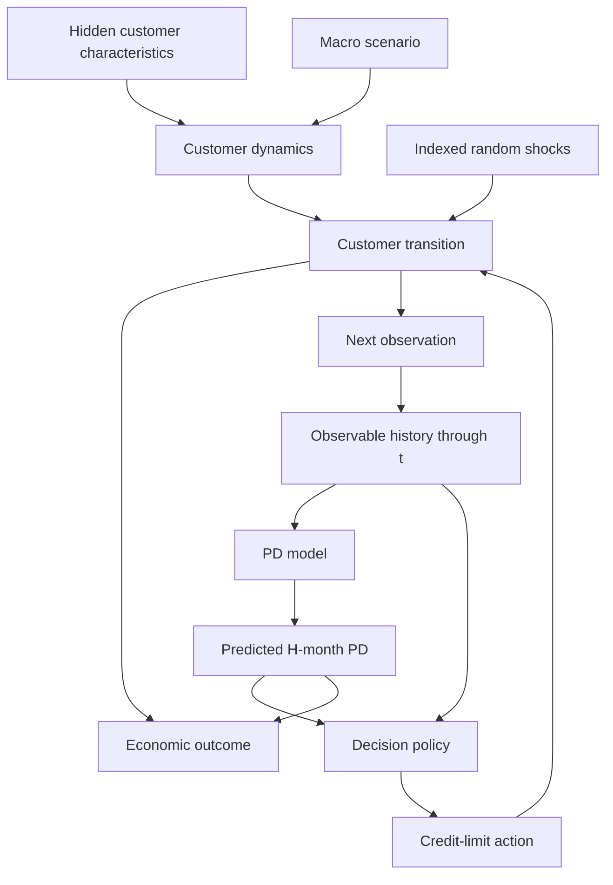
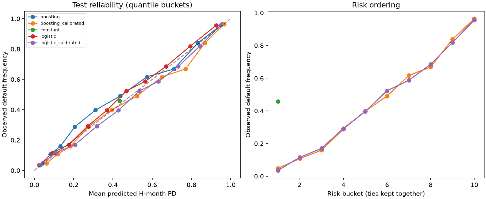
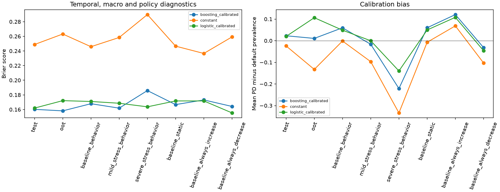

# Dynamic Credit Limit Optimization with Reinforcement Learning

A reproducible research environment for **credit-risk modeling and sequential credit-limit decisions**. A hidden synthetic world generates customer trajectories; a separate probability-of-default model observes only information available at each decision.

## Motivation

A credit-limit decision changes more than immediate revenue. Available credit affects spending, balances, utilization, subsequent risk estimates and future decisions. A static analysis can miss those delayed effects. This project studies them with controlled simulation, observable risk models, baseline policies and a Gymnasium interface. It does not assume reinforcement learning will outperform simpler rules.

## Problem formulation

At month t, a policy chooses a limit multiplier from −20%, −10%, unchanged, +10%, +20%, subject to bounds. Each episode follows one customer for up to 24 months or first default. The economic reward combines interest and fee proxies, realized credit losses, funding costs, a capital charge and a risk penalty.

The independent risk estimator targets:

**PD(i,t,H) = P(first default in (t,t+H] | observable history through t, active at t)**,

with **H=12 months** by default. Future actions follow the modeling behavior policy; this is a predictive, policy-dependent probability, not a causal estimate for a proposed action.

## System architecture


```mermaid
flowchart TD
    Hidden[Hidden customer characteristics] --> Dynamics[Customer dynamics]
    Macro[Macro scenario] --> Dynamics
    History[Observable history through t] --> PD[PD model]
    PD --> Forecast[Predicted H-month PD]
    Forecast --> Policy[Decision policy]
    History --> Policy
    Policy --> Action[Credit-limit action]
    Action --> Transition[Customer transition]
    Dynamics --> Transition
    Shocks[Indexed random shocks] --> Transition
    Transition --> Outcome[Economic outcome]
    Transition --> Next[Next observation]
    Forecast --> Outcome
    Next --> History
```

The DGP determines realized behavior and default independently of the risk estimator. Predicted PD informs the policy and reward proxies; it does not determine the simulator's true default hazard.

## Synthetic longitudinal environment

Persistent hidden creditworthiness, spending propensity, payment propensity and income stability create customer heterogeneity. Observable income, spending, payment ratios, balances, behavioral scores and delinquency evolve monthly. Balance accounting follows `B_next = B - repayment + purchases`; reducing a limit never erases outstanding debt.

Expansion, normal and stress regimes influence behavior and default. Common random numbers align customer/month/shock channels across controlled policy comparisons. The world is partially observable: similar observed customers can have different latent characteristics and outcomes.

The DGP is **synthetic and stylized**. Neither coefficients nor macro dynamics are calibrated to a real bank portfolio. [Structural equations](docs/dgp.md) describe its assumptions.

## Probability of Default modeling

The reproducible pipeline builds multiple point-in-time snapshots per customer using an explicit 25-feature schema. It combines current observable measurements with strictly backward-looking history. Short histories use training-only imputation and missing indicators.

- Twelve-month labels require a complete planned performance window; unresolved censored windows never become zeros.
- Chronological, customer-disjoint train/validation/calibration/test/OOT cohorts have non-overlapping label-maturity periods.
- Models include a training-prevalence baseline, logistic regression and histogram gradient boosting, with raw and separately sigmoid-calibrated probabilities.
- Evaluation covers ROC-AUC, average precision, Brier score, log loss, calibration, risk deciles, subgroups, time drift and customer-cluster bootstrap intervals.
- Baseline/mild/severe macro scenarios and static/increase/decrease policies expose distribution shift.

**True simulator risk ≠ predicted PD.** The hidden closing monthly hazard is not the same quantity as a forecast over the next 12 months. It is used only in clearly labeled trajectory diagnostics.

The [methodology](docs/pd_model.md) specifies the information cutoff, features, censoring, splits and limits. The [measured report](docs/pd_results.md) contains complete tables and uncertainty intervals.

## Sequential decision interface

`LongitudinalPDModel.load(path)` returns a bundled estimator, preprocessing and calibrator. Pass it to `CreditLimitEnv(..., pd_model=model)`: the environment computes PD from at most seven observed snapshots before the next action. The online path uses NumPy arrays and no Pandas feature construction. The assumed-coefficient fallback remains explicit when no artifact is supplied; it is not a calibrated 12-month PD.

The supplied PPO script consumes a trained longitudinal PD artifact. Its short integration run demonstrates compatibility, not economic superiority. Reward coefficients and risk thresholds remain stylized and require horizon-aware economic validation.

## Repository structure

```text
configs/                    Simulation, macro and PD experiment settings
src/credit_rl/
  simulation/               Hidden DGP, behavior, macro paths and shocks
  risk/                     Features, labels, fitting, calibration and evaluation
  envs/                     Gymnasium observation and decision interface
  policies/                 Static, threshold and constant-action baselines
  evaluation/               DGP and economic diagnostics
experiments/                PD pipeline, environment smoke test, DGP and PPO runs
tests/                      Timing, leakage, accounting and reproducibility checks
docs/                       Methodology, audit and measured results
outputs/{models,results,figures}/pd/
                            Bundled estimators, CSV/JSON diagnostics and figures
```

## Installation

Python 3.11+ is required. From the repository root, use a Python environment with pip and setuptools installed:

```shell
python -m pip install -e ".[dev,experiments]" --no-build-isolation
```

On this Windows checkout, `.venv\Scripts\python.exe` is the tested interpreter; use that path instead of `python` if the Windows application alias is unresolved. No external datasets or network services are needed to run the experiments after dependencies are installed.

## Reproducing the experiments

Run from the repository root:

```shell
python -m pytest -q
python -m experiments.train_pd
python -m experiments.train_pd --evaluate-only
python -m experiments.pd_env_smoke
python -m experiments.dgp_sanity --customers 100 --seed 42 --output outputs/pd_dgp_check
```

Training also runs evaluation and generates figures automatically. Evaluation-only loads saved models/datasets and never refits. `--config configs/pd_model.yaml` controls the target, population sizes, seeds, features and models; `--output` preserves a separate run. Default training uses 6,100 distinct customers plus six paired replays of the 1,000 OOT customers. The 100-customer DGP command is a smoke diagnostic, not a precision study.

The commands above were executed successfully in the local environment. With the optional `rl` dependencies installed, `python -m experiments.train_ppo --timesteps 256 --output outputs/pd_ppo_check` was also checked. Larger PPO searches are outside this experiment.

## Results

Measured with the checked-in PD configuration, DGP 2.0 and 200 customer-cluster bootstrap replicates. Test prevalence is **45.8% of eligible snapshots**, OOT **56.7%**, and severe stress **76.8%**. These high rates reflect the synthetic DGP, not a representative bank portfolio. Average precision is reported as PR-AUC.

| Sample | Model | ROC-AUC | PR-AUC | Brier | Log loss |
|---|---|---:|---:|---:|---:|
| test | constant | 0.500 | 0.458 | 0.249 | 0.691 |
| test | logistic | 0.842 | 0.823 | 0.162 | 0.487 |
| test | logistic_calibrated | 0.842 | 0.823 | 0.162 | 0.486 |
| test | boosting_calibrated | 0.846 | 0.831 | 0.160 | 0.483 |
| oot | constant | 0.500 | 0.567 | 0.263 | 0.720 |
| oot | logistic | 0.845 | 0.875 | 0.163 | 0.487 |
| oot | logistic_calibrated | 0.845 | 0.875 | 0.172 | 0.511 |
| oot | boosting_calibrated | 0.845 | 0.875 | 0.158 | 0.478 |
| severe_stress_behavior | constant | 0.500 | 0.768 | 0.290 | 0.773 |
| severe_stress_behavior | logistic | 0.807 | 0.928 | 0.181 | 0.531 |
| severe_stress_behavior | logistic_calibrated | 0.807 | 0.928 | 0.164 | 0.489 |
| severe_stress_behavior | boosting_calibrated | 0.848 | 0.945 | 0.186 | 0.552 |

Logistic test AUC has a 95% customer-cluster interval of **[0.825, 0.859]**. Calibrated boosting test Brier is **0.160 [0.149, 0.170]**. Intervals condition on the fitted models and realized shared macro path.

Calibration does not improve every setting: logistic calibration worsens OOT Brier from **0.163 to 0.172**. Under severe stress, calibrated boosting retains useful ranking while predicting a mean PD of **54.7%** against **76.8%** observed. The training calendar contains no stress months, which limits stress extrapolation. The predeclared configurable reference is calibrated logistic; no overall winner is inferred from these results.





Full [machine-readable metrics](outputs/results/pd/metrics.csv), [sample counts](outputs/results/pd/sample_counts.csv) and [benchmarks](outputs/results/pd/benchmark.json) are retained. Large trajectories and fitted artifacts are generated locally and excluded from Git.

## Methodological safeguards

Explicit point-in-time feature selection; no latent variables or hidden hazard in X; customer-disjoint chronological cohorts; matured label windows; separate calibration; no test-set tuning; no class rebalancing; deterministic independent RNG streams; customer-level bootstrap; common random numbers for controlled comparisons; exact offline/online feature parity and artifact reload checks.

## Limitations

Synthetic credit population, assumed behavioral coefficients, non-calibrated macro dynamics, simplified default/recovery economics and one macro calendar limit external validity. Shared macro uncertainty is not captured by customer-only bootstrap. Future actions affect the prediction target, so policy-induced covariate and outcome shift remain unresolved. Full H-month validation is unavailable for decisions after month 12 in 24-month episodes. Results do not establish that any policy should be used by a real lender.

## Roadmap

Priorities are independent macro-path backtests, longer follow-up, horizon-aware reward validation, policy-conditioned risk analysis, calibration stability, latent-state uncertainty diagnostics and eventual validation against appropriately governed empirical data.
