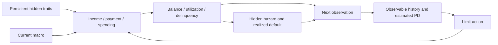
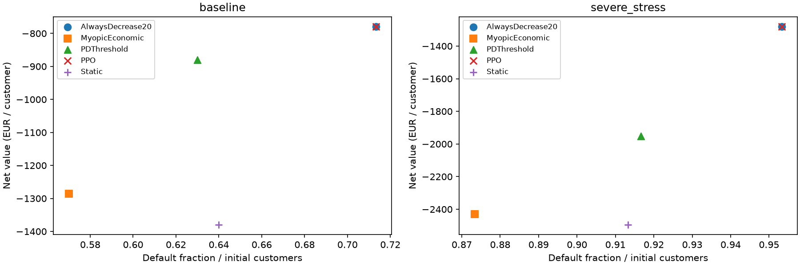
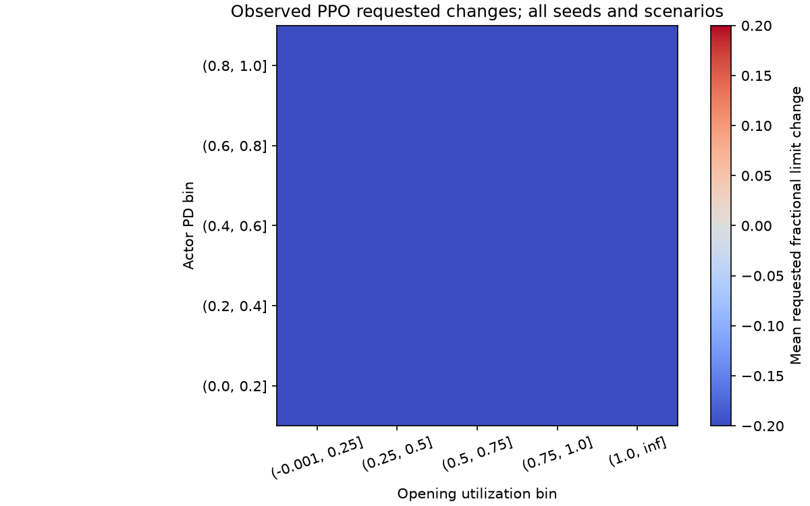
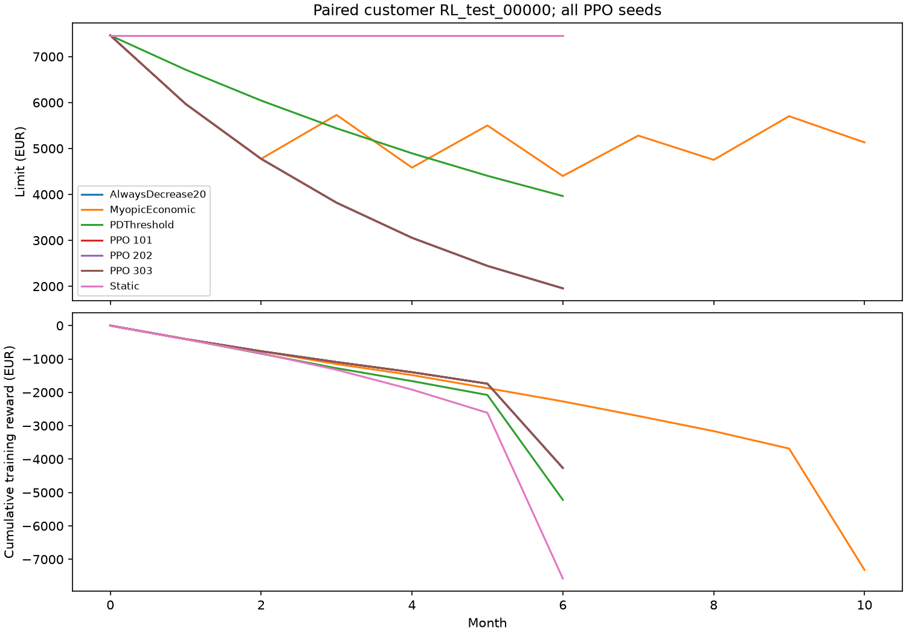

# Dynamic Credit-Limit Optimization under Partial Observability

This repository studies repeated credit-limit decisions in a synthetic longitudinal population. A limit change affects payment incentives, available purchasing capacity, future balances and default exposure. A frozen probability-of-default (PD) model summarizes observable customer histories; policies never receive hidden customer traits or future shocks.

The canonical experiment compares Static, PDThreshold (the risk-based rule), MyopicEconomic and PPO, with constant 20% contraction as an additional control. It uses held-out customers, common random numbers, three declared PPO seeds and baseline/stress macro paths. The simulator and economic assumptions are not calibrated to a real bank. Portfolio allocation, robustness and off-policy evaluation remain supplementary studies with their own protocols; their results must not be mixed with the individual-customer experiment.

## Model and decision chronology

One episode follows one customer for up to 24 monthly transitions. At month $t$, the policy receives the 21-dimensional observation $O_t$, including the current limit, balance, utilization, income, repayment, delinquency, behavioral score, macro factors and estimated 12-month PD. Hidden traits $Z_i$ persist throughout the episode. The policy chooses a multiplier in $\{0.8,0.9,1,1.1,1.2\}$. Limits are bounded to EUR 500–15,000; three consecutive delinquent months block increases.

The DGP applies the limit change, evolves income, generates payment against opening principal, caps purchases by remaining headroom, updates delinquency and score, and samples default. Current macro factors drive this transition; the next macro state is revealed only afterward. Default is absorbing. A surviving episode ends at the finite horizon.


```mermaid
flowchart LR
    Hidden[Persistent hidden traits] --> Dynamics[Income / payment / spending]
    Macro[Current macro] --> Dynamics
    Observation[Observable history and estimated PD] --> Action[Limit action]
    Action --> Dynamics
    Dynamics --> Balance[Balance / utilization / delinquency]
    Balance --> Default[Hidden hazard and realized default]
    Balance --> Next[Next observation]
    Default --> Next
    Next --> Observation
```

For opening balance $B_t$, payment $P_t$, purchases $C_{t+1}$ and admitted limit $L'_t$,

$$B_{t+1}=B_t-P_t+C_{t+1},\qquad C_{t+1}\leq\max(0,L'_t-(B_t-P_t)),\qquad U_{t+1}=B_{t+1}/L'_t.$$

Reducing a limit does not forgive existing debt, so utilization can exceed one. The hidden monthly hazard is a logistic function of closing utilization, debt-to-income, consecutive delinquency, payment ratio, persistent creditworthiness, current stress and adverse income change. It is independent of the PD estimator. The [technical paper](docs/technical_paper.md) gives the actual equations; [DGP specification](docs/dgp.md) provides parameter-level details.

Reward in EUR is

$$R_t=(1-D_{t+1})B_t\frac{0.18}{12}+0.012C_{t+1}-0.55D_{t+1}B_{t+1}
-\frac{0.03}{12}B_{t+1}-1.5(0.08)\widehat p_t B_{t+1}-25\max(0,\widehat p_t-0.12).$$

Reported **net economic value** excludes the last two soft capital/risk charges. Consequently PPO's discounted training reward and undiscounted net value are different estimands. Neither terminal receivables nor customer welfare are valued.

## From the DGP to PPO

The full state $X_t$ includes hidden traits and the history needed by the transition and PD features. It induces a controlled transition $P(X_{t+1}\mid X_t,A_t)$. The actor only receives $O_t=g(X_t)$; its compact observation is not guaranteed Markov. The underlying full-state MDP therefore yields a partially observed decision problem. For observable history $H_t=(O_0,A_0,\ldots,O_t)$ and terminal horizon $T$,

$$J(\pi)=\mathbb E_\pi\left[\sum_{t=0}^{T-1}\gamma^tR_t\right],\qquad \gamma=0.98,$$

$$V_t^\pi(h)=\mathbb E_\pi[R_t+\gamma V_{t+1}^\pi(H_{t+1})\mid H_t=h],\quad V_T^\pi=0,$$

$$Q_t^\pi(h,a)=\mathbb E[R_t+\gamma V_{t+1}^\pi(H_{t+1})\mid H_t=h,A_t=a],\quad
A_t^\pi(h,a)=Q_t^\pi(h,a)-V_t^\pi(h).$$

Here value means remaining expected reward from a customer's evolving exposure, not their observed PD. Advantage compares an action with the current policy's expected continuation. The policy-gradient identity motivates the sampled actor update:

$$\nabla_\theta J(\pi_\theta)=\mathbb E_{\pi_\theta}\left[\sum_t\gamma^t\nabla_\theta\log\pi_\theta(A_t\mid H_t)A_t^{\pi_\theta}(H_t,A_t)\right].$$

The implemented actor and critic approximate these quantities using $O_t$, not the full history. Generalized advantage estimation uses

$$\delta_t=R_t+\gamma V_\phi(O_{t+1})-V_\phi(O_t),\qquad
\widehat A_t=\sum_{l\geq0}(\gamma\lambda)^l\delta_{t+l},\quad\lambda=0.95.$$

The sum ends at rollout/episode boundaries. The PPO training adapter marks both default and the economic horizon as terminal, preventing SB3 from adding continuation value after month 24. The public Gymnasium environment still distinguishes default termination from horizon truncation.

With likelihood ratio $r_t(\theta)=\pi_\theta(A_t\mid O_t)/\pi_{\theta_{old}}(A_t\mid O_t)$, PPO maximizes

$$L^{clip}(\theta)=\mathbb E_t[\min(r_t\widehat A_t,\operatorname{clip}(r_t,1-\epsilon,1+\epsilon)\widehat A_t)],\quad\epsilon=0.2.$$

A squared value loss and entropy bonus accompany the actor objective. Separate actor/critic networks have two 64-unit tanh layers. Rewards are scaled by 0.001 for training; reported money remains EUR. These approximations provide no optimality or real-world safety guarantee.

## Credit-risk model and policies

The target is first default in $(t,t+12]$, conditional on being active at $t$. Snapshot eligibility requires a complete administrative horizon; unknown follow-up is censored. All current and historical features are allowlisted. Lags, rolling summaries and trends only use available history. PD cohorts are customer-disjoint and occupy non-overlapping calendar blocks with matured labels before the next block.

Logistic regression and histogram gradient boosting are fitted on 2,500 training customers. Separate cohorts contain 800 validation, 800 calibration, 1,000 test and 1,000 later entrants. Sigmoid calibration is fitted only on calibration customers. Calibrated logistic regression is the predeclared policy input, regardless of which model scores best on the test set.

| Code policy name | Decision |
|---|---|
| Static | Keep the limit unchanged |
| PDThreshold | Increase 10% below PD 0.2; decrease 10% at PD 0.6 or above; otherwise hold |
| MyopicEconomic | Maximize an observable one-step economic surrogate over admitted actions |
| AlwaysDecrease20 | Request maximum contraction, subject to the limit floor |
| PPO | Deterministic action from each seed's validation-selected checkpoint |

MyopicEconomic converts 12-month PD to a flat monthly hazard, then adjusts it using assumed utilization/burden sensitivities. Its expectation is a surrogate, not the DGP's true conditional reward. It accesses neither latent traits nor simulator draws.

## Experimental protocol

Policy training uses 1,500 synthetic customers with fixed indexed Markov macro/shock paths; checkpoint selection uses 100 separate baseline customers. The final comparison uses the same 300 held-out customers for every policy, seed and macro scenario. Each PPO seed (101, 202, 303) receives 32,768 transitions; no seed is discarded. Hyperparameters and rule thresholds are fixed before test evaluation. Initialization is an eligible validation checkpoint, so improvement from learning is not assumed.

Baseline is constant normal macro. Severe stress uses normal months 0–3, stress at severity 1.6 in months 4–19, then normal. Paired scenarios preserve initial customer draws, latent traits and indexed exogenous randomness. Endogenous outcomes and default times can differ.

Confidence intervals use 300 crossed resamples of customers and PPO seeds. They are conditional on the frozen PD model and macro scenarios, and do not quantify structural-model or real-world uncertainty. Default rates divide by initial customers; limit and utilization average each customer's observed monthly mean before averaging customers. Monetary values are per initial customer.

## Measured canonical results

The following block is generated from `outputs/main/standard/results/`; it is shared with the paper. Risk-based and myopic names are the exact code names. The supplementary portfolio study has different policies, rewards and units.

<!-- canonical-results:start -->

### Baseline

| policy | net_economic_value | revenue | credit_loss | default_rate | mean_limit | mean_utilization |
| --- | --- | --- | --- | --- | --- | --- |
| AlwaysDecrease20 | -779.428 | 385.293 | 1105.889 | 0.713 | 2794.781 | 1.098 |
| MyopicEconomic | -1285.245 | 1066.159 | 2191.299 | 0.570 | 11174.149 | 0.473 |
| PDThreshold | -880.473 | 862.116 | 1614.304 | 0.630 | 7189.632 | 0.708 |
| PPO | -779.428 | 385.293 | 1105.889 | 0.713 | 2794.781 | 1.098 |
| Static | -1379.340 | 1012.640 | 2237.257 | 0.640 | 7312.645 | 0.661 |

### Stress

| policy | net_economic_value | revenue | credit_loss | default_rate | mean_limit | mean_utilization |
| --- | --- | --- | --- | --- | --- | --- |
| AlwaysDecrease20 | -1280.840 | 301.699 | 1532.196 | 0.953 | 3423.447 | 1.074 |
| MyopicEconomic | -2430.560 | 596.680 | 2926.816 | 0.873 | 10290.866 | 0.495 |
| PDThreshold | -1953.059 | 477.893 | 2350.705 | 0.917 | 6452.382 | 0.736 |
| PPO | -1280.840 | 301.699 | 1532.196 | 0.953 | 3423.447 | 1.074 |
| Static | -2494.226 | 538.300 | 2940.479 | 0.913 | 7312.645 | 0.647 |

### Paired PPO differences (95% bootstrap)

| scenario | reference | metric | difference | lower | upper |
| --- | --- | --- | --- | --- | --- |
| baseline | Static | cumulative_reward | 3225.122 | 2821.154 | 3706.490 |
| baseline | Static | net_economic_value | 599.912 | 393.436 | 796.347 |
| baseline | Static | credit_loss | -1131.368 | -1301.271 | -955.382 |
| baseline | Static | defaulted | 0.073 | 0.037 | 0.115 |
| baseline | MyopicEconomic | cumulative_reward | 3156.257 | 2653.905 | 3670.037 |
| baseline | MyopicEconomic | net_economic_value | 505.817 | 282.939 | 706.396 |
| baseline | MyopicEconomic | credit_loss | -1085.410 | -1283.859 | -880.017 |
| baseline | MyopicEconomic | defaulted | 0.143 | 0.105 | 0.193 |
| severe_stress | Static | cumulative_reward | 2747.200 | 2505.704 | 3018.580 |
| severe_stress | Static | net_economic_value | 1213.386 | 1106.940 | 1331.399 |
| severe_stress | Static | credit_loss | -1408.284 | -1537.349 | -1288.953 |
| severe_stress | Static | defaulted | 0.040 | 0.020 | 0.060 |
| severe_stress | MyopicEconomic | cumulative_reward | 3012.293 | 2686.070 | 3330.624 |
| severe_stress | MyopicEconomic | net_economic_value | 1149.720 | 994.173 | 1294.821 |
| severe_stress | MyopicEconomic | credit_loss | -1394.620 | -1543.396 | -1224.009 |
| severe_stress | MyopicEconomic | defaulted | 0.080 | 0.052 | 0.112 |

### PD test performance

| model | roc_auc | pr_auc | brier | log_loss |
| --- | --- | --- | --- | --- |
| constant | 0.500 | 0.458 | 0.249 | 0.691 |
| logistic | 0.842 | 0.823 | 0.162 | 0.487 |
| logistic_calibrated | 0.842 | 0.823 | 0.162 | 0.486 |
| boosting | 0.846 | 0.831 | 0.161 | 0.485 |
| boosting_calibrated | 0.846 | 0.831 | 0.160 | 0.483 |

<!-- canonical-results:end -->






PPO has higher net value than MyopicEconomic by **505.82 EUR/customer [282.94, 706.40]** under baseline and **1,149.72 [994.17, 1,294.82]** under stress. But every PPO seed reproduces the effective trajectories of constant 20% contraction to numerical precision on this evaluation panel (maximum checked difference 1.71e-13). Its default incidence is **14.33 percentage points higher** than Myopic under baseline and **8.00 points higher** under stress, despite lower monetary losses. These results support exposure contraction under the specified objective, not a demonstrated advantage from learned planning. All policies have negative mean net value.

The empirical action map averages requested changes across visited states, all PPO seeds and both scenarios. Empty bins contain no observations. It describes behavior and is not causal evidence. The trajectory is the first held-out customer by identifier, selected without examining outcomes. There is no established evidence here that PPO sacrifices immediate value to recover more value later; constant contraction is retained specifically to challenge that interpretation.

## Reproducing the results

Python 3.12 is the tested and CI version; package metadata allows Python 3.11+. Use a virtual environment and run from the clone root. The experiment needs the `experiments` and `rl` extras; plain editable installation supports the core simulator.

### Installation

```shell
python -m pip install -e ".[dev,experiments,rl]"
```

### Tests

```shell
python -m ruff check .
python -m pytest --cov=credit_rl --cov-report=term-missing --cov-fail-under=70
```

### Smoke experiment

```shell
python -m credit_rl.experiments.main_evaluation --profile smoke
```

### Main experiment

```shell
python -m credit_rl.experiments.main_evaluation --profile standard
```

This generates PD data/models, fits every PPO seed, evaluates paired policies and writes tables/figures. Matching completed artifacts are reused; changed source/configuration requires a fresh `--output`. Run the same command again to replay frozen evaluation. A manifest records expanded configuration, seeds, package versions, source hashes, timestamp and Git commit when available. Model hashes are saved separately. Git is not required.

### Regenerate figures and documentation tables

```shell
python -m credit_rl.experiments.main_evaluation --profile standard --stage figures
python -m credit_rl.experiments.report_assets --update-docs
```

The first command regenerates policy and PD figures from saved histories and predictions. The second synchronizes measured table blocks in this README and the paper. Raw trajectories and models are generated locally; compact canonical results and figures are retained. All input populations are generated, so no private dataset or hidden checkpoint is required.

CI runs lint, all unit/integration tests with a 70% total coverage threshold, and an independent smoke experiment on Ubuntu and Windows with Python 3.12. It never runs the standard experiment. The integration test fits and reloads tiny PPO models, executes two fresh pipelines and compares numeric outputs exactly on the same environment.

## Repository structure

```text
configs/                 DGP, PD, policies and experiment profiles
src/credit_rl/
  simulation/            Customer dynamics, macro and indexed shocks
  risk/                  Features, labels, estimation and calibration
  envs/                  Gymnasium customer environment
  policies/              Existing baselines and PPO training
  evaluation/            Paired metrics, inference and supplementary studies
  portfolio/             Coupled portfolio allocation
  experiments/           Canonical orchestration and report generation
experiments/             Supplementary entry points and isolated archive
outputs/main/standard/   Canonical results, figures and provenance
tests/                  Scientific invariants and integration
docs/                   Methods, paper and audit
```

[Technical working paper](docs/technical_paper.md), [finalization audit](docs/finalization_audit.md), and [supplementary experiment guide](experiments/README.md). Portfolio measurements are documented separately in [portfolio results](docs/portfolio_results.md); robustness and OPE in [their report](docs/robustness_results.md). These broader studies are not rerun by the canonical customer command.

## Limitations

The DGP is synthetic, with stylized behavior, non-calibrated structural coefficients, synthetic macro scenarios and simplified default/recovery mechanics. The PD target comes from that same synthetic system and can shift under a decision policy. Training uses a finite set of replayed customer paths. The reward includes soft proxies, ignores customer welfare and terminal receivables, and differs from net economic value. Myopic's approximate dynamics and PPO's compact observation limit comparisons. A small action menu, three training seeds and fixed macro interventions provide limited external validity. No real banking portfolio validation, regulatory calibration or deployment claim is made.
