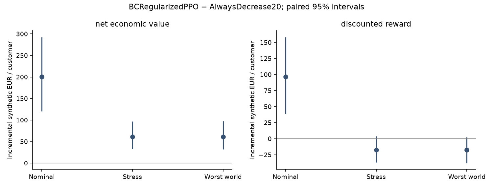
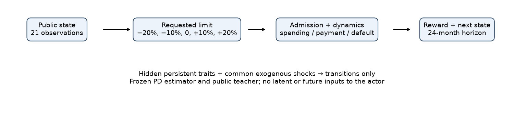
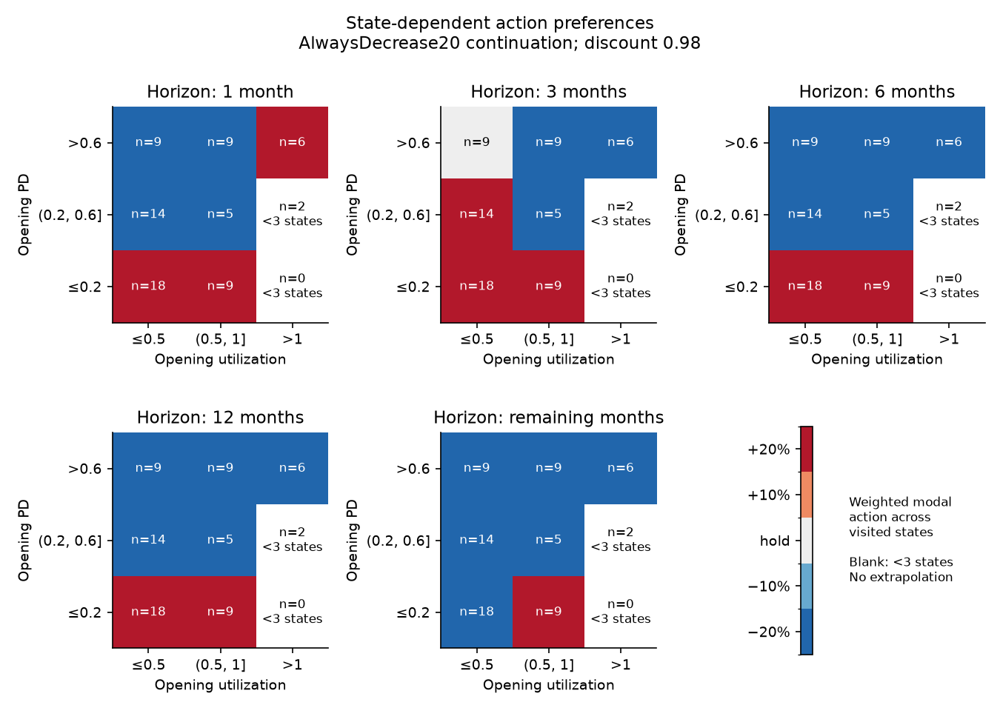
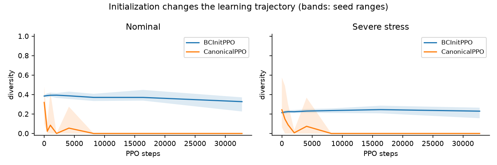

# Dynamic Credit Limit Optimization with Reinforcement Learning

[](https://github.com/Drivax/Dynamic-Credit-Limit-Optimization-with-RL-/actions/workflows/ci.yml)
[](pyproject.toml)
[](LICENSE)

When does a learned credit-limit policy earn its complexity over a simple rule? This applied RL study combines a longitudinal simulator, calibrated default-risk estimation, PPO diagnostics, observable-state behavior cloning and paired evaluation under distribution shift. All financial outcomes are **synthetic**, conditional on the declared simulator and experimental design.

## Key findings

- **Canonical PPO collapses:** its effective decisions become equivalent to maximum admissible contraction.
- **The decision problem is not trivial:** independent structural rollouts find visited states where hold or increases have higher estimated continuation value.
- **Initialization matters:** observable-state imitation initialization changes PPO learning and retains state-dependent decisions.
- **Complexity has conditional value:** initialized policies improve synthetic NEV over contraction across the declared worlds. Reward superiority is not universal; additional BC regularization does not establish an incremental NEV gain over initialization alone.

## Final results

The central contrast is **ΔNEV = NEV(BCRegularizedPPO) − NEV(AlwaysDecrease20)**. These are relative gains; absolute NEV remains negative. Reward is discounted and includes modeled capital and risk charges; NEV is undiscounted and excludes those charges.

<!-- final-measured:start -->
Primary budget: **32,768 steps**. Values are synthetic EUR per customer; diversity is one minus the largest requested-action share. Default and diversity below refer to nominal.

| Policy | Baseline NEV | Stress NEV | Baseline reward | Stress reward | Default | Diversity | Worst-world NEV |
|---|---:|---:|---:|---:|---:|---:|---:|
| AlwaysDecrease20 | -787.6 | -1245.7 | -2107.0 | -2545.0 | 75.3% | 0.313 | -1245.7 |
| CanonicalPPO | -787.6 | -1245.7 | -2107.0 | -2545.0 | 75.3% | 0.000 | -1245.7 |
| ObservationPlanner | -618.2 | -1201.1 | -2036.3 | -2556.0 | 67.3% | 0.435 | -1201.1 |
| BCInitPPO | -586.9 | -1182.3 | -2024.1 | -2567.8 | 65.3% | 0.467 | -1182.3 |
| BCRegularizedPPO | -586.8 | -1184.6 | -2010.4 | -2562.4 | 64.9% | 0.407 | -1184.6 |

Incremental NEV of BCRegularizedPPO over AlwaysDecrease20 (paired 95% intervals):

| Budget | World | Difference | 95% interval | Seeds | Customers |
|---:|---|---:|---:|---:|---:|
| 32,768 | nominal | 200.8 | [120.7, 293.0] | 5 | 150 |
| 32,768 | severe_stress | 61.1 | [32.8, 96.7] | 5 | 150 |
| 32,768 | worst_world | 61.1 | [32.3, 97.4] | 5 | 150 |

Intervals are marginal, conditional on the synthetic simulator, and do not establish real-bank population effects. Full intervals, stress interactions, both budgets and all five worlds are retained in the supporting CSVs.

Regularization versus initialization alone (primary budget; paired 95% intervals):

| Scenario | NEV difference | Reward difference |
|---|---:|---:|
| nominal | 0.2 [-33.4, 42.5] | 13.7 [-10.2, 42.5] |
| severe_stress | -2.3 [-18.0, 13.0] | 5.4 [-6.4, 21.1] |
<!-- final-measured:end -->



The [full table](outputs/main/final/main_table.csv), [paired comparisons](outputs/main/final/paired_comparisons.csv) and [technical paper](docs/technical_paper.md) retain all eight policies, both budgets, negative results and all five worlds. Positive requested-action diversity for AlwaysDecrease20 comes from hold commands when contraction is inadmissible, including at the limit floor; it does not imply a learned decision boundary.

## Why this problem is interesting

A limit decision changes future headroom, spending, repayment and default exposure. A predictive PD model alone cannot choose the best sequence of actions. Equally, beating a weak baseline does not establish useful sequential learning: constant contraction is a necessary control.

## Decision problem

Over at most 24 monthly steps, the actor sees 21 public features and chooses a limit multiplier from `{0.8, 0.9, 1.0, 1.1, 1.2}`. Admission enforces limits of synthetic EUR 500–15,000 and blocks increases after severe delinquency. Hidden persistent traits make this a partially observed problem. Default is absorbing; the economic horizon terminates value bootstrapping.



The objective is $J(\pi)=\mathbb{E}_\pi\sum_{t=0}^{T-1}0.98^t R_t$. Reward combines income, realized loss, funding cost, a modeled capital charge and a PD penalty. NEV excludes the last two charges. Neither metric values terminal receivables or customer welfare adequately for deployment.

## Synthetic environment and risk model

Correlated traits govern creditworthiness, spending, payment and income stability. Limits affect purchases through available headroom; contraction never forgives existing debt. Indexed shocks remain paired across policies despite different actions or defaults. The [DGP specification](docs/dgp.md) and [simulation configuration](configs/simulation.yaml) define the dynamics.

A frozen logistic model with separate sigmoid calibration estimates 12-month PD from public history. Customer and calendar partitions separate training, validation, calibration and evaluation; feature construction respects time ordering. Estimated PD is distinct from the simulator's latent monthly hazard.

## Policies

Static, PDThreshold and MyopicEconomic provide fixed, risk-based and immediate-value baselines. AlwaysDecrease20 is the strong contraction control. CanonicalPPO uses random initialization; ObservationPlanner predicts action values from public observations. BCInitPPO transfers an imitation actor into otherwise unchanged PPO. BCRegularizedPPO adds a small cross-entropy loss on the same teacher's training labels.

The [constrained portfolio benchmark](docs/portfolio_results.md) is secondary: its joint-allocation unit and separate cohort must not be pooled with the individual-customer results above.

## Why canonical PPO collapses

Canonical PPO develops greedy contraction before stochastic exploration disappears. Structural rollouts show that contraction is not preferred everywhere under the tested continuations. Public-state planning recovers useful information; controlled optimization diagnostics do not isolate one universal cause of collapse. These diagnostics establish neither a globally optimal policy nor that privileged information can never help.



## Observable-state initialization and offline-to-online learning

The frozen public teacher initializes the canonical 64×64 Tanh actor, paired with the same random critic. BCInitPPO receives no teacher signal after initialization. BCRegularizedPPO uses only training observations and hard action labels: no latent state, future outcomes or test inputs enter learning.



The coefficient candidate and constant/decay schedules were declared before outcomes. Baseline validation selects the schedule; all five seeds are retained at 32,768 and 262,144 steps. The [protocol](docs/final_protocol.md) specifies selection, paired inference and counterfactual checks. Teacher preservation and economic improvement are separate outcomes.

## Robustness and distribution shift

The final cohort contains 150 new customers, shared across policies and five worlds: nominal, severe stress, population shift, behavioral shift and risk shift. Policies keep their nominal assumptions without recalibration. Earlier 300-customer canonical results are historical diagnostics, not the final-world table. Worst-world NEV is the minimum over this declared set; its interval reselects the minimum within each paired bootstrap replicate.

## Off-policy evaluation

Known-propensity trajectory IS and WIS are checked against independent simulator NEV at three overlap levels. Poor overlap produces low effective sample sizes and unstable or undefined estimates even with positive one-step support. [OPE tables](outputs/main/final/ope_summary.csv) retain those failures and finite-reference Monte Carlo uncertainty.

## Reproducing the results

Use Python 3.11 or newer from the repository root:

```bash
git clone https://github.com/Drivax/Dynamic-Credit-Limit-Optimization-with-RL-.git dynamic-credit-limit-rl
cd dynamic-credit-limit-rl
python -m venv .venv
# Linux/macOS: source .venv/bin/activate
# Windows PowerShell: .venv/Scripts/Activate.ps1
python -m pip install -e ".[dev,experiments,rl]"
python -m ruff check .
python -m pytest --cov=credit_rl --cov-report=term-missing --cov-fail-under=75.13
```

**Smoke — software integration, not scientific evidence:**

```bash
python -m credit_rl.experiments.final_evaluation --profile smoke
python -m credit_rl.experiments.final_report --profile smoke
```

A source checkout supports this check. If historical models are absent, it uses tiny isolated fixtures. Smoke results do not reproduce the paper's numbers.

**Frozen presentation — no training or statistical recalculation:**

```bash
python -m credit_rl.experiments.final_report --documents-only
```

This publishes the CSV-derived measured block already included in Git: a compact README view and the complete paper view.

**Standard — scientific reproduction with frozen research artifacts:**

```bash
python -m credit_rl.experiments.final_evaluation --profile standard
python -m credit_rl.experiments.final_report
```

Standard needs the historical PD model, public teacher, initialization models and their hash-checked run artifacts. They are not all included in Git. Existing completed runs are reused and verified; a source checkout alone cannot reconstruct the measured table. See [artifact availability](docs/release_assets.md), the [final manifest](outputs/main/final_manifest.json) and [recorded scientific validation](outputs/main/final/validation.json). Local validation does not imply a hosted CI run succeeded.

## Repository structure

```text
configs/                 Simulator and experiment configuration
docs/                    Technical paper, protocols and release notes
outputs/main/final/      Final tables, figures and scientific audits
outputs/main/final_manifest.json
src/credit_rl/           Simulator, risk, policies and evaluation package
tests/                   Scientific invariants and software integration
.github/workflows/       Linux / Windows CI
```

## Technical paper

Read the [technical paper](docs/technical_paper.md) for equations, statistical estimands, all figures and limitations. The [release notes](docs/release_notes_v1.0.0.md) summarize the completed study. [Third-party notices](docs/third_party_notices.md) retain dependency attribution.

## Limitations

The environment is fully synthetic and has no real-bank calibration. Behavioral response is stylized; default and recovery are simplified; PD is fitted from the same synthetic family. Macro scenarios and training seeds are limited. The teacher is approximate, and its offline labels require simulator-based information even though its inputs are public. Reward is a modeling choice, NEV omits some reward components, and the customer-welfare model is inadequate for production. Designed distribution shifts are experiments, not forecasts. There is no claim of regulatory validity or deployment readiness.

## Citation

Use [CITATION.cff](CITATION.cff) for the prepared version 1.0.0. No DOI or publication venue is claimed. The project is distributed under the [MIT license](LICENSE).

<!-- final-conclusion:start -->
Learned sequential control adds net economic value over contraction across the declared worlds, but does not establish a reward improvement in every world. Its complexity is justified conditionally on the economic objective and synthetic setting, not by universal policy superiority. The additional BC regularizer does not establish an incremental NEV gain over initialization alone in both macro scenarios.
<!-- final-conclusion:end -->
