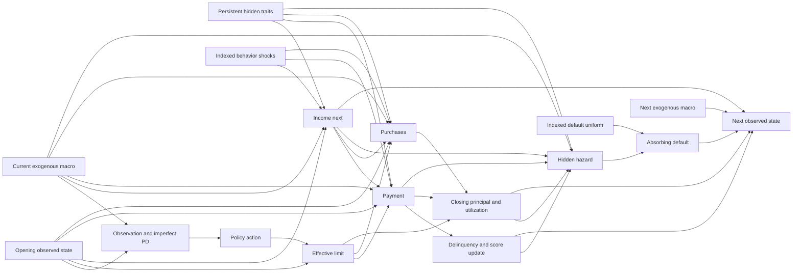

# Hidden synthetic DGP — version 2.0

This is a transparent synthetic testbed, not an empirically calibrated bank model.
The monthly transition is a specified structural mechanism: causal statements refer
to interventions **inside this simulator only**. The objective is controlled testing
of sequential credit decisions under partial observability and model error.

## State and interfaces

For customer i and decision month t:

- Z_i = (z_i,h_i,p_i,k_i): persistent hidden creditworthiness, spending propensity,
  payment propensity and income stability. `CustomerTraits` is frozen and separate.
- X_it: customer ID/month, principal B, limit L, monthly income Y, initial income
  anchor Y0, observed log income change, last spending C, payment ratio q, consecutive
  insufficient-payment months d, rolling six-month late history, behavioral score s,
  initial score anchor s0, tenure and observed terminal default flag.
- M_t: `MacroState(regime,income_growth,spending_growth,credit_stress)`. Regimes are
  EXPANSION=0, NORMAL=1, STRESS=2. All three factors are currently observable.
- A_it: requested discrete limit multiplier; effective change can differ at bounds.
- epsilon_it: named standard-normal/uniform idiosyncratic shocks, hidden before outcome.
- D_i,t+1: realized end-month default. Once true, the episode ends permanently.

The agent observes a 21-dimensional projection of current X and M plus imperfect PD.
It never receives Z, the next shock, future macro, or true hazard. Initial anchors are
internal bookkeeping (their initial values were observed); they are not latent types.

The implementation separates `customer.py` (initialization), `macro.py` (exogenous
paths), `shocks.py` (common random numbers), `behavior.py` (income/payment/spending),
`default.py` (hidden hazard), `dgp.py` (one-month orchestration), `envs/observation.py`
(information boundary), `reward.py` (economics), and the Gymnasium wrapper.

## Persistent correlated heterogeneity

The structural graph for one transition (unrolled through time) is:

Edges represent dependencies, not estimated causal effects in real populations.
Score additionally receives its own indexed shock and opening-score reversion.
Reward reads opening balance/PD and closing cashflows/exposure/default. Neither
predicted PD nor reward feeds the hidden hazard directly.

Draw a shared F and four residuals e_j independently from N(0,1), clipped to +/-6
for numerical protection. Define v_j=l_j F+sqrt(1-l_j^2)e_j, also clipped to +/-6.
Loadings l=(0.70,-0.25,0.65,0.65) induce correlations l_j*l_k before clipping/nonlinear
transformation. A favorable common factor raises creditworthiness, payment and
stability and modestly lowers spending propensity. Residuals preserve substantial
within-profile variation; there are no deterministic customer segments.

z=(s0-650)/100 + 0.6 v_0;
h=exp(-0.25^2/2+0.25 v_1);
p=sigmoid(-0.4+0.5 v_2);
k=sigmoid(0.8+0.6 v_3).

Payment propensity is bounded to [machine epsilon,1-machine epsilon] to keep its
logit finite for extreme custom parameters; default settings do not hit these bounds.

The initial snapshot generator and its supervised-training label equation are
preserved. Its future labels and true_pd are discarded by environment ingestion.
Initial late-payment timestamps do not exist: counts populate the newest history
slots, and the initial delinquency count is interpreted as consecutive shortfalls.
Initial payment ratio defaults to 0.4. These are explicit initialization assumptions.

All numbers above are named in `configs/simulation.yaml` (`dynamics` section).
The four traits are sampled exactly once; no monthly trait resampling occurs.

## Exact monthly event sequence

1. Expose beginning state X_t and current M_t; compute PD_t from observed features.
2. Policy requests A_t. Cap its monthly change and absolute limit to obtain L'.
3. Reveal current-month income shocks and compute Y'.
4. Generate payment willingness and missed-payment event using B_t and L'; pay P
   against **opening principal**. Payment does not include this month's later purchases.
5. Update delinquency from actual paid fraction; generate spending demand and cap
   purchases C' by headroom after payment.
6. Apply principal identity B'=B_t-P+C'. Update score, tenure and recent history.
7. Compute p* from this closing candidate state and **M_t**. Compare the hidden
   default uniform against p*. Default has exposure E=B'.
8. Compute reward from opening balance/PD, purchases and closing exposure/default.
9. Return X_(t+1) with M_(t+1) from the pre-generated macro path and updated PD.

The path is pre-generated for reproducibility, but only M_t is policy-visible at t.
Default terminates; H surviving transitions truncate. Default on month H takes
precedence. A call after either event raises. Terminal state is preserved for analysis.

## Implemented equations

The following equations use parameter names from `simulation.yaml`. sigma is the
stable logistic link; clip(x,a,b)=min(b,max(a,x)); normal shocks are clipped at +/-6.
Currency is EUR, time is months. Let m=M_t.credit_stress, g=M_t.income_growth and
w=M_t.spending_growth. Omit customer/month subscripts for readability.

### Effective limit

a_eff_pre=clip(A,1-max_monthly_decrease,1+max_monthly_increase).
L'=clip(L*a_eff_pre,min_limit,max_limit).
Requested change=A-1; effective change=L'/L-1.
Defaults are +/-20% monthly and EUR 500–15000 absolute limits. Existing actions
[0.8,0.9,1,1.1,1.2] remain. There is no hidden discretionary action override.

### Income

Let v=1-k. Monthly volatility:

sigma_Y=income_sigma*(1+income_unstable_volatility*v)*(1+income_stress_volatility*m).

J=1[U_income < clip(income_adverse_probability
+ income_stress_adverse_probability*m*v,0,1)].

delta=income_reversion*(log(Y0)-log(Y))
+ g*(1+income_macro_vulnerability*v)
+ sigma_Y*epsilon_income - sigma_Y^2/2 - income_adverse_log_drop*J.

Y'=clip(Y*exp(clip(delta,-income_max_log_drop,income_max_log_gain)),income_min,income_max).
The observed change is log(Y'/Y). Volatility is 0.025 base, multiplied by 1+2v and
1+0.5m; reversion is 0.08. Adverse-shock probability is 0.01+0.06*m*v, and its log
drop is 0.15. Monthly log changes are bounded to [-0.35,0.20], income to [300,30000].
The lognormal correction is approximate after clipping and jump shocks; no exact
stationary distribution is claimed. Initial income stays the mean-reversion anchor.

### Payment and persistent delinquency

u=B/L', b=B/Y'.
q*=sigma(logit(p)+payment_credit*z-payment_utilization*u-payment_burden*b
-payment_delinquency*d-payment_stress*m+payment_shock_sigma*epsilon_payment).

qbar=payment_persistence*q+(1-payment_persistence)*q*.
p_miss=sigma(missed_intercept+missed_utilization*u+missed_burden*b
+missed_delinquency*d-missed_credit*z+missed_stress*m).

If U_missed<p_miss: qbar=min(qbar,missed_payment_fraction).
P=min(B*qbar,payment_income_cap*Y'); q'=P/B for B>0, otherwise q'=1.

Q'=1[B>0 and q'<minimum_payment_ratio].
d'=d+1 if Q'=1, otherwise d'=0. Shift history and append Q'.

Payment persistence is 0.5; affordability cap is 50% of monthly income; minimum
principal payment is 5%, and a missed event caps repayment at 2%. Existing coefficients
for utilization, burden, delinquency and creditworthiness were retained. Better payment
propensity raises willingness, but affordability/missed-payment events can bind.
This is not an aged contractual arrears ledger. Diagnostic buckets min(d',3) denote
current/one/two/three-plus consecutive shortfalls, not regulatory 30/60/90 DPD.
Allowed paths include entry, cure, worsening and stochastic default from severe states.

### Spending, principal and utilization

Individual limit elasticity:
beta_i=clip(spend_limit_elasticity*h^spend_elasticity_loading,0,spend_max_elasticity).
Defaults: beta_i=min(0.15*h,0.60).

base=spend_persistence*C+(1-spend_persistence)*spend_income_fraction*Y'*h.
demand=base*(1+w)*exp(beta_i*log(L'/L)
+spend_shock_sigma*epsilon_spending-spend_shock_sigma^2/2).

headroom=max(0,L'-(B-P)); C'=min(demand,headroom).
B'=B-P+C'; utilization'=B'/L'.

Demand is evaluated in log space with its exponent capped at log(headroom) before
exp. No independent balance draw occurs. A limit increase does not create purchases
equal to the increase. Its response depends on h, prior spend/income, shocks and
whether headroom binds. In unconstrained demand, d log(C')/d log(L'/L)=beta_i.
At headroom constraints the realized response differs.

Existing debt can exceed the reduced limit and is not forgiven. New purchases are
zero when post-payment debt exceeds the limit. Utilization is never clipped to one.
Interest/fees are **not capitalized**; B is principal only. This preserves the Sprint 1
accounting convention and avoids silently changing exposure and reward simultaneously.

### Behavioral score

s'=clip(s+score_reversion*(s0-s)-score_delinquency_drop*Q'
+score_payment_gain*q'+score_noise*epsilon_score,score_min,score_max).

Defaults: 0.1 mean reversion, -18 on delinquency, +4*q', noise scale 3, bounds 300–950.
Score is an observed smoothed proxy and not a direct encoding of hidden z or p*.

### Hidden default hazard

For positive B', the **exact default coefficients** are:

logit(p*) = -6 + 1.2*(B'/L') + 0.45*(B'/Y') + 0.65*d'
+ 0.6*(1-q') - 0.8*z + 0.9*m + 1.5*max(0,-log(Y'/Y)).

For B'=0, p*=0. Draw D'=1[U_default<p*]. p* is simulator truth, not real-world
truth. The normal logistic is implemented with logaddexp for numerical stability.
There is no direct raw-limit coefficient. Higher delinquency/burden/stress raise
hazard holding other inputs fixed; better z lowers it. Policy effects need not be
monotonic: increased headroom can lower utilization and raise repayment while also
raising purchases/exposure. Different customers can have different responses.

## Macro process and deterministic scenarios

Transition rows/columns EXPANSION, NORMAL, STRESS:

| From / to | Expansion | Normal | Stress |
|---|---:|---:|---:|
| Expansion | .88 | .11 | .01 |
| Normal | .035 | .93 | .035 |
| Stress | .01 | .14 | .85 |

| Regime | Monthly income log growth | Spending multiplier increment | Credit stress index |
|---|---:|---:|---:|
| Expansion | .003 | .02 | 0 |
| Normal | .001 | 0 | 0 |
| Stress | -.01 | -.12 | 1 |

These are uncalibrated monthly synthetic assumptions. Normal is most persistent;
stress has a mean geometric spell of about 6.7 months. Effects are deterministic
given regime/severity; idiosyncratic customer responses remain stochastic.

Scenarios use fractions of the requested horizon, not hardcoded month counts:

| Scenario | Phases (horizon fraction, regime, severity multiplier) |
|---|---|
| baseline | 1 Normal x1 |
| mild_stress | 1/4 Normal x1; 1/4 Stress x.65; 1/2 Normal x1 |
| severe_stress | 1/6 Normal x1; 2/3 Stress x1.6; 1/6 Normal x1 |
| recovery | 1/4 Stress x1.3; 1/4 Stress x.6; 1/4 Normal x1; 1/4 Expansion x1 |

Severity multiplies all three regime effects. Recovery is a staged, piecewise
improvement rather than a smooth continuous process. The baseline is intentionally
constant normal as a clear controlled reference. At H=24, severe stress acts in
decision months 4–19; mild in 6–11. H+1 states include the terminal observation,
which repeats the last scenario state. At very short horizons a phase can contain
zero decisions. Config validates matrix sums, factor domains and scenario fractions;
reset rejects incompatible path lengths. MacroPath.save/load preserves exact paths.

The population Markov diagnostic uses independently seeded paths per customer to
cover all regimes. Policy/scenario comparisons share one deterministic path across
the entire cohort, including common macro exposure. These are different experimental
designs and are labeled separately; no claim of measured macro uncertainty is made.

## Common random numbers and reproducibility

ShockPath contains seven named channels: income_normal, income_uniform,
spending_normal, payment_normal, missed_uniform, score_normal, default_uniform.
Each channel has an independent NumPy Generator seeded by SeedSequence(root seed,
stable BLAKE2 customer-ID digest, stable channel digest). The month is its position
in the pre-generated array. Python's process-salted hash is never used.

Extending horizon preserves the prefix. Reordering customers does not change their
shocks. Default timing, changes in action, and random draws in another channel cannot
shift the future default or income draws. The DGP step itself uses **no RNG**.
Initialization and macro paths use separate generators. Entire paths can be saved
and loaded; large experiment metadata records seeds and initial states for reconstruction.

CRN means the same shocks, not identical realized behavior: distributions/thresholds
change endogenously with state and macro. Once one policy defaults, its future path
is unused; surviving policies continue with the original indexed shocks.

## Information boundary and scientific history

Agent-facing observations/info and `get_history()` exclude hazard, hidden traits and
future/shock values. The 21 observation dimensions retain the original 15 meanings
(macro stress now bounded continuous), add observed income log change, two current
macro growth factors and three regime indicators. `OBSERVATION_NAMES` is the schema.
21-feature checkpoints are incompatible with 15-feature Sprint 1 checkpoints.

`record_diagnostics=True` explicitly enables `get_diagnostics()` with closing hazard,
realized default, requested/effective changes, pre-limit, spending/payment, observed
end state, macro USED this month, shocks, income event and reward components. These
columns are researcher-only. `get_latent_diagnostics()` is a separate table interface.
Python object access is not a security sandbox; custom policies must respect this API.

`decision_pd` is the forecast at t. `predicted_pd` in a resulting-state row is the
estimate at t+1. `p_default_true` is conditional on realized intra-month behavior
and latent traits. Comparing these is descriptive, **not a calibration curve**.
The learnability diagnostic collects observation_t **before** step and default_t+1
as target, independently of diagnostic exports, and splits by customer. No true
hazard/latent/future state is in the feature matrix. Terminal next-PD values are not
used to predict the default that just occurred.

## Economics and performance

Reward is unchanged: (1-D)*B*APR/12 + C'*fee_rate - D*LGD*B'
- funding_rate/12*B' - capital_weight*rwa_factor*PD_t*B'
- constraint_weight*max(0,PD_t-threshold). The coefficient defaults remain 18%,
1.2%, 55%, 3%, 1.5, .08, 25, .12 respectively. No loss is double counted.

Online simulation uses dataclasses/scalars/NumPy. Pandas is used only at initialization
and export/analysis. The optional GB adapter prepares an array-inference copy once,
retaining validated feature ordering without DataFrames in step. No historical
estimator is mutated. History recording can be disabled for training/benchmarking.

## Modeling assumptions and limitations

- Synthetic population, correlations, macro matrix and coefficients are not bank-calibrated.
- Payment and delinquency are stylized principal-shortfall processes, not a contractual
  arrears/collections ledger. No recoveries beyond fixed LGD; no competing risks.
- Fixed pricing and simplified interest/interchange/funding/capital economics; no
  adverse selection, churn, utility, fairness or transaction-level behavior.
- Income has a fixed individual anchor, bounded monthly changes and a hard floor;
  no employment state or long-run structural wage dynamics is modeled.
- Macro factors are noiseless and observed; scenarios are staged assumptions, not forecasts.
- Hidden factors are continuous with arbitrary shared loadings. Score initialization
  and recent history are synthesized, not estimated from actual customer histories.
- Cumulative default rates may be high. Nondegenerate and directionally coherent does
  not mean quantitatively realistic. Survivor-only monthly summaries have selection effects.
- The longitudinal PD pipeline estimates future H-month default from observable
  histories; see [pd_model.md](pd_model.md). The fallback proxy and independent
  one-month learnability diagnostic have different targets and calibration status.
- Finite-horizon truncation lacks terminal asset valuation. Early defaults change
  exposure/survival; reward under stress need not order exactly like default risk.
- Paired diagnostic differences are conditional on one specified DGP/config/seed;
  statistical precision is not model-validity evidence. No policy winner is imposed.

The version, complete resolved config, seed, horizon, macro scenario and source hashes
are saved per experiment. Historical Sprint 1 results retain their original meaning.
