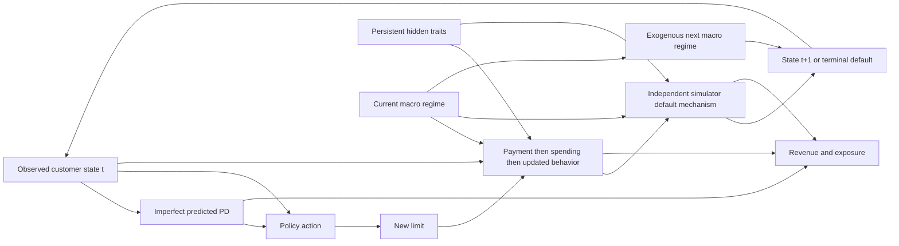

# Longitudinal environment v1

This is an assumed, uncalibrated monthly behavioral simulator. It supports controlled
comparisons under its own assumptions, not causal claims about real bank customers.
Money is denominated in EUR; income is monthly. The full executable parameter set
is in `configs/simulation.yaml`, with typed defaults/validation in `credit_rl.config`.

## Decision process and timing

One episode follows one customer for H=24 transitions or until default. At month t,
the policy receives observed financial/behavioral state and predicted monthly PD,
chooses a discrete limit multiplier, and receives one month's reward. The simulator
retains the customer's state and hidden traits. It never samples another row in step.
The decision problem is partially observable because persistent hidden traits are
excluded from the observation. State snapshots are immutable; the environment owns
and replaces its current snapshot each month, preserving all longitudinal links.

S_t contains observed financial state, recent payment history and hidden traits;
A_t is a limit multiplier; M_t is observed NORMAL/STRESS. The assumed transition is
S_(t+1) ~ P(. | S_t, A_t, M_t). M_t affects this month's behavior/default. Only after
these events does the exogenous chain produce M_(t+1) for the next decision.

The diagram's return loop applies only to surviving, non-truncated trajectories.
`terminated=True` means default. `truncated=True` means H months elapsed without
default. Default on month H takes precedence over truncation. A step after either
event raises RuntimeError; terminal observations preserve state rather than returning
an unrelated zero vector. No loss or reward is generated after default.

## State and information boundary

| Category | Variables and role |
|---|---|
| Static observed | Customer ID, monthly income (held constant), initial behavioral score anchoring score mean reversion |
| Dynamic observed | Month, limit, principal balance, utilization, payment fraction, consecutive delinquent months, six-month late-payment history, score, tenure, realized spending, default flag |
| Exogenous observed | Current two-state macro regime |
| Hidden persistent | Creditworthiness, spending propensity, payment propensity |
| Simulator-only | Conditional default probability and future random draws |
| Model estimate | Predicted PD computed only from ObservedRiskFeatures |

The 15-dimensional float32 observation is named by `OBSERVATION_NAMES` in the env
module. Limit is divided by maximum limit; score is scaled to configured bounds;
elapsed time is divided by H; binary variables/payment ratio/PD are already bounded.
For nonnegative unbounded quantities use b(x)=x/(1+x): balance and spending first
divide by maximum limit; income does likewise; utilization, delinquent months and
tenure use b directly. Late-payment count divides by six. The observation space is
[0,1]^15. This transformation retains above-limit debt without clipping it away.
Customer IDs, initial-score bookkeeping and individual history slots are not policy
features. A policy can retain previous observations if needed.

The risk API accepts a frozen allowlist of observed inputs, never CustomerTraits or
the raw dataset. Dataset ingestion discards `true_pd`, `default_next_month`, and other
unused columns. `info` and trajectory history expose outcomes/reward components but
no hidden traits, future macro, shocks, or simulator probability. White-box research
can call TransitionModel directly; Python privacy is not a security boundary.

## Initialization and heterogeneity

The original synthetic snapshot generator is retained in `synthetic_snapshot.py`.
It is used once at reset, not as a transition model. Its old label/default equation
is retained only to reproduce the original supervised PD workflow.

Given initial observed score s, hidden creditworthiness is
z=(s-score_reference)/score_scale + Normal(0, latent_credit_noise).
Spending propensity h is Lognormal(-sigma_h^2/2, sigma_h), with mean one.
Payment propensity p is sigmoid(Normal(payment_logit_mean, payment_logit_sigma)).
These three traits are sampled once and persist. They are imperfectly correlated
with observed score, creating observable heterogeneity and unobserved variation.

Initial payment ratio is configured. Initial snapshot delinquency count is interpreted
as consecutive delinquent months. Its six-month late-payment count lacks timestamps;
late events are placed in the most recent slots. These are assumptions, not recovered
histories. Synthetic snapshot region/age are not new transition variables. Macro is
initialized to NORMAL unless explicitly overridden; old regional macro features are
not a longitudinal economic series. Initialization limit is clipped to configured
bounds, but principal is never silently reduced.

## Monthly transition equations

All named coefficients below are in `dynamics` unless otherwise stated. Write B for
opening balance, L for opening limit, Y for monthly income, q for last payment ratio,
d for consecutive delinquent months, W for previous spending, m=1 for stress, z/h/p
for hidden traits. sigma(x) is the logistic link. Independent shocks are standard
Normal or Uniform(0,1); the same fixed draw schedule is used under each action.

1. **Limit**: L' = clip(L * action_multiplier, min_limit, max_limit).
   Multipliers default to [0.8, 0.9, 1, 1.1, 1.2]. Mechanical utilization u=B/L'
   changes before payment. Debt burden v=B/Y.
2. **Payment willingness**:
   q* = sigma(logit(p) + payment_credit*z - payment_utilization*u
   - payment_burden*v - payment_delinquency*d - payment_stress*m
   + payment_shock_sigma*epsilon_payment).
   qbar=payment_persistence*q + (1-payment_persistence)*q*.
3. **Missed-payment event**:
   p_miss=sigma(missed_intercept + missed_utilization*u + missed_burden*v
   + missed_delinquency*d - missed_credit*z + missed_stress*m).
   If U_miss < p_miss, qbar=min(qbar, missed_payment_fraction).
   Actual payment P=min(B*qbar, payment_income_cap*Y).
   q'=P/B when B>0; q'=1 when B=0.
4. **Delinquency**: an opening debt is delinquent when q'<minimum_payment_ratio.
   d'=d+1 on delinquency, otherwise zero. Shift the binary six-month history and
   append the new delinquency event. This provides persistence and possible cure.
   Minimum payment is a stylized fraction of principal, not a full arrears ledger.
5. **Spending demand**:
   D=[spend_persistence*W + (1-spend_persistence)*spend_income_fraction*Y*h]
   * (L'/L)^spend_limit_elasticity * (1-spend_stress*m)
   * exp(spend_shock_sigma*epsilon_spend - spend_shock_sigma^2/2).
   W'=min(D, max(0,L'-(B-P))). B'=B-P+W'.
6. **Behavioral score**: s'=clip(s + score_reversion*(s_initial-s)
   - score_delinquency_drop*delinquent + score_payment_gain*q'
   + score_noise*epsilon_score, score_min, score_max).
   Income is fixed; tenure and month advance by one.
7. **Default**: apply the hidden mechanism below to the closing candidate state
   under M_t. Preserve B' as exposure at default; terminate if default is realized.
8. **Macro**: NORMAL switches to STRESS with normal_to_stress probability; STRESS
   switches to NORMAL with stress_to_normal probability. The next regime is observed
   for the next action. Separate macro RNG means actions do not change this path.

Balances may exceed limits after a reduction. Such debt is retained and cannot grow
through new purchases until repaid below the limit. No interest/fees are capitalized.
This avoids debt forgiveness through limit reduction. At zero balance there is no
payment delinquency, but new purchases may create end-month default exposure.

Increasing a limit can mechanically lower utilization and improve payment while
enabling additional spending and exposure. Reductions constrain purchases but may
increase utilization/payment stress. No universal policy ordering is imposed.

## Independent default DGP and predicted PD

Under the `default` coefficients, closing-state monthly default probability is:

p_DGP = sigma(intercept + utilization*(B'/L') + debt_to_income*(B'/Y)
+ months_delinquent*d' + low_payment*(1-q') - creditworthiness*z + stress*m).

If B'=0, p_DGP=0. Default is U_default < p_DGP. Already-defaulted states are terminal
and the transition rejects them. This is **simulator truth**, not empirically known
real-world truth. The probability is neither passed to the PD estimator nor returned
to the agent. Changing a PD estimator while keeping actions/shocks fixed changes
only estimated risk and risk-based reward components, not the generated states/defaults.

Two PD implementations exist:

- `ObservedLogisticPD`, the lightweight default, uses different configurable
  coefficients over observed utilization, debt burden, delinquency, score and macro.
  It is explicitly a hand-specified imperfect estimate, not a trained classifier.
- `SnapshotPDModel` adapts the original GradientBoosting classifier, retaining its
  11 feature names, supervised training, feature importance and validation metrics.
  Current monthly fields replace static fields; macro regime maps to configured
  unemployment/inflation/rate proxies. Debt-to-income retains the original
  (balance + 0.35*spend)/income feature. No future target is a predictor.

The GB classifier is trained on a separate synthetic snapshot population with the
original label equation, not on events sampled from its own predictions. Its reported
validation metrics are **snapshot metrics**, not evidence of calibration on the new
longitudinal DGP. New spending, delinquency and macro behavior create domain shift.
Both estimators approximate next-month risk before future action/shocks; neither is
the action-conditional closing-state DGP hazard. Terminal PD is a diagnostic proxy
computed from terminal observed features, with no subsequent decision or prediction
evaluation. It must not be interpreted as a forecast for an active defaulted account.

## Reward (EUR per month)

Let E=B' (closing principal), W'=new spending, PD_t=observed estimate at decision
time, I_D=realized default. Coefficients are in `reward`:

| Component | Formula |
|---|---|
| Interest income | (1-I_D) * B * annual_percentage_rate / 12 |
| Fee income | W' * fee_rate |
| Credit loss | I_D * loss_given_default * E |
| Funding cost | annual_funding_rate / 12 * E |
| Capital cost proxy | capital_weight * rwa_factor * PD_t * E |
| Soft constraint penalty | constraint_weight * max(0, PD_t-max_pd_threshold) |
| Total | Interest + fees - credit loss - funding - capital - penalty |

APR 18%, fee 1.2%, LGD 55%, rwa_factor 8%, capital weight 1.5 and the 12% PD
threshold originate in the prototype. Funding is a new explicit 3% annual proxy.
The old lambda_default*expected_loss subtraction is removed: also subtracting
realized loss would charge credit losses twice in expectation. The score-tier
penalty is archived; it was a soft penalty despite being called a hard constraint.
There is no portfolio constraint inside a single-customer episode. The retained
capital term is a monthly risk proxy, not a regulatory capital formula. Reward
components include their total in info; no coefficients were tuned for PPO.

Interest is a simplifying revenue proxy on opening principal, suppressed in the
default month; fees are retained. Payments reduce principal and are not income.
No full billing ledger, explicit recoveries or customer welfare is modeled. LGD
represents net loss. Horizon truncation has no terminal liquidation valuation: results
are finite-window outcomes and may encourage late-horizon exposure. This matters
before using returns to rank long-term business strategies.

## History, reproducibility and evaluation

`env.get_history()` and `simulate_customer(...).to_dataframe()` return copies.
Month zero is initialization with no action/reward. Row t+1 contains state t+1,
the action taken at t, its reward, decision_pd=PD_t, and macro_state_used=M_t.
`predicted_pd` and `macro_state` are the next decision's values. `terminated` and
`truncated` distinguish default from censoring. Initialization rows are excluded
from per-step metrics. Aggregate returns and default incidence use episodes as
the denominator, not observed active months (which depend on survival).

Gymnasium's seeded RNG spawns separate initialization, behavioral and macro Generators.
All transition components receive Generators; no global random draws are used.
Reset with the same seed, initial customer/options, configuration, actions and library
versions reproduces trajectories. Reset without a seed advances the RNG stream.
Python/NumPy/Torch global seeding is provided explicitly for PPO, not used by the DGP.

Sanity policies share customer seeds and shocks. PPO train and evaluation populations
use different seeds; no HPO or selection on evaluation return is performed. The
stress diagnostic fixes one observed state and traits, repeats paired shocks, and
locks each regime (both switching probabilities zero). It is a conditional mechanism
check, not a diverse portfolio stress forecast. Macro paths are independent across
episodes: correlated portfolio-wide economic stress remains future work.
