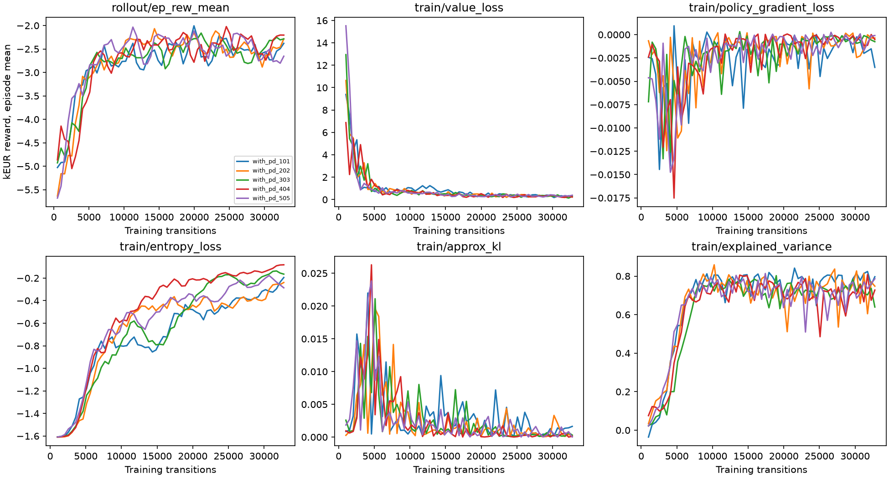
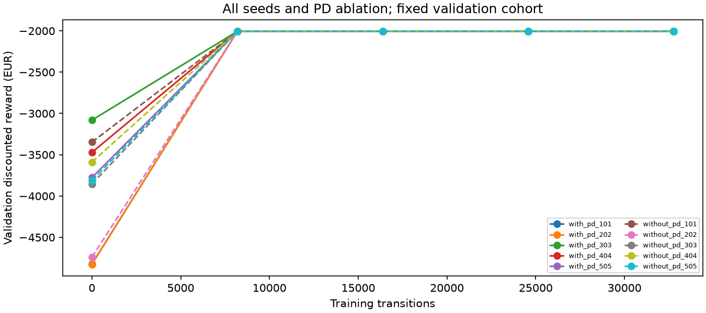
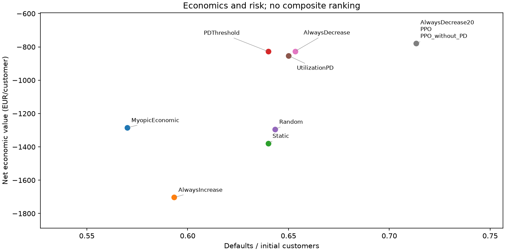
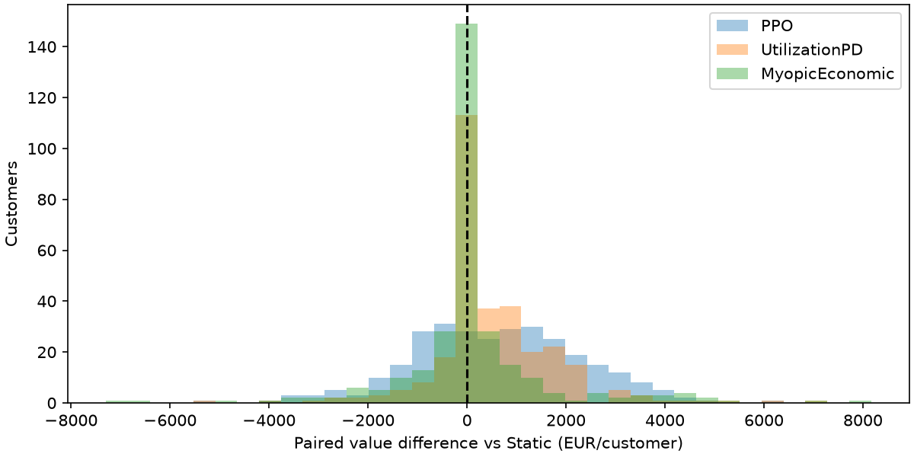
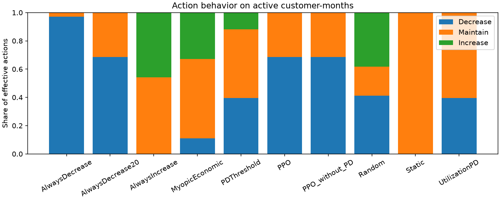
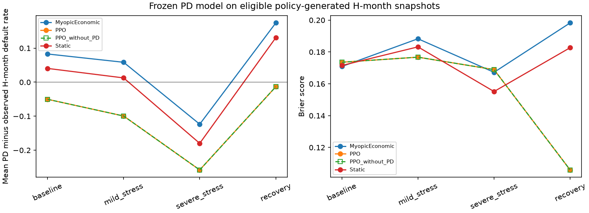
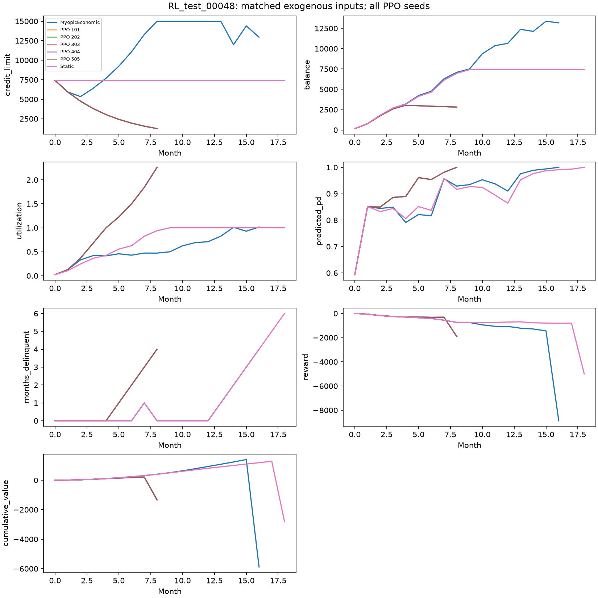
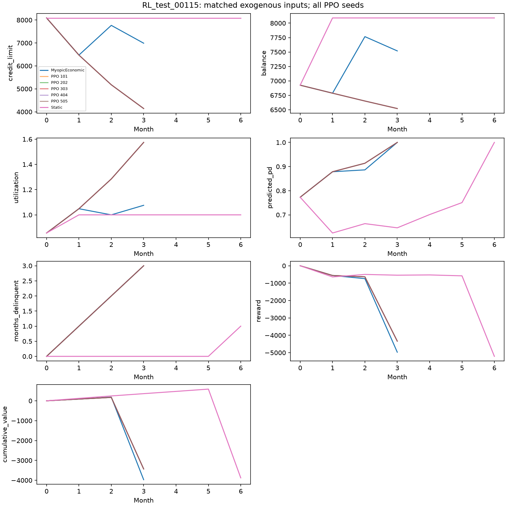
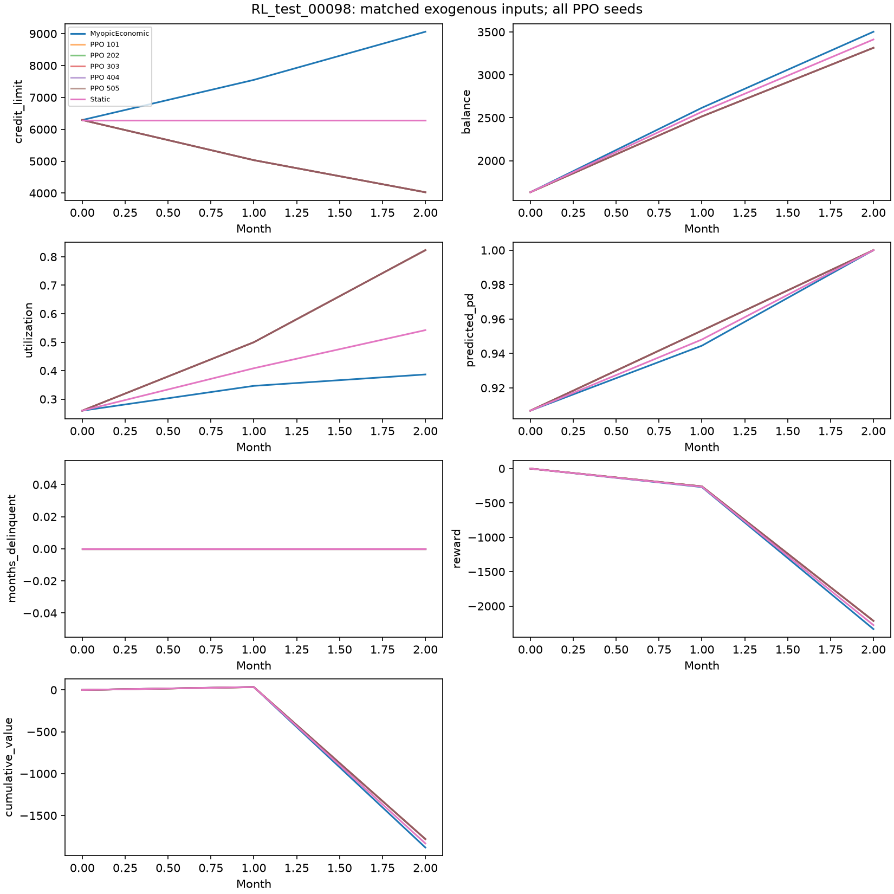

# Rapport expérimental — politiques de limites de crédit

**Résultat central : aucune valeur séquentielle supplémentaire n’est démontrée.** Les cinq PPO avec PD et les cinq sans PD reproduisent les actions effectives et les trajectoires de la réduction constante à −20 %, à l’arrondi numérique près. Le gain économique face à Static s’accompagne de davantage de défauts. Toutes les valeurs économiques moyennes restent négatives dans cette simulation.

Les tableaux proviennent des CSV de `outputs/results/policy_evaluation`, pour l’exécution locale du 19 septembre 2026. Les modèles, paramètres, seuils et checkpoints ont été figés par entraînement/validation avant l’ouverture du test. Aucune seed gagnante n’est sélectionnée. Le DGP, la PD et les coefficients de reward n’ont pas été modifiés pour favoriser PPO.

## Audit du système et modifications

Le système audité possédait un DGP longitudinal, des chemins macro et des chocs indexés, un environnement Gymnasium et un modèle PD observable avec historique. Le script PPO existant vérifiait surtout l’intégration sur une seule seed. Il manquait un benchmark partagé avec populations RL distinctes, baselines économiques fortes, sélection sur validation, incertitude appariée et diagnostics complets de décision. L’audit détaillé est dans [policy_audit.md](policy_audit.md).

**CREATED** : `configs/policy_evaluation.yaml` ; `envs/constraints.py` ; `policies/decision.py`, `oracle.py`, `registry.py`, `training.py` ; `evaluation/scenarios.py`, `policy_engine.py`, `policy_statistics.py`, `policy_reporting.py` ; `experiments/compare_policies.py` ; `tests/test_policy_benchmark.py` ; les trois documents `policy_audit.md`, `policy_evaluation.md`, `policy_results.md` ; checkpoints, tableaux et figures du benchmark.

**MODIFIED** : environnement pour la projection optionnelle des hausses en impayé sévère et leur traçabilité ; README principal ; guide des expériences ; documentation de l’environnement ; `.gitignore` pour conserver les petits résultats et figures, sans versionner les gros modèles et trajectoires.

**MOVED** : aucun. **DELETED** : aucun. Les composants PD/DGP corrects ont été conservés. Cet inventaire couvre le travail sur le benchmark, y compris les fichiers déjà enregistrés dans le commit local `c59bb5e`, et non uniquement le diff encore non committé.

## Problème de décision et protocole

L’observation contient 21 coordonnées publiques bornées : temps, limite, encours, utilisation, paiement, impayés, revenu, score, macro courante, PD à 12 mois, dépenses, retards récents, ancienneté, variations de revenu et indicateurs de régime. Aucun trait caché, hazard réel, choc futur ou macro future n’entre dans PPO.

Les actions demandées sont −20 %, −10 %, 0, +10 %, +20 %. L’environnement borne la limite à 500–15 000 EUR et bloque toute hausse après trois mois consécutifs d’impayé. Il enregistre demande, variation effective et blocage. Le défaut termine l’épisode ; sinon il est tronqué à 24 mois. La dette n’est jamais effacée par une baisse de limite. Le discount PPO est **γ=0,98**.

Les cohortes comprennent **1 500 train, 100 validation, 300 test**, puis 300 clients indépendants supplémentaires. Les identités et namespaces de seeds sont disjoints. Chaque comparaison conserve les mêmes états initiaux observables et latents, macro et chocs exogènes indexés. Les tirages propres à Random et à l’oracle ne décalent pas le monde. Les 30 600 épisodes évalués correspondent à 102 combinaisons politique/seed/scénario ; ils ne représentent pas 30 600 clients indépendants.

Baseline reste normal. Mild : 6 décisions normales, 6 en stress de sévérité 0,65, puis 12 normales. Severe : 4 normales, 16 en stress 1,6, puis 4 normales. Recovery : 6 en stress 1,3, 6 en stress 0,6, 6 normales, 6 en expansion. La cohorte `oot_markov` est un nouveau tirage synthétique, **pas un véritable test calendaire empirique OOT**. Voir [méthodologie complète](policy_evaluation.md).

## Politiques et information autorisée

| Policy | Exact requested decision logic |
|---|---|
| Static | Maintain |
| AlwaysDecrease | −10% when feasible, otherwise maintain |
| AlwaysDecrease20 | −20% when feasible, otherwise maintain |
| AlwaysIncrease | +10% when feasible, otherwise maintain |
| Random | Uniform among feasible actions; separate seeded generator per customer |
| PDThreshold | PD ≥high: −10%; PD <low: +10%; otherwise maintain; respect guardrails |
| UtilizationPD | PD ≥high or delinquency ≥3: −10%; PD <low, utilization ≥0.75 and no delinquency: +10%; otherwise maintain |
| MyopicEconomic | Maximize the explicitly specified observable one-step expected reward surrogate over feasible actions |
| PPO | Deterministic argmax of the trained SB3 policy distribution at evaluation |
| PPO_without_PD | Same architecture/budget/seeds; PD coordinate zeroed for the actor during training and evaluation |

Les seuils retenus sur validation sont **low=0,10, high=0,50**, communs aux deux règles. AlwaysDecrease20 a été ajouté sur la base de la validation, avant l’évaluation test, pour vérifier le rôle d’une réduction constante maximale.

MyopicEconomic estime le paiement par `min(encours × ratio observé, 0,5 × revenu)`, les achats par une demande observée ajustée à la limite et à la macro, puis l’encours suivant. Il convertit PD à 12 mois en hazard mensuel constant et ajuste ses log-odds avec les variations d’utilisation (coefficient 1) et de dette/revenu (0,3). Il maximise le reward immédiat espéré ; les égalités privilégient le changement minimal. Ces approximations sont explicites, observables et non identifiées causalement ; il n’appelle jamais le DGP caché.

**SIMULATOR-ONLY ORACLE** : l’adaptateur myope utilise les traits cachés et 12 chocs comportementaux hypothétiques indépendants par action, communs entre les actions candidates. Il ne lit pas les chocs futurs réellement évalués ni la macro future. Ses résultats sont séparés ci-dessous. Ce diagnostic non déployable n’est pas une borne supérieure : il reste myope et approché par Monte Carlo.

## Reward : audit, unités et interprétation

Le reward mensuel en EUR est `(1−D) × B × APR/12 + achats × frais − D × LGD × B_suivant − funding/12 × B_suivant − poids_capital × RWA × PD_12m × B_suivant − pénalité × max(0, PD_12m−seuil)`.

APR=18 %, frais=1,2 %, LGD=55 %, funding annuel=3 %, poids capital=1,5, RWA=0,08, poids pénalité=25, seuil=0,12. La composante capital est une convention synthétique mensuelle, pas une formule réglementaire validée. L’audit porte sur **12 822 transitions de clients train** sous Static, Random et MyopicEconomic. Aucune composante n’a été retirée ni recalibrée après observation de PPO.

| Composante EUR | Moyenne | Écart-type | p01 | p05 | Médiane | p95 | p99 |
| --- | --- | --- | --- | --- | --- | --- | --- |
| reward_interest_income | 50.41 | 36.41 | 0.00 | 8.51 | 41.81 | 125.65 | 177.07 |
| reward_fee_income | 11.80 | 8.09 | 0.00 | 1.42 | 10.03 | 26.76 | 39.73 |
| reward_credit_loss | 142.13 | 750.08 | 0.00 | 0.00 | 0.00 | 0.00 | 4,284.74 |
| reward_funding_cost | 9.40 | 6.32 | 1.77 | 2.50 | 7.74 | 22.51 | 30.71 |
| reward_capital_cost | 236.88 | 281.47 | 0.23 | 2.06 | 134.48 | 828.58 | 1,316.60 |
| reward_constraint_penalty | 8.04 | 7.30 | 0.00 | 0.00 | 6.64 | 20.73 | 21.68 |
| reward | -334.25 | 906.65 | -5,216.36 | -1,176.82 | -96.37 | 35.33 | 55.69 |

La charge de capital moyenne (~237 EUR/mois) dépasse les intérêts (~50 EUR) ; les pertes réalisées ont une forte queue. Ce poids économique incertain contribue aux incitations de réduction. L’apprentissage utilise seulement la conversion fixe **EUR × 0,001** : aucune normalisation adaptative de reward et aucune statistique issue du test.

**Valeur économique nette** = revenus − pertes réalisées − funding. **Reward cumulé** = cette valeur − capital − pénalités. Le premier est un proxy simplifié avant capital, pas un bénéfice comptable. La valeur terminale des prêts survivants, le bien-être du client et les coûts opérationnels de changement de limite ne sont pas modélisés.

## PPO : entraînement, validation et seeds

Stable-Baselines3 PPO, CPU, un thread Torch, actor et critic séparés `[64,64]` tanh, actions catégorielles. Chaque agent reçoit 32 768 transitions ; 5 seeds avec PD et 5 sans PD : 101, 202, 303, 404, 505. Hyperparamètres : γ=0,98, GAE=0,95, rollout=512, minibatch=128, 5 epochs, clip=0,2, vf_coef=0,5, max_grad_norm=0,5. Les observations utilisent leurs transformations publiques fixes, sans statistiques ajustées.

Deux pilotes de 4 096 transitions sur la seed 17 comparent learning rate/entropie `(0,0003;0,01)` et `(0,0001;0,02)`. Tous deux obtiennent −2 005,8306 EUR de reward actualisé sur validation ; l’égalité conserve le premier. Les seuils et deux résultats pilotes sont sauvegardés. Les checkpoints sont évalués à l’initialisation, tous les 8 192 pas et après la dernière mise à jour. Le maximum du reward actualisé brut moyen sur validation sélectionne le checkpoint, le plus ancien en cas d’égalité. **Tous les checkpoints retenus sont à 8 192 pas**, mais les dix entraînements ont bien atteint 32 768 pas.

Le smoke test réel à 1 024 transitions a amélioré son score de validation de −4 269,54 à −2 605,43 sans NaN, observation invalide ou problème de sauvegarde. Les courbes principales montrent une baisse de la value loss, une variance expliquée proche de 0,7–0,8 et une concentration de l’acteur. La hausse du reward train ne constitue pas à elle seule une preuve économique hors échantillon.

| Policy | Seed | Valeur EUR | Reward EUR | Défauts % | Pertes EUR |
| --- | --- | --- | --- | --- | --- |
| PPO | 101 | -779.4 | -2,363.5 | 71.3 | 1,105.9 |
| PPO | 202 | -779.4 | -2,363.5 | 71.3 | 1,105.9 |
| PPO | 303 | -779.4 | -2,363.5 | 71.3 | 1,105.9 |
| PPO | 404 | -779.4 | -2,363.5 | 71.3 | 1,105.9 |
| PPO | 505 | -779.4 | -2,363.5 | 71.3 | 1,105.9 |
| PPO_without_PD | 101 | -779.4 | -2,363.5 | 71.3 | 1,105.9 |
| PPO_without_PD | 202 | -779.4 | -2,363.5 | 71.3 | 1,105.9 |
| PPO_without_PD | 303 | -779.4 | -2,363.5 | 71.3 | 1,105.9 |
| PPO_without_PD | 404 | -779.4 | -2,363.5 | 71.3 | 1,105.9 |
| PPO_without_PD | 505 | -779.4 | -2,363.5 | 71.3 | 1,105.9 |

L’écart-type inter-seeds de la valeur, du reward, des pertes et du taux de défaut est nul dans chaque scénario : les décisions déterministes coïncident. Cela ne signifie ni absence d’incertitude client ni optimalité globale. Les CSV conservent les résultats individuels de toutes les seeds dans tous les scénarios.

## Économie baseline : toutes les politiques déployables

| Policy | Valeur EUR [IC95 %] | Revenus | Pertes | Funding | Capital | Reward |
| --- | --- | --- | --- | --- | --- | --- |
| Static | -1,379.3 [-1,640.7; -1,078.3] | 1,012.6 | 2,237.3 | 154.7 | 4,089.4 | -5,588.6 |
| AlwaysDecrease | -826.2 [-1,014.2; -658.3] | 600.5 | 1,336.4 | 90.3 | 2,165.6 | -3,095.9 |
| AlwaysDecrease20 | -779.4 [-929.6; -654.0] | 385.3 | 1,105.9 | 58.8 | 1,494.1 | -2,363.5 |
| AlwaysIncrease | -1,703.1 [-2,008.3; -1,371.0] | 1,103.2 | 2,638.0 | 168.3 | 4,516.6 | -6,339.6 |
| Random | -1,294.6 [-1,566.8; -1,054.4] | 912.7 | 2,068.4 | 138.9 | 3,467.2 | -4,874.6 |
| PDThreshold | -828.0 [-1,023.2; -619.7] | 802.7 | 1,511.5 | 119.1 | 2,741.6 | -3,679.5 |
| UtilizationPD | -852.9 [-1,055.0; -660.0] | 799.0 | 1,533.0 | 118.9 | 2,741.0 | -3,704.0 |
| MyopicEconomic | -1,285.2 [-1,568.1; -967.5] | 1,066.2 | 2,191.3 | 160.1 | 4,114.5 | -5,519.8 |
| PPO | -779.4 [-923.6; -646.3] | 385.3 | 1,105.9 | 58.8 | 1,494.1 | -2,363.5 |
| PPO_without_PD | -779.4 [-923.6; -646.3] | 385.3 | 1,105.9 | 58.8 | 1,494.1 | -2,363.5 |

Les moyennes sont par client initial. Les IC utilisent 300 rééchantillonnages de clients entiers, communs aux seeds, avec rééchantillonnage des seeds PPO. Les intervalles sont conditionnels au monde, au modèle PD et aux scénarios macro fixés. Les petites différences d’IC entre politiques aux trajectoires identiques proviennent de la séquence Monte Carlo de rééchantillonnage (nombre de seeds différent), pas d’un écart d’issue économique.

## Risque, exposition et contraintes

| Policy | Défauts % clients | Impayés % mois actifs | Pertes / encours initial % | EAD EUR | Encours moyen | Exposition PD≥0,6 % |
| --- | --- | --- | --- | --- | --- | --- |
| Static | 64.0 | 16.1 | 81.4 | 6,355.8 | 4,664.7 | 47.8 |
| AlwaysDecrease | 65.3 | 17.7 | 48.6 | 3,719.1 | 3,315.5 | 38.2 |
| AlwaysDecrease20 | 71.3 | 18.7 | 40.2 | 2,818.7 | 2,663.9 | 42.6 |
| AlwaysIncrease | 59.3 | 13.7 | 95.9 | 8,083.8 | 5,008.5 | 48.5 |
| Random | 64.3 | 15.9 | 75.2 | 5,845.7 | 4,348.3 | 42.6 |
| PDThreshold | 64.0 | 16.5 | 55.0 | 4,294.0 | 3,842.0 | 35.3 |
| UtilizationPD | 65.0 | 16.6 | 55.8 | 4,288.1 | 3,846.2 | 35.3 |
| MyopicEconomic | 57.0 | 13.5 | 79.7 | 6,989.8 | 4,522.5 | 45.6 |
| PPO | 71.3 | 18.7 | 40.2 | 2,818.7 | 2,663.9 | 42.6 |
| PPO_without_PD | 71.3 | 18.7 | 40.2 | 2,818.7 | 2,663.9 | 42.6 |

| Policy | Au moins un impayé % | PD moyenne % | Limite moyenne EUR | Utilisation moyenne | Limite finale / initiale −1 % |
| --- | --- | --- | --- | --- | --- |
| Static | 74.7 | 43.6 | 7,312.6 | 0.7 | 0.0 |
| AlwaysDecrease | 79.7 | 40.9 | 3,954.7 | 0.9 | -65.7 |
| AlwaysDecrease20 | 81.7 | 39.4 | 2,794.8 | 1.1 | -77.4 |
| AlwaysIncrease | 71.7 | 42.2 | 11,370.3 | 0.5 | 104.6 |
| Random | 76.3 | 42.1 | 6,829.6 | 0.7 | -11.1 |
| PDThreshold | 75.3 | 41.5 | 6,429.3 | 0.7 | -15.6 |
| UtilizationPD | 75.3 | 41.7 | 5,699.2 | 0.8 | -37.8 |
| MyopicEconomic | 71.7 | 41.3 | 11,174.1 | 0.5 | 94.8 |
| PPO | 81.7 | 39.4 | 2,794.8 | 1.1 | -77.4 |
| PPO_without_PD | 81.7 | 39.4 | 2,794.8 | 1.1 | -77.4 |

Défauts : défauts / clients initiaux. Impayés mensuels : mois d’impayé / mois actifs. Pertes : perte totale / encours total initial. EAD : exposition au défaut / nombre de défauts. Exposition à haut risque : somme des encours de fin de mois lorsque la PD d’ouverture ≥0,6 / somme de tous les encours de fin de mois. Encours, limite et utilisation moyens : moyenne des moyennes temporelles individuelles ; PD moyenne : pondération par mois actif. Les populations survivantes diffèrent entre politiques.

PPO diminue l’encours moyen de 4 664,7 à 2 663,9 EUR face à Static, mais porte l’utilisation moyenne de 0,661 à 1,098 et le défaut de 64,0 % à 71,3 %. La PD moyenne sur mois actifs peut baisser malgré davantage de défauts : composition, survie et calibration changent. AlwaysIncrease génère davantage de revenus et de pertes, mais moins de défauts ; fréquence et sévérité de perte sont distinctes.

Les alertes configurées sont expérimentales : défaut >75 %, pertes/encours initial >70 %, exposition à PD≥0,6 >60 %. Ce sont des contrôles ex post, pas des garanties de constrained RL. Aucun accroissement effectif après trois mois consécutifs d’impayé n’est observé.

| Policy | Scénario | Alerte défaut | Alerte pertes | Alerte exposition risquée |
| --- | --- | --- | --- | --- |
| MyopicEconomic | baseline | False | True | False |
| MyopicEconomic | mild_stress | False | True | False |
| MyopicEconomic | recovery | False | True | True |
| MyopicEconomic | severe_stress | True | True | True |
| PPO | baseline | False | False | False |
| PPO | mild_stress | True | False | False |
| PPO | recovery | True | False | True |
| PPO | severe_stress | True | False | False |
| Static | baseline | False | True | False |
| Static | mild_stress | False | True | False |
| Static | recovery | True | True | True |
| Static | severe_stress | True | True | True |

## Différences appariées et valeur séquentielle

| Référence | Métrique | PPO − référence | IC95 % bas | IC95 % haut | Fraction clients Δ>0 |
| --- | --- | --- | --- | --- | --- |
| Static | cumulative_reward | 3,225.122 | 2,835.943 | 3,678.124 | 0.820 |
| Static | net_economic_value | 599.912 | 405.186 | 801.403 | 0.623 |
| Static | credit_loss | -1,131.368 | -1,319.368 | -960.899 | 0.110 |
| Static | default rate (points %) | 7.333 | 3.825 | 11.175 | 0.097 |
| MyopicEconomic | cumulative_reward | 3,156.257 | 2,660.315 | 3,634.715 | 0.757 |
| MyopicEconomic | net_economic_value | 505.817 | 276.462 | 706.080 | 0.513 |
| MyopicEconomic | credit_loss | -1,085.410 | -1,282.256 | -870.319 | 0.163 |
| MyopicEconomic | default rate (points %) | 14.333 | 10.492 | 19.175 | 0.150 |

L’écart de valeur contre Static est +599,9 EUR, mais l’écart de défaut est +7,3 points. Contre MyopicEconomic, le gain de valeur est +505,8 EUR avec +14,3 points de défaut. La fraction positive doit être interprétée selon le sens de la métrique : une hausse de pertes ou de défaut n’est pas un bénéfice.

La comparaison explicite à AlwaysDecrease20 invalide une interprétation en « valeur apprise du futur » : 55 comparaisons trajectoire/policy/seed/scénario, aucun mois non apparié, écart maximal d’encours inférieur à 2×10⁻¹³ EUR. PPO sans PD et PPO avec PD biaisée sont également équivalents sur les scénarios exécutés. Les demandes diffèrent au plancher (PPO continue à demander −20 %), mais les transitions effectives coïncident. Le gain face à Myopic peut donc être expliqué par une action constante. Rien ici ne démontre que PPO sacrifie un revenu immédiat pour apprendre une meilleure continuation.

## Robustesse macro et cohorte indépendante

| Policy | Baseline EUR | Mild EUR | Severe EUR | Recovery EUR | Pire scénario EUR | Cohorte indépendante EUR |
| --- | --- | --- | --- | --- | --- | --- |
| Static | -1,379.3 | -1,615.3 | -2,494.2 | -1,992.0 | -2,494.2 | -1,305.7 |
| AlwaysDecrease | -826.2 | -1,030.1 | -1,668.1 | -1,596.0 | -1,668.1 | -703.4 |
| AlwaysDecrease20 | -779.4 | -887.7 | -1,280.8 | -1,514.1 | -1,514.1 | -738.3 |
| AlwaysIncrease | -1,703.1 | -1,956.3 | -2,755.2 | -2,056.6 | -2,755.2 | -1,716.6 |
| Random | -1,294.6 | -1,480.9 | -2,317.2 | -1,918.5 | -2,317.2 | -1,168.8 |
| PDThreshold | -828.0 | -1,119.5 | -1,886.7 | -1,576.1 | -1,886.7 | -744.1 |
| UtilizationPD | -852.9 | -1,125.9 | -1,881.8 | -1,576.3 | -1,881.8 | -769.0 |
| MyopicEconomic | -1,285.2 | -1,525.6 | -2,430.6 | -1,943.9 | -2,430.6 | -1,381.9 |
| PPO | -779.4 | -887.7 | -1,280.8 | -1,514.1 | -1,514.1 | -738.3 |
| PPO_without_PD | -779.4 | -887.7 | -1,280.8 | -1,514.1 | -1,514.1 | -738.3 |

| Policy | Baseline défaut % | Mild défaut % | Severe défaut % | Recovery défaut % | Indépendant défaut % |
| --- | --- | --- | --- | --- | --- |
| Static | 64.0 | 69.7 | 91.3 | 79.0 | 67.7 |
| AlwaysDecrease | 65.3 | 72.7 | 93.3 | 83.3 | 68.3 |
| AlwaysDecrease20 | 71.3 | 78.7 | 95.3 | 89.3 | 74.7 |
| AlwaysIncrease | 59.3 | 65.0 | 87.7 | 74.3 | 62.0 |
| Random | 64.3 | 70.3 | 91.3 | 81.0 | 67.3 |
| PDThreshold | 64.0 | 71.7 | 92.0 | 82.0 | 67.0 |
| UtilizationPD | 65.0 | 72.0 | 92.0 | 82.0 | 67.7 |
| MyopicEconomic | 57.0 | 63.0 | 87.3 | 74.7 | 60.0 |
| PPO | 71.3 | 78.7 | 95.3 | 89.3 | 74.7 |
| PPO_without_PD | 71.3 | 78.7 | 95.3 | 89.3 | 74.7 |

PPO reste équivalent à la coupe maximale dans les quatre scénarios macro et ne reprend pas les hausses pendant recovery. Son pire scénario de valeur est recovery (−1 514,1 EUR), tandis que son pire taux de défaut est severe (95,3 %). Recovery commence en stress dès l’origine : exposition au moment du choc, défaut précoce et composition survivante diffèrent de severe ; les noms ne constituent pas un ordre de pertes garanti.

Sur la cohorte indépendante, AlwaysDecrease à −10 % obtient −703,4 EUR contre −738,3 pour PPO, avec 68,3 % contre 74,7 % de défaut. Cet écart descriptif ne reçoit pas ici un test de supériorité additionnel ; il ne sert à aucun nouveau choix de paramètres.

## Actions, churn et interprétabilité

| Policy | Hausses % | Baisses % | Maintien % | Demande moyenne % | Effet moyen % | Changements/client | Inversions/client |
| --- | --- | --- | --- | --- | --- | --- | --- |
| Static | 0.0 | 0.0 | 100.0 | 0.0 | 0.0 | 0.0 | 0.0 |
| AlwaysDecrease | 0.0 | 97.2 | 2.8 | -9.7 | -9.7 | 13.4 | 0.0 |
| AlwaysDecrease20 | 0.0 | 68.5 | 31.5 | -13.7 | -13.4 | 8.5 | 0.0 |
| AlwaysIncrease | 45.7 | 0.0 | 54.3 | 4.6 | 4.4 | 6.9 | 0.0 |
| Random | 38.3 | 41.3 | 20.4 | -0.4 | -0.5 | 11.3 | 5.3 |
| PDThreshold | 11.8 | 39.5 | 48.8 | -2.8 | -2.8 | 7.2 | 0.2 |
| UtilizationPD | 0.1 | 39.7 | 60.2 | -4.0 | -4.0 | 5.6 | 0.0 |
| MyopicEconomic | 32.8 | 10.9 | 56.3 | 4.3 | 4.0 | 6.8 | 1.6 |
| PPO | 0.0 | 68.5 | 31.5 | -20.0 | -13.4 | 8.5 | 0.0 |
| PPO_without_PD | 0.0 | 68.5 | 31.5 | -20.0 | -13.4 | 8.5 | 0.0 |

PPO demande −20 % à chaque décision ; 68,5 % des actions produisent une baisse effective et 31,5 % deviennent sans effet au plancher. La variation absolue effective moyenne est 13,38 % par mois actif, avec 8,49 changements/client et aucune inversion. MyopicEconomic présente 1,60 inversion/client en moyenne ; ses variations reflètent l’optimisation du surrogate et aucun coût de churn n’a été inventé pour les masquer.

Les slices contrôlées couvrent 19 PD, 13 utilisations, deux niveaux d’impayés et deux régimes macro, soit **4 940 décisions PPO** sur les cinq seeds. Toutes demandent −20 %. Aucune hausse quand la PD augmente n’est détectée sur les 4 680 paires adjacentes PPO. La règle à seuil est monotone. Le myope présente une inversion parmi 936 paires : en stress, utilisation 0,2, sans impayé, il passe de +10 % à +20 % entre PD 0,65 et 0,70. Cela expose une particularité du surrogate de risque/utilisation, pas une propriété causale validée. Aucune monotonie n’a été imposée après coup. Ces slices peuvent être hors de la distribution observée.

## Ablation PD et signal biaisé

| Policy | Signal | Valeur EUR | Défaut % | Encours EUR |
| --- | --- | --- | --- | --- |
| MyopicEconomic | baseline | -1,285.2 | 57.0 | 4,522.5 |
| MyopicEconomic | baseline_biased_pd | -1,280.4 | 56.7 | 4,523.1 |
| PDThreshold | baseline | -828.0 | 64.0 | 3,842.0 |
| PDThreshold | baseline_biased_pd | -1,375.9 | 63.3 | 4,658.7 |
| PPO | baseline | -779.4 | 71.3 | 2,663.9 |
| PPO | baseline_biased_pd | -779.4 | 71.3 | 2,663.9 |

L’ablation entraîne réellement cinq nouveaux agents à budget égal avec la coordonnée PD nulle. Les autres observables, le modèle PD utilisé par le reward et le monde restent identiques. Les résultats sont identiques avec/sans PD sur les cinq ensembles évalués. Cela mesure l’absence d’apport marginal de cette coordonnée pour la politique constante apprise, pas l’inutilité générale du risque.

La sensibilité divise uniquement la PD visible par l’acteur par deux. La PD du reward reste intacte. PDThreshold perd environ 548 EUR/client et ne réduit presque plus les limites ; Myopic change peu ; PPO reste constant. L’absence de sensibilité de PPO ne prouve pas une robustesse universelle à une mauvaise calibration. Aucune ablation macro supplémentaire ni autre algorithme RL n’a été ajouté.

## Retour de la politique sur le modèle PD

| Policy | Scénario | Snapshots éligibles | Défaut H mois % | PD moyenne % | AUC | Brier | ECE |
| --- | --- | --- | --- | --- | --- | --- | --- |
| MyopicEconomic | baseline | 3038 | 36.932 | 45.220 | 0.823 | 0.171 | 0.099 |
| PPO | baseline | 2660 | 52.632 | 47.604 | 0.824 | 0.174 | 0.050 |
| Static | baseline | 2942 | 44.052 | 48.100 | 0.825 | 0.172 | 0.058 |
| MyopicEconomic | mild_stress | 2922 | 44.661 | 50.509 | 0.797 | 0.188 | 0.074 |
| PPO | mild_stress | 2548 | 62.951 | 53.006 | 0.817 | 0.177 | 0.099 |
| Static | mild_stress | 2829 | 51.856 | 53.110 | 0.801 | 0.183 | 0.038 |
| MyopicEconomic | recovery | 2219 | 51.420 | 68.846 | 0.843 | 0.198 | 0.174 |
| PPO | recovery | 1765 | 74.504 | 73.171 | 0.911 | 0.106 | 0.067 |
| Static | recovery | 2108 | 56.641 | 69.730 | 0.838 | 0.183 | 0.131 |
| MyopicEconomic | severe_stress | 2503 | 74.551 | 62.202 | 0.804 | 0.167 | 0.128 |
| PPO | severe_stress | 2048 | 88.916 | 63.124 | 0.832 | 0.169 | 0.258 |
| Static | severe_stress | 2354 | 80.756 | 62.778 | 0.845 | 0.155 | 0.180 |

Les cibles sont les défauts dans la fenêtre suivante de 12 mois, sur snapshots actifs et administrativement éligibles ; elles ne sont pas le taux de défaut cumulé de l’épisode. Les nombres de snapshots ne sont pas des observations indépendantes et les cinq seeds PPO identiques ne multiplient pas la taille d’échantillon. Aucun modèle n’est refit dans ce diagnostic.

En severe/PPO, la PD moyenne 63,1 % sous-estime la prévalence à 12 mois de 88,9 %. Un Brier parfois inférieur sous stress ne suffit pas à conclure à une meilleure calibration, car la prévalence et les états changent. La boucle PD → décisions → états → features modifie l’usage du modèle.

| Feature | Moyenne train PD | Moyenne sous PPO | PPO q10 | PPO q90 | Décalage moyen |
| --- | --- | --- | --- | --- | --- |
| credit_limit | 6,795.110 | 3,311.274 | 627.157 | 7,309.495 | -3,483.836 |
| balance | 3,778.534 | 2,509.988 | 696.769 | 5,028.256 | -1,268.546 |
| utilization | 0.593 | 0.961 | 0.385 | 1.476 | 0.368 |
| months_delinquent | 0.277 | 0.298 | 0.000 | 1.000 | 0.021 |
| utilization_mean3 | 0.544 | 0.816 | 0.308 | 1.216 | 0.272 |
| limit_change6 | -0.012 | -0.718 | -0.738 | -0.688 | -0.707 |

La limite moyenne des snapshots éligibles tombe de 6 795 à 3 311 EUR, l’utilisation passe de 0,593 à 0,961, et le changement de limite sur six mois de −0,012 à −0,718. Ces différences de distribution et de suivi limitent le transfert de calibration. Les moyennes diffèrent des KPI d’épisode car l’éligibilité et la pondération diffèrent.

## Trajectoires examinées

| Client | Policy | Mois observés | Défaut | Valeur EUR | Limite finale EUR | Inversions |
| --- | --- | --- | --- | --- | --- | --- |
| RL_test_00048 | Static | 18 | 1 | -2,815.3 | 7,421.8 | 0 |
| RL_test_00098 | Static | 2 | 1 | -1,833.8 | 6,292.4 | 0 |
| RL_test_00115 | Static | 6 | 1 | -3,878.6 | 8,089.9 | 0 |
| RL_test_00048 | MyopicEconomic | 16 | 1 | -5,879.0 | 12,960.0 | 4 |
| RL_test_00098 | MyopicEconomic | 2 | 1 | -1,882.4 | 9,061.0 | 0 |
| RL_test_00115 | MyopicEconomic | 3 | 1 | -3,970.2 | 6,989.7 | 2 |
| RL_test_00048 | PPO | 8 | 1 | -1,336.0 | 1,245.2 | 0 |
| RL_test_00098 | PPO | 2 | 1 | -1,781.7 | 4,027.1 | 0 |
| RL_test_00115 | PPO | 3 | 1 | -3,430.8 | 4,142.0 | 0 |

Ces exemples ont été sélectionnés selon l’état initial, avant lecture des outcomes : utilisation minimale (00048), maximale (00115), score minimal (00098). Ils illustrent des mécanismes et ne représentent pas la prévalence du portefeuille. Les figures tracent toutes les seeds PPO ; la table évite de répéter cinq lignes identiques.

Pour 00048, PPO réduit l’encours mais atteint le défaut au mois 8 contre 18 sous Static ; le myope augmente ensuite l’exposition et défaut au mois 16 avec davantage de perte. Pour 00115, les coupes placent rapidement la dette au-dessus de la limite, avec défaut au mois 3 au lieu de 6 sous Static. Pour 00098, toutes les politiques font défaut au mois 2 malgré des limites différentes. Ces cas ne montrent pas une continuation séquentielle supérieure. **La PD terminale égale à 1 est une sentinelle de défaut, pas une prévision active.**

## Oracle : diagnostic séparé, non déployable

| Scénario | Valeur EUR | Revenus EUR | Pertes EUR | Défaut % | Reward EUR |
| --- | --- | --- | --- | --- | --- |
| baseline | -1,156.5 | 957.6 | 1,971.0 | 56.3 | -4,849.3 |
| mild_stress | -1,389.6 | 866.5 | 2,124.1 | 62.7 | -5,050.4 |
| oot_markov | -1,172.6 | 875.1 | 1,915.7 | 58.0 | -4,726.9 |
| recovery | -1,943.6 | 640.1 | 2,480.3 | 75.3 | -5,469.5 |
| severe_stress | -2,256.2 | 570.9 | 2,731.5 | 87.3 | -5,573.7 |

L’oracle myope améliore ici certains résultats du myope observable, mais ne domine pas toutes les politiques. Son accès aux traits latents interdit de l’interpréter comme une comparaison à information égale. Son caractère myope et ses 12 tirages interdisent de présenter sa valeur comme une borne d’optimalité.

## Tests, performances et vérifications

**108 tests passés, 0 échoué**, dernière suite complète exécutée en 9,27 s. Les tests couvrent notamment les labels/features temporels, l’absence de champs cachés, l’invariance de l’observation à des traits/chocs futurs modifiés, les populations disjointes, les chocs appariés, la projection des actions, les dénominateurs et identités économiques, le bootstrap par client, la PD biaisée limitée à l’acteur et un entraînement court avec sauvegarde/rechargement PD/PPO.

Les dix entraînements principaux totalisent 327,680 transitions et 677.0 secondes (11.28 min), validation incluse ; 135.9 secondes sont consacrées à la validation. Débit hors validation : 569–641 pas/s. Les pilotes et le smoke s’ajoutent à ce total.

Le moteur final a mesuré 341,051 transitions en 603.7 secondes (10.06 min), hors export final CSV, bootstrap et figures. La latence ci-dessous concerne uniquement `act`, pas le calcul PD ou le reset. Elle dépend du CPU et de la charge locale.

| Policy | Évaluation pas/s | Inférence ms |
| --- | --- | --- |
| AlwaysDecrease | 670.950 | 0.059 |
| AlwaysDecrease20 | 641.205 | 0.059 |
| AlwaysIncrease | 687.764 | 0.060 |
| MyopicEconomic | 653.272 | 0.174 |
| PDThreshold | 682.613 | 0.061 |
| PPO | 554.257 | 0.288 |
| PPO_without_PD | 552.924 | 0.285 |
| Random | 672.620 | 0.080 |
| SIMULATOR_ONLY_ORACLE_Myopic | 258.033 | 1.917 |
| Static | 674.986 | 0.060 |
| UtilizationPD | 673.026 | 0.066 |

Les contrôles automatisés de cohérence sont consignés dans [verification.json](../outputs/results/policy_evaluation/verification.json) : cohortes disjointes, 300 clients par combinaison, comptes économiques, modèle PD figé, équivalence des trajectoires, dix lignes chiffrées du README et 29 liens locaux vérifiés.

Les dix checkpoints sélectionnés ont été chargés pour l’évaluation réelle ; chaque entraînement vérifie aussi la parité de prédiction après rechargement. Les figures économiques, de stress, d’action, de convergence, de calibration et les trois trajectoires ont été inspectées visuellement.

Le README a été réécrit pour présenter uniquement le système actuel, ses résultats mesurés, trois composants distincts, le protocole et ses limites. Il ne décrit aucune phase ou version antérieure. Les commandes d’installation, pytest, entraînement PD, smoke PD, audit/smoke/train/evaluate/figures du benchmark ont été exécutées dans l’environnement local. `--stage all` est la composition des étapes du même runner. Les artefacts et chemins de reproduction sont détaillés dans [experiments/README.md](../experiments/README.md).

## Artefacts et reproductibilité

Les CSV compacts versionnables comprennent `summary`, `seed_metrics`, `paired_comparisons`, `robustness`, `reward_audit`, `selection`, `pilot_validation`, `threshold_validation`, `pd_calibration_under_policies`, `constant_rule_equivalence`, ainsi que les benchmarks et manifestes.

Les sorties locales détaillées contiennent `episode_metrics.csv`, `trajectories/*.csv.gz`, les épisodes séparés, les distributions appariées, `monthly_metrics.csv`, `action_metrics.csv`, les features PD et leurs décalages, les slices et contrôles de monotonie, les trajectoires illustratives et `population_ids.json`. Les modèles contiennent selected/final/checkpoints, metadata, Monitor, progress et validation CSV pour tous les agents.

Les manifestes conservent versions de packages, configuration, SHA-256 des sources et empreinte de l’artefact PD. Le fingerprint de reprise vérifie configuration et modèle PD ; les hashes source sont enregistrés séparément. Les gros modèles et traces restent locaux, reproductibles par les commandes documentées. Les valeurs négatives et tous les pilotes/seeds sont conservés.

## Limites méthodologiques

Monde synthétique et fréquence de défaut très élevée ; coefficients non calibrés empiriquement ; capital mensuel alimenté par une PD à 12 mois ; absence de valeur terminale, coûts opérationnels et utilité client ; recovery simplifiée ; menu d’actions limité ; entraînement sur trajectoires fixes, petit budget et petite validation ; tuning à une seule seed pilote ; surrogate myope aux sensibilités supposées ; ablation PD qui conserve les autres signaux de risque ; snapshots corrélés ; macro commune hors bootstrap ; absence de correction de shift induit par la politique ; fenêtre PD incomplète après le mois 12 ; oracle non optimal et non comparable à information égale.

Les alertes portefeuille ne sont pas contraintes dans l’optimisation. Une amélioration du reward ne suffit pas à une recommandation de crédit. Le plateau observé n’établit pas que PPO est globalement optimal, ni qu’un autre régime économique produirait le même comportement.

## Priorités techniques suivantes, non implémentées

1. Valider indépendamment les unités et horizons du coût de capital et des pénalités ; définir une fonction économique justifiée avant une nouvelle expérience.
2. Introduire une valorisation terminale et une comptabilité de remboursement/recovery cohérentes, puis auditer leurs incitations.
3. Répliquer sur de nombreux chemins macro indépendants et intégrer cette incertitude aux intervalles.
4. Estimer sur train un modèle de transition observable pour renforcer la baseline myope sans lui fournir de traits cachés.
5. Évaluer le transfert de calibration et les cibles conditionnées par politique avec des cohortes dédiées, sans recalibrer sur le test utilisé ici.
6. Quantifier les coûts de changements de limite et les conséquences client avant de proposer une pénalité de churn ou de nouvelles contraintes.
7. Préenregistrer un budget PPO plus long, plusieurs seeds de sélection et une nouvelle validation, avec un nouveau holdout final.
8. Confronter hypothèses et résultats à des données empiriques gouvernées avant toute interprétation opérationnelle.
