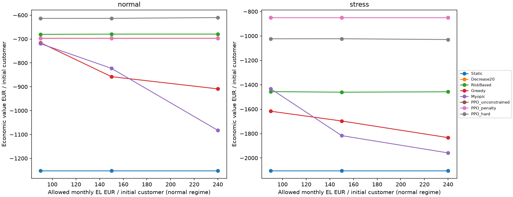
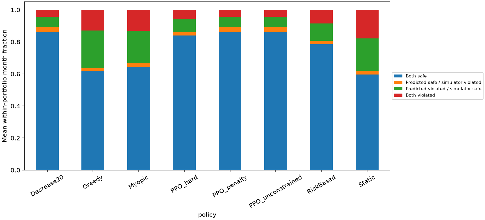
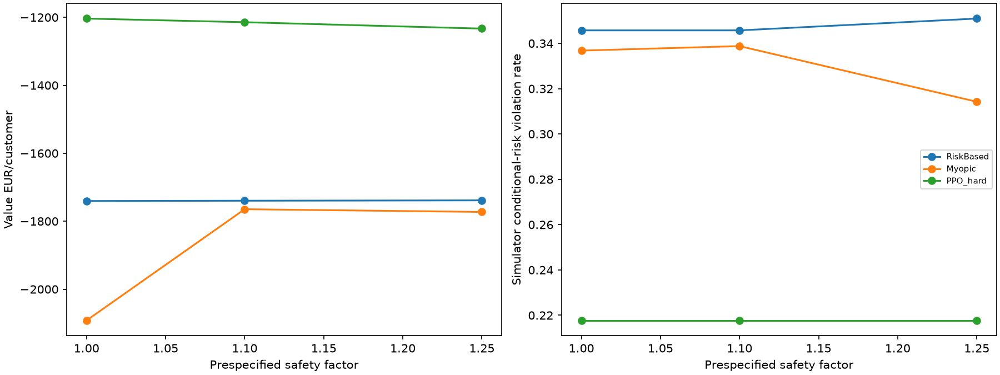
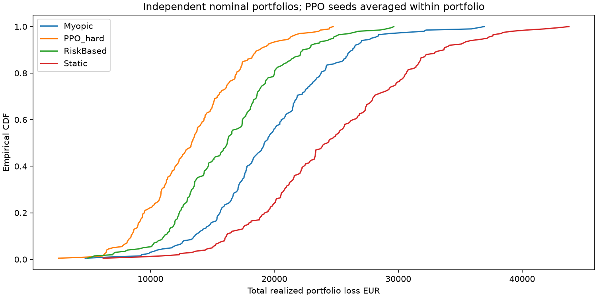
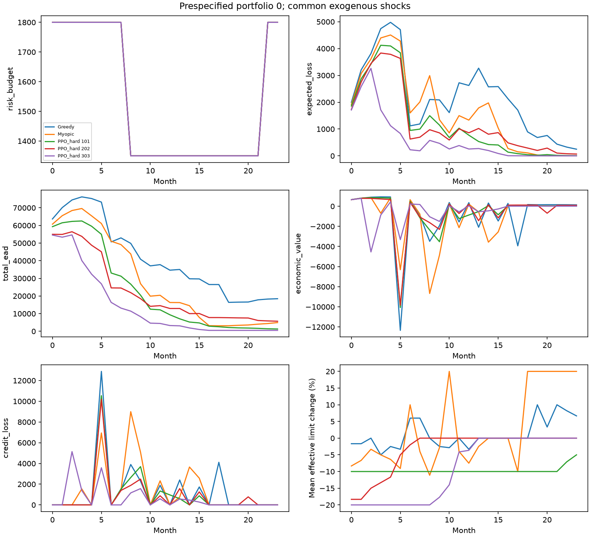
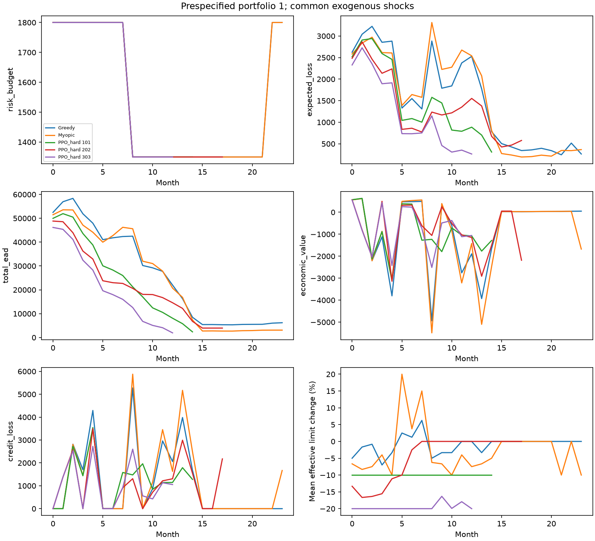
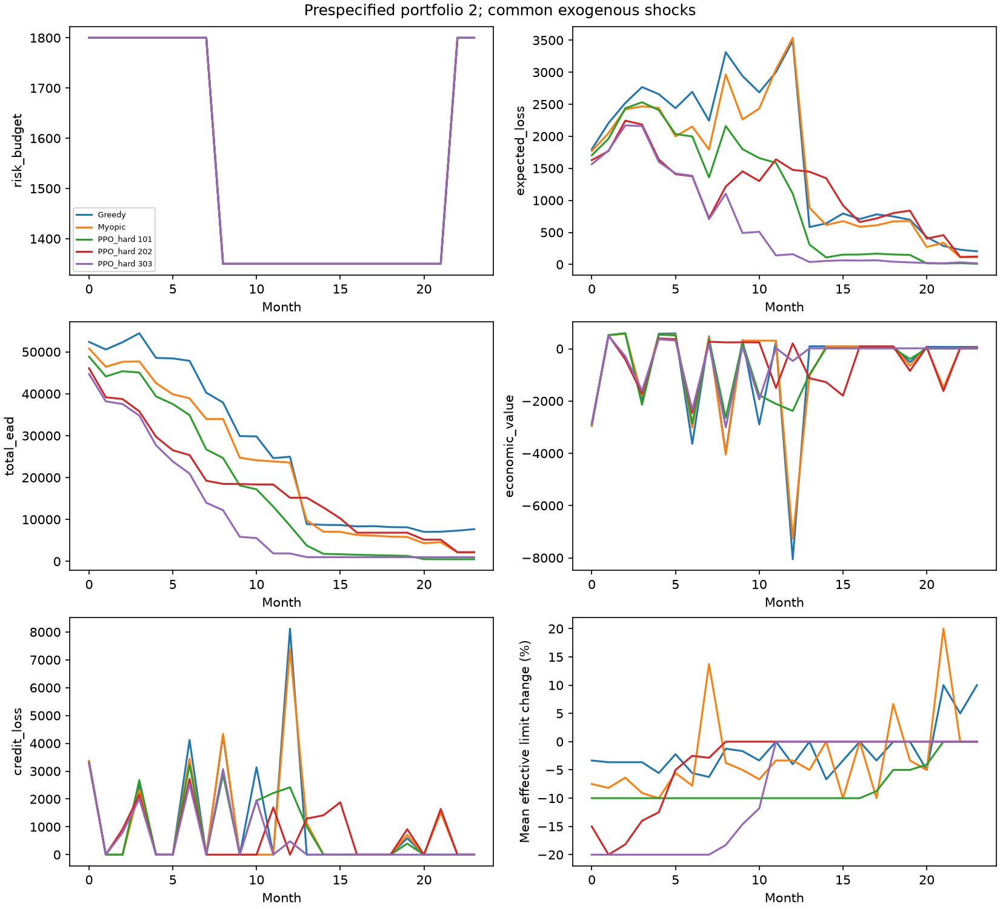
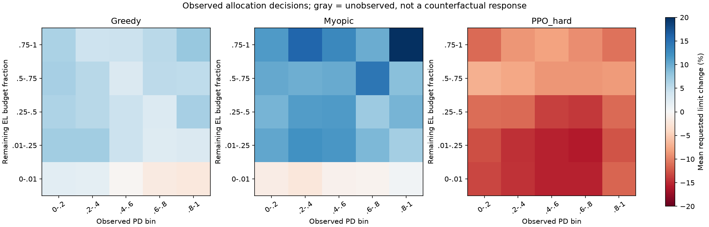

# Risk-constrained portfolio decisioning: measured report

## A. Audit and scope

The inspected repository supplies a longitudinal hidden-state DGP, indexed exogenous
shocks, a public 21-feature customer environment, a frozen calibrated 12-month PD,
individual-policy comparisons, shifted-world evaluation and trajectory IS/WIS. Its
customer episodes did not form a synchronized allocation book with shared capacity.
The portfolio implementation reuses those components without changing the DGP to
favor an algorithm. [Audit](portfolio_audit.md); [exact methodology](portfolio_decisioning.md).

## B. Files and artifacts

**CREATED:** `src/credit_rl/portfolio/{accounting,environment,policies,reporting}.py`,
the package initializer, `configs/{portfolio,constrained_policy}.yaml`,
`experiments/{portfolio_constraints,portfolio_diagnostics,verify_portfolio}.py`,
`tests/test_portfolio.py`, this report and the portfolio audit/methodology documents.
Compact CSVs, configuration snapshots, verification records and figures live under
`outputs/{results,experiments,figures}/portfolio/standard/`. Models and complete raw
trajectories are retained locally and ignored by Git.

**MODIFIED:** README, experiment guide, OPE methodology, `.gitignore`, and the
experiments dependency group (`scipy>=1.11` for the integer optimizer). Existing
uncommitted work outside this scope is preserved.

**MOVED:** initial smoke artifacts and the experimental runs preceding the finite-horizon
termination correction are archived in explicitly suffixed output directories. Their
models/results are excluded from the final measured study. **DELETED:** no active source
or user data. No commit or remote publication is performed.

## C. Sequential formulation

One episode is a closed portfolio. At each month, observable histories and PDs are
frozen, active customers receive decisions in a seeded random order, and accepted
limits immediately change capacity available to later customers. All customer
transitions occur only after allocation finishes. Defaults are absorbing; losses
remain in cumulative accounting when customers leave the live book. Extinction or
month 24 terminates the objective, with no critic bootstrap beyond that horizon.

The objective is expected undiscounted interest plus fees minus realized losses and
funding over those months. There is no terminal receivable valuation or replacement
business. The formulation is partially observed: the portfolio vector summarizes
the book rather than exposing latent traits or future outcomes.

## D. Exact risk accounting

For balance B, candidate limit L, CCF c=0.5, LGD=0.55 and visible 12-month PD p:

```
EAD_i = B_i + 0.5 max(L_i - B_i, 0)
q_i = 1 - (1 - min(s p_i, 1))^(1/12)
EL_i = q_i * 0.55 * EAD_i
EL_portfolio = sum_i EL_i
remaining_capacity = max(0, risk_budget - EL_portfolio)
shortfall = max(0, EL_portfolio - risk_budget)
```

The flat monthly hazard conversion is an approximation, not a calibrated monthly
or causal action-specific PD. Probability endpoints 0 and 1 remain exact. Raw EL
also records s=1. Reservation EAD differs from closing balance used for actual default
loss. Debt is never erased by a limit reduction.

## E. Constraints

Monthly EL budget is initial N times b, with b in {90,150,240} EUR/customer and an
optional 0.75 multiplier in currently observed stress. Exposure budget is N times
8,000 EUR. High-risk exposure (visible PD>0.6) is capped at 80% of live EAD. Individual
limits are 500–15,000 EUR, commands are −20%, −10%, 0%, +10%, +20%, and three consecutive
delinquent months block increases.

Hard admission uses `g_after <= max(0,g_before)+1e-7` componentwise for EL excess,
EAD excess and `high_risk_EAD - 0.8*EAD`. It prevents a new immediate breach or worsening
of an inherited breach; it cannot make inherited debt or next-month deterioration
disappear. Rejected commands become no change. A low-risk contraction can be rejected
if it worsens concentration. All deficits and requested/effective actions are saved.

Soft PPO pays lambda times positive monthly EL shortfall, with no portfolio action
rejection. That penalty does not enforce EAD or concentration. Unconstrained PPO has
only structural individual guards. No general safe-RL guarantee is asserted.

## F. Policies and oracle boundary

| Policy | Actual mechanism |
|---|---|
| Static | No-change requests, common hard admission |
| Decrease20 | Constant maximum contraction control, common hard admission |
| RiskBased | Observable PD thresholds 0.10/0.50, common hard admission |
| BufferedRiskBased | Same rule, validation-selected reservation factor |
| Greedy | Positive observable one-step gain / incremental EL, joint resource ceilings |
| Myopic | Multiple-choice MILP maximizing observable one-step surrogate value |
| PPO_unconstrained | Standard PPO, individual guards |
| PPO_penalty | Standard PPO, monthly EL-shortfall penalty |
| PPO_hard | Standard PPO, common hard admission |

The Myopic economic surrogate remains nominal in shifted worlds. Its optimal solver
status certifies the joint proposal only: sequential execution can reject an increase
before a later proposed release. Solver failure falls back to Greedy. The batch rules
can inspect the entire public book; PPO uses a compact summary and current customer.
This unequal representation favors neither a claim of PPO information superiority nor
a perfectly controlled representation comparison.

Simulator-only diagnostics integrate 16 independent hypothetical one-month shocks per
client, analytically averaging default Bernoulli risk conditional on each closing
state. They estimate expected realized loss and its MC SE, never feed actions/rewards,
and never read the actual future shock realization. There is no portfolio oracle
allocation policy or optimal-value bound. Buffer selection uses privileged validation
evaluation only, which is explicitly a research assumption.

## G. PPO details and selection

PPO sees 34 bounded public inputs: 21 customer features and 13 portfolio features,
including remaining budget, EL/EAD utilization, shortfall, concentration, active
fraction, allocation progress, cumulative loss and current budget rule. It requests
one of five commands. Reward is zero during allocation, then monthly net contribution
minus any penalty, divided by 1,000 times initial N.

SB3 MLP actor and critic each use two 64-unit tanh layers; learning rate 0.0003,
512 rollout steps, batch 128, five epochs, gamma 1, GAE lambda 0.95, entropy coefficient
0.01. Three final seeds (101,202,303) each train 24,576 customer decisions for each
of three formulations. Pilot lambda candidates 0.5,2,10 each train 8,192 decisions
with seed 101. Final checkpoints are fixed by training budget, not test performance.

Eight held-out validation portfolios rank lambda by mean predicted violation then
economic value. Buffer factors 1,1.1,1.25 rank by simulator-diagnostic violation then
value. All seeds enter evaluation; no world or final-test selection is allowed.

## H. Paired protocol and statistical units

The standard panel has 21 cases and 15 policy instances per case: six rules plus
nine PPO checkpoints. Six main cases cross three budgets with normal/stress macro,
24 paired portfolios each. Separate cases use four PD distortions, three buffer
factors, constant stress budget, sizes 8/24, fixed/reverse ordering, and three sampled
DGP worlds. Small diagnostics use eight portfolios; size and constant-budget cases
use 24. The main portfolio size is 12. Stress starts at month 8, lasts 10 months,
recovers over four, and has intensity 1.5; future stress is unobserved.

Train/validation/test/tail/OPE have distinct namespaces. Policies share initial
customers, hidden traits, macro, indexed shocks and random order within each case.
World parameters are prespecified draws from `configs/robustness.yaml`. Portfolios
at different sizes are independently generated populations, not nested samples.

Monetary contributions and default incidence divide by initial N. Risk rates average
observed live-portfolio months before extinction, with equal weight per portfolio;
they are not zero-padded to month 24. PPO seed means are formed within portfolio.
Five hundred bootstrap replicates resample whole paired portfolios and training
seeds. PD/order/world sensitivity uses the same first eight reference portfolios,
not an unmatched comparison to the 24-portfolio reference average. Intervals are
descriptive and not adjusted for the many comparisons.

Independent tail evaluation uses 200 portfolios per policy instance. Quantiles need
20 expected observations in the tail: p90 is supported, p95/p99 are withheld at this
budget, and no expected shortfall or CVaR claim is made.
## I. Completed results

The verified standard run contains **4,680 portfolio episodes,
723,721 allocation decisions and 106,906 observed
portfolio-months**, across 21 cases and 315 jobs. These are repeated policy
evaluations of paired portfolios, not that many independent populations. Independent
tail runs add 1,200 policy/portfolio episodes; OPE adds 100 behavior portfolios.

Tables below use EUR per initial customer except ratios. EL and EAD are means over
observed live-portfolio months. PPO rows average all three training seeds. Negative
value is a property of this synthetic accounting/world, not a profitability claim.


### Normal macro, medium budget

| Policy | Value | Revenue | Realized loss | Mean EL | Mean EAD | Defaults | Delinquent client-months |
| --- | --- | --- | --- | --- | --- | --- | --- |
| Static | -1,251.78 | 994.59 | 2,095.15 | 130.51 | 3,343.80 | 62.50% | 17.63% |
| Decrease20 | -696.56 | 374.89 | 1,014.55 | 45.22 | 1,074.48 | 69.44% | 20.19% |
| RiskBased | -679.37 | 824.58 | 1,382.11 | 85.18 | 2,908.55 | 62.50% | 18.28% |
| BufferedRiskBased | -679.37 | 824.58 | 1,382.11 | 85.18 | 2,908.55 | 62.50% | 18.28% |
| Greedy | -857.72 | 941.74 | 1,659.88 | 129.44 | 3,959.07 | 56.60% | 16.09% |
| Myopic | -822.81 | 984.22 | 1,661.01 | 129.15 | 4,022.44 | 56.60% | 15.95% |
| PPO_unconstrained | -696.76 | 374.66 | 1,014.55 | 45.22 | 1,073.89 | 69.44% | 20.19% |
| PPO_penalty | -696.76 | 374.66 | 1,014.55 | 45.22 | 1,073.89 | 69.44% | 20.19% |
| PPO_hard | -613.40 | 554.78 | 1,085.53 | 59.08 | 1,540.15 | 63.66% | 19.64% |

| Policy | EL / budget | EL breach months | Mean shortfall | High-risk EAD share | Top-decile EL share | Live-limit growth | Reversals/client |
| --- | --- | --- | --- | --- | --- | --- | --- |
| Static | 0.87 | 38.19% | 27.50 | 35.32% | 50.71% | -61.35% | 0.00 |
| Decrease20 | 0.30 | 10.76% | 4.33 | 23.71% | 54.57% | -97.22% | 0.00 |
| RiskBased | 0.57 | 19.27% | 10.91 | 22.23% | 46.11% | -56.83% | 0.13 |
| BufferedRiskBased | 0.57 | 19.27% | 10.91 | 22.23% | 46.11% | -56.83% | 0.13 |
| Greedy | 0.86 | 36.46% | 22.24 | 28.18% | 48.70% | -19.45% | 1.36 |
| Myopic | 0.86 | 33.33% | 18.20 | 29.65% | 48.06% | -12.44% | 2.35 |
| PPO_unconstrained | 0.30 | 10.76% | 4.33 | 23.74% | 54.45% | -97.22% | 0.00 |
| PPO_penalty | 0.30 | 10.76% | 4.33 | 23.74% | 54.45% | -97.22% | 0.00 |
| PPO_hard | 0.39 | 13.83% | 7.20 | 24.27% | 50.04% | -91.15% | 0.00 |

### Stress macro, medium budget

| Policy | Value | Revenue | Realized loss | Mean EL | Mean EAD | Defaults | Delinquent client-months |
| --- | --- | --- | --- | --- | --- | --- | --- |
| Static | -2,104.24 | 728.27 | 2,714.41 | 151.83 | 2,789.38 | 86.11% | 24.06% |
| Decrease20 | -849.92 | 341.09 | 1,137.78 | 58.49 | 1,212.88 | 89.24% | 27.59% |
| RiskBased | -1,460.89 | 602.33 | 1,967.80 | 106.60 | 2,330.22 | 88.89% | 26.61% |
| BufferedRiskBased | -1,460.89 | 602.33 | 1,967.80 | 106.60 | 2,330.22 | 88.89% | 26.61% |
| Greedy | -1,696.90 | 691.01 | 2,278.15 | 146.20 | 2,902.82 | 84.03% | 24.32% |
| Myopic | -1,816.80 | 670.15 | 2,379.35 | 134.58 | 2,657.53 | 88.54% | 25.83% |
| PPO_unconstrained | -849.41 | 340.88 | 1,137.08 | 58.48 | 1,212.25 | 89.24% | 27.59% |
| PPO_penalty | -849.41 | 340.88 | 1,137.08 | 58.48 | 1,212.25 | 89.24% | 27.59% |
| PPO_hard | -1,022.92 | 451.68 | 1,403.68 | 74.63 | 1,499.63 | 89.35% | 27.91% |

| Policy | EL / budget | EL breach months | Mean shortfall | High-risk EAD share | Top-decile EL share | Live-limit growth | Reversals/client |
| --- | --- | --- | --- | --- | --- | --- | --- |
| Static | 1.18 | 55.96% | 50.96 | 55.78% | 55.25% | -83.00% | 0.00 |
| Decrease20 | 0.41 | 14.03% | 5.71 | 46.66% | 57.65% | -98.74% | 0.00 |
| RiskBased | 0.81 | 36.90% | 20.16 | 46.88% | 55.58% | -85.99% | 0.11 |
| BufferedRiskBased | 0.81 | 36.90% | 20.16 | 46.88% | 55.58% | -85.99% | 0.11 |
| Greedy | 1.15 | 52.84% | 45.82 | 53.37% | 54.92% | -69.53% | 0.65 |
| Myopic | 1.05 | 46.74% | 38.15 | 52.27% | 57.83% | -77.04% | 1.99 |
| PPO_unconstrained | 0.41 | 14.03% | 5.71 | 46.65% | 57.65% | -98.74% | 0.00 |
| PPO_penalty | 0.41 | 14.03% | 5.71 | 46.65% | 57.65% | -98.74% | 0.00 |
| PPO_hard | 0.55 | 19.28% | 9.22 | 49.89% | 57.42% | -96.62% | 0.00 |

Complete all-case metrics: [summary](../outputs/results/portfolio/standard/summary.csv), [individual seed means](../outputs/results/portfolio/standard/seed_metrics.csv), [uncertainty](../outputs/results/portfolio/standard/uncertainty.csv), [paired comparisons](../outputs/results/portfolio/standard/paired_comparisons.csv). Limit growth includes default attrition. Delinquency uses active customer-months, not initial customers.

### Individual PPO seeds and uncertainty

| Policy | Seed | Value | Loss | Defaults | EL breach |
| --- | --- | --- | --- | --- | --- |
| PPO_hard | 101 | -695.86 | 1,203.52 | 63.54% | 16.67% |
| PPO_hard | 202 | -447.77 | 1,038.51 | 57.99% | 14.06% |
| PPO_hard | 303 | -696.56 | 1,014.55 | 69.44% | 10.76% |
| PPO_penalty | 101 | -696.76 | 1,014.55 | 69.44% | 10.76% |
| PPO_penalty | 202 | -696.76 | 1,014.55 | 69.44% | 10.76% |
| PPO_penalty | 303 | -696.76 | 1,014.55 | 69.44% | 10.76% |
| PPO_unconstrained | 101 | -696.76 | 1,014.55 | 69.44% | 10.76% |
| PPO_unconstrained | 202 | -696.76 | 1,014.55 | 69.44% | 10.76% |
| PPO_unconstrained | 303 | -696.76 | 1,014.55 | 69.44% | 10.76% |

| Policy | Mean value | 95% lower | 95% upper | Portfolio SD | Training-seed SD |
| --- | --- | --- | --- | --- | --- |
| BufferedRiskBased | -679.37 | -814.67 | -509.73 | 407.67 | 0.00 |
| Decrease20 | -696.56 | -819.15 | -564.16 | 339.13 | 0.00 |
| Greedy | -857.72 | -991.12 | -667.44 | 442.35 | 0.00 |
| Myopic | -822.81 | -1,021.65 | -603.46 | 538.21 | 0.00 |
| PPO_hard | -613.40 | -783.71 | -402.59 | 375.13 | 143.43 |
| PPO_penalty | -696.76 | -821.75 | -554.65 | 339.28 | 0.00 |
| PPO_unconstrained | -696.76 | -821.75 | -554.65 | 339.28 | 0.00 |
| RiskBased | -679.37 | -814.67 | -509.73 | 407.67 | 0.00 |
| Static | -1,251.78 | -1,480.97 | -985.41 | 645.41 | 0.00 |

The normal-medium paired PPO_hard value gap versus Myopic is **+209.41 [+35.89, +396.60] EUR/client**;
versus Decrease20 it is **+83.16 [-20.04, +235.12]**. Under stress these become
**+793.88 [+619.23, +966.12]** and **-173.00 [-308.83, +0.00]**, respectively.
The interval reflects portfolio and seed variation, with only three training seeds.


## J. Risk-budget sensitivity

| Case | Policy | Value | Loss | EL / budget | EL breach |
| --- | --- | --- | --- | --- | --- |
| normal_loose | BufferedRiskBased | -679.27 | 1,381.94 | 0.36 | 3.99% |
| normal_loose | Decrease20 | -696.56 | 1,014.55 | 0.19 | 0.35% |
| normal_loose | Greedy | -908.89 | 1,762.41 | 0.65 | 15.80% |
| normal_loose | Myopic | -1,082.77 | 1,979.82 | 0.72 | 19.79% |
| normal_loose | PPO_hard | -610.09 | 1,085.85 | 0.25 | 1.85% |
| normal_loose | PPO_penalty | -696.76 | 1,014.55 | 0.19 | 0.35% |
| normal_loose | PPO_unconstrained | -696.76 | 1,014.55 | 0.19 | 0.35% |
| normal_loose | RiskBased | -679.27 | 1,381.94 | 0.36 | 3.99% |
| normal_loose | Static | -1,251.78 | 2,095.15 | 0.54 | 11.11% |
| normal_medium | BufferedRiskBased | -679.37 | 1,382.11 | 0.57 | 19.27% |
| normal_medium | Decrease20 | -696.56 | 1,014.55 | 0.30 | 10.76% |
| normal_medium | Greedy | -857.72 | 1,659.88 | 0.86 | 36.46% |
| normal_medium | Myopic | -822.81 | 1,661.01 | 0.86 | 33.33% |
| normal_medium | PPO_hard | -613.40 | 1,085.53 | 0.39 | 13.83% |
| normal_medium | PPO_penalty | -696.76 | 1,014.55 | 0.30 | 10.76% |
| normal_medium | PPO_unconstrained | -696.76 | 1,014.55 | 0.30 | 10.76% |
| normal_medium | RiskBased | -679.37 | 1,382.11 | 0.57 | 19.27% |
| normal_medium | Static | -1,251.78 | 2,095.15 | 0.87 | 38.19% |
| normal_tight | BufferedRiskBased | -680.41 | 1,382.47 | 0.94 | 36.28% |
| normal_tight | Decrease20 | -696.56 | 1,014.55 | 0.50 | 21.01% |
| normal_tight | Greedy | -715.45 | 1,490.48 | 1.27 | 55.38% |
| normal_tight | Myopic | -719.35 | 1,493.29 | 1.17 | 49.83% |
| normal_tight | PPO_hard | -613.62 | 1,087.22 | 0.66 | 24.42% |
| normal_tight | PPO_penalty | -696.76 | 1,014.55 | 0.50 | 21.01% |
| normal_tight | PPO_unconstrained | -696.76 | 1,014.55 | 0.50 | 21.01% |
| normal_tight | RiskBased | -680.41 | 1,382.47 | 0.94 | 36.28% |
| normal_tight | Static | -1,251.78 | 2,095.15 | 1.45 | 61.98% |
| stress_loose | BufferedRiskBased | -1,457.55 | 1,965.98 | 0.51 | 8.58% |
| stress_loose | Decrease20 | -849.92 | 1,137.78 | 0.26 | 0.52% |
| stress_loose | Greedy | -1,833.18 | 2,456.07 | 0.90 | 36.25% |
| stress_loose | Myopic | -1,958.36 | 2,595.87 | 0.89 | 34.16% |
| stress_loose | PPO_hard | -1,029.40 | 1,411.82 | 0.34 | 2.42% |
| stress_loose | PPO_penalty | -849.41 | 1,137.08 | 0.26 | 0.52% |
| stress_loose | PPO_unconstrained | -849.41 | 1,137.08 | 0.26 | 0.52% |
| stress_loose | RiskBased | -1,457.55 | 1,965.98 | 0.51 | 8.58% |
| stress_loose | Static | -2,104.24 | 2,714.41 | 0.74 | 25.13% |
| stress_medium | BufferedRiskBased | -1,460.89 | 1,967.80 | 0.81 | 36.90% |
| stress_medium | Decrease20 | -849.92 | 1,137.78 | 0.41 | 14.03% |
| stress_medium | Greedy | -1,696.90 | 2,278.15 | 1.15 | 52.84% |
| stress_medium | Myopic | -1,816.80 | 2,379.35 | 1.05 | 46.74% |
| stress_medium | PPO_hard | -1,022.92 | 1,403.68 | 0.55 | 19.28% |
| stress_medium | PPO_penalty | -849.41 | 1,137.08 | 0.41 | 14.03% |
| stress_medium | PPO_unconstrained | -849.41 | 1,137.08 | 0.41 | 14.03% |
| stress_medium | RiskBased | -1,460.89 | 1,967.80 | 0.81 | 36.90% |
| stress_medium | Static | -2,104.24 | 2,714.41 | 1.18 | 55.96% |
| stress_tight | BufferedRiskBased | -1,456.16 | 1,963.61 | 1.33 | 60.93% |
| stress_tight | Decrease20 | -849.92 | 1,137.78 | 0.68 | 27.71% |
| stress_tight | Greedy | -1,616.86 | 2,174.29 | 1.68 | 68.47% |
| stress_tight | Myopic | -1,432.79 | 1,936.18 | 1.34 | 60.51% |
| stress_tight | PPO_hard | -1,023.22 | 1,405.33 | 0.91 | 39.78% |
| stress_tight | PPO_penalty | -849.41 | 1,137.08 | 0.68 | 27.71% |
| stress_tight | PPO_unconstrained | -849.41 | 1,137.08 | 0.68 | 27.71% |
| stress_tight | RiskBased | -1,456.16 | 1,963.61 | 1.33 | 60.93% |
| stress_tight | Static | -2,104.24 | 2,714.41 | 1.97 | 75.25% |

The empirical slopes in [budget marginal value](../outputs/results/portfolio/standard/budget_marginal_value.csv) are finite differences between frozen-policy evaluations, **not** optimal dual prices. A larger admissible set does not guarantee higher realized value for a fixed or approximate policy.




## K. Predicted versus simulator conditional risk

| Policy | Both safe | Predicted safe / simulator breach | Predicted breach / simulator safe | Both breach | Mean diagnostic MC SE EUR/client |
| --- | --- | --- | --- | --- | --- |
| Static | 59.55% | 2.26% | 20.31% | 17.88% | 2.92 |
| Decrease20 | 86.28% | 2.95% | 6.42% | 4.34% | 1.13 |
| RiskBased | 78.47% | 2.26% | 10.76% | 8.51% | 1.87 |
| BufferedRiskBased | 78.47% | 2.26% | 10.76% | 8.51% | 1.87 |
| Greedy | 61.98% | 1.56% | 23.61% | 12.85% | 2.38 |
| Myopic | 64.41% | 2.26% | 20.31% | 13.02% | 2.49 |
| PPO_unconstrained | 86.28% | 2.95% | 6.42% | 4.34% | 1.13 |
| PPO_penalty | 86.28% | 2.95% | 6.42% | 4.34% | 1.13 |
| PPO_hard | 83.91% | 2.26% | 7.81% | 6.02% | 1.35 |

Separate non-EL constraint frequencies (observed portfolio-months):

| Case | Policy | EAD breach | High-risk-share breach |
| --- | --- | --- | --- |
| normal_medium | BufferedRiskBased | 0.00% | 0.52% |
| normal_medium | Decrease20 | 0.00% | 0.35% |
| normal_medium | Greedy | 0.00% | 0.00% |
| normal_medium | Myopic | 0.00% | 0.52% |
| normal_medium | PPO_hard | 0.00% | 0.23% |
| normal_medium | PPO_penalty | 0.00% | 0.69% |
| normal_medium | PPO_unconstrained | 0.00% | 0.69% |
| normal_medium | RiskBased | 0.00% | 0.52% |
| normal_medium | Static | 0.00% | 3.47% |
| stress_medium | BufferedRiskBased | 0.00% | 19.34% |
| stress_medium | Decrease20 | 0.00% | 17.31% |
| stress_medium | Greedy | 0.00% | 21.13% |
| stress_medium | Myopic | 0.00% | 20.44% |
| stress_medium | PPO_hard | 0.00% | 19.51% |
| stress_medium | PPO_penalty | 0.00% | 18.08% |
| stress_medium | PPO_unconstrained | 0.00% | 18.08% |
| stress_medium | RiskBased | 0.00% | 19.34% |
| stress_medium | Static | 0.00% | 26.51% |

These classifications compare current reservation EL and an independently integrated next-month expected realized loss. They do not compare two calibrated forecasts of the same event. [MC boundary ambiguity](../outputs/results/portfolio/standard/diagnostic_mc_ambiguity.csv) records the fraction within 1.96 diagnostic standard errors of the budget; binary categories near that boundary are uncertain. [Other constraints](../outputs/results/portfolio/standard/additional_constraints.csv) disclose EAD and concentration breaches separately.



## L. PD errors, buffers and validation

PD intercept shifts are −0.7/+0.7 on the logit scale, slope is 0.65, and noise SD is 0.8. The same distorted public forecast feeds the policy and reservation rule. Hidden dynamics are untouched. The following are **matched differences** from the same eight reference portfolios; violation changes are percentage points.


| Signal | Policy | Metric | Difference | 95% lower | 95% upper |
| --- | --- | --- | --- | --- | --- |
| pd_under | Myopic | value | -219.94 | -392.79 | -70.14 |
| pd_under | PPO_hard | value | -12.88 | -47.19 | 0.00 |
| pd_under | RiskBased | value | -244.65 | -434.45 | -70.20 |
| pd_under | Myopic | el_violation_rate | -6.25 | -13.02 | -0.00 |
| pd_under | PPO_hard | el_violation_rate | -8.51 | -12.67 | -4.51 |
| pd_under | RiskBased | el_violation_rate | -10.94 | -14.58 | -6.77 |
| pd_under | Myopic | true_violation_rate | 4.69 | 2.08 | 7.29 |
| pd_under | PPO_hard | true_violation_rate | -0.35 | -1.74 | 0.35 |
| pd_under | RiskBased | true_violation_rate | 5.21 | 1.56 | 9.37 |
| pd_under | Myopic | predicted_safe_true_violated_rate | 0.52 | -1.04 | 3.12 |
| pd_under | PPO_hard | predicted_safe_true_violated_rate | 1.91 | 0.60 | 3.30 |
| pd_under | RiskBased | predicted_safe_true_violated_rate | 5.73 | 2.08 | 9.90 |
| pd_over | Myopic | value | 77.40 | -13.31 | 170.70 |
| pd_over | PPO_hard | value | -18.34 | -57.82 | 17.70 |
| pd_over | RiskBased | value | -2.51 | -78.43 | 71.81 |
| pd_over | Myopic | el_violation_rate | 7.81 | 4.17 | 11.46 |
| pd_over | PPO_hard | el_violation_rate | 9.03 | 3.82 | 13.54 |
| pd_over | RiskBased | el_violation_rate | 6.77 | 3.12 | 9.90 |
| pd_over | Myopic | true_violation_rate | -3.12 | -5.21 | -1.04 |
| pd_over | PPO_hard | true_violation_rate | 1.04 | -1.39 | 3.65 |
| pd_over | RiskBased | true_violation_rate | 0.52 | -1.32 | 3.12 |
| pd_over | Myopic | predicted_safe_true_violated_rate | -0.52 | -1.56 | 0.00 |
| pd_over | PPO_hard | predicted_safe_true_violated_rate | -0.52 | -2.60 | 1.83 |
| pd_over | RiskBased | predicted_safe_true_violated_rate | -1.04 | -2.08 | 0.00 |
| pd_slope | Myopic | value | 126.69 | -17.77 | 284.64 |
| pd_slope | PPO_hard | value | -7.23 | -35.97 | 3.46 |
| pd_slope | RiskBased | value | 0.97 | -4.91 | 8.76 |
| pd_slope | Myopic | el_violation_rate | -6.77 | -9.38 | -3.65 |
| pd_slope | PPO_hard | el_violation_rate | -3.65 | -6.42 | -1.74 |
| pd_slope | RiskBased | el_violation_rate | -4.17 | -7.81 | -1.04 |
| pd_slope | Myopic | true_violation_rate | 0.00 | -1.56 | 1.56 |
| pd_slope | PPO_hard | true_violation_rate | 0.00 | 0.00 | 0.00 |
| pd_slope | RiskBased | true_violation_rate | 0.00 | 0.00 | 0.00 |
| pd_slope | Myopic | predicted_safe_true_violated_rate | 1.56 | 0.00 | 3.65 |
| pd_slope | PPO_hard | predicted_safe_true_violated_rate | 1.56 | 0.17 | 2.95 |
| pd_slope | RiskBased | predicted_safe_true_violated_rate | 1.04 | 0.00 | 2.08 |
| pd_noise | Myopic | value | -64.27 | -135.12 | 5.47 |
| pd_noise | PPO_hard | value | -8.32 | -45.52 | 10.49 |
| pd_noise | RiskBased | value | -121.41 | -304.20 | 33.70 |
| pd_noise | Myopic | el_violation_rate | 2.08 | -2.08 | 5.73 |
| pd_noise | PPO_hard | el_violation_rate | 1.74 | -0.96 | 4.86 |
| pd_noise | RiskBased | el_violation_rate | 3.65 | 0.77 | 6.52 |
| pd_noise | Myopic | true_violation_rate | 1.04 | 0.00 | 3.12 |
| pd_noise | PPO_hard | true_violation_rate | -0.17 | -1.39 | 0.69 |
| pd_noise | RiskBased | true_violation_rate | 0.52 | -1.56 | 3.12 |
| pd_noise | Myopic | predicted_safe_true_violated_rate | 1.04 | 0.00 | 3.12 |
| pd_noise | PPO_hard | predicted_safe_true_violated_rate | -0.52 | -1.56 | 0.69 |
| pd_noise | RiskBased | predicted_safe_true_violated_rate | -1.04 | -2.08 | 0.00 |

Prespecified stress buffer cases (not selection on final data):

| Factor | Policy | Value | Predicted breach | Simulator breach | False-safe months |
| --- | --- | --- | --- | --- | --- |
| buffer_1.0 | Myopic | -2,092.01 | 48.44% | 33.68% | 4.17% |
| buffer_1.0 | PPO_hard | -1,203.70 | 23.56% | 21.77% | 8.98% |
| buffer_1.0 | RiskBased | -1,740.44 | 44.64% | 34.57% | 5.46% |
| buffer_1.1 | Myopic | -1,764.65 | 72.54% | 33.88% | 0.00% |
| buffer_1.1 | PPO_hard | -1,214.44 | 54.09% | 21.77% | 0.00% |
| buffer_1.1 | RiskBased | -1,739.67 | 65.38% | 34.57% | 0.00% |
| buffer_1.25 | Myopic | -1,772.67 | 76.04% | 31.42% | 0.00% |
| buffer_1.25 | PPO_hard | -1,233.23 | 64.86% | 21.77% | 0.00% |
| buffer_1.25 | RiskBased | -1,738.61 | 73.26% | 35.09% | 0.00% |

Validation selection (eight portfolios per candidate):

| Lambda | Value | Predicted breach |
| --- | --- | --- |
| 0.50 | -559.19 | 9.37% |
| 2.00 | -559.19 | 9.37% |
| 10.00 | -546.78 | 17.19% |

| Factor | Value | Predicted breach | Simulator breach |
| --- | --- | --- | --- |
| 1.00 | -620.00 | 21.35% | 8.85% |
| 1.10 | -626.32 | 39.58% | 8.85% |
| 1.25 | -625.62 | 52.60% | 8.85% |

Lambda 0.5 and factor 1.0 are selected; identical lambda rankings retain configuration order. Inflating PD can classify more states as breached without changing realized risk. Capping buffered PD at one makes high factors particularly conservative for already-high forecasts. A reserve factor is not a guarantee against model error.



## M. Shared macro stress

| Policy | Value | Loss | Loss during stress/recovery | EAD before onset | Predicted breach | Simulator breach |
| --- | --- | --- | --- | --- | --- | --- |
| Static | -2,104.24 | 2,714.41 | 1,760.12 | 4,052.57 | 55.96% | 35.30% |
| Decrease20 | -849.92 | 1,137.78 | 338.29 | 1,104.76 | 14.03% | 13.13% |
| RiskBased | -1,460.89 | 1,967.80 | 1,124.12 | 3,221.13 | 36.90% | 25.43% |
| BufferedRiskBased | -1,460.89 | 1,967.80 | 1,124.12 | 3,221.13 | 36.90% | 25.43% |
| Greedy | -1,696.90 | 2,278.15 | 1,426.66 | 4,106.96 | 52.84% | 27.97% |
| Myopic | -1,816.80 | 2,379.35 | 1,555.09 | 4,062.44 | 46.74% | 30.46% |
| PPO_unconstrained | -849.41 | 1,137.08 | 337.59 | 1,102.33 | 14.03% | 13.13% |
| PPO_penalty | -849.41 | 1,137.08 | 337.59 | 1,102.33 | 14.03% | 13.13% |
| PPO_hard | -1,022.92 | 1,403.68 | 613.09 | 1,713.51 | 19.28% | 17.31% |

The stress regime lasts through declining-severity recovery, so its reduced budget remains active in months 8–21. Pre-onset exposure is recorded at month 7. These are paired normal/stress outcomes, not a claim that policies observe or anticipate the declared future path.

| Policy | Metric | Constant minus dynamic | 95% lower | 95% upper |
| --- | --- | --- | --- | --- |
| Myopic | value | 44.01 | -1.14 | 96.84 |
| PPO_hard | value | -42.49 | -115.94 | 0.00 |
| RiskBased | value | -0.84 | -2.45 | -0.02 |
| Myopic | el_violation_rate | -0.05 | -0.07 | -0.03 |
| PPO_hard | el_violation_rate | -0.02 | -0.04 | 0.00 |
| RiskBased | el_violation_rate | -0.07 | -0.10 | -0.05 |
| Myopic | true_violation_rate | -0.06 | -0.08 | -0.04 |
| PPO_hard | true_violation_rate | -0.04 | -0.06 | -0.01 |
| RiskBased | true_violation_rate | -0.03 | -0.05 | -0.02 |
| Myopic | predicted_safe_true_violated_rate | -0.01 | -0.02 | 0.01 |
| PPO_hard | predicted_safe_true_violated_rate | -0.01 | -0.03 | 0.00 |
| RiskBased | predicted_safe_true_violated_rate | 0.02 | 0.00 | 0.03 |

Violation differences in this table are fractions, unlike the percentage-point PD table.


## N. Independent loss distributions

| Policy | Seed | Independent portfolios | Mean loss | Median | SD | P90 | P95 | P99 |
| --- | --- | --- | --- | --- | --- | --- | --- | --- |
| Myopic | -1 | 200 | 19,711.53 | 19,216.72 | 5,228.04 | 26,333.90 | — | — |
| PPO_hard | 101 | 200 | 14,523.88 | 14,437.60 | 4,438.19 | 20,003.09 | — | — |
| PPO_hard | 202 | 200 | 13,091.05 | 12,796.38 | 4,459.17 | 18,550.09 | — | — |
| PPO_hard | 303 | 200 | 12,853.10 | 12,476.37 | 4,129.24 | 18,036.30 | — | — |
| RiskBased | -1 | 200 | 16,370.10 | 16,206.20 | 4,704.30 | 22,340.02 | — | — |
| Static | -1 | 200 | 24,858.09 | 24,322.35 | 6,785.36 | 33,687.90 | — | — |

Losses here are **total EUR per 12-client portfolio**, not per-client figures. Every row has 200 independent portfolios, with common random numbers across policies. P95/P99 and expected shortfall are withheld under the declared 20-tail-observation rule. The figure averages PPO seeds within each portfolio; that distribution is not the risk distribution of one deployed seed. Per-seed figures in the table prevent that conflation.



## O. Sequential value versus the Myopic baseline

Hard PPO improves normal-medium value by 209.41 EUR/client [35.89,396.60] versus
Myopic, while reducing realized loss by 575.48 [427.28,711.54] EUR/client. Its default
incidence is nevertheless **7.06 percentage points higher [0.80,13.19]**. Lower
exposure can reduce loss severity while contraction increases default incidence in
this DGP. This is a trade-off, not dominance across every risk definition.

Against constant −20%, nominal value gain is only 83.16 [−20.04,235.12] EUR/client.
Under stress it is −173.00 [−308.83,0.00]. The intervals and degenerate actions do not
establish a benefit from learning a long-horizon budget-allocation strategy.

Across the complete final panel, hard PPO seed 101 always requests −10%, seed 303
always −20%, and seed 202 requests hold in 70.23% of decisions, −20% in 29.59%, and
−10% in 0.18%. **No PPO formulation requests or executes an increase** in this panel.
The six unconstrained/penalized models all request −20% throughout. Their economic
outcomes coincide with each other; small differences from the hard Decrease20 rule
come from admission, not different requested actions. The selected penalty therefore
does not demonstrate added policy value at this training budget.

Thirty of 72 nominal-medium seed/portfolio paths have lower first-month economic
value but higher total value than Myopic; 47/72 do under stress. That pattern is also
compatible with a constant contraction rule. It is not evidence of learned planning.
No observed conservation-then-redeployment of risk capacity is established.

### Prespecified path inspection

Portfolios 0,1,2 were selected by identifier, not performance. In stress portfolio 0,
the shared budget falls from 1,800 to 1,350 EUR at month 8 and returns at month 22.
Forecast EL rises above capacity before stress for several policies; the admission
rule cannot erase drawn debt. PPO seed 202 contracts early and then holds, while the
other hard seeds keep requesting their fixed contraction. Myopic resumes increases
on surviving loans, with larger realized losses on this path. Portfolio 1 includes
extinction of PPO books before month 24; lines correctly stop rather than fabricate
zero-risk observations. Portfolio 2 again shows contraction and holding, not later
PPO redeployment. These are illustrative paths under identical shocks, not selected
proofs of superiority.


| Portfolio | Policy | Seed | Value/client | Loss/client | Mean EAD/client | EL breach |
| --- | --- | --- | --- | --- | --- | --- |
| 0 | Greedy | -1 | -1,719.50 | 2,551.73 | 3,431.40 | 66.67% |
| 0 | Myopic | -1 | -2,127.74 | 2,773.21 | 2,384.79 | 45.83% |
| 0 | PPO_hard | 101 | -1,306.17 | 1,849.84 | 1,869.26 | 29.17% |
| 0 | PPO_hard | 202 | -1,136.84 | 1,704.14 | 1,854.29 | 20.83% |
| 0 | PPO_hard | 303 | -888.47 | 1,228.21 | 1,157.40 | 8.33% |
| 1 | Greedy | -1 | -1,635.44 | 2,136.80 | 2,151.11 | 45.83% |
| 1 | Myopic | -1 | -1,903.38 | 2,433.89 | 2,035.00 | 45.83% |
| 1 | PPO_hard | 101 | -1,195.09 | 1,578.02 | 2,204.14 | 46.67% |
| 1 | PPO_hard | 202 | -1,239.53 | 1,636.05 | 1,846.56 | 44.44% |
| 1 | PPO_hard | 303 | -840.67 | 1,110.77 | 1,778.72 | 38.46% |
| 2 | Greedy | -1 | -1,647.21 | 2,174.90 | 2,188.89 | 50.00% |
| 2 | Myopic | -1 | -1,516.77 | 2,017.50 | 1,872.49 | 45.83% |
| 2 | PPO_hard | 101 | -1,274.63 | 1,672.08 | 1,453.05 | 41.67% |
| 2 | PPO_hard | 202 | -1,062.39 | 1,493.02 | 1,492.36 | 25.00% |
| 2 | PPO_hard | 303 | -907.23 | 1,176.40 | 972.60 | 8.33% |







[All paired sequential checks](../outputs/results/portfolio/standard/sequential_cases.csv)
and [constant-rule outcome gaps](../outputs/results/portfolio/standard/constant_rule_gaps.csv)
retain individual seeds and portfolios.


## P. Allocation behavior and interpretation

Normal-medium effective action frequencies below account for floor clipping,
delinquency and portfolio rejection; they differ from requested-command frequencies.


| Policy | Increase | Decrease | No effective change | Portfolio rejection | Sign reversals/client |
| --- | --- | --- | --- | --- | --- |
| Static | 0.00% | 0.00% | 100.00% | 0.00% | 0.00 |
| Decrease20 | 0.00% | 68.54% | 31.46% | 0.07% | 0.00 |
| RiskBased | 8.68% | 41.35% | 49.98% | 1.52% | 0.13 |
| BufferedRiskBased | 8.68% | 41.35% | 49.98% | 1.52% | 0.13 |
| Greedy | 34.05% | 11.23% | 54.72% | 9.71% | 1.36 |
| Myopic | 33.19% | 21.46% | 45.35% | 15.22% | 2.35 |
| PPO_unconstrained | 0.00% | 68.54% | 31.46% | 0.00% | 0.00 |
| PPO_penalty | 0.00% | 68.54% | 31.46% | 0.00% | 0.00 |
| PPO_hard | 0.00% | 64.01% | 35.99% | 0.04% | 0.00 |

Myopic proposals all received an optimal solver status in the final panel, but
15.22% of its nominal-medium requests are rejected by sequential admission (23.24%
under stress). Exact proposal optimization is not exact execution. Greedy has
9.71%/12.85% rejection in these cases. Pending releases, inherited deficits and the
concentration constraint explain why proposal feasibility and execution differ.

For the variable hard-PPO seed 202, nominal mean requested changes by remaining
capacity are −14.56%, −13.86%, −8.33%, −1.37%, −0.16% across capacity fractions
0–1%, 1–25%, 25–50%, 50–75%, 75–100%. This observable association supports budget
sensitivity, but state composition confounds it. By increasing PD bins (0–0.2 through
0.8–1), mean requests are −1.74%, −4.19%, −8.03%, −10.29%, −4.23%: the rule is not
monotone in PD. No causal counterfactual response surface is claimed.

Income, score, utilization, PD and remaining-capacity segments are saved with counts
in [action segments](../outputs/results/portfolio/standard/action_segments.csv).
The heatmap pools seeds and observed states, so fixed-action seeds contribute to it.




## Q. DGP worlds, order and portfolio size

Three prespecified synthetic parameter/macro worlds each use eight matched portfolios.
The nominal surrogate and all trained models remain frozen. Every policy has some
predicted and simulator-diagnostic breaches in every sampled world: observed
zero-breach world frequency is 0/3, not a population feasibility probability.


| World | Policy | Value/client | Predicted breach | Simulator breach |
| --- | --- | --- | --- | --- |
| portfolio_world_0 | Decrease20 | -945.79 | 23.65% | 19.16% |
| portfolio_world_0 | Myopic | -1,672.56 | 49.79% | 31.15% |
| portfolio_world_0 | PPO_hard | -1,103.44 | 27.96% | 21.85% |
| portfolio_world_0 | RiskBased | -1,496.18 | 50.31% | 30.83% |
| portfolio_world_1 | Decrease20 | -1,160.49 | 13.72% | 23.87% |
| portfolio_world_1 | Myopic | -1,893.14 | 45.16% | 35.27% |
| portfolio_world_1 | PPO_hard | -1,353.13 | 17.88% | 26.08% |
| portfolio_world_1 | RiskBased | -1,743.59 | 32.96% | 32.26% |
| portfolio_world_2 | Decrease20 | -987.95 | 20.05% | 19.77% |
| portfolio_world_2 | Myopic | -1,765.76 | 47.72% | 27.38% |
| portfolio_world_2 | PPO_hard | -1,177.49 | 22.51% | 22.67% |
| portfolio_world_2 | RiskBased | -1,502.05 | 38.58% | 31.03% |

Hard PPO is worse in mean value than fixed −20% in all three worlds. Its world means range from −1,353.13 to −1,103.44 EUR/client, versus −1,160.49 to −945.79 for Decrease20. This is evidence of a nominal-to-shifted trade-off in these synthetic worlds, not robust banking performance.

| Size case | Policy | Value/client | Predicted breach | Simulator breach |
| --- | --- | --- | --- | --- |
| normal_medium | Myopic | -822.81 | 33.33% | 15.28% |
| normal_medium | PPO_hard | -613.40 | 13.83% | 8.28% |
| normal_medium | RiskBased | -679.37 | 19.27% | 10.76% |
| size_24 | Myopic | -823.15 | 25.17% | 10.07% |
| size_24 | PPO_hard | -678.62 | 16.38% | 7.70% |
| size_24 | RiskBased | -759.74 | 22.57% | 10.42% |
| size_8 | Myopic | -824.09 | 37.50% | 13.89% |
| size_8 | PPO_hard | -549.24 | 11.11% | 8.39% |
| size_8 | RiskBased | -605.11 | 21.18% | 10.76% |

Size differences mix population composition and diversification; these cohorts are not nested. With only 24 portfolios per size, the table does not identify a pure scale effect. Fixed/reverse orders use exactly matched initial books:

| Order | Policy | Value difference | 95% lower | 95% upper |
| --- | --- | --- | --- | --- |
| order_fixed | Greedy | 0.00 | 0.00 | 0.00 |
| order_fixed | Myopic | 0.25 | -4.45 | 3.73 |
| order_fixed | PPO_hard | 26.52 | 0.00 | 92.21 |
| order_reverse | Greedy | 0.00 | 0.00 | 0.00 |
| order_reverse | Myopic | 4.31 | -5.55 | 21.01 |
| order_reverse | PPO_hard | -7.49 | -45.77 | 16.43 |

Order can change the variable PPO seed and sequential execution. The primary order is randomized and fixed across paired policies; no favorable ordering is selected.

## R. Off-policy evaluation

The existing IS/WIS implementation remains functional; the portfolio adapter records
100 whole behavior portfolios and 17,069 decisions. Behavior is 60% RiskBased, 20%
Static and 20% uniform, so every requested command has propensity at least 0.04.
Targets use the same hard admission kernel. Products run across all clients/months
in a portfolio; independent-client OPE is invalid for this coupled state.


| Target | Numerical IS | WIS | ESS / 100 | Minimum command propensity | Decisions with target propensity <0.1 |
| --- | --- | --- | --- | --- | --- |
| Behavior | -860.74 | -860.74 | 100.00 | 0.47 | 0.00% |
| RiskBased | 0.00 | — | 0.00 | 0.64 | 0.00% |
| Static | 0.00 | — | 0.00 | 0.24 | 0.00% |
| PPO_hard_101 | 0.00 | — | 0.00 | 0.04 | 57.05% |
| PPO_hard_202 | 0.00 | — | 0.00 | 0.04 | 36.51% |
| PPO_hard_303 | 0.00 | — | 0.00 | 0.04 | 100.00% |

All deterministic targets have zero nonzero trajectory weights. WIS is undefined;
the numerical IS=0 and its degenerate bootstrap interval **must not be interpreted as
zero target value or confidence**. Behavior's self-check has unit weights and ESS=100.
Even RiskBased, whose chosen commands have propensity at least 0.64, has no complete
matching sampled trajectory. The long joint horizon destroys useful empirical support.

The command-based estimator is conservative in data efficiency: several requests can
map to the same effective action. Aggregating equivalent commands would require a
carefully derived common transition likelihood and is not implemented. No constrained
OPE solution or independent portfolio MC accuracy benchmark is claimed. The separate
customer OPE report still executes and its mathematical tests pass. See
[OPE methodology](off_policy_evaluation.md).


## S. Tests and scientific verification

**Passed: 138; failed: 0; errors: 0; skipped: 0.** Final pytest wall time is 11.62 s.
The suite includes EAD/EL aggregation and endpoint probabilities, explicit inherited
shortfalls, accepted/rejected actions, shared capacity coupling, brute-force MILP
agreement, a hand-calculated Greedy choice, reproducible shock paths, synchronized
monthly stepping, hidden/future-information separation, independent diagnostics,
Gym/SB3 short training and terminal finite-horizon behavior.

The complete data audit independently reconstructs monthly EAD, EL, raw EL, balances,
limits and high-risk exposure from all 723,721 customer decisions.
It independently recomputes admission vectors for all 453,457 hard decisions: none
introduces or worsens an immediate breach. It reconciles monthly revenue/loss/funding,
episode totals and denominators, checks complete panels, four-category risk partitions,
OPE propensity normalization and transition continuity, and verifies source/model/PD
hashes. The serial replay reproduces every monthly/action field of a parallel job.

The smoke pipeline completes 108 episodes and 4,636 decisions; its OPE smoke includes
eight portfolios and 465 decisions. PD online/offline parity and a 100-customer DGP
sanity run also pass. Tests never launch the full experiment.

[Verification record](../outputs/results/portfolio/standard/verification.json);
[serial/parallel replay](../outputs/results/portfolio/standard/parallel_verification.json).


## T. Runtime and throughput

| Work | Measured elapsed time | Scope |
|---|---:|---|
| PPO pilots + final fits | 493.07 s | 245,760 training decisions; validation excluded |
| Nine final PPO fits | 442.41 s | 221,184 training decisions |
| Paired evaluation | 776.62 s | 315 jobs, three spawned workers |
| Independent loss evaluation | 439.04 s | 1,200 policy/portfolio episodes |
| Portfolio OPE | 59.23 s | 100 behavior portfolios |

Training throughput across pilots/final fits is **498.43 decisions/s**.
Paired evaluation, including 16-draw hidden-risk diagnostics and raw logging, achieves
**931.88 customer decisions/s** and
**137.65 portfolio-months/s** in aggregate.
Tail/OPE overlap paired evaluation, so these times are not summed into end-to-end latency.
Training and diagnostic evaluation perform different work; their rates are not a speedup
comparison. NumPy handles portfolio stocks, no Pandas runs inside env.step(), and each
evaluation worker uses one Torch/BLAS thread. No unmeasured optimization gain is claimed.


## U. README, commands and deliverables

The README is fully rewritten around the current portfolio system: present-state
architecture, implemented equations, information boundaries, available policies,
measured outcomes and explicit limitations. It contains no development-history
narration. Its result tables are generated from the verified CSVs; all ten report
figures are generated from recorded outcomes, with three portfolio trajectories
inspected manually. Relative documentation/image links are checked locally.

Executed commands cover editable installation with dev/experiments/RL extras,
pytest, DGP sanity, longitudinal PD fitting and environment parity, customer PPO
training/evaluation, customer robustness/OPE, portfolio smoke, standard training,
paired evaluation, independent tails, OPE, reporting and verification. The command
guide distinguishes prerequisites; standard is executed, full is only configured.

The final portfolio identity is
`b16c68f5f312cd6a7c5971d65de77a94efaef9c958310c17294999fa79af6150`.
The frozen PD SHA256 is
`a5aa166d3db55a2d2b779e19d1d1c421aad619a1c02ed7e9384da96f7187fe`.
See the [registry](../outputs/experiments/portfolio/standard/manifest.json),
[report-source hashes](../outputs/experiments/portfolio/standard/report_manifest.json)
and [checkpoint hashes](../outputs/results/portfolio/standard/model_hashes.json).
Raw logs and checkpoints remain local; compact results, source and figures are
versionable. No commit or push is made.

## V. Methodological limits

- Synthetic DGP, high default incidence, stylized behavioral effects, no real bank
  calibration or deployment validation. Budget levels are experimental, not regulatory.
- Constant LGD and simplified EAD; no recoveries, collections, terminal loan valuation,
  new originations, operational adjustment cost or welfare objective.
- Monthly PD is converted from an imperfect 12-month forecast; neither the reservation
  model nor its buffer is calibrated to causal action-specific monthly losses.
- Hard admission is local non-worsening with inherited deficits, not absolute risk
  feasibility or a guarantee on future realized loss. Concentration can deteriorate
  after defaults. Soft PPO penalizes only EL, not every constraint.
- Compact PPO state and a nominal approximate economic surrogate create representation
  and model differences. Exact MILP proposal status does not certify executed optimality.
- Three training seeds, eight diagnostic portfolios, 24 main portfolios and three DGP
  worlds limit precision. Many descriptive comparisons are not multiplicity-adjusted.
- Sixteen diagnostic draws leave Monte Carlo classification uncertainty near capacity;
  the risk-model comparison mixes PD, horizon, EAD and behavior assumptions.
- Buffer selection uses simulator-only validation scoring, unavailable in a real bank.
  No privileged information reaches the deployable decision interface.
- Tail P90 uses only 20 expected tail observations per seed; no P95/P99/ES claim.
  Seed-averaged distributions are distinct from deployed-policy distributions.
- All PPOs avoid increases in the final panel, so multi-period budget redeployment
  is unproven. Nominal gains against Myopic do not imply superiority to simple rules.
- Closed portfolios couple through allocation and shared macro, with no extra modeled
  contagion or conditional latent-default correlation. Size comparisons are not nested.
- Complete-portfolio importance sampling has no usable deterministic-target trajectory
  support here. No off-policy economic conclusion can be drawn for those targets.

## W. High-ROI next research steps (not implemented)

1. Calibrate and validate a monthly, policy-conditioned expected-loss model so forecast
   horizon and risk-reservation horizon coincide.
2. Validate terminal receivable accounting, funding, pricing and behavioral responses
   before interpreting economic values as bank profitability.
3. Increase independent training seeds, test portfolios and independently sampled
   worlds under a preregistered evaluation budget.
4. Separate atomic joint execution from sequential admission in a controlled optimizer
   experiment, preserving the same observable information and resource definitions.
5. Add matched observable one-step/reactive controls for the variable PPO seed to test
   whether continuation value contributes beyond budget-sensitive contraction.
6. Study observation compression and delayed monthly credit assignment before adding
   more complex RL architectures; keep explicit constant controls.
7. Allocate more independent diagnostic draws adaptively near the budget boundary and
   collect enough portfolios before reporting more extreme loss tails.
8. Design logging around plausible stochastic targets and derive effective-action
   propensity aggregation before attempting more ambitious constrained OPE.

