# PPO optimization diagnosis — Phase C

Profile: **standard**. Generated exclusively from saved CSVs. See [the frozen protocol](ppo_diagnostics_protocol.md) for hypotheses, selection rules and estimands.

Software validation: **174 tests passed**, coverage **79.78%**, Ruff passed.

Reproducibility: 2833 protected files unchanged, 2672 snapshot hashes checked, canonical weights identical, and CSV/figure regeneration byte-identical.

## 1. Canonical PPO training dynamics

The original canonical result is retained. Fine replay uses the unchanged 21 public observations, separate Tanh actor/critic MLPs (64×64), one Markov training environment, 32,768 steps, γ=.98, λ=.95, five epochs, batch 128, rollout 512, Adam .0003, entropy .01, clipping .2 and reward scale .001. Canonical seeds 101/202/303 are checked against original selected and final weights; 404/505 extend replication. `canonical_ppo_configuration.csv` records the full implementation audit. Fine eight-customer validation is diagnostic only; the unchanged full 100-customer baseline validation selects the checkpoint. That canonical selection occurs at rollout boundaries before the pending update, plus after the final update; temporal snapshots are after updates. Selected and temporal MC probes remain separate even when their step labels coincide. All reported primary policies use that selected checkpoint.

| family | status | runs |
| --- | --- | --- |
| advantage | complete | 12 |
| budget | complete | 9 |
| canonical | complete | 5 |
| clipping | complete | 6 |
| critic | complete | 10 |
| discount | complete | 9 |
| entropy_schedule | complete | 3 |
| exploration | complete | 12 |
| learning_rate | complete | 6 |
| representation | complete | 15 |
| rollout | complete | 9 |
| scale | complete | 6 |

## 2. When does collapse occur?

Thresholds are strict first passages, measured after updates on the same observation panel. Deterministic argmax collapse and loss of stochastic exploration are different events. NA denotes right censoring, not absence of all contraction. Recrossings are retained.

| seed | scenario | kind | first_crossing | censored | recrossings |
| --- | --- | --- | --- | --- | --- |
| 101 | baseline | deterministic_contraction | 1024.000 | False | 0 |
| 101 | baseline | stochastic_contraction | 12800.000 | False | 0 |
| 101 | severe_stress | deterministic_contraction | 1536.000 | False | 0 |
| 101 | severe_stress | stochastic_contraction | 12800.000 | False | 0 |
| 202 | baseline | deterministic_contraction | 1536.000 | False | 0 |
| 202 | baseline | stochastic_contraction | 20992.000 | False | 2 |
| 202 | severe_stress | deterministic_contraction | 1536.000 | False | 0 |
| 202 | severe_stress | stochastic_contraction | 21504.000 | False | 2 |
| 303 | baseline | deterministic_contraction | 512.000 | False | 1 |
| 303 | baseline | stochastic_contraction | 17920.000 | False | 0 |
| 303 | severe_stress | deterministic_contraction | 512.000 | False | 1 |
| 303 | severe_stress | stochastic_contraction | 18432.000 | False | 0 |
| 404 | baseline | deterministic_contraction | 512.000 | False | 0 |
| 404 | baseline | stochastic_contraction | 16896.000 | False | 2 |
| 404 | severe_stress | deterministic_contraction | 512.000 | False | 0 |
| 404 | severe_stress | stochastic_contraction | 16896.000 | False | 2 |
| 505 | baseline | deterministic_contraction | 512.000 | False | 0 |
| 505 | baseline | stochastic_contraction | NA | True | 0 |
| 505 | severe_stress | deterministic_contraction | 1024.000 | False | 0 |
| 505 | severe_stress | stochastic_contraction | NA | True | 0 |

## 3. Does the advantage estimator favor contraction?

Actual rollout advantages and the actual minibatch-normalized values are recorded before optimization; gradient norms are captured at the real clipping call. Across-action conditional averages also reflect which states sampled each action. They must not be read as an unbiased action comparison. Early contraction ranks (1 = largest normalized GAE) are:

| seed | contraction_gae_rank | normalized_gae_0 |
| --- | --- | --- |
| 101 | 1.000 | 0.106 |
| 202 | 1.750 | 0.076 |
| 303 | 2.000 | 0.097 |
| 404 | 1.250 | 0.116 |
| 505 | 1.750 | 0.108 |

`actual_training_gae.csv` compares actual first-transition GAE with independent MC using its behavior checkpoint; `training_updates.csv` retains all five action means, KL, clipping, losses, explained variance and gradients.

## 4. Does GAE agree with Monte-Carlo action values?

Frozen-state probes use separate random draw banks for GAE and independent MC Q; each action receives common random numbers. The continuation is the checkpoint’s stochastic policy, and MC advantage is Q−ΣπQ. These full-episode frozen-critic probes are distinct from finite-rollout, sampled training GAE. Validation panels contain eight states per scenario; a separate six-state training panel is also saved. Correlations, sign, ranking and calibration errors are in the CSVs.

| scenario | timesteps | sign_agreement | ranking_accuracy | critic_rmse |
| --- | --- | --- | --- | --- |
| baseline | 0 | 0.535 | 0.950 | 6726.713 |
| baseline | 512 | 0.540 | 0.925 | 5601.447 |
| baseline | 1024 | 0.600 | 0.950 | 4534.592 |
| baseline | 1536 | 0.505 | 0.900 | 3588.238 |
| baseline | 2048 | 0.525 | 0.800 | 2952.903 |
| baseline | 4096 | 0.515 | 0.625 | 2249.855 |
| baseline | 8192 | 0.600 | 0.600 | 1878.107 |
| baseline | 32768 | 0.675 | 0.775 | 960.350 |
| severe_stress | 0 | 0.475 | 0.875 | 6770.038 |
| severe_stress | 512 | 0.510 | 0.900 | 5769.804 |
| severe_stress | 1024 | 0.535 | 0.950 | 4812.240 |
| severe_stress | 1536 | 0.560 | 0.975 | 4008.070 |
| severe_stress | 2048 | 0.590 | 1.000 | 3570.349 |
| severe_stress | 4096 | 0.710 | 1.000 | 3122.619 |
| severe_stress | 8192 | 0.750 | 0.750 | 2592.392 |
| severe_stress | 32768 | 0.790 | 0.750 | 1480.640 |

## 5. Is critic error responsible?

The baseline networks already have separate learned actor/critic parameters; a second “separate critic” treatment is therefore N/A. C1 enlarges only the critic while preserving initial actor weights. C3 adds five critic-only optimization passes. C4 is a supervised public-state value benchmark, never substituted into PPO. Its deterministic continuation differs from the stochastic policy that trained the PPO critic, so its error comparison is diagnostic rather than a controlled causal test.

| benchmark | scenario | region | states | bias | rmse | r2 | estimand |
| --- | --- | --- | --- | --- | --- | --- | --- |
| SupervisedMCValue | baseline | all | 100 | 29.521 | 704.408 | 0.905 | deterministic PPO101 continuation; critic trained under stochastic actor |
| SupervisedMCValue | baseline | mc_best_not_contraction | 40 | -72.253 | 505.913 | 0.904 | deterministic PPO101 continuation; critic trained under stochastic actor |
| SupervisedMCValue | severe_stress | all | 100 | 182.852 | 616.499 | 0.902 | deterministic PPO101 continuation; critic trained under stochastic actor |
| SupervisedMCValue | severe_stress | mc_best_not_contraction | 18 | -45.782 | 525.695 | 0.954 | deterministic PPO101 continuation; critic trained under stochastic actor |
| CanonicalCritic | baseline | all | 100 | 217.046 | 1418.009 | 0.614 | deterministic PPO101 continuation; critic trained under stochastic actor |
| CanonicalCritic | baseline | mc_best_not_contraction | 40 | -127.246 | 1008.069 | 0.619 | deterministic PPO101 continuation; critic trained under stochastic actor |
| CanonicalCritic | severe_stress | all | 100 | 620.966 | 1452.429 | 0.459 | deterministic PPO101 continuation; critic trained under stochastic actor |
| CanonicalCritic | severe_stress | mc_best_not_contraction | 18 | 246.702 | 1803.804 | 0.462 | deterministic PPO101 continuation; critic trained under stochastic actor |

| family | experiment_id | scenario | discounted_reward | diversity | teacher_regret |
| --- | --- | --- | --- | --- | --- |
| canonical | canonical | baseline | -2183.819 | 0.000 | 6.525 |
| canonical | canonical | severe_stress | -2632.710 | 0.000 | 5.459 |
| critic | critic128 | baseline | -2183.819 | 0.000 | 6.525 |
| critic | critic128 | severe_stress | -2632.710 | 0.000 | 5.459 |
| critic | critic_updates | baseline | -2183.819 | 0.000 | 6.525 |
| critic | critic_updates | severe_stress | -2632.710 | 0.000 | 5.459 |

## 6. Does exploration disappear too quickly?

Constant entropy interventions precede the fixed .02→.01 linear schedule. The entropy plot and stochastic contraction thresholds measure exploration separately from greedy action collapse. Bucket visitation/action counts are retained in `exploration.csv`; increased entropy alone is not evidence that economically relevant alternatives were learned.

| family | experiment_id | scenario | discounted_reward | diversity | teacher_regret |
| --- | --- | --- | --- | --- | --- |
| entropy_schedule | entropy_linear | baseline | -2183.819 | 0.000 | 6.525 |
| entropy_schedule | entropy_linear | severe_stress | -2632.710 | 0.000 | 5.459 |
| exploration | entropy_0 | baseline | -2183.819 | 0.000 | 6.525 |
| exploration | entropy_0 | severe_stress | -2632.710 | 0.000 | 5.459 |
| exploration | entropy_1 | baseline | -2183.819 | 0.000 | 6.525 |
| exploration | entropy_1 | severe_stress | -2632.710 | 0.000 | 5.459 |
| exploration | entropy_2 | baseline | -2183.819 | 0.000 | 6.525 |
| exploration | entropy_2 | severe_stress | -2632.710 | 0.000 | 5.459 |
| exploration | entropy_3 | baseline | -2183.819 | 0.000 | 6.525 |
| exploration | entropy_3 | severe_stress | -2632.710 | 0.000 | 5.459 |

## 7. Does additional training recover state dependence?

Budgets are fixed before observing test outcomes. Selected checkpoints and final actors are both evaluated; a larger training budget can leave the validation-selected actor unchanged.

| family | experiment_id | scenario | discounted_reward | diversity | teacher_regret |
| --- | --- | --- | --- | --- | --- |
| budget | budget_0 | baseline | -2183.819 | 0.000 | 6.525 |
| budget | budget_0 | severe_stress | -2632.710 | 0.000 | 5.459 |
| budget | budget_1 | baseline | -2184.462 | 0.010 | 6.547 |
| budget | budget_1 | severe_stress | -2632.622 | 0.000 | 5.459 |
| budget | budget_2 | baseline | -2108.027 | 0.247 | 9.151 |
| budget | budget_2 | severe_stress | -2645.104 | 0.110 | 7.242 |

Final actor economic outcomes:

| policy | policy_seed | scenario | discounted_reward | net_economic_value |
| --- | --- | --- | --- | --- |
| budget_0_final | 101 | baseline | -2183.819 | -766.840 |
| budget_0_final | 101 | severe_stress | -2632.710 | -1258.445 |
| budget_0_final | 202 | baseline | -2183.819 | -766.840 |
| budget_0_final | 202 | severe_stress | -2632.710 | -1258.445 |
| budget_0_final | 303 | baseline | -2183.819 | -766.840 |
| budget_0_final | 303 | severe_stress | -2632.710 | -1258.445 |
| budget_1_final | 101 | baseline | -2183.819 | -766.840 |
| budget_1_final | 101 | severe_stress | -2632.710 | -1258.445 |
| budget_1_final | 202 | baseline | -2186.116 | -765.191 |
| budget_1_final | 202 | severe_stress | -2632.408 | -1257.779 |
| budget_1_final | 303 | baseline | -2183.819 | -766.840 |
| budget_1_final | 303 | severe_stress | -2632.710 | -1258.445 |
| budget_2_final | 101 | baseline | -2097.171 | -599.299 |
| budget_2_final | 101 | severe_stress | -2664.730 | -1256.608 |
| budget_2_final | 202 | baseline | -2150.292 | -687.566 |
| budget_2_final | 202 | severe_stress | -2632.647 | -1258.405 |
| budget_2_final | 303 | baseline | -2150.917 | -733.925 |
| budget_2_final | 303 | severe_stress | -2644.942 | -1249.795 |
| canonical_final | 101 | baseline | -2183.819 | -766.840 |
| canonical_final | 101 | severe_stress | -2632.710 | -1258.445 |
| canonical_final | 202 | baseline | -2183.819 | -766.840 |
| canonical_final | 202 | severe_stress | -2632.710 | -1258.445 |
| canonical_final | 303 | baseline | -2183.819 | -766.840 |
| canonical_final | 303 | severe_stress | -2632.710 | -1258.445 |
| canonical_final | 404 | baseline | -2183.819 | -766.840 |
| canonical_final | 404 | severe_stress | -2632.710 | -1258.445 |
| canonical_final | 505 | baseline | -2183.819 | -766.840 |
| canonical_final | 505 | severe_stress | -2632.710 | -1258.445 |

## 8. Is actor representation sufficient?

Actor-only architecture treatments preserve initial critic parameters. Diversity and action–public-bucket mutual information describe state dependence; neither establishes optimality. Per-scenario macro MI can be zero when macro is constant.

| family | experiment_id | scenario | discounted_reward | diversity | teacher_regret |
| --- | --- | --- | --- | --- | --- |
| canonical | canonical | baseline | -2183.819 | 0.000 | 6.525 |
| canonical | canonical | severe_stress | -2632.710 | 0.000 | 5.459 |
| representation | actor128 | baseline | -2179.772 | 0.014 | 6.696 |
| representation | actor128 | severe_stress | -2632.695 | 0.004 | 5.614 |
| representation | actor128x3 | baseline | -2175.721 | 0.034 | 6.623 |
| representation | actor128x3 | severe_stress | -2649.892 | 0.088 | 7.838 |
| representation | actor32 | baseline | -2183.819 | 0.000 | 6.525 |
| representation | actor32 | severe_stress | -2632.710 | 0.000 | 5.459 |

## 9. Can the same network imitate ObservationPlanner?

The exact SB3 Tanh actor architecture is trained by supervised cross-entropy on frozen ObservationPlanner F0 labels. Only the original 21 public inputs are supplied. Epoch selection uses validation cross-entropy; all five seeds and both fixed architectures are retained. Requested agreement, effective-action agreement and economic teacher regret are separate endpoints. Partial imitation demonstrates representational signal but does not prove that the network can represent the full planner.

| experiment_id | scenario | accuracy | effective_accuracy | diversity | teacher_regret |
| --- | --- | --- | --- | --- | --- |
| Imitation_128x128 | baseline | 0.607 | 0.648 | 0.288 | 9.462 |
| Imitation_128x128 | severe_stress | 0.752 | 0.764 | 0.088 | 6.189 |
| Imitation_64x64 | baseline | 0.651 | 0.692 | 0.266 | 7.151 |
| Imitation_64x64 | severe_stress | 0.748 | 0.760 | 0.084 | 7.842 |

## 10. Which interventions alter collapse?

Every preregistered OFAT result, including failures to improve, appears below. Discount treatments use a common .98 evaluation discount and additionally retain their own training objective. Exploratory comparisons are not adjusted for multiple testing.

| family | experiment_id | scenario | discounted_reward | diversity | teacher_regret |
| --- | --- | --- | --- | --- | --- |
| advantage | lambda_0 | baseline | -2183.819 | 0.000 | 6.525 |
| advantage | lambda_0 | severe_stress | -2632.710 | 0.000 | 5.459 |
| advantage | lambda_1 | baseline | -2183.819 | 0.000 | 6.525 |
| advantage | lambda_1 | severe_stress | -2632.710 | 0.000 | 5.459 |
| advantage | lambda_2 | baseline | -2183.819 | 0.000 | 6.525 |
| advantage | lambda_2 | severe_stress | -2632.710 | 0.000 | 5.459 |
| advantage | lambda_3 | baseline | -2183.819 | 0.000 | 6.525 |
| advantage | lambda_3 | severe_stress | -2632.710 | 0.000 | 5.459 |
| budget | budget_0 | baseline | -2183.819 | 0.000 | 6.525 |
| budget | budget_0 | severe_stress | -2632.710 | 0.000 | 5.459 |
| budget | budget_1 | baseline | -2184.462 | 0.010 | 6.547 |
| budget | budget_1 | severe_stress | -2632.622 | 0.000 | 5.459 |
| budget | budget_2 | baseline | -2108.027 | 0.247 | 9.151 |
| budget | budget_2 | severe_stress | -2645.104 | 0.110 | 7.242 |
| canonical | canonical | baseline | -2183.819 | 0.000 | 6.525 |
| canonical | canonical | severe_stress | -2632.710 | 0.000 | 5.459 |
| clipping | clip_0 | baseline | -2183.819 | 0.000 | 6.525 |
| clipping | clip_0 | severe_stress | -2632.710 | 0.000 | 5.459 |
| clipping | clip_1 | baseline | -2183.819 | 0.000 | 6.525 |
| clipping | clip_1 | severe_stress | -2632.710 | 0.000 | 5.459 |
| confirmation | confirm_control | baseline | -2183.819 | 0.000 | 6.525 |
| confirmation | confirm_control | severe_stress | -2632.710 | 0.000 | 5.459 |
| confirmation | confirm_lambda_0 | baseline | -2183.819 | 0.000 | 6.525 |
| confirmation | confirm_lambda_0 | severe_stress | -2632.710 | 0.000 | 5.459 |
| critic | critic128 | baseline | -2183.819 | 0.000 | 6.525 |
| critic | critic128 | severe_stress | -2632.710 | 0.000 | 5.459 |
| critic | critic_updates | baseline | -2183.819 | 0.000 | 6.525 |
| critic | critic_updates | severe_stress | -2632.710 | 0.000 | 5.459 |
| discount | gamma_0 | baseline | -2183.819 | 0.000 | 6.525 |
| discount | gamma_0 | severe_stress | -2632.710 | 0.000 | 5.459 |
| discount | gamma_1 | baseline | -2183.819 | 0.000 | 6.525 |
| discount | gamma_1 | severe_stress | -2632.710 | 0.000 | 5.459 |
| discount | gamma_2 | baseline | -2183.819 | 0.000 | 6.525 |
| discount | gamma_2 | severe_stress | -2632.710 | 0.000 | 5.459 |
| entropy_schedule | entropy_linear | baseline | -2183.819 | 0.000 | 6.525 |
| entropy_schedule | entropy_linear | severe_stress | -2632.710 | 0.000 | 5.459 |
| exploration | entropy_0 | baseline | -2183.819 | 0.000 | 6.525 |
| exploration | entropy_0 | severe_stress | -2632.710 | 0.000 | 5.459 |
| exploration | entropy_1 | baseline | -2183.819 | 0.000 | 6.525 |
| exploration | entropy_1 | severe_stress | -2632.710 | 0.000 | 5.459 |
| exploration | entropy_2 | baseline | -2183.819 | 0.000 | 6.525 |
| exploration | entropy_2 | severe_stress | -2632.710 | 0.000 | 5.459 |
| exploration | entropy_3 | baseline | -2183.819 | 0.000 | 6.525 |
| exploration | entropy_3 | severe_stress | -2632.710 | 0.000 | 5.459 |
| learning_rate | lr_0 | baseline | -2183.819 | 0.000 | 6.525 |
| learning_rate | lr_0 | severe_stress | -2632.710 | 0.000 | 5.459 |
| learning_rate | lr_1 | baseline | -2154.097 | 0.223 | 10.548 |
| learning_rate | lr_1 | severe_stress | -2643.703 | 0.140 | 9.007 |
| representation | actor128 | baseline | -2179.772 | 0.014 | 6.696 |
| representation | actor128 | severe_stress | -2632.695 | 0.004 | 5.614 |
| representation | actor128x3 | baseline | -2175.721 | 0.034 | 6.623 |
| representation | actor128x3 | severe_stress | -2649.892 | 0.088 | 7.838 |
| representation | actor32 | baseline | -2183.819 | 0.000 | 6.525 |
| representation | actor32 | severe_stress | -2632.710 | 0.000 | 5.459 |
| rollout | rollout_0 | baseline | -2183.819 | 0.000 | 6.525 |
| rollout | rollout_0 | severe_stress | -2632.710 | 0.000 | 5.459 |
| rollout | rollout_1 | baseline | -2183.819 | 0.000 | 6.525 |
| rollout | rollout_1 | severe_stress | -2632.710 | 0.000 | 5.459 |
| rollout | rollout_2 | baseline | -2183.819 | 0.000 | 6.525 |
| rollout | rollout_2 | severe_stress | -2632.710 | 0.000 | 5.459 |
| scale | scale_0 | baseline | -2183.819 | 0.000 | 6.525 |
| scale | scale_0 | severe_stress | -2632.710 | 0.000 | 5.459 |
| scale | scale_1 | baseline | -2183.819 | 0.000 | 6.525 |
| scale | scale_1 | severe_stress | -2632.710 | 0.000 | 5.459 |

Eligibility uses validation regret, MC ranking and collapse delay only; test outcomes cannot select factors.

| experiment_id | family | seed | collapse_delay | validation_regret_reduction | ranking_gain | supports |
| --- | --- | --- | --- | --- | --- | --- |
| lambda_0 | advantage | 101 | 18688.000 | 0.000 | -0.062 | True |
| lambda_0 | advantage | 202 | 5632.000 | 0.000 | 0.000 | True |
| lambda_0 | advantage | 303 | 0.000 | 0.000 | -0.062 | False |
| lambda_1 | advantage | 101 | 4864.000 | 0.000 | 0.062 | True |
| lambda_1 | advantage | 202 | 5376.000 | 0.000 | 0.062 | True |
| lambda_1 | advantage | 303 | 0.000 | 0.000 | -0.062 | False |
| lambda_2 | advantage | 101 | 768.000 | 0.000 | 0.062 | False |
| lambda_2 | advantage | 202 | 2048.000 | 0.000 | 0.062 | True |
| lambda_2 | advantage | 303 | 0.000 | 0.000 | -0.125 | False |
| lambda_3 | advantage | 101 | -256.000 | 0.000 | -0.062 | False |
| lambda_3 | advantage | 202 | 2560.000 | 0.000 | 0.062 | True |
| lambda_3 | advantage | 303 | 0.000 | 0.000 | -0.125 | False |
| critic128 | critic | 101 | -256.000 | 0.000 | 0.062 | False |
| critic128 | critic | 202 | 512.000 | 0.000 | 0.062 | False |
| critic128 | critic | 303 | 0.000 | 0.000 | 0.000 | False |
| critic_updates | critic | 101 | 0.000 | 0.000 | 0.000 | False |
| critic_updates | critic | 202 | 0.000 | 0.000 | 0.000 | False |
| critic_updates | critic | 303 | 0.000 | 0.000 | -0.062 | False |
| entropy_0 | exploration | 101 | 0.000 | 0.000 | -0.062 | False |
| entropy_0 | exploration | 202 | 0.000 | 0.000 | 0.000 | False |
| entropy_0 | exploration | 303 | 0.000 | 0.000 | -0.062 | False |
| entropy_1 | exploration | 101 | 0.000 | 0.000 | -0.062 | False |
| entropy_1 | exploration | 202 | 0.000 | 0.000 | -0.062 | False |
| entropy_1 | exploration | 303 | 0.000 | 0.000 | 0.000 | False |
| entropy_2 | exploration | 101 | 0.000 | 0.000 | -0.062 | False |
| entropy_2 | exploration | 202 | 0.000 | 0.000 | -0.062 | False |
| entropy_2 | exploration | 303 | 0.000 | 0.000 | -0.125 | False |
| entropy_3 | exploration | 101 | 0.000 | 0.000 | 0.000 | False |
| entropy_3 | exploration | 202 | 0.000 | 0.000 | 0.125 | True |
| entropy_3 | exploration | 303 | 0.000 | 0.000 | -0.062 | False |

Fresh-seed factorial confirmation (or explicit no-trigger result):

| experiment_id | scenario | metric | difference | lower | upper | seeds | customers | analysis |
| --- | --- | --- | --- | --- | --- | --- | --- | --- |
| confirm_lambda_0 | baseline | discounted_reward | 0.000 | 0.000 | 0.000 | 5 | 100 | fresh-seed factorial confirmation |
| confirm_lambda_0 | baseline | net_economic_value | 0.000 | 0.000 | 0.000 | 5 | 100 | fresh-seed factorial confirmation |
| confirm_lambda_0 | severe_stress | discounted_reward | 0.000 | 0.000 | 0.000 | 5 | 100 | fresh-seed factorial confirmation |
| confirm_lambda_0 | severe_stress | net_economic_value | 0.000 | 0.000 | 0.000 | 5 | 100 | fresh-seed factorial confirmation |

Confirmation of the mechanism itself, on fresh paired seeds:

| experiment_id | metric | difference | lower | upper | seeds | estimand |
| --- | --- | --- | --- | --- | --- | --- |
| confirm_lambda_0 | collapse | 3481.600 | 1587.200 | 5171.200 | 5 | paired fresh seeds; scenario-mean validation mechanism; collapse right-censored at budget |
| confirm_lambda_0 | regret | 0.000 | 0.000 | 0.000 | 5 | paired fresh seeds; scenario-mean validation mechanism; collapse right-censored at budget |
| confirm_lambda_0 | rank | 0.013 | -0.062 | 0.113 | 5 | paired fresh seeds; scenario-mean validation mechanism; collapse right-censored at budget |

## 11. Do those interventions improve counterfactual regret?

Counterfactual regret uses a common frozen deterministic PPO101 continuation. The first independent half-bank chooses the reference action and the second evaluates it; negative estimates are possible from noise and selection error. This is a one-step deviation estimand, not optimal-policy lifetime regret. Public teacher regret collapses economically equivalent floor/cap/guard actions; requested-action regret remains available separately.

| experiment_id | scenario | regret_difference | lower | upper | seeds | customers | comparison |
| --- | --- | --- | --- | --- | --- | --- | --- |
| AlwaysDecrease20 | baseline | 0.000 | 0.000 | 0.000 | 1 | 100 | regret minus AlwaysDecrease20; negative is better |
| AlwaysDecrease20 | severe_stress | 0.000 | 0.000 | 0.000 | 1 | 100 | regret minus AlwaysDecrease20; negative is better |
| Imitation_128x128 | baseline | -3.643 | -16.059 | 4.935 | 5 | 100 | regret minus AlwaysDecrease20; negative is better |
| Imitation_128x128 | severe_stress | 4.620 | -0.686 | 12.738 | 5 | 100 | regret minus AlwaysDecrease20; negative is better |
| Imitation_64x64 | baseline | -4.087 | -16.131 | 3.999 | 5 | 100 | regret minus AlwaysDecrease20; negative is better |
| Imitation_64x64 | severe_stress | 4.783 | -0.603 | 12.812 | 5 | 100 | regret minus AlwaysDecrease20; negative is better |
| ObservationPlanner | baseline | 0.330 | -5.894 | 6.392 | 1 | 100 | regret minus AlwaysDecrease20; negative is better |
| ObservationPlanner | severe_stress | 4.693 | -0.121 | 12.037 | 1 | 100 | regret minus AlwaysDecrease20; negative is better |
| actor128 | baseline | 0.117 | 0.000 | 0.530 | 5 | 100 | regret minus AlwaysDecrease20; negative is better |
| actor128 | severe_stress | 0.023 | -0.021 | 0.157 | 5 | 100 | regret minus AlwaysDecrease20; negative is better |
| actor128x3 | baseline | -0.162 | -0.804 | 0.075 | 5 | 100 | regret minus AlwaysDecrease20; negative is better |
| actor128x3 | severe_stress | 1.018 | -2.753 | 7.342 | 5 | 100 | regret minus AlwaysDecrease20; negative is better |
| actor32 | baseline | 0.000 | 0.000 | 0.000 | 5 | 100 | regret minus AlwaysDecrease20; negative is better |
| actor32 | severe_stress | 0.000 | 0.000 | 0.000 | 5 | 100 | regret minus AlwaysDecrease20; negative is better |
| budget_0 | baseline | 0.000 | 0.000 | 0.000 | 3 | 100 | regret minus AlwaysDecrease20; negative is better |
| budget_0 | severe_stress | 0.000 | 0.000 | 0.000 | 3 | 100 | regret minus AlwaysDecrease20; negative is better |
| budget_1 | baseline | -0.004 | -0.016 | 0.000 | 3 | 100 | regret minus AlwaysDecrease20; negative is better |
| budget_1 | severe_stress | 0.000 | 0.000 | 0.000 | 3 | 100 | regret minus AlwaysDecrease20; negative is better |
| budget_2 | baseline | -1.589 | -6.574 | 1.661 | 3 | 100 | regret minus AlwaysDecrease20; negative is better |
| budget_2 | severe_stress | 2.659 | 0.000 | 7.747 | 3 | 100 | regret minus AlwaysDecrease20; negative is better |
| canonical | baseline | 0.000 | 0.000 | 0.000 | 5 | 100 | regret minus AlwaysDecrease20; negative is better |
| canonical | severe_stress | 0.000 | 0.000 | 0.000 | 5 | 100 | regret minus AlwaysDecrease20; negative is better |
| clip_0 | baseline | 0.000 | 0.000 | 0.000 | 3 | 100 | regret minus AlwaysDecrease20; negative is better |
| clip_0 | severe_stress | 0.000 | 0.000 | 0.000 | 3 | 100 | regret minus AlwaysDecrease20; negative is better |
| clip_1 | baseline | 0.000 | 0.000 | 0.000 | 3 | 100 | regret minus AlwaysDecrease20; negative is better |
| clip_1 | severe_stress | 0.000 | 0.000 | 0.000 | 3 | 100 | regret minus AlwaysDecrease20; negative is better |
| confirm_control | baseline | 0.000 | 0.000 | 0.000 | 5 | 100 | regret minus AlwaysDecrease20; negative is better |
| confirm_control | severe_stress | 0.000 | 0.000 | 0.000 | 5 | 100 | regret minus AlwaysDecrease20; negative is better |
| confirm_lambda_0 | baseline | 0.000 | 0.000 | 0.000 | 5 | 100 | regret minus AlwaysDecrease20; negative is better |
| confirm_lambda_0 | severe_stress | 0.000 | 0.000 | 0.000 | 5 | 100 | regret minus AlwaysDecrease20; negative is better |
| critic128 | baseline | 0.000 | 0.000 | 0.000 | 5 | 100 | regret minus AlwaysDecrease20; negative is better |
| critic128 | severe_stress | 0.000 | 0.000 | 0.000 | 5 | 100 | regret minus AlwaysDecrease20; negative is better |
| critic_updates | baseline | 0.000 | 0.000 | 0.000 | 5 | 100 | regret minus AlwaysDecrease20; negative is better |
| critic_updates | severe_stress | 0.000 | 0.000 | 0.000 | 5 | 100 | regret minus AlwaysDecrease20; negative is better |
| entropy_0 | baseline | 0.000 | 0.000 | 0.000 | 3 | 100 | regret minus AlwaysDecrease20; negative is better |
| entropy_0 | severe_stress | 0.000 | 0.000 | 0.000 | 3 | 100 | regret minus AlwaysDecrease20; negative is better |
| entropy_1 | baseline | 0.000 | 0.000 | 0.000 | 3 | 100 | regret minus AlwaysDecrease20; negative is better |
| entropy_1 | severe_stress | 0.000 | 0.000 | 0.000 | 3 | 100 | regret minus AlwaysDecrease20; negative is better |
| entropy_2 | baseline | 0.000 | 0.000 | 0.000 | 3 | 100 | regret minus AlwaysDecrease20; negative is better |
| entropy_2 | severe_stress | 0.000 | 0.000 | 0.000 | 3 | 100 | regret minus AlwaysDecrease20; negative is better |
| entropy_3 | baseline | 0.000 | 0.000 | 0.000 | 3 | 100 | regret minus AlwaysDecrease20; negative is better |
| entropy_3 | severe_stress | 0.000 | 0.000 | 0.000 | 3 | 100 | regret minus AlwaysDecrease20; negative is better |
| entropy_linear | baseline | 0.000 | 0.000 | 0.000 | 3 | 100 | regret minus AlwaysDecrease20; negative is better |
| entropy_linear | severe_stress | 0.000 | 0.000 | 0.000 | 3 | 100 | regret minus AlwaysDecrease20; negative is better |
| gamma_0 | baseline | 0.000 | 0.000 | 0.000 | 3 | 100 | regret minus AlwaysDecrease20; negative is better |
| gamma_0 | severe_stress | 0.000 | 0.000 | 0.000 | 3 | 100 | regret minus AlwaysDecrease20; negative is better |
| gamma_1 | baseline | 0.000 | 0.000 | 0.000 | 3 | 100 | regret minus AlwaysDecrease20; negative is better |
| gamma_1 | severe_stress | 0.000 | 0.000 | 0.000 | 3 | 100 | regret minus AlwaysDecrease20; negative is better |
| gamma_2 | baseline | 0.000 | 0.000 | 0.000 | 3 | 100 | regret minus AlwaysDecrease20; negative is better |
| gamma_2 | severe_stress | 0.000 | 0.000 | 0.000 | 3 | 100 | regret minus AlwaysDecrease20; negative is better |
| lambda_0 | baseline | 0.000 | 0.000 | 0.000 | 3 | 100 | regret minus AlwaysDecrease20; negative is better |
| lambda_0 | severe_stress | 0.000 | 0.000 | 0.000 | 3 | 100 | regret minus AlwaysDecrease20; negative is better |
| lambda_1 | baseline | 0.000 | 0.000 | 0.000 | 3 | 100 | regret minus AlwaysDecrease20; negative is better |
| lambda_1 | severe_stress | 0.000 | 0.000 | 0.000 | 3 | 100 | regret minus AlwaysDecrease20; negative is better |
| lambda_2 | baseline | 0.000 | 0.000 | 0.000 | 3 | 100 | regret minus AlwaysDecrease20; negative is better |
| lambda_2 | severe_stress | 0.000 | 0.000 | 0.000 | 3 | 100 | regret minus AlwaysDecrease20; negative is better |
| lambda_3 | baseline | 0.000 | 0.000 | 0.000 | 3 | 100 | regret minus AlwaysDecrease20; negative is better |
| lambda_3 | severe_stress | 0.000 | 0.000 | 0.000 | 3 | 100 | regret minus AlwaysDecrease20; negative is better |
| lr_0 | baseline | 0.000 | 0.000 | 0.000 | 3 | 100 | regret minus AlwaysDecrease20; negative is better |
| lr_0 | severe_stress | 0.000 | 0.000 | 0.000 | 3 | 100 | regret minus AlwaysDecrease20; negative is better |
| lr_1 | baseline | 4.518 | -0.315 | 17.947 | 3 | 100 | regret minus AlwaysDecrease20; negative is better |
| lr_1 | severe_stress | 4.026 | -0.152 | 12.170 | 3 | 100 | regret minus AlwaysDecrease20; negative is better |
| rollout_0 | baseline | 0.000 | 0.000 | 0.000 | 3 | 100 | regret minus AlwaysDecrease20; negative is better |
| rollout_0 | severe_stress | 0.000 | 0.000 | 0.000 | 3 | 100 | regret minus AlwaysDecrease20; negative is better |
| rollout_1 | baseline | 0.000 | 0.000 | 0.000 | 3 | 100 | regret minus AlwaysDecrease20; negative is better |
| rollout_1 | severe_stress | 0.000 | 0.000 | 0.000 | 3 | 100 | regret minus AlwaysDecrease20; negative is better |
| rollout_2 | baseline | 0.000 | 0.000 | 0.000 | 3 | 100 | regret minus AlwaysDecrease20; negative is better |
| rollout_2 | severe_stress | 0.000 | 0.000 | 0.000 | 3 | 100 | regret minus AlwaysDecrease20; negative is better |
| scale_0 | baseline | 0.000 | 0.000 | 0.000 | 3 | 100 | regret minus AlwaysDecrease20; negative is better |
| scale_0 | severe_stress | 0.000 | 0.000 | 0.000 | 3 | 100 | regret minus AlwaysDecrease20; negative is better |
| scale_1 | baseline | 0.000 | 0.000 | 0.000 | 3 | 100 | regret minus AlwaysDecrease20; negative is better |
| scale_1 | severe_stress | 0.000 | 0.000 | 0.000 | 3 | 100 | regret minus AlwaysDecrease20; negative is better |

Intervals resample seeds and paired customers jointly with visitation weights; negative differences mean lower regret than constant contraction.

## 12. Are effects robust across macro scenarios?

The new test cohort has 100 customers under paired baseline/stress paths. Intervals resample paired customers and seeds, and preserve each customer across treatments. Scenario interaction estimates are in `scenario_comparison.csv`. No baseline/stress pooling is used to declare success.

| policy | scenario | reward_difference | lower | upper | seeds | customers |
| --- | --- | --- | --- | --- | --- | --- |
| AlwaysDecrease20 | baseline | 0.000 | 0.000 | 0.000 | 1 | 100 |
| AlwaysDecrease20 | severe_stress | 0.000 | 0.000 | 0.000 | 1 | 100 |
| Imitation_128x128 | baseline | 33.099 | -23.809 | 100.416 | 5 | 100 |
| Imitation_128x128 | severe_stress | -13.458 | -30.831 | 1.035 | 5 | 100 |
| Imitation_64x64 | baseline | 26.001 | -32.411 | 89.177 | 5 | 100 |
| Imitation_64x64 | severe_stress | -18.970 | -46.737 | 0.309 | 5 | 100 |
| MyopicEconomic | baseline | -2433.107 | -3043.013 | -1881.438 | 1 | 100 |
| MyopicEconomic | severe_stress | -2291.573 | -2779.805 | -1856.421 | 1 | 100 |
| ObservationPlanner | baseline | 122.886 | 55.469 | 202.541 | 1 | 100 |
| ObservationPlanner | severe_stress | -22.162 | -62.606 | 13.328 | 1 | 100 |
| actor128 | baseline | 4.047 | -0.301 | 17.421 | 5 | 100 |
| actor128 | severe_stress | 0.014 | -0.000 | 0.054 | 5 | 100 |
| actor128x3 | baseline | 8.098 | -1.009 | 33.120 | 5 | 100 |
| actor128x3 | severe_stress | -17.183 | -45.276 | 0.097 | 5 | 100 |
| actor32 | baseline | -0.000 | -0.000 | 0.000 | 5 | 100 |
| actor32 | severe_stress | -0.000 | -0.000 | 0.000 | 5 | 100 |
| budget_0 | baseline | -0.000 | -0.000 | 0.000 | 3 | 100 |
| budget_0 | severe_stress | -0.000 | -0.000 | 0.000 | 3 | 100 |
| budget_1 | baseline | -0.643 | -3.522 | 0.471 | 3 | 100 |
| budget_1 | severe_stress | 0.088 | -0.000 | 0.346 | 3 | 100 |
| budget_2 | baseline | 75.792 | 9.286 | 160.814 | 3 | 100 |
| budget_2 | severe_stress | -12.395 | -33.978 | 0.680 | 3 | 100 |
| canonical | baseline | -0.000 | -0.000 | 0.000 | 5 | 100 |
| canonical | severe_stress | -0.000 | -0.000 | 0.000 | 5 | 100 |
| clip_0 | baseline | -0.000 | -0.000 | 0.000 | 3 | 100 |
| clip_0 | severe_stress | -0.000 | -0.000 | 0.000 | 3 | 100 |
| clip_1 | baseline | -0.000 | -0.000 | 0.000 | 3 | 100 |
| clip_1 | severe_stress | -0.000 | -0.000 | 0.000 | 3 | 100 |
| confirm_control | baseline | -0.000 | -0.000 | 0.000 | 5 | 100 |
| confirm_control | severe_stress | -0.000 | -0.000 | 0.000 | 5 | 100 |
| confirm_lambda_0 | baseline | -0.000 | -0.000 | 0.000 | 5 | 100 |
| confirm_lambda_0 | severe_stress | -0.000 | -0.000 | 0.000 | 5 | 100 |
| critic128 | baseline | -0.000 | -0.000 | 0.000 | 5 | 100 |
| critic128 | severe_stress | -0.000 | -0.000 | 0.000 | 5 | 100 |
| critic_updates | baseline | -0.000 | -0.000 | 0.000 | 5 | 100 |
| critic_updates | severe_stress | -0.000 | -0.000 | 0.000 | 5 | 100 |
| entropy_0 | baseline | -0.000 | -0.000 | 0.000 | 3 | 100 |
| entropy_0 | severe_stress | -0.000 | -0.000 | 0.000 | 3 | 100 |
| entropy_1 | baseline | -0.000 | -0.000 | 0.000 | 3 | 100 |
| entropy_1 | severe_stress | -0.000 | -0.000 | 0.000 | 3 | 100 |
| entropy_2 | baseline | -0.000 | -0.000 | 0.000 | 3 | 100 |
| entropy_2 | severe_stress | -0.000 | -0.000 | 0.000 | 3 | 100 |
| entropy_3 | baseline | -0.000 | -0.000 | 0.000 | 3 | 100 |
| entropy_3 | severe_stress | -0.000 | -0.000 | 0.000 | 3 | 100 |
| entropy_linear | baseline | -0.000 | -0.000 | 0.000 | 3 | 100 |
| entropy_linear | severe_stress | -0.000 | -0.000 | 0.000 | 3 | 100 |
| gamma_0 | baseline | -0.000 | -0.000 | 0.000 | 3 | 100 |
| gamma_0 | severe_stress | -0.000 | -0.000 | 0.000 | 3 | 100 |
| gamma_1 | baseline | -0.000 | -0.000 | 0.000 | 3 | 100 |
| gamma_1 | severe_stress | -0.000 | -0.000 | 0.000 | 3 | 100 |
| gamma_2 | baseline | -0.000 | -0.000 | 0.000 | 3 | 100 |
| gamma_2 | severe_stress | -0.000 | -0.000 | 0.000 | 3 | 100 |
| lambda_0 | baseline | -0.000 | -0.000 | 0.000 | 3 | 100 |
| lambda_0 | severe_stress | -0.000 | -0.000 | 0.000 | 3 | 100 |
| lambda_1 | baseline | -0.000 | -0.000 | 0.000 | 3 | 100 |
| lambda_1 | severe_stress | -0.000 | -0.000 | 0.000 | 3 | 100 |
| lambda_2 | baseline | -0.000 | -0.000 | 0.000 | 3 | 100 |
| lambda_2 | severe_stress | -0.000 | -0.000 | 0.000 | 3 | 100 |
| lambda_3 | baseline | -0.000 | -0.000 | 0.000 | 3 | 100 |
| lambda_3 | severe_stress | -0.000 | -0.000 | 0.000 | 3 | 100 |
| lr_0 | baseline | -0.000 | -0.000 | 0.000 | 3 | 100 |
| lr_0 | severe_stress | -0.000 | -0.000 | 0.000 | 3 | 100 |
| lr_1 | baseline | 29.722 | -10.866 | 73.069 | 3 | 100 |
| lr_1 | severe_stress | -10.994 | -38.512 | 0.819 | 3 | 100 |
| rollout_0 | baseline | -0.000 | -0.000 | 0.000 | 3 | 100 |
| rollout_0 | severe_stress | -0.000 | -0.000 | 0.000 | 3 | 100 |
| rollout_1 | baseline | -0.000 | -0.000 | 0.000 | 3 | 100 |
| rollout_1 | severe_stress | -0.000 | -0.000 | 0.000 | 3 | 100 |
| rollout_2 | baseline | -0.000 | -0.000 | 0.000 | 3 | 100 |
| rollout_2 | severe_stress | -0.000 | -0.000 | 0.000 | 3 | 100 |
| scale_0 | baseline | -0.000 | -0.000 | 0.000 | 3 | 100 |
| scale_0 | severe_stress | -0.000 | -0.000 | 0.000 | 3 | 100 |
| scale_1 | baseline | -0.000 | -0.000 | 0.000 | 3 | 100 |
| scale_1 | severe_stress | -0.000 | -0.000 | 0.000 | 3 | 100 |

## 13. Mechanistic interpretation

The observed sequence is an early global preference for contraction, followed by greedy policy concentration, and only later by strong stochastic concentration. All five canonical seeds have positive mean normalized contraction advantages over the first 2,048 steps (0.076–0.116). Greedy contraction first exceeds 95% after 512–1,536 steps, whereas stochastic contraction exceeds 95% only after 12,800–21,504 steps in four seeds; seed 505 never crosses that stochastic threshold within 32,768 steps. Greedy first passages can recross. Loss of exploration therefore cannot be the sole explanation of the initial greedy collapse.

The critic is already poorly calibrated before collapse: independent MC RMSE at initialization averages 6,727 EUR in baseline and 6,770 EUR in stress on the small fixed validation panel. However, initial GAE/MC action-ranking agreement is 95.0% and 87.5%, respectively, despite poor sign calibration. The MC-best action itself is contraction in 87.5% and 75.0% of these initial state/seed observations. A large state-common value error can damage advantage calibration without reversing every action ordering. Centered-GAE diagnostics in `mc_action_opportunity.csv` illustrate that distinction; they are descriptive additions, not tuning criteria.

At the common selected step 8,192, enlarging the critic reduces baseline MC RMSE from 1,954 to 1,539 EUR, and extra critic updates give a similar reduction. Neither recovers greedy state dependence or economic value. The preregistered lambda intervention does change learning dynamics: fresh-seed confirmation finds a mean delay of 3,481.6 steps, with paired-seed 95% interval [1,587.2, 5,171.2], but exactly zero differences in selected-policy reward, net economic value and validation teacher regret. Its ranking-agreement change is +0.0125, interval [−0.0625, 0.1125]. These results do not establish critic or advantage error as a sufficient cause.

Constant entropy coefficients through .02 and the fixed linear schedule leave the selected greedy policy unchanged. Larger actors produce only small or seed-dependent departures. The same 64×64 actor can learn some public-state structure by imitation, but effective agreement is only 69.2% in baseline and 76.0% in stress; a 128×128 actor does not consistently improve it. Imitation teacher regret is not lower than canonical contraction. Thus neither complete representational sufficiency nor representation failure is demonstrated.

The strongest exploratory change is training duration. At 262,144 steps, the unchanged architecture has mean fixed-test-state diversity 0.247 in baseline and 0.110 in stress. Validation-selected policies improve baseline discounted reward by 75.79 EUR per customer, paired 95% interval [9.29, 160.81], and net economic value by 132.65 EUR [48.97, 240.31]. Stress reward changes by −12.39 EUR [−33.98, 0.68]. The stress-minus-baseline reward interaction is −88.19 EUR [−183.26, −16.29]. These are exploratory results from three seeds, not the fresh-seed confirmatory experiment. The final-actor analysis also shows late recovery, so early greedy collapse is not an irreversible absorbing state.

Late recovery still does not reproduce the planner's boundary: fitted teacher regret increases by 2.63 EUR in baseline [0.20, 6.38], while independent common-continuation regret changes by −1.59 EUR [−6.57, 1.66], an inconclusive reduction. Whole-policy rollout gains and one-step fixed-continuation regret are different estimands. The evidence therefore points to a long optimization plateau and scenario-specific learning opportunities, but does not uniquely separate critic error, advantage noise, exploration and approximation. Temporal order and useful local interventions are not a causal decomposition.

## 14. Limitations

Three seeds cover most OFATs and five cover the canonical, critic and actor-capacity treatments. Monte Carlo state samples are small (eight validation states/scenario, six fixed training states), with 32 draws per independent bank. The regret benchmark uses 32 total draws split into halves and has wide intervals. Test-state visitation is a fixed mixture of three policies, not the state distribution of every treatment. The teacher is fitted and imperfect; latent simulator state is used only by the diagnostic oracle. None of these probes is deployable future information. MC alignment rankings ignore economic ties and can be noisy. No multiple-testing correction or best-test configuration selection is claimed. Smoke results only validate software.

## 15. Decision gate for the next phase

**Decision gate: ScenarioDependent + Unresolved.** ScenarioDependent describes the economic consequences of the tested interventions: the extended budget improves baseline outcomes, with a materially different stress effect. It does not establish that different uniquely identified mechanisms dominate each scenario. Unresolved applies to the finer causal attribution of the canonical contraction.

The strict ExplorationLimited gate is not met: tested entropy interventions do not recover a better state-dependent policy. The CriticAdvantageLimited gate is not met: better critic accuracy or delayed collapse does not produce the required ranking, regret and policy improvements together. RepresentationLimited is not met: richer actors do not consistently reproduce the planner better. OptimizationDynamicsLimited has suggestive evidence from late recovery with the same architecture and faster learning-rate treatments, but the preregistered imitation/regret evidence is insufficient for an unqualified attribution. No configuration is labeled BestPPO or PPO fixed.

The quantitative answer is that the canonical 32,768-step run quickly learns a broad contraction preference while its critic is still inaccurate, then spends most of its budget in a greedy-contraction plateau; useful current-state information is not automatically extracted by that on-policy training process. Exploration disappears later, and extra training can partially escape the plateau, mainly in baseline. Which combination of advantage noise, value approximation and actor optimization makes the plateau persist remains unresolved.

A rational next experiment would compare a validation-selected imitated initialization with a random initialization under the exact same PPO objective, update budget and paired seeds, separately by macro scenario, to test whether PPO preserves or destroys an already learned public-state boundary. Imitation fidelity would need to be established first. This recommendation is not implemented here; Phase C stops after the preregistered matrix, its single-factor fresh-seed confirmation, reproducibility checks and reporting.

## Reproduction

Run commands from the repository root using the project Python environment:

```powershell
python -m credit_rl.experiments.ppo_diagnostics --family all
python -m credit_rl.experiments.ppo_analysis --workers 3
python -m credit_rl.experiments.ppo_imitation
python -m credit_rl.experiments.ppo_counterfactual
python -m credit_rl.experiments.ppo_confirmation
python -m credit_rl.experiments.ppo_analysis --stage aggregate
python -m credit_rl.experiments.ppo_counterfactual
python -m credit_rl.experiments.ppo_report
python -m credit_rl.experiments.ppo_verify
python -m ruff check .
python -m pytest --cov=credit_rl --cov-report=term-missing --cov-fail-under=70
```

For smoke, use `--profile smoke --canonical outputs/main/information_canonical_smoke --phase-b outputs/main/information_gap_smoke --output outputs/main/ppo_diagnostics_smoke` on experiment commands. The report command needs only `--profile smoke --output outputs/main/ppo_diagnostics_smoke`. Raw checkpoints and Monte Carlo caches remain local. The report and all thirteen figures regenerate without training or model loading.

## Figures

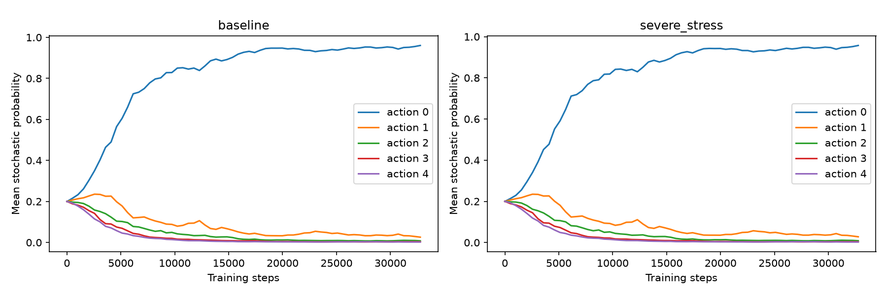

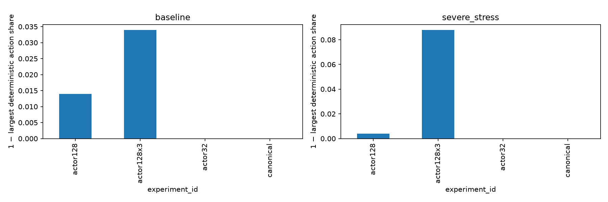

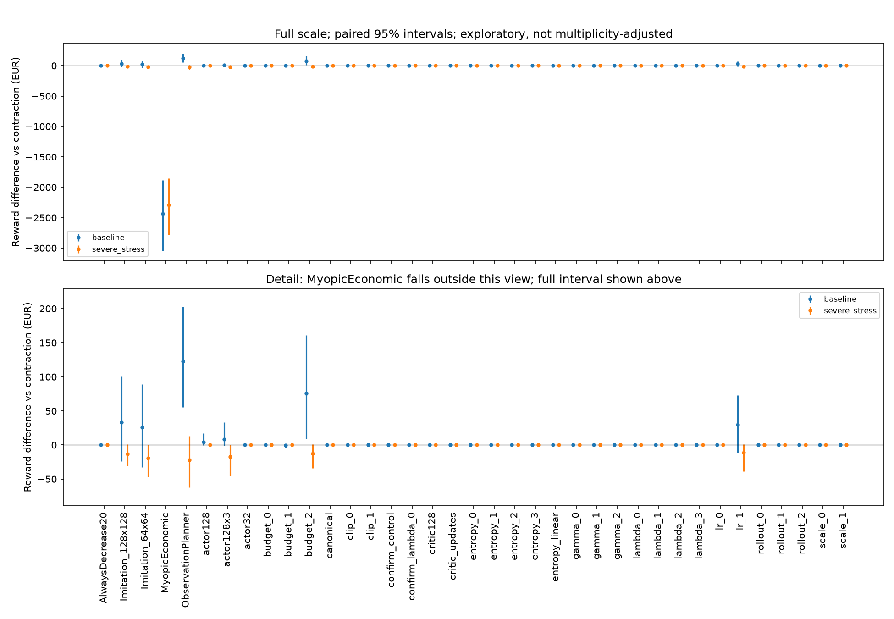

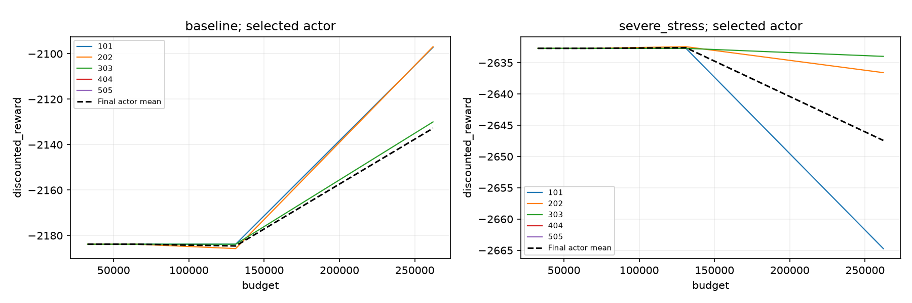

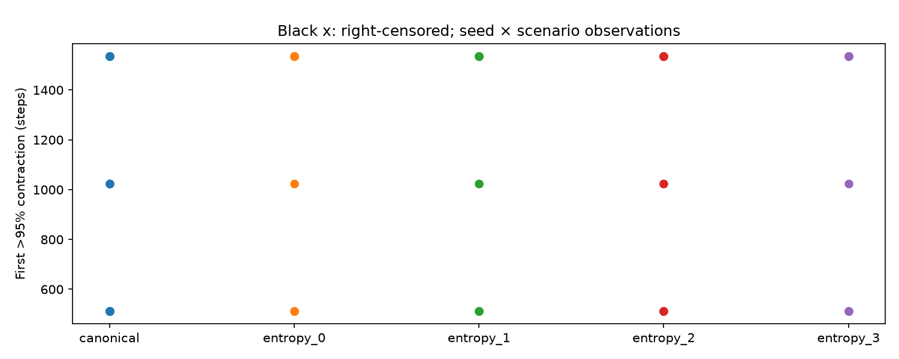

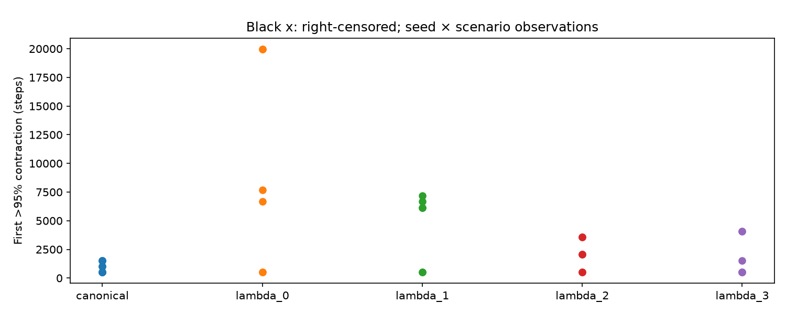

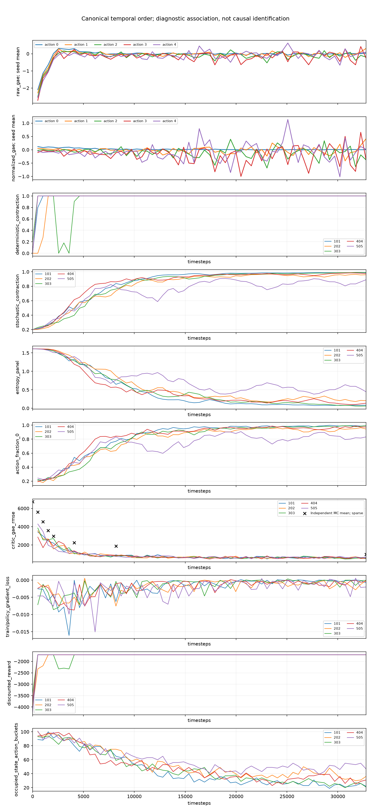

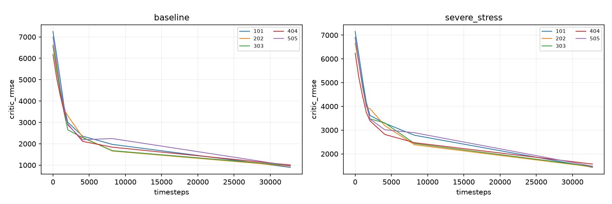

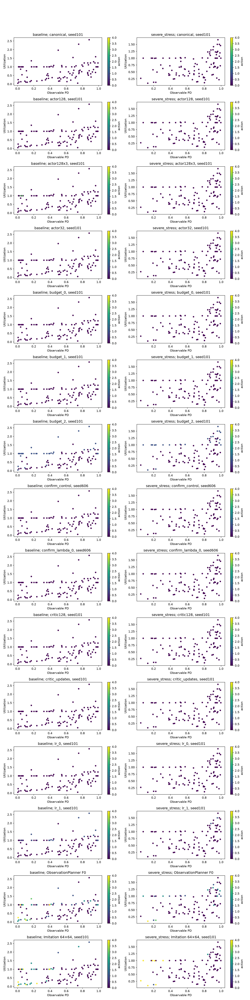

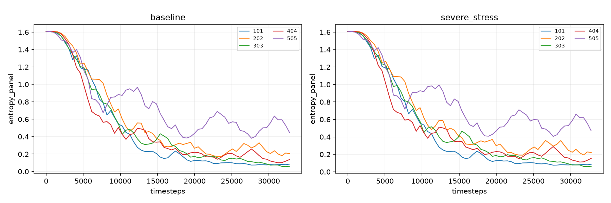

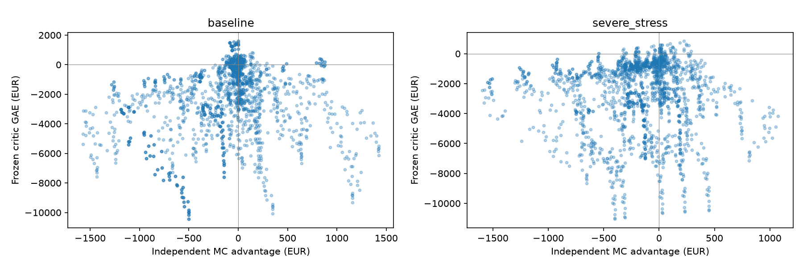

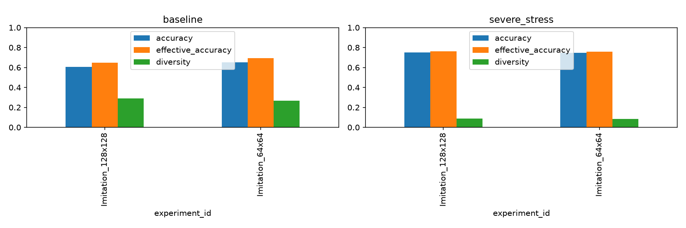

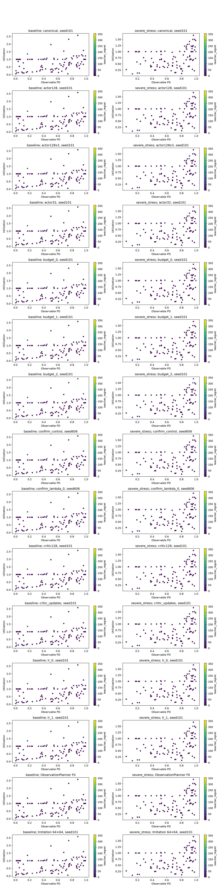

