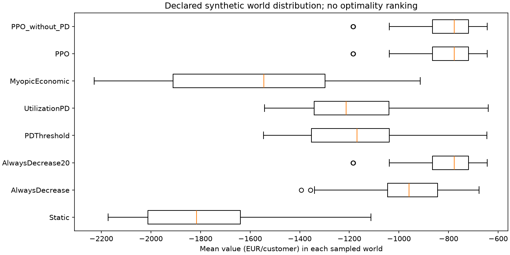
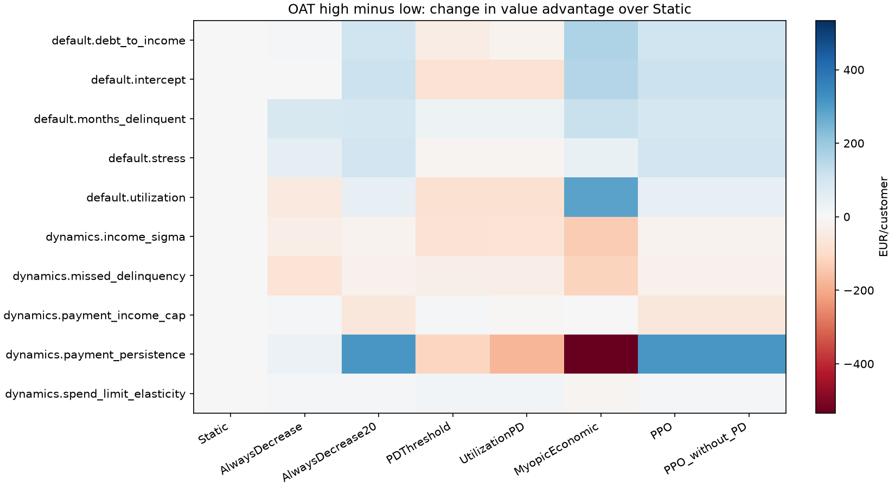
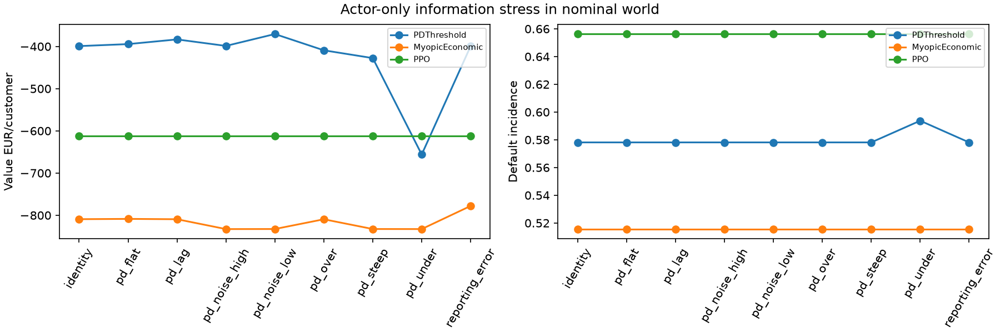
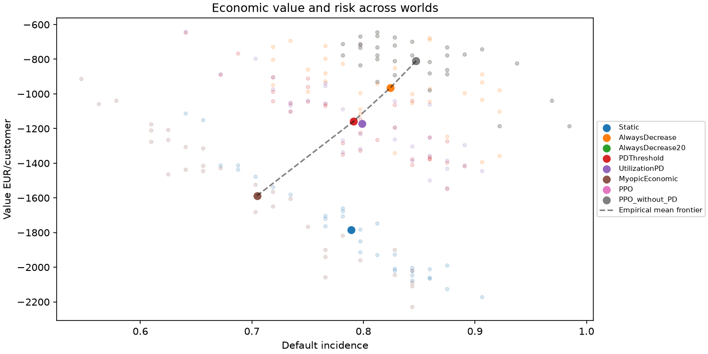
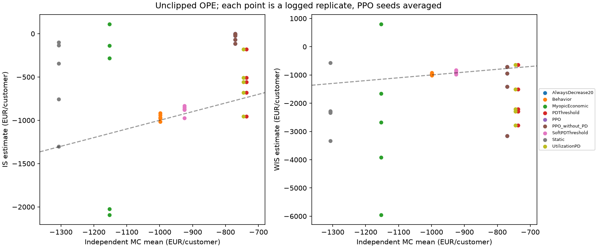
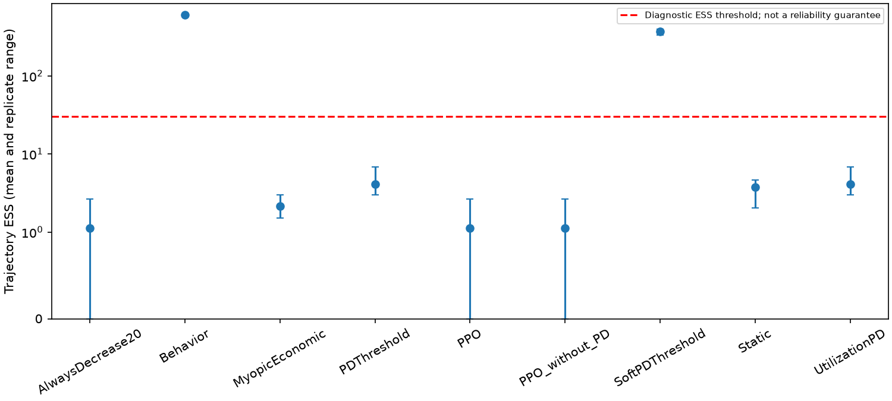

# Rapport mesuré : robustesse et évaluation off-policy

Expériences locales exécutées le 20 septembre 2026. **Le gain économique de PPO ne constitue pas une preuve de planification apprise : les dix modèles reproduisent exactement la règle de réduction de 20 % sur les trajectoires évaluées.** Cette règle réduit les pertes, mais augmente souvent les défauts. L'OPE déterministe manque de support effectif malgré des probabilités de collecte strictement positives.

## A. Repository audit

Le simulateur longitudinal, le modèle PD observable et les politiques sont séparés. Les chocs indexés permettent des comparaisons appariées sans décaler les tirages lorsque les actions divergent. Le modèle PD dépend de la politique qui génère les historiques ; sa discrimination nominale ne garantit pas sa calibration après changement de politique.

L'audit a identifié deux points décisifs : conserver les coefficients **nominaux** de MyopicEconomic lorsque le monde change, et vérifier les signes des coefficients de risque échantillonnés. L'évaluation respecte ces frontières. La reward, les modèles et les paramètres nominaux ne sont pas ajustés à partir des résultats de robustesse. Voir [audit détaillé](robustness_audit.md).

## B. Files changed

| Fichiers | Rôle |
|---|---|
| `configs/robustness.yaml`, `configs/ope.yaml` | Budgets, distributions, transformations et estimateurs fixés |
| `evaluation/worlds.py`, `evaluation/sensors.py` | Mondes reproductibles et information acteur perturbée |
| `evaluation/policy_engine.py` | Transformations optionnelles et journal public des transitions |
| `evaluation/robustness_statistics.py` | Panels appariés, bootstrap croisé, contraintes et dominance |
| `evaluation/robustness_reporting.py` | Sensibilités, mécanismes, trajectoires et figures |
| `evaluation/ope.py`, `evaluation/ope_reporting.py` | IS/WIS, poids, ESS, support et comparaison MC |
| `experiments/study_common.py` | Chargement figé, identités et registre de provenance |
| `experiments/robustness.py`, `experiments/off_policy_evaluation.py` | Exécution séparée des expériences et rapports |
| `tests/test_robustness_ope.py` | Dix tests de frontières, reproductibilité, statistiques et OPE |
| `docs/robustness.md`, `docs/off_policy_evaluation.md`, ce rapport | Méthodes, résultats et limites |
| `README.md`, `experiments/README.md`, `.gitignore` | Présentation actuelle, commandes et sélection des artefacts |

Les chemins `evaluation/` sont sous `src/credit_rl/`. Les autres modifications déjà présentes dans le dossier sont conservées. Les CSV compacts, figures et registres sont sélectionnés pour Git ; modèles, journaux et grandes trajectoires restent disponibles localement et exclus de Git.

## C. Evaluation worlds

59 mondes physiques : nominal, 32 tirages indépendants des paramètres et du macro, une référence de stress OAT, 20 extrémités OAT et cinq scénarios macro. Huit variantes de signal sont appliquées sur trois ancrages fixés à l'avance, soit **83 combinaisons monde/signal**.

Dix paramètres varient : élasticité des achats à la limite [0.05,0.30], volatilité des revenus [0.018,0.040], persistance des paiements [0.25,0.75], effet du retard sur les paiements manqués [0.35,0.90], plafond paiement/revenu [0.40,0.60], intercept de défaut [−6.35,−5.65], effets de l'utilisation [0.85,1.65], des retards [0.45,0.85], dette/revenu [0.30,0.65] et stress [0.60,1.30]. Les tirages sont uniformes indépendants, hypothèses synthétiques et non distributions estimées.

Le stress aléatoire commence entre les décisions 4 et 12, dure 3 à 10 décisions, décroît sur 2 à 6 décisions et a une intensité de 0.5 à 1.8. Les caractéristiques initiales des clients restent nominales. [Définitions complètes et justification](robustness.md).

## D. Robustness protocol

64 clients neufs `ROBUST_TEST`, mêmes états initiaux, traits cachés et chocs dans tous les mondes et pour toutes les politiques. Les mondes modifient les transitions ultérieures. Huit règles observables, un oracle séparé et dix modèles PPO (cinq seeds avec PD, cinq sans) donnent 19 instances, **100 928 épisodes**. Aucun réentraînement, aucune nouvelle sélection de seuils ou de checkpoints.

Les modèles sélectionnés ont été entraînés pour 32 768 transitions chacun avec gamma 0.98 ; les checkpoints retenus à 8 192 transitions et les seuils PD [0.10,0.50] proviennent uniquement de la validation nominale. Les unités de reporting sont EUR par client initial et incidence cumulée jusqu'au défaut ou 24 mois. La valeur économique est revenus − pertes − financement ; la reward soustrait en plus capital synthétique et pénalité de risque. Aucune valorisation terminale des prêts n'est ajoutée.

La cohorte nominale ci-dessous contient 64 clients ; elle ne doit pas être confondue avec le benchmark nominal de 300 clients documenté dans [policy_results.md](policy_results.md), ni avec les 2 000 clients MC indépendants de l'OPE.

## E. Nominal results

| Policy | Valeur EUR | Revenus EUR | Pertes EUR | Défauts |
| --- | --- | --- | --- | --- |
| Static | -722.3 | 1205.3 | 1747.0 | 56.2% |
| AlwaysDecrease | -445.7 | 669.9 | 1017.1 | 60.9% |
| AlwaysDecrease20 | -612.3 | 409.9 | 960.8 | 65.6% |
| AlwaysIncrease | -1282.4 | 1253.6 | 2348.6 | 53.1% |
| Random | -624.0 | 1113.2 | 1571.1 | 57.8% |
| PDThreshold | -399.1 | 963.7 | 1222.6 | 57.8% |
| UtilizationPD | -392.4 | 972.7 | 1222.7 | 57.8% |
| MyopicEconomic | -809.2 | 1239.9 | 1866.6 | 51.6% |
| PPO | -612.3 | 409.9 | 960.8 | 65.6% |
| PPO_without_PD | -612.3 | 409.9 | 960.8 | 65.6% |

Les règles PDThreshold et UtilizationPD obtiennent ici une valeur nominale supérieure à PPO. Les petites cohortes peuvent modifier les moyennes ; aucun résultat nominal favorable au PPO n'a été sélectionné pour remplacer cette cohorte.

## F. Shifted-world results

Distribution sur les **32 mondes aléatoires uniquement**, après moyenne des seeds dans chaque monde. SD désigne la dispersion des moyennes mondiales, pas une erreur standard.

| Policy | Moyenne EUR | Médiane EUR | SD mondes | P10 | P90 | Pire EUR | Défauts moyens |
| --- | --- | --- | --- | --- | --- | --- | --- |
| Static | -1784.0 | -1816.4 | 280.4 | -2065.6 | -1415.0 | -2171.8 | 78.9% |
| AlwaysDecrease | -963.9 | -959.4 | 188.4 | -1232.3 | -722.7 | -1393.6 | 82.4% |
| AlwaysDecrease20 | -810.5 | -777.3 | 134.5 | -972.2 | -675.4 | -1186.0 | 84.7% |
| AlwaysIncrease | -1983.7 | -1993.7 | 332.0 | -2416.3 | -1574.2 | -2521.2 | 71.5% |
| Random | -1632.0 | -1685.0 | 269.5 | -1906.4 | -1213.1 | -2027.0 | 79.4% |
| PDThreshold | -1158.9 | -1168.4 | 212.8 | -1394.0 | -904.2 | -1546.3 | 79.1% |
| UtilizationPD | -1171.6 | -1212.7 | 219.4 | -1428.0 | -908.4 | -1542.2 | 79.9% |
| MyopicEconomic | -1587.2 | -1544.2 | 362.2 | -2055.0 | -1177.8 | -2228.1 | 70.5% |
| PPO | -810.5 | -777.3 | 134.5 | -972.2 | -675.4 | -1186.0 | 84.7% |
| PPO_without_PD | -810.5 | -777.3 | 134.5 | -972.2 | -675.4 | -1186.0 | 84.7% |

Le pire monde économique de PPO et MyopicEconomic est `random_021` : stress précoce (onset 4), durée 10, intensité 1.664, coefficient d'utilisation 1.615 et de retard 0.748. PPO atteint **98.44 % de défauts**, une exposition moyenne de 3 026 EUR et une utilisation moyenne de 1.088. Myopic atteint 84.38 % de défauts et une exposition de 4 330 EUR. Le monde combine plusieurs mécanismes ; attribuer causalement son résultat à un seul coefficient serait incorrect. Les OAT isolent certains effets.

Le pire monde de Static est `random_003` : intensité 1.744, durée 10 et coefficient de stress 1.295 ; défauts 90.63 %. Les paramètres et tous les composants sont conservés dans [worst_worlds.csv](../outputs/results/robustness/standard/worst_worlds.csv).

## G. Parameter sensitivity

OAT autour d'un même ancrage macro et des mêmes clients/chocs. Variation **haut moins bas de l'avantage économique PPO−Static**, EUR/client : persistance des paiements +312.3 ; intercept de défaut +114.0 ; dette/revenu +107.1 ; stress +101.8 ; retard +95.5 ; utilisation +44.3 ; élasticité des achats +8.0 ; volatilité des revenus −20.7 ; paiements manqués −23.1 ; plafond paiement/revenu −60.3.

Dans ces plages, la persistance des paiements modifie le plus cet avantage. Ce résultat dépend de l'ancrage, de la largeur des plages et de la cohorte ; ce n'est pas un classement universel des paramètres. Les corrélations de rang multivariées sont descriptives, non causales.

## H. Policy comparison stability

PPO a une valeur strictement supérieure à Static et Myopic dans 32/32 mondes, à PDThreshold et UtilizationPD dans 29/32, et à la réduction de 10 % dans 28/32. Il est à égalité avec la réduction de 20 % et PPO sans PD dans 32/32. Ces fréquences empiriques concernent la valeur, pas une supériorité globale valeur/risque. Elles ne sont pas des probabilités bayésiennes.

L'oracle myope caché a une valeur moyenne de −1 444.9 EUR. Son écart moyen oracle−PPO est **−634.4 EUR**, oracle−Static +339.1 et oracle−Myopic +142.3. Un oracle myope n'est pas une borne optimale multi-période ; un écart négatif est donc conservé, sans interprétation en regret optimal.

## I. PD robustness

Les transformations de logit simulent sous/surestimation, aplatissement/pente accrue, bruit sigma 0.3/0.8, retard d'un mois et erreur de reporting de 5 %. Seule l'information de l'acteur est modifiée ; la PD de reward et le vrai DGP restent intacts. Le masque sans PD est appliqué après transformation.

Sur le monde nominal, sous-estimer la PD fait passer PDThreshold de −399.1 à −656.0 EUR et les défauts de 57.81 à 59.38 %. Le retard produit −383.3 EUR, le bruit fort −398.7, la pente accrue −427.6. Les effets ne sont pas monotones sur cette petite cohorte. Myopic varie de −832.7 à −777.9 EUR selon le signal. PPO et PPO sans PD restent exactement à −612.3 EUR et 65.63 % de défauts.

Cette invariance de PPO traduit ici une décision constante, pas une capacité démontrée à corriger une mauvaise calibration. L'absence de la coordonnée PD n'efface pas toute information de risque dans les autres variables.

## J. Macro robustness

| Scénario | Policy | Valeur EUR | Défauts |
| --- | --- | --- | --- |
| macro_early | MyopicEconomic | -1508.9 | 67.2% |
| macro_early | PPO | -1053.1 | 84.4% |
| macro_early | Static | -1533.2 | 70.3% |
| macro_late | MyopicEconomic | -1521.9 | 67.2% |
| macro_late | PPO | -667.9 | 76.6% |
| macro_late | Static | -1811.7 | 81.2% |
| macro_prolonged | MyopicEconomic | -1998.2 | 76.6% |
| macro_prolonged | PPO | -805.4 | 84.4% |
| macro_prolonged | Static | -1971.1 | 82.8% |
| macro_slow_recovery | MyopicEconomic | -1659.9 | 68.8% |
| macro_slow_recovery | PPO | -794.4 | 82.8% |
| macro_slow_recovery | Static | -1899.7 | 81.2% |
| macro_unexpected | MyopicEconomic | -1993.4 | 82.8% |
| macro_unexpected | PPO | -716.6 | 87.5% |
| macro_unexpected | Static | -2045.5 | 87.5% |

Le choc inattendu arrive après douze décisions normales et n'est pas annoncé dans les observations. PPO ne change pas de règle au choc ni à la reprise. Les différences entre stress précoce et tardif reflètent aussi la durée d'exposition et les sorties par défaut : elles ne prouvent pas une adaptation apprise.

## K. Risk constraints

Seuils expérimentaux figés : défaut 0.75, pertes/balance initiale 0.70, part d'exposition à PD >0.60 de 0.60. Un excès est `max(0, métrique−seuil)` ; les fréquences utilisent les 32 mondes aléatoires.

| Policy | Métrique / seuil | Fréquence | Excès moyen | Excès si violé | Excès maximal |
| --- | --- | --- | --- | --- | --- |
| MyopicEconomic | default_rate / 0.75 | 34.4% | 0.0205 | 0.0597 | 0.0938 |
| MyopicEconomic | credit_loss_rate / 0.70 | 93.8% | 0.1532 | 0.1634 | 0.3035 |
| MyopicEconomic | high_risk_exposure_share / 0.60 | 3.1% | 0.0001 | 0.0040 | 0.0040 |
| PDThreshold | default_rate / 0.75 | 65.6% | 0.0527 | 0.0804 | 0.1406 |
| PDThreshold | credit_loss_rate / 0.70 | 6.2% | 0.0004 | 0.0061 | 0.0117 |
| PDThreshold | high_risk_exposure_share / 0.60 | 0.0% | 0.0000 | 0.0000 | 0.0000 |
| PPO | default_rate / 0.75 | 100.0% | 0.0972 | 0.0972 | 0.2344 |
| PPO | credit_loss_rate / 0.70 | 0.0% | 0.0000 | 0.0000 | 0.0000 |
| PPO | high_risk_exposure_share / 0.60 | 0.0% | 0.0000 | 0.0000 | 0.0000 |
| Static | default_rate / 0.75 | 75.0% | 0.0547 | 0.0729 | 0.1562 |
| Static | credit_loss_rate / 0.70 | 100.0% | 0.1891 | 0.1891 | 0.2976 |
| Static | high_risk_exposure_share / 0.60 | 6.2% | 0.0012 | 0.0192 | 0.0379 |

PPO respecte les deux seuils d'exposition/pertes dans ces mondes, mais viole le seuil de défaut dans **100 %** des mondes, jusqu'à 23.44 points au-dessus du seuil. Les garde-fous opérationnels restent distincts : **zéro augmentation en retard sévère** dans l'ensemble des épisodes. Ces alertes ne constituent pas une garantie de conformité réglementaire.

## L. Risk/value trade-offs

PPO−Static : **+973.5 EUR [706.1,1 284.5]**, pertes −1 399.2 EUR [−1 721.9,−1 131.6], défauts **+5.81 points [2.69,9.33]**. PPO−Myopic : **+776.6 EUR [449.4,1 154.5]**, défauts **+14.26 points [9.03,19.53]**. Intervalles croisés à 95 %.

La contraction réduit les revenus (366.2 contre 872.8 EUR pour Static), mais réduit davantage les pertes (1 120.2 contre 2 519.4) et le financement (56.5 contre 137.4). L'utilisation moyenne monte à 1.139 contre 0.675 : réduire la limite ne supprime pas la dette existante. Le lien utilisation–hazard explique pourquoi perte monétaire et incidence du défaut peuvent évoluer en sens opposé.

La frontière empirique des moyennes contient Myopic, PDThreshold, la baisse de 10 % et le groupe équivalent baisse de 20 %/PPO. Elle porte sur les politiques disponibles, sans optimalité globale. La seule dominance soutenue simultanément par les intervalles appariés de valeur et défaut est **MyopicEconomic sur AlwaysIncrease**. Les autres dominances ponctuelles restent incertaines.

## M. Sequential value

Les neuf métriques par épisode comparées entre PPO et la règle −20 % ont un écart maximal exactement nul dans les 83 combinaisons, pour chacune des cinq seeds et chaque ablation PD. Le gain face à Myopic est donc entièrement reproduit par une règle fixe ; **aucune valeur supplémentaire de planification apprise n'est identifiée**.

PPO effectue en moyenne 8.24 changements effectifs de limite par épisode aléatoire et zéro inversion de direction ; Myopic 6.81 changements et 1.41 inversion. La reward moyenne PPO est −2 323.3 EUR, dont 1 417.6 de charge en capital et 95.1 de pénalité, contre −5 859.2 EUR pour Myopic. La forte charge synthétique contribue à l'incitation à contracter l'exposition.

Sur 64 états initiaux et de petites perturbations (logit PD ±0.1, revenu et balance/utilisation ±2 %), PPO ne change aucune action. PDThreshold change 5.47 % des décisions sous perturbation PD ; Myopic 1.56 % sous PD et 0.78 % sous balance/utilisation. Ce test local ne couvre pas tous les états atteignables.

Deux clients sur 64, dans chacun des mondes nominal et choc inattendu, ont une reward réalisée au premier pas plus faible sous PPO mais une valeur totale supérieure à Myopic. Cela montre une différence de temporalité des résultats, **pas** une preuve de planification, puisque la règle fixe reproduit ces cas. Reward instantanée et valeur cumulée sont en outre des métriques distinctes.

Six figures retracent trois clients choisis par caractéristiques initiales (utilisation minimale/maximale et score minimal) dans les deux mondes : limite, achats, balance, utilisation, PD, retard et valeur cumulée. Les sorties précoces restent visibles ; la PD terminale égale à 1 est un marqueur de défaut.

## N. OPE dataset

Cinq collectes indépendantes de 600 trajectoires, soit **3 000 épisodes et 44 183 décisions**. Politique de collecte connue : 40 % PDThreshold, 20 % Static, 20 % Myopic et 20 % uniforme. Chaque commande a une probabilité au moins 0.04 avant projection par les garde-fous. Le journal enregistre l'état public courant, commande, cinq probabilités, probabilité choisie, reward, valeur, état public suivant et terminaison. Aucune variable latente n'est fournie aux estimateurs.

17 instances cibles incluent cinq règles, dix modèles PPO, la politique de collecte et une cible proche `SoftPDThreshold = 0.8*collecte + 0.2*PDThreshold`. Une cohorte indépendante de **2 000 clients par cible**, appariée entre cibles, fournit la référence Monte Carlo nominale. Ses IDs et tirages sont distincts des logs et des cohortes d'apprentissage/robustesse.

## O. OPE results

IS et WIS utilisent le produit des rapports de probabilités sur la trajectoire complète, gamma=1 pour la valeur et reward cumulées. La référence MC reste une estimation avec erreur standard, pas une espérance exacte. Moyennes de cinq collectes ; pour PPO les cinq seeds ont ici les mêmes estimations.

| Cible | MC ± SE (EUR) | IS moyen | WIS moyen | SD WIS | ESS moyenne | WIS disponibles |
| --- | --- | --- | --- | --- | --- | --- |
| AlwaysDecrease20 | -770.6 ± 26.7 | -43.2 | -1560.8 | 1103.5 | 1.13 | 4/5 |
| Behavior | -998.7 ± 45.9 | -963.7 | -963.7 | 36.9 | 600.00 | 5/5 |
| MyopicEconomic | -1152.9 ± 55.9 | -885.0 | -2682.9 | 2523.2 | 2.14 | 5/5 |
| PDThreshold | -736.9 ± 39.0 | -575.8 | -1886.9 | 832.9 | 4.14 | 5/5 |
| PPO | -770.6 ± 26.7 | -43.2 | -1560.8 | 1103.5 | 1.13 | 4/5 |
| PPO_without_PD | -770.6 ± 26.7 | -43.2 | -1560.8 | 1103.5 | 1.13 | 4/5 |
| SoftPDThreshold | -925.1 ± 44.4 | -881.1 | -897.8 | 56.8 | 369.94 | 5/5 |
| Static | -1307.0 ± 50.6 | -526.9 | -2168.6 | 996.0 | 3.74 | 5/5 |
| UtilizationPD | -745.5 ± 38.8 | -575.8 | -1886.9 | 832.9 | 4.14 | 5/5 |

Une réplication PPO n'a aucun poids non nul : WIS y est indéfini et reste manquant. Sa moyenne ci-dessus utilise 4/5 réplications ; IS vaut zéro dans cette réplication et reste explicitement non fiable. Aucun DR n'est implémenté ; aucun modèle de valeur appris sur ces données ni nouvel algorithme offline RL n'est ajouté.

Avec écrêtage des poids à 20, PPO IS passe à −24.7 EUR, WIS à −1 567.7 et ESS à 1.16 : cela ne restaure pas le support. Pour Myopic, WIS passe de −2 682.9 à −2 384.1 et sa SD de 2 523.2 à 1 357.1, mais reste éloigné du MC −1 152.9. L'écrêtage échange variance contre biais ; les valeurs brutes restent disponibles. La cible souple n'est pas affectée car son poids maximal est 14.17.

## P. OPE support diagnostics

Aucune action cible n'a une probabilité de collecte exactement nulle. Pourtant 99.77 % des trajectoires ont un poids nul pour PPO : un seul désaccord avec une politique déterministe annule le produit entier. ESS moyenne **1.13/600**, minimum 0 ; poids maximal observé 72.34. Environ 84.74 % de la masse d'action PPO sur les états journalisés porte sur des commandes de probabilité <0.1.

PDThreshold a 97.40 % de poids nuls, ESS 4.14 ; Static 98.57 %, ESS 3.74 ; Myopic 98.97 %, ESS 2.14 et poids maximal 164.40. Même lorsque la probabilité de l'action cible est assez grande à chaque état, le produit sur un long horizon dégénère. La seule couverture marginale des actions ne suffit pas.

La cible souple garde ESS 369.94 (minimum 330.81), sans poids nul ; la politique de collecte a exactement des poids 1 et ESS 600. Ces contrôles rendent l'implémentation interprétable, sans rendre fiables les autres cibles. Les maxima observés ne bornent pas les poids rares non observés.

## Q. Statistical uncertainty

400 réplications bootstrap croisant mondes, clients et seeds. Chaque réplication resélectionne une seule liste de clients partagée entre tous les mondes, respectant le panel croisé ; les différences de politiques sont formées avant rééchantillonnage. Des intervalles conditionnels gardent les mondes fixes. Les lignes client-mois ne sont jamais traitées comme indépendantes.

PPO : valeur moyenne −810.5, IC croisé [−1 044.0,−593.7], IC conditionnel [−1 011.1,−585.1] ; SD inter-mondes 134.5, SD moyenne entre clients au sein des mondes 964.4 et SD des moyennes entre seeds 0. Ces dispersions ne forment pas une décomposition additive identifiée. Les intervalles bootstrap finis ne sont pas forcément emboîtés.

L'OPE rééchantillonne des trajectoires entières dans chaque log et conserve le nombre de bootstraps WIS définis. La couverture de la **moyenne MC estimée** est descriptive : PPO WIS 1/5, cible souple 5/5, avec seulement cinq collectes et une référence elle-même incertaine. Ce n'est pas une validation de couverture de l'espérance vraie. Les comparaisons multiples sont exploratoires sans correction familiale. Les seeds appariées avec/sans PD utilisent la même liste nominale.

## R. Tests

**118 passed, 0 failed** lors de la vérification finale (`pytest -q`, 13.31 s). Les tests couvrent comptabilité, absence de fuite temporelle, chocs appariés, bornes/signes des mondes, immutabilité nominale, causalité du lag, RNG des capteurs, invariance de Static au bruit acteur, exactitude analytique des poids/ESS/IS/WIS, cas sans poids, probabilités invalides, journaux publics et bootstrap croisé.

Une vérification séparée reproduit exactement les résultats smoke séquentiels avec deux processus Windows. Les données standard passent les contrôles de panel complet, comptabilité des rewards, zéro augmentation en retard sévère, hashes inchangés des sources de simulation et des artefacts, propensions normalisées, continuité des états journalisés et terminaison unique. [Robustesse](../outputs/results/robustness/standard/verification.json), [OPE](../outputs/results/ope/standard/verification.json), [parallélisme](../outputs/results/robustness/parallel_verification.json).

## S. Computational performance

Robustesse standard : **1 380.13 s (23.00 min)**, 83 jobs, trois processus Windows, un thread Torch/BLAS par processus. OPE standard : **1 551.82 s (25.86 min)**, incluant les références MC et cinq logs. Ces expériences ont tourné simultanément ; leurs durées ne doivent pas être additionnées comme durée utilisateur totale. Les rapports et tests sont séparés de ces durées.

Smoke et standard ont été exécutés. Le profil full est configuré, **non exécuté**. Aucun résultat full n'est présenté. Les jobs de robustesse terminés sont réutilisés seulement avec une identité compatible. Les registres conservent YAML exacts, seeds, mondes, versions, commit et hashes des sources/modèles ; un manifeste séparé identifie les sources de reporting.

IDs : robustesse `fa6bce635853c860883b6d24041cd535271e953b3b963852f9ccc6473ad5027d` ; OPE `a9b3eb7dfbe550fee8d0533262ae263b2094ac9548dd26088f34f025c57041cf`.

## T. README

Le README décrit le système actuel, les résultats mesurés, les frontières d'information, l'OPE et ses échecs de support. Il ne raconte pas d'historique de développement. Ses tableaux proviennent des CSV standard. Les commandes d'évaluation et de reporting smoke/standard, ainsi que la suite de tests, ont été exécutées avec `.venv/Scripts/python.exe`. Le guide distingue les prérequis de génération des modèles et les budgets ; aucune exécution du profil full n'est revendiquée.

## U. Limitations

Les plages sont stylisées, indépendantes et non estimées sur une banque ; la robustesse à ces mondes n'est pas une robustesse bancaire démontrée. 64 clients croisés et 32 mondes donnent une résolution limitée, particulièrement dans les queues. La population initiale, la fonction de reward, LGD et l'architecture du hazard restent fixes. Une seule réalisation de chocs par client est partagée entre mondes.

Les défauts sont très fréquents ; horizon fini, absence de valorisation terminale, coûts d'ajustement et bien-être client absents. La PD 12 mois entre dans une charge mensuelle stylisée ; sa calibration sous politique n'est pas résolue. L'ablation masque un score, pas tous ses prédicteurs. Le budget PPO reste modeste et son résultat constant ne permet pas de tester un véritable planificateur adaptatif.

La frontière est empirique, les contraintes sont des alertes ex post et non un entraînement contraint. Les OAT ignorent les interactions ; les pires mondes sont observés, pas adversarialement optimisés. Les logs OPE et références MC concernent le monde nominal seulement. Le support de trajectoire est insuffisant pour les cibles déterministes ; bootstrap et écrêtage ne le réparent pas. Cinq collectes sont insuffisantes pour calibrer précisément une couverture statistique.

## V. Priorités techniques suivantes

1. Valider les unités économiques, le capital et une valorisation terminale cohérente avant toute optimisation supplémentaire.
2. Calibrer distributions et dépendances des paramètres sur une source empirique autorisée, avec analyse d'identifiabilité.
3. Augmenter clients, mondes et réplications indépendantes de chocs ; quantifier l'incertitude des queues et des violations.
4. Étudier la calibration PD conditionnelle à la politique et à l'horizon, sans fuite ni utilisation du test pour ajuster les modèles.
5. Améliorer l'estimation observable des transitions du comparateur myope et vérifier son erreur de modèle.
6. Introduire et valider coûts opérationnels, contraintes explicites et effets client avant de qualifier une règle de viable.
7. Concevoir une collecte OPE adaptée aux cibles, avec analyse préalable du support et de l'horizon ; conserver une cible souple témoin.
8. Évaluer ensuite un estimateur à variance réduite ou DR avec apprentissage séparé/cross-fitting et diagnostics d'erreur, sans promettre de résoudre l'absence de support.
9. Construire un test de planification contrôlé où une règle constante est insuffisante, et conserver les baselines fixes pour vérifier la valeur séquentielle.
