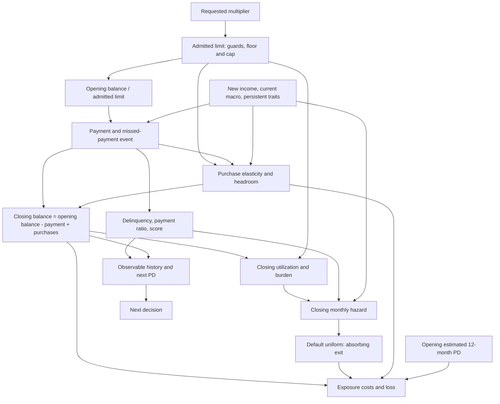

# Structural diagnostic implementation audit

Inspected before implementation: README, technical paper, DGP documentation,
reward, simulator, environment, policy registry/training, evaluation engine,
canonical experiments/configuration, scientific tests and CI. Existing reward
audits, equivalence tables and robustness/OAT studies do not estimate conditional
first-action continuation values. Reuse their accounting and simulator interfaces.

| Relation | Implementation authority |
|---|---|
| Admission/floor/cap/delinquency | `envs/constraints.py:effective_limit`, `CreditLimitEnv.step` |
| Income, payment, demand/headroom, balance, delinquency and score | `simulation/behavior.py:evolve_behavior` |
| Closing utilization/burden/payment/delinquency/traits/current macro -> hazard | `simulation/default.py:true_default_probability` |
| Hazard/uniform -> default; reveal next macro afterward | `simulation/dgp.py:CreditDGP.step` |
| Opening balance, closing exposure/purchases/default, opening PD -> reward | `reward.py:calculate_reward` |
| Current/past observable rows -> PD; actor projection | `risk/features.py`, `envs/observation.py`, `CreditLimitEnv._predict_pd` |

Payment precedes purchases and closing utilization. Opening balance divided by
the admitted limit affects payment willingness and missed payments. There is no
action effect on income or direct raw-limit coefficient in hazard. Cuts do not
forgive principal; utilization can exceed one. Interest is not capitalized.

Full state includes CustomerState, persistent CustomerTraits, elapsed horizon,
seven-row PD history and macro process/scenario clock. Initial income and score
are reversion anchors. Latents are creditworthiness, spending propensity,
payment propensity and income stability. PPO receives only the 21 quantities
in `OBSERVATION_NAMES`: time, limit, balance, utilization, payment, delinquency
flag/count, income, score, macro stress, PD, spend, late fraction, tenure, default,
income change, macro growth factors and regime indicators. No traits, anchors,
future states or shocks are supplied. The compact observation is partially observed.

## Accounting and timing

All components are EUR per transition. Interest uses opening balance and is zero
in the default month. Interchange uses purchases, even in the default month.
Realized loss is LGD times closing exposure at default, counted once. Funding is
annual funding rate / 12 times closing exposure. Capital is capital_weight times
rwa_factor times opening 12-month PD times closing exposure. The PD penalty is
constraint_weight times positive excess PD over its threshold.

Reward = interest + interchange - loss - funding - capital - PD penalty.
Net economic value excludes capital and PD penalty (`episode_metrics`).
Capital applies a 12-month PD every month without annualization, whereas APR and
funding are divided by 12. This soft proxy can be large; it is not calibrated
cash flow or duplicate realized loss. The PD penalty is action-invariant at H=1
but depends on history/survival later. Funding and capital remain at default.
Opening revenue versus closing costs is explicit. No terminal receivable,
recovery beyond fixed LGD, or salvage value exists. Exit stops costs AND revenue.

PPO gamma is .98 and reward scale .001; published net value is undiscounted.
`TrainingEnvironment` treats finite horizon as terminal to avoid bootstrapping;
the public environment distinguishes default termination and horizon truncation.
Default wins on the last month and is absorbing.

All five requests are accepted by the environment, then constrained.
`legal_actions` removes blocked/no-effect choices except hold for baselines.
PPO is unmasked. `ConstantAdjustment(.8)` requests hold at the floor, so the
AlwaysDecrease20 name does not imply unconditional action-index zero.
MyopicEconomic optimizes an observable surrogate, not true DGP Q1.
OracleMyopic is privileged, not Q*. Nested oracle continuation is optional;
full-state Monte Carlo is already an oracle diagnostic, never a deployable policy.

Canonical evaluation uses 300 held-out identities, two paired macro scenarios,
indexed CRN, frozen calibrated logistic PD, PPO seeds 101/202/303 and 24 months.
Inference resamples customers and seeds. Supplementary studies differ. CI runs
Python 3.12, Ruff, pytest with 70% coverage and the canonical smoke pipeline.
No economic, DGP or PPO parameter is changed by this diagnostic phase.
