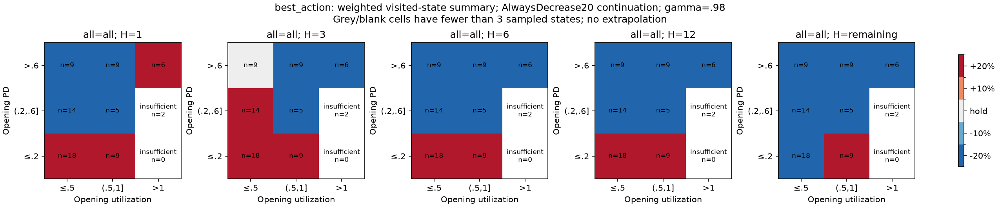
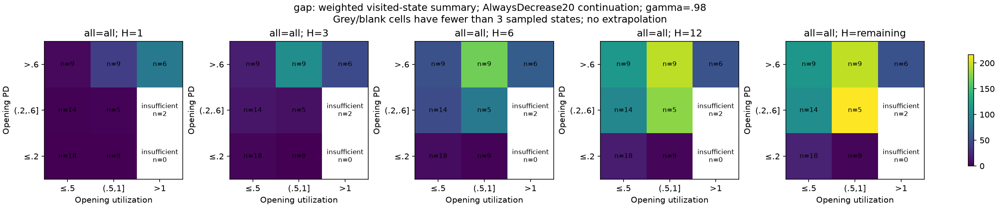
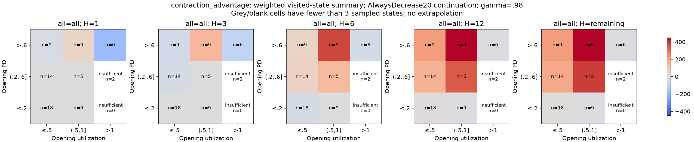
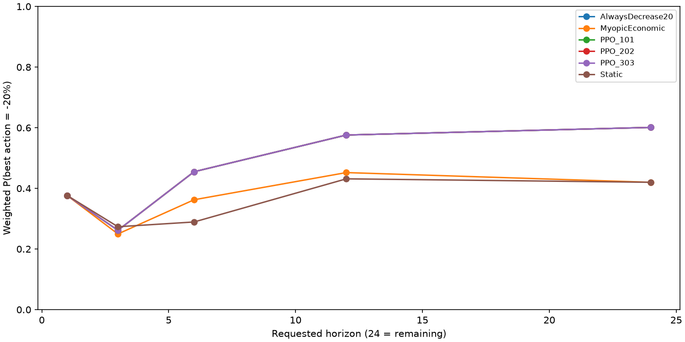
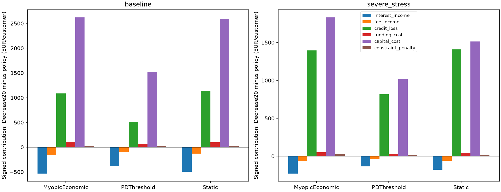
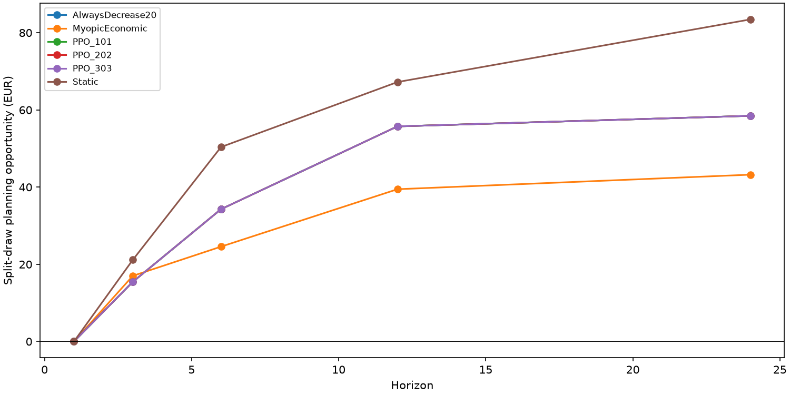
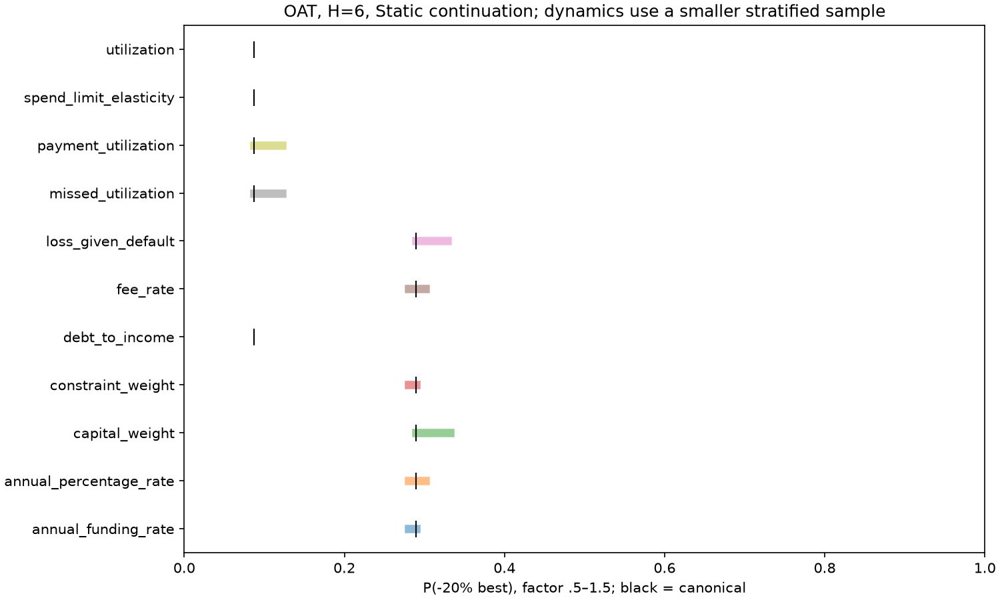

# Why did PPO collapse toward maximum contraction?

This phase diagnoses the existing simulator without changing its DGP, reward,
economic parameters, training configuration or fitted policies. The canonical
negative result is retained: matching AlwaysDecrease20 is not evidence that PPO
learned useful state-dependent planning. The measurements below distinguish that
behavioral collapse from the much stronger claim that contraction is optimal
throughout the simulator's state space.

The [implementation audit and causal diagram](structural_audit.md) identify every
implemented action path, the information boundary and accounting timing. Exact
equations remain in the [technical paper](technical_paper.md) and [DGP](dgp.md).

## Protocol and estimands

Run from the repository root, with the existing Python environment activated:

```shell
python -m credit_rl.experiments.structural_diagnostics
python -m credit_rl.experiments.structural_diagnostics --report-only --update-docs
```

Frozen canonical PD/PPO artifacts and raw canonical trajectories are prerequisites.
They are generated by `python -m credit_rl.experiments.main_evaluation --profile standard`
on a clean output. `--canonical PATH` selects another complete canonical output;
`--profile smoke` must be paired with smoke artifacts. No model is trained by the
diagnostic command. `--resume` reuses cached draws only with matching settings,
model hashes and scientific source hashes. A new seed/sample/draw budget requires
a fresh `--output`. All outputs live in `outputs/main/structural_diagnostics/`.

The main sample draws four states without replacement in each of 18
scenario × source-policy × episode-third strata. Source policies are Static,
MyopicEconomic and AlwaysDecrease20, applied to the full held-out canonical
population. Each sampled state receives weight N_stratum/n_stratum. Therefore
the target is pooled active customer-month visitation under these three policies,
not a uniform customer population, uniform Cartesian grid, or PPO-only visitation.
`state_support.csv` reports absent/rare strata; `states.csv` retains PD, utilization,
balance, limit, income, payment, delinquency, score, macro and remaining horizon.
Latent columns are explicitly marked and never passed to a standard policy.

For each visited **full state** (including fixed latent traits and available PD
history), all five initial requests receive the same independent hypothetical
shock paths. These are separate from the shocks that generated the visited state.
Every transition calls the canonical CreditDGP, effective_limit and calculate_reward.
Batched frozen PD inference uses the existing history_vector; policy inputs use
the existing 21-dimensional build_observation. Future shocks are never supplied
to a policy. Macro paths remain the specified baseline/stress scenarios; those
paths condition the estimand, but only current macro appears in observations.

The estimated quantity is Q_H(s,a; continuation), **not Q***. Continuations are
Static, MyopicEconomic, AlwaysDecrease20 and each frozen PPO seed. A nested
OracleMyopic continuation is omitted: the first-action diagnostic itself already
uses privileged full-state conditioning, and is not a deployable benchmark or
an optimal-policy bound. Future latent inference from observable histories is
not attempted. H=24 in saved tables denotes the entire remaining episode;
`effective_horizon` explicitly records truncation. Defaults absorb with zero
subsequent cash flows. No terminal salvage or extra future value is introduced.

## Immediate economics

`action_values.csv` reports each request, admissibility, actual first effective
action, expected reward and net value, revenue/loss components, purchases,
closing balance/utilization, mean conditional hazard and realized default
incidence. Hazard is conditional on realized behavior/traits and is not the
opening estimated 12-month PD. First-step state quantities are prefixed `first_`;
the reward/component columns are discounted horizon sums. Net value is also
reported as an explicitly **undiscounted** sum.

Cuts reduce demand through the existing elasticity and constrain headroom, but
they simultaneously raise opening utilization, weaken payment and may raise
missed-payment probability. Closing utilization then affects default hazard.
Consequently contraction can reduce monetary loss while increasing default
incidence; a universal one-step dominance claim cannot be inferred from aggregate
PPO returns. The best-action maps and measured shares below test it directly.

## Long-term economics

Persistent principal, payment ratio, spending, delinquency, score, limit and PD
history transmit actions across months. `action_persistence.csv` separates the
H=1 reward contrast from the subsequent reward contrast; `persistent_state_effects.csv`
reports purchases, active probability and closing exposure contrasts by lag.
Exposure after exit is explicitly zero in this diagnostic, not a survivor-only
mean or a valuation of written-off debt. Persistence alone does not establish that
a learned policy successfully exploits planning.

`policy_value_decomposition.csv` attributes AlwaysDecrease20 minus each canonical
comparator to signed revenue, realized loss, funding, capital and PD-penalty
contributions. All entries are per initial customer. Scenario, PD, utilization,
month and eventual-default groups are retained. PD/utilization and eventual-default
groups describe policy-specific occupancy/outcomes; conditioning on these
post-policy variables does not identify causal subgroup treatment effects.

## Action constraints

All five requests are simulated, including censored ones. Best-action comparisons
use the existing `legal_actions` convention, with hold preferred on numerical
ties, then the smallest adjustment. A blocked/no-effect request remains in the
action-value table but is not treated as a distinct feasible alternative.
`action_constraints.csv` records requested-to-effective classes, partial changes,
guardrail blocks and floor/cap modifications. `effective_action_gaps.csv` also
collapses admitted-limit aliases (such as two increases both reaching the cap).
Raw requested-action gaps can be zero simply because two requests coincide.

## Limit-floor effects

`limit_floor.csv` measures reach probability, mean first arrival among reachers,
fraction of observed transitions at the floor and fraction of the scheduled
episode at the floor. Early defaults censor floor arrival; the conditional mean
is not an unconditional time-to-floor estimate. It also counts partial and
ineffective contraction requests. AlwaysDecrease20 requests **hold at the floor**
through legal_actions, whereas PPO can continue requesting a censored reduction.
Thus requested-action agreement and effective-policy collapse are different.
`policy_collapse.csv` compares all three PPO seeds with the constant rule on
matched canonical customer-months and explicitly reports unmatched observations,
limits, balances, utilization, default timing, cumulative reward and net value.
`ppo_disagreement_states.csv` retains the exact request-disagreement regions.
Effective equivalence also holds before reaching the floor on this panel.
Censoring explains the request differences at the floor, but cannot explain the
entire observed collapse toward contraction.

## Horizon effects

The last transition still recognizes opening-balance interest on survival,
purchase fees and closing exposure costs. A surviving terminal balance has no
asset value and future revenue/loss disappears. This can change preferred actions
near expiry. Horizon comparisons start from the **same** state and shock draws;
phase-conditioned maps additionally describe visited early/middle/late states,
whose distributions differ. They do not isolate a causal time effect by themselves.
Sensitivity to gamma in {.90,.95,.98,.995,1} reweights identical simulations without
retraining PPO or changing the canonical gamma.
In the saved remaining-horizon comparisons with contraction continuation, larger
gamma increases the estimated contraction share. These results do not support
discounting as the sole cause of an excessive preference for immediate contraction.

## Reward specification

`reward_decomposition.csv` checks, transition by transition,
reward = interest + interchange - realized loss - funding - capital - PD penalty,
and net value = interest + interchange - realized loss - funding.
`verification.json` records maximum reconstruction residuals. Realized loss is
counted once. The additional capital proxy is not a second realized loss, but
uses a 12-month PD every month without annualization, unlike APR and funding.
This asymmetry can strongly favor smaller exposure. The action-invariant current
PD penalty cannot select the H=1 action, although future PD and survival affect
its cumulative burden. No accounting term or economic coefficient is corrected
or recalibrated in this phase.

## Planning opportunity

`planning_opportunity.csv` compares a_1 with a_H for each continuation and gamma.
The in-sample opportunity maximizes noisy estimates and is upward biased.
`heldout_opportunity` instead selects both actions on the first half of independent
draws and evaluates their difference on the second half. Its aggregate MC interval
conditions on sampled states and first-half selection; it does not quantify
state-sampling, model or calibration uncertainty. An immediate sacrifice is also
reported. Compare the continued-policy values, not Q* or an attainable PPO gain.

`mc_precision.csv` reports independent-half ranking agreement and paired MC errors.
A gap below 1.96 paired standard errors is labelled MC-unresolved, not a proof of
economic indifference. This is a descriptive normal approximation for a selected
pair, without simultaneous-comparison coverage. No arbitrary threshold defines
scientific degeneracy: D_H is the largest weighted action share. Shares and gap
distributions, including exact ties and admitted-limit aliases, are reported
together. Maps use weighted modal per-state choices, not an interpolated optimum
at a hypothetical bin center; cells with fewer than three sampled states are
explicitly marked insufficient.

## Parameter sensitivity

Each existing coefficient is perturbed separately by .5, .75, 1, 1.25 and 1.5.
APR, interchange, LGD, funding, capital weight and PD penalty are exactly rescored
on fixed Static continuation paths at H=1,6,remaining. Static is invariant to
reward coefficient changes, making this rescore exact. Dynamic sensitivity
resimulates spending elasticity, payment-utilization, missed-utilization,
hazard-utilization and hazard-burden coefficients on common shocks at H=1,6.
It uses one sampled state per original visitation stratum, weighted by full
stratum mass. Its baseline is that subset, not the full-sample baseline.

These are local interventions conditional on canonical visited states, frozen PD
and Static continuation, not new stationary populations or a parameter search
for PPO superiority. No fitting or model selection uses their results. The
tornado plot displays the range of contraction shares over factors, with the
unmodified coefficient marked. `sensitivity.csv` retains per-state outcomes.
At one step, increasing capital weight raises the contraction share, whereas
increasing interchange lowers it. The PD penalty leaves the immediate ranking
unchanged, consistent with its action-invariant opening-PD definition. The
six-step ranking sensitivities are smaller. Flat dynamic-subset shares do not
prove that the corresponding mechanisms are economically irrelevant: the sample
is small, discrete action rankings can remain stable while values change, and
the dynamic subset has a different estimated baseline from the full state sample.

## Measured results

The following block is regenerated from saved tables. Full decompositions,
MC diagnostics, floor/collapse tables and sensitivity results are in
[`report_tables.md`](../outputs/main/structural_diagnostics/report_tables.md).

<!-- structural-results:start -->

On 72 sampled visited full states, maximum contraction is the estimated best admissible request in 37.6% of weighted states at one step and 60.1% over the remaining horizon with AlwaysDecrease20 continuation. The preferred request changes between these horizons in 43.6% of states. Split-draw planning opportunity is EUR 58.47 of discounted training reward per sampled decision (conditional MC interval [50.92, 66.02]). This is privileged simulator evidence of state-dependent continuation values, not Q* or an attainable PPO gain. The canonical PPO/AlwaysDecrease20 effective equivalence remains; PPO has not demonstrated exploitation of this opportunity.

| Question | Measured answer |
| --- | --- |
| Q1: Is -20% immediately optimal everywhere? | No: weighted share 37.6%. |
| Q2: Does it remain universally optimal at long horizon? | No: 60.1% with contraction continuation; see other continuations. |
| Q3: Can an increase be better? | An increase wins in 33.1% at H1 and 23.2% at remaining horizon. |
| Q4: Are those states visited? | Yes: all 72 states are from simulated held-out trajectories, not a fabricated grid. |
| Q5: Do effects persist? | Yes: action_persistence.csv separates future rewards; persistent_state_effects.csv reports lagged exposure/purchase/survival effects. |
| Q6: Does the choice depend on state? | Yes: the largest remaining-horizon share is 60.1% under contraction continuation, far from all sampled visitation. |
| Q7: Does the preferred action depend on horizon? | Estimated one-step/remaining-horizon disagreement 43.6%; phase maps are descriptive. |
| Q8: Is myopic selection equivalent to multistep selection? | No for this full-state diagnostic: held-out gain EUR 58.47; held-out immediate sacrifice EUR 17.45 [7.84, 27.06]. This differs from the MyopicEconomic surrogate policy. |
| Q9: What PPO value comes from state-dependent effective decisions? | The canonical PPO/AlwaysDecrease20 effective equivalence remains; PPO has not demonstrated exploitation of this opportunity. See per-seed policy_collapse.csv. |
| Q10: Does the result justify RL? | It motivates studying observable-information planning, but does not validate PPO or establish that RL is necessary; privileged lookahead is not a fair-information optimum. |

| continuation | horizon | -20% | -10% | hold | +10% | +20% |
| --- | --- | --- | --- | --- | --- | --- |
| AlwaysDecrease20 | 1 | 0.376 | 0.126 | 0.166 | 0.030 | 0.301 |
| AlwaysDecrease20 | 3 | 0.262 | 0.075 | 0.218 | 0.054 | 0.391 |
| AlwaysDecrease20 | 6 | 0.455 | 0.031 | 0.165 | 0.095 | 0.255 |
| AlwaysDecrease20 | 12 | 0.576 | 0.031 | 0.111 | 0.042 | 0.241 |
| AlwaysDecrease20 | 24 | 0.601 | 0.031 | 0.136 | 0.042 | 0.191 |
| MyopicEconomic | 1 | 0.376 | 0.126 | 0.166 | 0.030 | 0.301 |
| MyopicEconomic | 3 | 0.250 | 0.022 | 0.162 | 0.079 | 0.488 |
| MyopicEconomic | 6 | 0.362 | 0.057 | 0.131 | 0.035 | 0.415 |
| MyopicEconomic | 12 | 0.452 | 0.033 | 0.133 | 0.058 | 0.324 |
| MyopicEconomic | 24 | 0.420 | 0.039 | 0.133 | 0.083 | 0.324 |
| PPO_101 | 1 | 0.376 | 0.126 | 0.166 | 0.030 | 0.301 |
| PPO_101 | 3 | 0.262 | 0.075 | 0.218 | 0.054 | 0.391 |
| PPO_101 | 6 | 0.455 | 0.031 | 0.165 | 0.095 | 0.255 |
| PPO_101 | 12 | 0.576 | 0.031 | 0.111 | 0.042 | 0.241 |
| PPO_101 | 24 | 0.601 | 0.031 | 0.136 | 0.042 | 0.191 |
| PPO_202 | 1 | 0.376 | 0.126 | 0.166 | 0.030 | 0.301 |
| PPO_202 | 3 | 0.262 | 0.075 | 0.218 | 0.054 | 0.391 |
| PPO_202 | 6 | 0.455 | 0.031 | 0.165 | 0.095 | 0.255 |
| PPO_202 | 12 | 0.576 | 0.031 | 0.111 | 0.042 | 0.241 |
| PPO_202 | 24 | 0.601 | 0.031 | 0.136 | 0.042 | 0.191 |
| PPO_303 | 1 | 0.376 | 0.126 | 0.166 | 0.030 | 0.301 |
| PPO_303 | 3 | 0.262 | 0.075 | 0.218 | 0.054 | 0.391 |
| PPO_303 | 6 | 0.455 | 0.031 | 0.165 | 0.095 | 0.255 |
| PPO_303 | 12 | 0.576 | 0.031 | 0.111 | 0.042 | 0.241 |
| PPO_303 | 24 | 0.601 | 0.031 | 0.136 | 0.042 | 0.191 |
| Static | 1 | 0.376 | 0.126 | 0.166 | 0.030 | 0.301 |
| Static | 3 | 0.273 | 0.035 | 0.150 | 0.037 | 0.505 |
| Static | 6 | 0.289 | 0.044 | 0.138 | 0.091 | 0.438 |
| Static | 12 | 0.431 | 0.092 | 0.097 | 0.067 | 0.312 |
| Static | 24 | 0.420 | 0.104 | 0.072 | 0.067 | 0.338 |

| continuation | horizon | gamma | disagreement | opportunity | heldout_opportunity | immediate_sacrifice | heldout_mc_se | heldout_mc_low | heldout_mc_high |
| --- | --- | --- | --- | --- | --- | --- | --- | --- | --- |
| AlwaysDecrease20 | 1 | 0.980 | 0.000 | 0.000 | 0.000 | 0.000 | 0.000 | 0.000 | 0.000 |
| AlwaysDecrease20 | 3 | 0.980 | 0.492 | 16.776 | 15.445 | 16.387 | 3.451 | 8.682 | 22.209 |
| AlwaysDecrease20 | 6 | 0.980 | 0.422 | 31.683 | 34.280 | 18.953 | 4.455 | 25.548 | 43.012 |
| AlwaysDecrease20 | 12 | 0.980 | 0.410 | 62.398 | 55.733 | 19.577 | 4.188 | 47.524 | 63.942 |
| AlwaysDecrease20 | 24 | 0.980 | 0.436 | 65.054 | 58.471 | 19.588 | 3.852 | 50.922 | 66.020 |
| MyopicEconomic | 1 | 0.980 | 0.000 | 0.000 | 0.000 | 0.000 | 0.000 | 0.000 | 0.000 |
| MyopicEconomic | 3 | 0.980 | 0.495 | 15.967 | 17.000 | 16.457 | 2.697 | 11.715 | 22.286 |
| MyopicEconomic | 6 | 0.980 | 0.506 | 22.679 | 24.575 | 18.116 | 4.408 | 15.935 | 33.214 |
| MyopicEconomic | 12 | 0.980 | 0.520 | 35.171 | 39.455 | 20.850 | 5.643 | 28.394 | 50.516 |
| MyopicEconomic | 24 | 0.980 | 0.552 | 44.675 | 43.224 | 20.911 | 5.476 | 32.491 | 53.957 |
| PPO_101 | 1 | 0.980 | 0.000 | 0.000 | 0.000 | 0.000 | 0.000 | 0.000 | 0.000 |
| PPO_101 | 3 | 0.980 | 0.492 | 16.776 | 15.445 | 16.387 | 3.451 | 8.682 | 22.209 |
| PPO_101 | 6 | 0.980 | 0.422 | 31.683 | 34.280 | 18.953 | 4.455 | 25.548 | 43.012 |
| PPO_101 | 12 | 0.980 | 0.410 | 62.398 | 55.733 | 19.577 | 4.188 | 47.524 | 63.942 |
| PPO_101 | 24 | 0.980 | 0.436 | 65.054 | 58.471 | 19.588 | 3.852 | 50.922 | 66.020 |
| PPO_202 | 1 | 0.980 | 0.000 | 0.000 | 0.000 | 0.000 | 0.000 | 0.000 | 0.000 |
| PPO_202 | 3 | 0.980 | 0.492 | 16.776 | 15.445 | 16.387 | 3.451 | 8.682 | 22.209 |
| PPO_202 | 6 | 0.980 | 0.422 | 31.683 | 34.280 | 18.953 | 4.455 | 25.548 | 43.012 |
| PPO_202 | 12 | 0.980 | 0.410 | 62.398 | 55.733 | 19.577 | 4.188 | 47.524 | 63.942 |
| PPO_202 | 24 | 0.980 | 0.436 | 65.054 | 58.471 | 19.588 | 3.852 | 50.922 | 66.020 |
| PPO_303 | 1 | 0.980 | 0.000 | 0.000 | 0.000 | 0.000 | 0.000 | 0.000 | 0.000 |
| PPO_303 | 3 | 0.980 | 0.492 | 16.776 | 15.445 | 16.387 | 3.451 | 8.682 | 22.209 |
| PPO_303 | 6 | 0.980 | 0.422 | 31.683 | 34.280 | 18.953 | 4.455 | 25.548 | 43.012 |
| PPO_303 | 12 | 0.980 | 0.410 | 62.398 | 55.733 | 19.577 | 4.188 | 47.524 | 63.942 |
| PPO_303 | 24 | 0.980 | 0.436 | 65.054 | 58.471 | 19.588 | 3.852 | 50.922 | 66.020 |
| Static | 1 | 0.980 | 0.000 | 0.000 | 0.000 | 0.000 | 0.000 | 0.000 | 0.000 |
| Static | 3 | 0.980 | 0.450 | 19.092 | 21.144 | 16.451 | 2.839 | 15.580 | 26.708 |
| Static | 6 | 0.980 | 0.469 | 39.846 | 50.379 | 17.119 | 7.090 | 36.483 | 64.275 |
| Static | 12 | 0.980 | 0.529 | 65.693 | 67.221 | 20.433 | 8.758 | 50.056 | 84.386 |
| Static | 24 | 0.980 | 0.480 | 79.972 | 83.451 | 20.416 | 7.928 | 67.911 | 98.990 |

**baseline:** versus MyopicEconomic, contraction changes revenue by EUR -680.87, saves EUR 1085.41 in realized loss and EUR 101.27 in funding per initial customer. This yields EUR 505.82 more net value. The reward additionally benefits from EUR 2620.33 less capital proxy and EUR 30.11 less PD penalty. The floor is reached by 41.0% of customers, after 11.79 months among reachers; 34.8% of observed transitions end at the floor. PPO requested-action agreement is 68.5%; effective agreement is 100.0%.

**severe_stress:** versus MyopicEconomic, contraction changes revenue by EUR -294.98, saves EUR 1394.62 in realized loss and EUR 50.08 in funding per initial customer. This yields EUR 1149.72 more net value. The reward additionally benefits from EUR 1829.52 less capital proxy and EUR 33.06 less PD penalty. The floor is reached by 13.7% of customers, after 11.02 months among reachers; 11.4% of observed transitions end at the floor. PPO requested-action agreement is 90.4%; effective agreement is 100.0%.

The remaining-horizon independent-half ranking agreement is 85.8%; 33.4% of weighted requested-action gaps remain MC-unresolved. Selecting a first action on one draw half and comparing it to fixed initial -20% on the other gives EUR 23.15 [17.72, 28.58] with contraction continuation. Thus even the constant rule is not established as an optimum.

Across the five diagnostic discount factors, the remaining-horizon contraction share ranges from 54.3% to 62.3%. Discounting changes action rankings but does not establish uniform contraction dominance.

**Descriptive classification:** meaningful state-dependent decision problem, with evidence of a meaningful sequential/planning problem, **conditional on privileged full state and the named continuations**. The measured shares, MC errors and split-draw sacrifices above support this description. It does not prove that this information is recoverable from PPO observations or justify a new RL algorithm. The experiment establishes policy collapse and its economic incentives, not the optimization-path cause of PPO training convergence; no training intervention was performed.

<!-- structural-results:end -->









## Limitations

The full-state diagnostic has more information than PPO. It cannot establish an
observable-history optimal policy or prove that PPO could recover the measured
opportunity. The sample is modest and state counts within map cells can be small.
Severe delinquency tails may be absent despite existing in visitation. Weighting
corrects unequal selection rates, not missing support or finite-sample noise.
Common random numbers reduce variance but cannot remove default discontinuities.
Fixed macro scenarios are not a forecast distribution; the simulator is synthetic.
All policies, objectives, terminal rules and DGP mechanisms remain unchanged.

## Interpretation

<!-- structural-interpretation:start -->

**Descriptive classification:** meaningful state-dependent decision problem, with evidence of a meaningful sequential/planning problem, **conditional on privileged full state and the named continuations**. The measured shares, MC errors and split-draw sacrifices above support this description. It does not prove that this information is recoverable from PPO observations or justify a new RL algorithm. The experiment establishes policy collapse and its economic incentives, not the optimization-path cause of PPO training convergence; no training intervention was performed.

<!-- structural-interpretation:end -->
