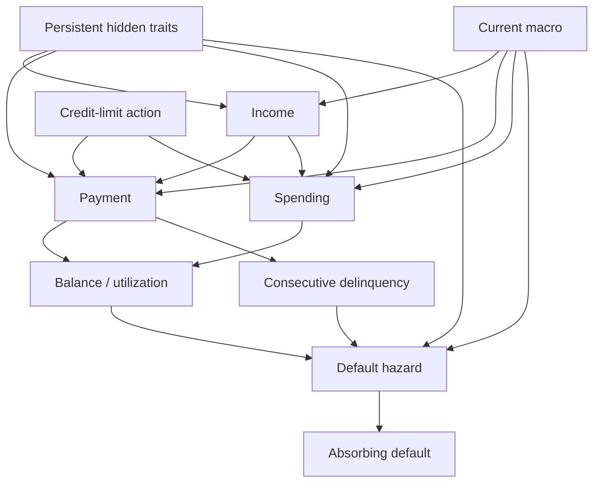
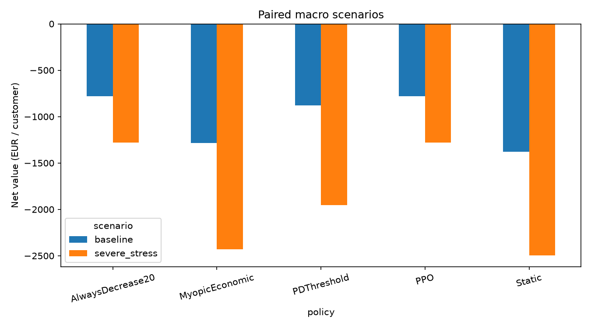

# Dynamic Credit-Limit Optimization under Partially Observed Credit Risk: A Synthetic Sequential Decision Framework

Technical working paper. This document describes a reproducible simulation study; it is not a peer-reviewed publication.

## Abstract

Repeated credit-limit decisions change purchasing capacity, repayment behavior and future exposure, creating a sequential trade-off between revenue and credit loss. We study this problem in a synthetic monthly simulator with persistent unobserved customer traits, correlated behavioral heterogeneity, exogenous macro regimes and absorbing default. A calibrated logistic model estimates 12-month default risk from point-in-time observable histories, using customer-disjoint chronological training, calibration and test cohorts. Static, risk-threshold, one-step myopic and PPO policies are compared on the same held-out customers and indexed random shocks. Constant maximum contraction provides an additional control for interpreting learned behavior. The canonical experiment trains three PPO seeds, evaluates baseline and severe-stress scenarios, and quantifies paired differences using customer and training-seed bootstrap resampling. The calibrated PD model achieves test ROC AUC 0.842 and Brier score 0.162. PPO improves baseline net value over MyopicEconomic by 505.82 EUR per customer (95% paired interval 282.94–706.40), while increasing default incidence by 14.33 percentage points. All three seeds reproduce constant maximum-contraction effective trajectories to numerical precision on the evaluation panel, so these gains do not establish learned planning. The experiment distinguishes discounted, penalized training reward from undiscounted net economic value and does not infer a continuation-value mechanism merely from superior returns. All behavioral coefficients, macro scenarios and economic parameters are synthetic; the study provides a controlled evaluation framework rather than evidence of real-bank effectiveness or regulatory suitability.

## 1. Introduction

A higher credit limit creates additional purchasing capacity but also permits larger exposure at default. It can reduce current utilization and change repayment incentives, so reducing limits need not monotonically reduce default probability. Repeated actions affect subsequent balances, behavior and future action opportunities. A one-step prediction problem therefore does not capture the entire decision process.

This study stabilizes an explicit synthetic experiment rather than proposing a new reinforcement-learning algorithm. The scientific question is whether standard PPO improves the declared objective over observable baselines under matched simulated conditions, and whether any improvement demonstrates a sequential mechanism. All results refer to the specified DGP. Separate portfolio allocation and off-policy studies in the repository address different estimands and are not pooled with this experiment.

## 2. Problem formulation

Customer $i$ has persistent hidden traits $Z_i=(z_i,h_i,p_i,k_i)$: creditworthiness, spending propensity, repayment propensity and income stability. At decision month $t$, the observable customer state contains balance $B_{it}$, limit $L_{it}$, monthly income $Y_{it}$, last purchases $C_{it}$, actual payment ratio $q_{it}$, consecutive delinquent months $d_{it}$, behavioral score, tenure and recent delinquency history. Macro state $M_t$ supplies current income growth, spending growth and credit stress.

The complete simulator state $X_t$ also includes traits, initial income/score anchors and recent observable history required by the PD model. A bounded 21-dimensional projection $O_t$ is supplied to the policy. The hidden state, true hazard, future outcomes, future macro states and future shocks are not policy inputs. Simulator diagnostic exports are separate research artifacts.

An action is an index selecting multiplier $a_t\in\{0.8,0.9,1,1.1,1.2\}$. Individual guards admit a limit $L'_t$ between 500 and 15,000 EUR and block increases after three consecutive delinquent months. The stochastic transition is $X_{t+1}\sim P(\cdot\mid X_t,a_t)$, implemented as a deterministic function of the current state, action and supplied indexed shocks. An episode follows the same customer until default or 24 transitions. Default is absorbing; no normal evolution or repeat loss is permitted afterward.

## 3. Synthetic data-generating process

Trait draws occur once per customer. A common normal factor plus residuals produces correlated creditworthiness, spending, payment and income-stability traits. Their numerical loading and transformation parameters are declared in `configs/simulation.yaml`. Trait persistence is tested explicitly. Initial snapshots are synthetic; their snapshot labels and simulated true PD are discarded before longitudinal decision making.

This graph specifies simulator dependencies, not a causal structure identified from banking data. The exact implemented equations, including clipping and coefficient names, appear in Appendix A. The central balance identity is $B'=B-P+C'$, with purchases capped by $\max(0,L'-(B-P))$. Outstanding debt is not forgiven when limits contract. Interest and fees are cash-flow proxies and are not capitalized into principal.

The transition uses current macro $M_t$ to evolve behavior and sample closing default. Only then is $M_{t+1}$ exposed. A stable customer/channel hash and NumPy SeedSequence identify seven shock channels: income normal/uniform, spending normal, payment normal, missed-payment uniform, score normal and default uniform. Each month's shock is indexed independently of action-dependent control flow. Policy differences therefore do not shift later exogenous draws.

## 4. Credit-risk model

For active customer $i$ at month $t$, the target is

$$Y_{i,t,H}=\mathbf1\{\text{first default occurs in }(t,t+H]\},\quad H=12.$$

A row is eligible only if its full target window lies within administrative follow-up. Among eligible rows, an observed event in the window is positive; complete event-free follow-up is negative; otherwise the row is excluded as censored. This avoids retaining near-end positive labels while discarding comparable unknown negatives. Post-default observations are excluded.

The 25-feature allowlist includes current limit, balance, utilization, income, payment ratio, delinquency, behavioral score, tenure, last purchases, recent late payments, income change and current macro factors. Historical summaries include lagged utilization, three-month mean utilization/payment, six-month extrema, income volatility and balance/income/limit changes. Rolling summaries exclude the current row; current information has separate features. Online inference uses the same feature calculation as offline construction. Tests poison future rows and verify unchanged earlier features.

Five disjoint cohorts occupy successive 25-month calendar blocks: training 2,500 customers, validation 800, calibration 800, test 1,000 and later entrants 1,000. Previous labels mature before the next observation block. The shared Markov calendar uses seed 412; dataset, DGP, behavior-policy, estimator and bootstrap seeds are 410, 411, 413, 414 and 415. Training behavior chooses the five actions with probabilities (0.1,0.2,0.4,0.2,0.1).

The logistic pipeline median-imputes features, adds missing indicators, standardizes and fits logistic regression with C=1 and max_iter=2000. Histogram gradient boosting uses 150 iterations, 15 leaves and L2 regularization 1, without early stopping. Imputation/scaling are fitted on training data only. A separate sigmoid calibration fits the log odds of each base model using calibration customers. The calibrated logistic model is predeclared for all decision policies; final test metrics do not select the estimator.

ROC AUC, average-precision PR AUC, Brier score and log loss are measured on mature snapshot targets. Customer-cluster bootstrap intervals preserve each customer's related labels. Calibration plots compare predicted 12-month PD with observed 12-month outcomes, not with the simulator's one-month conditional hazard. The actual model comparison is generated in Section 8.

## 5. Sequential decision framework

The full-state system admits an MDP representation. The observable process is partially observed because traits influence future behavior and hazard without being supplied to the policy. Let $H_t$ denote the full observable history. The finite-horizon objective is

$$J(\pi)=\mathbb E_\pi\sum_{t=0}^{T-1}\gamma^tR_t,\quad \gamma=0.98.$$

The conceptual history-based Bellman quantities are

$$V_t^\pi(h)=\mathbb E[R_t+\gamma V_{t+1}^\pi(H_{t+1})\mid H_t=h],\quad V_T=0,$$

$$Q_t^\pi(h,a)=\mathbb E[R_t+\gamma V_{t+1}^\pi(H_{t+1})\mid h,a],\quad A_t^\pi=Q_t^\pi-V_t^\pi.$$

The actor and critic use the compact $O_t$ rather than full $H_t$. This approximation does not establish that $O_t$ is Markov. Reward is opening-balance interest in nondefault months plus purchase fees, less realized loss, funding and soft capital/risk charges:

$$R_t=(1-D')B_t(0.18/12)+0.012C'-0.55D'B'-(0.03/12)B'-1.5(0.08)\widehat p_t B'-25(\widehat p_t-0.12)_+.$$

Net economic value omits the last two charges and is aggregated without discounting. Loss is counted exactly once at default. Revenue includes purchase fees even in a default month; no opening-balance interest is recognized then. The objective is a deliberately simplified economic proxy, with no terminal asset valuation.

## 6. Policies

Static always requests $a_t=1$. The risk-based implementation is named **PDThreshold**: request 1.1 if $\widehat p_t<0.2$, 0.9 if $\widehat p_t\geq0.6$, and 1 otherwise. **AlwaysDecrease20** requests 0.8 subject to individual guards and the minimum limit. These exact names appear in code and generated tables.

### MyopicEconomic

The myopic action maximizes an observable surrogate $\widetilde{\mathbb E}[R_t\mid O_t,a]$. Set monthly hazard $q=1-(1-\widehat p_t)^{1/12}$. For a candidate admitted limit, approximate payment by $P=\min(Bq_{payment},0.5Y)$ and purchases by

$$\widetilde C=\min((L'-(B-P))_+,C(L'/L)^{0.15}(1+g_{spend})).$$

Set $\widetilde B=B-P+\widetilde C$ and adjust hazard by

$$\widetilde q=\sigma\left(\operatorname{logit}(q)+(\widetilde B/L'-U)+0.3(\widetilde B-B)/Y\right).$$

Zero closing balance gives zero hazard. The surrogate applies the reward formula using $\widetilde q$, $\widetilde B$, $\widetilde C$ and current PD. It chooses the maximizing admitted action, preferring the smallest adjustment on ties. These risk sensitivities are fixed assumptions, not causal estimates. The baseline is useful because it explicitly optimizes immediate modeled economics without access to traits, future shocks or DGP calls.

### PPO

PPO's actor objective is

$$\mathbb E_t\min\left(r_t\widehat A_t,\operatorname{clip}(r_t,1-\epsilon,1+\epsilon)\widehat A_t\right),\qquad
r_t=\frac{\pi_\theta(A_t\mid O_t)}{\pi_{old}(A_t\mid O_t)}.$$

GAE uses $\widehat A_t=\sum_l(\gamma\lambda)^l\delta_{t+l}$ with $\delta_t=R_t+\gamma V_\phi(O_{t+1})-V_\phi(O_t)$. Default and the economic horizon have zero continuation in the training adapter. Public Gymnasium evaluation still returns termination at default and truncation at the horizon. Advantage estimates are normalized by the underlying PPO implementation.

| Hyperparameter | Standard value |
|---|---:|
| Training transitions per seed | 32,768 |
| Seeds | 101, 202, 303 |
| Actor / critic hidden layers | 64, 64 / 64, 64; tanh |
| Gamma / GAE lambda | 0.98 / 0.95 |
| Learning rate | 0.0003 |
| Clipping epsilon | 0.2 |
| Rollout / batch size | 512 / 128 |
| Epochs | 5 |
| Entropy / value coefficient | 0.01 / 0.5 |
| Maximum gradient norm | 0.5 |
| Reward scaling | EUR times 0.001 |
| Validation interval | 8,192 transitions, initialization and final update |

Hyperparameters are fixed from configuration; the canonical protocol performs no pilot search. Checkpoint selection maximizes validation mean discounted reward, retaining the earliest exact tie. Initialization is eligible. Every declared seed contributes to evaluation; there is no best-seed selection. CPU, one Torch thread and deterministic algorithms support repeatability within a recorded software environment.

## 7. Experimental design

PD cohorts and policy cohorts use distinct identity namespaces and random seeds. Policy training contains 1,500 customers, validation 100, and evaluation 300. Policy population seed is 73000; partition codes 11/22/33 identify training/validation/test draws. Per-customer initialization uses SeedSequence(master, partition, index, 1); Markov training paths use a separate final component 2. Shock roots use master plus partition code and stable customer/channel hashes.

The same held-out initial states, traits and shock paths are supplied to all policies and seeds. Baseline uses constant normal macro. Severe stress uses normal decisions 0–3, stress at severity 1.6 for 4–19, then normal for 20–23. The macro path is paired and fixed, so bootstrap intervals do not describe uncertainty over possible macro histories.

Each bootstrap replicate samples customers with replacement jointly across seeds, then samples PPO seeds with replacement. Paired policy differences are formed at the customer level before aggregation. There are 300 resamples, seed 73100. The resampling unit is never independent customer-months. Three seeds provide limited estimation of training variability; intervals should not be interpreted as universal policy rankings.

Default incidence uses initial customers. Credit losses, revenue and net value are per initial customer, including early-default episodes. Average limit and utilization first average observed months within a customer, then customers/seeds; these metrics are survival-dependent. Action fractions use observed transitions. Training reward includes capital/risk proxies while reported net value excludes them.

| Experiment | Config | Seeds | Command | Output |
|---|---|---|---|---|
| Smoke | main_evaluation.yaml: smoke | PPO 101; PD 410–415 | `python -m credit_rl.experiments.main_evaluation --profile smoke` | outputs/main/smoke |
| Canonical | main_evaluation.yaml: standard | PPO 101/202/303; population 73000; bootstrap 73100 | `python -m credit_rl.experiments.main_evaluation --profile standard` | outputs/main/standard |
| Figures | Saved canonical results | No resimulation | `python -m credit_rl.experiments.main_evaluation --profile standard --stage figures` | outputs/main/standard/figures |

Expanded configurations, package/source hashes and timestamps are recorded in the manifest. PD and selected PPO file hashes are recorded in `results/model_hashes.json`. Local models and raw histories are regenerated; no unversioned input is required.

## 8. Results

Tables below are generated from the same CSV files as the README. All monetary quantities are EUR per initial customer, default rates are fractions, and `lower`/`upper` are 95% bootstrap bounds. PD metrics use eligible snapshots; policy metrics use whole episodes. A numerically better net value does not imply better performance under every reward definition.

<!-- canonical-results:start -->

### Baseline

| policy | net_economic_value | revenue | credit_loss | default_rate | mean_limit | mean_utilization |
| --- | --- | --- | --- | --- | --- | --- |
| AlwaysDecrease20 | -779.428 | 385.293 | 1105.889 | 0.713 | 2794.781 | 1.098 |
| MyopicEconomic | -1285.245 | 1066.159 | 2191.299 | 0.570 | 11174.149 | 0.473 |
| PDThreshold | -880.473 | 862.116 | 1614.304 | 0.630 | 7189.632 | 0.708 |
| PPO | -779.428 | 385.293 | 1105.889 | 0.713 | 2794.781 | 1.098 |
| Static | -1379.340 | 1012.640 | 2237.257 | 0.640 | 7312.645 | 0.661 |

### Stress

| policy | net_economic_value | revenue | credit_loss | default_rate | mean_limit | mean_utilization |
| --- | --- | --- | --- | --- | --- | --- |
| AlwaysDecrease20 | -1280.840 | 301.699 | 1532.196 | 0.953 | 3423.447 | 1.074 |
| MyopicEconomic | -2430.560 | 596.680 | 2926.816 | 0.873 | 10290.866 | 0.495 |
| PDThreshold | -1953.059 | 477.893 | 2350.705 | 0.917 | 6452.382 | 0.736 |
| PPO | -1280.840 | 301.699 | 1532.196 | 0.953 | 3423.447 | 1.074 |
| Static | -2494.226 | 538.300 | 2940.479 | 0.913 | 7312.645 | 0.647 |

### Paired PPO differences (95% bootstrap)

| scenario | reference | metric | difference | lower | upper |
| --- | --- | --- | --- | --- | --- |
| baseline | Static | cumulative_reward | 3225.122 | 2821.154 | 3706.490 |
| baseline | Static | net_economic_value | 599.912 | 393.436 | 796.347 |
| baseline | Static | credit_loss | -1131.368 | -1301.271 | -955.382 |
| baseline | Static | defaulted | 0.073 | 0.037 | 0.115 |
| baseline | MyopicEconomic | cumulative_reward | 3156.257 | 2653.905 | 3670.037 |
| baseline | MyopicEconomic | net_economic_value | 505.817 | 282.939 | 706.396 |
| baseline | MyopicEconomic | credit_loss | -1085.410 | -1283.859 | -880.017 |
| baseline | MyopicEconomic | defaulted | 0.143 | 0.105 | 0.193 |
| severe_stress | Static | cumulative_reward | 2747.200 | 2505.704 | 3018.580 |
| severe_stress | Static | net_economic_value | 1213.386 | 1106.940 | 1331.399 |
| severe_stress | Static | credit_loss | -1408.284 | -1537.349 | -1288.953 |
| severe_stress | Static | defaulted | 0.040 | 0.020 | 0.060 |
| severe_stress | MyopicEconomic | cumulative_reward | 3012.293 | 2686.070 | 3330.624 |
| severe_stress | MyopicEconomic | net_economic_value | 1149.720 | 994.173 | 1294.821 |
| severe_stress | MyopicEconomic | credit_loss | -1394.620 | -1543.396 | -1224.009 |
| severe_stress | MyopicEconomic | defaulted | 0.080 | 0.052 | 0.112 |

### PD test performance

| model | roc_auc | pr_auc | brier | log_loss |
| --- | --- | --- | --- | --- |
| constant | 0.500 | 0.458 | 0.249 | 0.691 |
| logistic | 0.842 | 0.823 | 0.162 | 0.487 |
| logistic_calibrated | 0.842 | 0.823 | 0.162 | 0.486 |
| boosting | 0.846 | 0.831 | 0.161 | 0.485 |
| boosting_calibrated | 0.846 | 0.831 | 0.160 | 0.483 |

<!-- canonical-results:end -->

### PPO versus MyopicEconomic

PPO has higher net value than MyopicEconomic by **505.82 EUR/customer [282.94, 706.40]** under baseline and **1,149.72 [994.17, 1,294.82]** under stress. But every PPO seed reproduces the effective trajectories of constant 20% contraction to numerical precision on this evaluation panel (maximum checked difference 1.71e-13). Its default incidence is **14.33 percentage points higher** than Myopic under baseline and **8.00 points higher** under stress, despite lower monetary losses. These results support exposure contraction under the specified objective, not a demonstrated advantage from learned planning. All policies have negative mean net value.

The generated paired differences give economic effect size, realized-loss difference, default-rate difference and penalized reward difference under both scenarios. Both signs and uncertainty must be considered. The constant-contraction control is essential: an economic advantage over an imperfect one-step surrogate alone cannot identify learned planning. No clear evidence of sacrificing immediate reward to obtain later gains is established by these aggregate results.

## 9. Policy analysis

The map bins actual opening utilization and actor-visible PD, then averages requested limit changes across all seeds and scenarios. Empty bins are unobserved. Other state variables vary within bins, so this is neither a controlled policy slice nor a causal response estimate. Policy-seed tables retain training variability even when the average map conceals it.

The displayed customer is the lexicographically first test ID, selected before inspecting economic results. Every PPO seed is shown against the same customer's baselines. Lines terminate when the respective customer defaults or reaches the horizon. Cumulative penalized reward is labeled separately from net economic value. These examples illustrate behavior and do not prove a general continuation-value mechanism.

## 10. Stress testing

Stress jointly changes income growth, spending growth and credit stress. It affects income volatility and adverse-income shocks, repayment/missed-payment probabilities and default hazard. Table comparisons retain the same customers and indexed uniforms/normals, while changed thresholds induce different realized events. A higher default fraction can coexist with lower losses when exposure is reduced; monetary loss and incidence are distinct outcomes. Scenario comparisons are conditional interventions inside the specified simulator.

## 11. Limitations

All customer behavior, latent distributions, macro transition probabilities and structural coefficients are synthetic and not fitted to bank data. The closed book shrinks after default. Simplified repayment, principal-only accounting, fixed LGD and omitted terminal receivables affect the incentive to contract. The five-action menu limits expressiveness. The reward's PD-dependent charges are not regulatory capital, and real borrower welfare is absent.

The PD model is trained on synthetic behavior-policy trajectories. Deployment under another policy can change feature and outcome distributions, while its 12-month forecast is not action-specific. A flat-hazard conversion does not recover calibrated monthly risk. Myopic uses approximate dynamics and PPO has only a compact observation, so neither represents an optimal-information bound. Repeated fixed training paths may encourage simulator overfitting.

Bootstrap intervals condition on the PD fit, selected macro paths, fixed DGP and finite training seeds. They do not capture parameter uncertainty, model misspecification, cross-bank transport or real-world macro uncertainty. No multiple-comparison correction is used, and the study makes no significance-based ranking across all metrics. Supplementary portfolio/OPE studies have separate inference units and cannot validate this customer experiment by substitution.

## 12. Conclusion

The repository provides a controlled, reproducible way to evaluate sequential credit-limit decisions while separating hidden simulator risk from observable predictions. PPO improves net economic value over the myopic surrogate in both specified scenarios, but its effective trajectories match the fixed maximum-contraction control and its default incidence is higher. This is evidence of exposure reduction under the declared synthetic objective, not a demonstrated sequential-planning advantage. They do not establish that RL solves credit-limit optimization, that a learned sequential mechanism explains any advantage, or that these policies transfer to real portfolios. Such claims require stronger mechanism tests and independent empirical validation.

## Appendix A. Exact implemented monthly equations

The following equations use parameter names from `simulation.yaml`. sigma is the
stable logistic link; clip(x,a,b)=min(b,max(a,x)); normal shocks are clipped at +/-6.
Currency is EUR, time is months. Let m=M_t.credit_stress, g=M_t.income_growth and
w=M_t.spending_growth. Omit customer/month subscripts for readability.

### Effective limit

a_eff_pre=clip(A,1-max_monthly_decrease,1+max_monthly_increase).
L'=clip(L*a_eff_pre,min_limit,max_limit).
Requested change=A-1; effective change=L'/L-1.
Defaults are +/-20% monthly and EUR 500–15000 absolute limits. Existing actions
[0.8,0.9,1,1.1,1.2] remain. There is no hidden discretionary action override.

### Income

Let v=1-k. Monthly volatility:

sigma_Y=income_sigma*(1+income_unstable_volatility*v)*(1+income_stress_volatility*m).

J=1[U_income < clip(income_adverse_probability
+ income_stress_adverse_probability*m*v,0,1)].

delta=income_reversion*(log(Y0)-log(Y))
+ g*(1+income_macro_vulnerability*v)
+ sigma_Y*epsilon_income - sigma_Y^2/2 - income_adverse_log_drop*J.

Y'=clip(Y*exp(clip(delta,-income_max_log_drop,income_max_log_gain)),income_min,income_max).
The observed change is log(Y'/Y). Volatility is 0.025 base, multiplied by 1+2v and
1+0.5m; reversion is 0.08. Adverse-shock probability is 0.01+0.06*m*v, and its log
drop is 0.15. Monthly log changes are bounded to [-0.35,0.20], income to [300,30000].
The lognormal correction is approximate after clipping and jump shocks; no exact
stationary distribution is claimed. Initial income stays the mean-reversion anchor.

### Payment and persistent delinquency

u=B/L', b=B/Y'.
q*=sigma(logit(p)+payment_credit*z-payment_utilization*u-payment_burden*b
-payment_delinquency*d-payment_stress*m+payment_shock_sigma*epsilon_payment).

qbar=payment_persistence*q+(1-payment_persistence)*q*.
p_miss=sigma(missed_intercept+missed_utilization*u+missed_burden*b
+missed_delinquency*d-missed_credit*z+missed_stress*m).

If U_missed<p_miss: qbar=min(qbar,missed_payment_fraction).
P=min(B*qbar,payment_income_cap*Y'); q'=P/B for B>0, otherwise q'=1.

Q'=1[B>0 and q'<minimum_payment_ratio].
d'=d+1 if Q'=1, otherwise d'=0. Shift history and append Q'.

Payment persistence is 0.5; affordability cap is 50% of monthly income; minimum
principal payment is 5%, and a missed event caps repayment at 2%. Existing coefficients
for utilization, burden, delinquency and creditworthiness were retained. Better payment
propensity raises willingness, but affordability/missed-payment events can bind.
This is not an aged contractual arrears ledger. Diagnostic buckets min(d',3) denote
current/one/two/three-plus consecutive shortfalls, not regulatory 30/60/90 DPD.
Allowed paths include entry, cure, worsening and stochastic default from severe states.

### Spending, principal and utilization

Individual limit elasticity:
beta_i=clip(spend_limit_elasticity*h^spend_elasticity_loading,0,spend_max_elasticity).
Defaults: beta_i=min(0.15*h,0.60).

base=spend_persistence*C+(1-spend_persistence)*spend_income_fraction*Y'*h.
demand=base*(1+w)*exp(beta_i*log(L'/L)
+spend_shock_sigma*epsilon_spending-spend_shock_sigma^2/2).

headroom=max(0,L'-(B-P)); C'=min(demand,headroom).
B'=B-P+C'; utilization'=B'/L'.

Demand is evaluated in log space with its exponent capped at log(headroom) before
exp. No independent balance draw occurs. A limit increase does not create purchases
equal to the increase. Its response depends on h, prior spend/income, shocks and
whether headroom binds. In unconstrained demand, d log(C')/d log(L'/L)=beta_i.
At headroom constraints the realized response differs.

Existing debt can exceed the reduced limit and is not forgiven. New purchases are
zero when post-payment debt exceeds the limit. Utilization is never clipped to one.
Interest/fees are **not capitalized**; B is principal only. The balance tracks principal rather than capitalized interest.

### Behavioral score

s'=clip(s+score_reversion*(s0-s)-score_delinquency_drop*Q'
+score_payment_gain*q'+score_noise*epsilon_score,score_min,score_max).

Defaults: 0.1 mean reversion, -18 on delinquency, +4*q', noise scale 3, bounds 300–950.
Score is an observed smoothed proxy and not a direct encoding of hidden z or p*.

### Hidden default hazard

For positive B', the **exact default coefficients** are:

logit(p*) = -6 + 1.2*(B'/L') + 0.45*(B'/Y') + 0.65*d'
+ 0.6*(1-q') - 0.8*z + 0.9*m + 1.5*max(0,-log(Y'/Y)).

For B'=0, p*=0. Draw D'=1[U_default<p*]. p* is simulator truth, not real-world
truth. The normal logistic is implemented with logaddexp for numerical stability.
There is no direct raw-limit coefficient. Higher delinquency/burden/stress raise
hazard holding other inputs fixed; better z lowers it. Policy effects need not be
monotonic: increased headroom can lower utilization and raise repayment while also
raising purchases/exposure. Different customers can have different responses.

