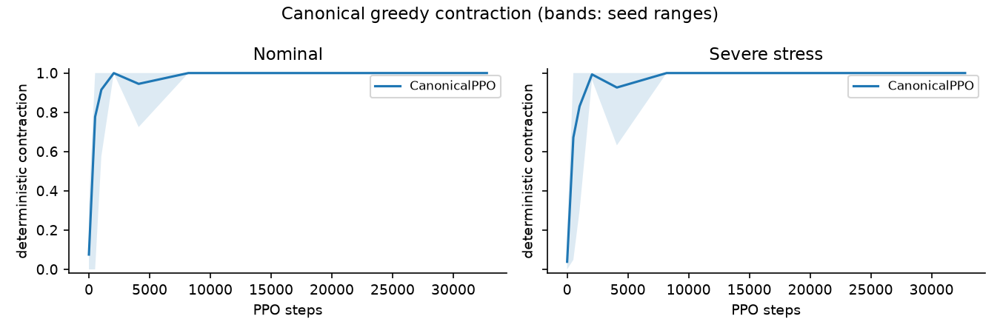
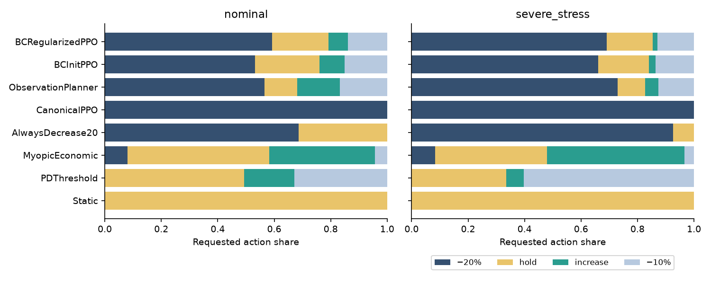
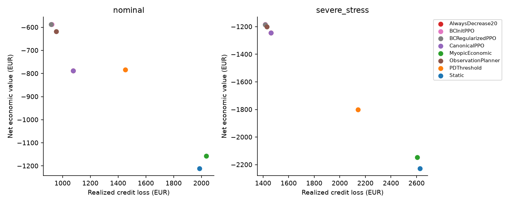
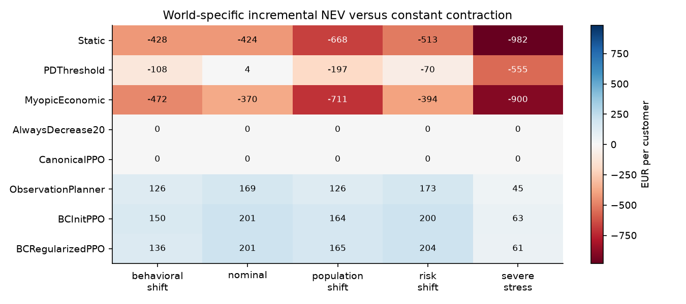
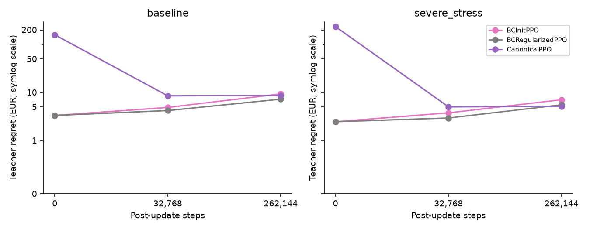
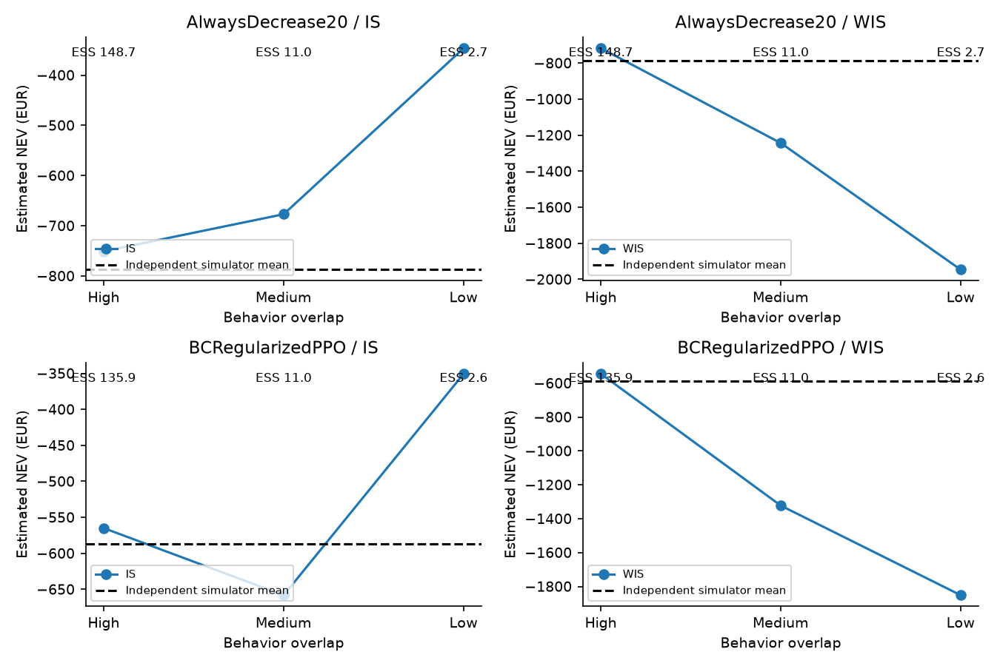

# Learning versus simple rules in synthetic dynamic credit-limit decisions

## Abstract

We study repeated credit-limit decisions in a fully synthetic partially observed consumer-credit environment. A canonical PPO agent initially appears economically competitive but rapidly approaches behavior equivalent to constant maximum contraction. Structural diagnostics find state-dependent and multi-step opportunities, and observable-state planners recover useful decision information. Controlled optimization experiments do not identify a single universal explanation for PPO's behavior, whereas actor initialization substantially changes learning trajectories. We compare public-state imitation initialization with a small behavior-cloning regularizer during on-policy learning. At the primary budget, initialized policies improve net economic value relative to contraction across the declared worlds, while reward improvement under severe stress is not established. The regularizer does not establish additional net economic value beyond initialization alone in both macro scenarios. Preservation and economic improvement are distinct, and the justification for learned policy complexity remains conditional on the objective and synthetic model.

## 1. Introduction

A credit limit changes future exposure and the customer's modeled ability to spend and repay. Optimizing a sequence of limits is therefore more than predicting default. Nevertheless, a sophisticated policy should earn its complexity against strong simple controls. This study asks whether observable decision information can initialize or regularize PPO so that useful decisions survive training and generalize across adverse conditions. A negative answer is a valid outcome.

The study proceeds from structural opportunity to information availability, optimization dynamics, initialization and final generalization. Historical protocols and negative results are preserved. The final experiment adds one auxiliary objective, not a new algorithm family, reward design or simulator.

## 2. Problem formulation

The full simulator state contains current customer balances, limit, payment, income, delinquency, score, recent history, macro state and persistent hidden traits. Its transition is Markov conditional on indexed shocks. The actor receives a bounded 21-dimensional public projection and chooses one of five requested limit multipliers: 0.8, 0.9, 1, 1.1 or 1.2. Admission bounds limits to EUR 500–15,000 and blocks increases after severe delinquency. Existing debt is never forgiven by contraction. Default is absorbing and surviving episodes end after 24 transitions.

For public history $H_t$ and horizon $T$, the conceptual objective is

$$J(\pi)=\mathbb{E}_\pi\sum_{t=0}^{T-1}\gamma^tR_t,\qquad \gamma=0.98.$$

$$Q_t^\pi(h,a)=\mathbb{E}[R_t+\gamma V_{t+1}^\pi(H_{t+1})\mid H_t=h,A_t=a],\qquad V_T^\pi=0.$$

The implemented feedforward actor and critic approximate these quantities from the current observation. Value is expected remaining reward, not estimated PD.

## 3. Synthetic data-generating process

Persistent correlated traits govern creditworthiness, spending propensity, payment propensity and income stability. Initial snapshots are synthetic; future labels and the true generating hazard are excluded from policy inputs. Current macro factors and the admitted limit influence income, repayment and purchases. Purchases are capped by remaining headroom after payment. The central identity is $B_{t+1}=B_t-P_t+C_{t+1}$. Utilization may exceed one after contraction. Delinquency and score update before a closing default event is sampled from the hidden hazard. The next macro state is exposed afterward.

Indexed customer/month shock channels remain aligned across policies despite action-dependent defaults or transitions. This implements common random numbers without coupling the policy to future information. Exact equations are preserved in Appendix A and parameters in `configs/simulation.yaml`.

## 4. Partial observability

The actor sees elapsed time, current limit, balance, utilization, payment, delinquency, income, score, estimated PD, spending, recent late payments, tenure, income change and current macro features. Hidden traits and future shocks remain inside the simulator. The observation is not guaranteed to be a sufficient Markov state. Privileged diagnostic rollouts condition on a complete visited state; those objects are never passed to the final learner. Simulator-derived offline labels are still a form of model-based supervision and do not imply that such labels are freely available in real lending data.

## 5. PD estimation

The risk target is first default within the next 12 months among active, administratively observable rows. Eligibility requires a complete target window; post-default rows are excluded. Customer and calendar partitions separate fitting, validation, calibration and evaluation. Historical features use past information only, and online/offline feature construction is tested for agreement.

The frozen canonical estimator is median-imputed, standardized logistic regression with separate sigmoid calibration. Boosting remains an earlier diagnostic comparator, not a final policy-selection instrument. Calibration of a 12-month estimated PD is distinct from matching the simulator's one-month latent hazard. The model is learned from the same synthetic family and provides no independent real-bank validation.

## 6. Economic objective

The reward combines interest and fee income minus realized credit loss, funding cost, a modeled capital charge and a soft PD penalty. In the canonical parameters,

$$R_t=(1-D_{t+1})B_t\frac{0.18}{12}+0.012C_{t+1}-0.55D_{t+1}B_{t+1}-\frac{0.03}{12}B_{t+1}-1.5(0.08)\widehat p_t B_{t+1}-25\max(0,\widehat p_t-0.12).$$

Reported NEV excludes the final capital and risk terms and is undiscounted. Discounted reward and NEV can therefore disagree. Neither terminal principal liquidation nor an adequate customer-welfare objective is modeled. Both default and the finite economic horizon terminate PPO bootstrapping.

## 7. Baseline policies

Static holds the requested limit. PDThreshold applies predeclared thresholds. MyopicEconomic optimizes an approximate immediate economic value. AlwaysDecrease20 applies maximum admissible contraction, using the existing legal-action helper to return hold when contraction is inadmissible. ObservationPlanner predicts action values from the public observation using the frozen F0 estimator and chooses a legal action with a fixed tie rule. Admission may map distinct requested commands to the same effective limit; requested and effective agreement are distinguished. Consequently the contraction rule can have positive requested-action diversity at the limit floor while producing the same effective outcomes as an actor that always requests contraction. Diversity alone is not evidence of a learned economic decision boundary.

The working constrained-policy infrastructure is a secondary portfolio-allocation study. The final [secondary benchmark table](../outputs/main/final/constrained_secondary.csv) carries forward Static, RiskBased, Decrease20, PPO_hard and PPO_penalty under the existing normal-medium and stress-medium budget cases. It reports value, default and constraint-violation rates. Original feasibility, paired comparisons and OPE remain under `outputs/results/portfolio/standard/`. Portfolio interactions and its separate cohorts make direct pooling with the individual-customer table inappropriate.

## 8. PPO

Canonical PPO uses separate 64-by-64 Tanh actor and critic networks, gamma 0.98, GAE lambda 0.95, rollout length 512, minibatches of 128 and five optimization epochs. Learning rate, clipping, entropy/value weights, reward scaling and maximum gradient norm remain canonical. A fixed Markov training population is distinct from baseline validation and final test customers.

The clipped actor surrogate uses minibatch-normalized GAE; the critic fits rollout returns. Checkpoint selection maximizes baseline validation discounted raw reward, with earliest ties retained. Validation at a rollout boundary precedes that pending update, while the final callback also evaluates the completed final update. Selected checkpoints and post-update temporal checkpoints are therefore different estimands.

## 9. Structural diagnosis

Canonical contraction is not universally optimal under the tested fixed continuations. Independent action rollouts find visited states in which hold or increases yield better estimated continuation value. The preferred action varies with state and horizon. These are estimates conditional on the synthetic model and continuation policy, not a proof of globally optimal control.

## 10. Information and planning gap

The frozen observable-state planner recovers substantial useful decision information. Earlier history-augmented and privileged-information benchmarks did not establish a robust additional advantage with the fitted models and budgets used. That limits the claim: insufficient information alone does not explain canonical PPO's failure, but the experiments do not prove that memory or latent information can never help.

## 11. PPO optimization dynamics

Greedy contraction develops before stochastic exploration disappears. Controlled variations in entropy, critic capacity and updates, GAE, discount and network size did not yield one universal causal explanation. Longer training partially recovers state dependence, particularly in nominal conditions. Diagnostics of normalized advantages also do not support uniformly negative average pressure on all teacher-preferred noncontraction actions.

## 12. Policy initialization

The frozen public F0 teacher supplies hard labels on natural training visits. Imitation fits the canonical actor; only actor weights transfer into PPO, leaving a matched random critic. This treatment, renamed BCInitPPO in the final suite, is unchanged from the historical experiment. The learner receives no teacher signal after initialization.

Initialization substantially changes behavior relative to random initialization. It preserves multiple effective actions at the primary budget but does not completely preserve the teacher boundary. Increase regions are especially vulnerable. A decrease in teacher agreement can coexist with better nominal economic reward, so agreement alone is not evidence of policy quality.

## 13. Offline-to-online policy learning

The only new treatment adds

$$L(\theta,\phi)=L_{\mathrm{PPO}}(\theta,\phi)+\beta_t\,\mathbb{E}_{(O,a_T)\sim D_{\mathrm{train}}}[-\log\pi_\theta(a_T\mid O)].$$

The learner receives only 21 public features and hard labels from the same frozen teacher. Auxiliary batches sample natural training visits uniformly with an independent RNG. No latent variables, future outcomes, test observations or teacher Q targets enter optimization. The combined gradient is clipped once. BC0 delegates to the canonical update and is checked against the historical BCInit checkpoints.

Only beta zero and a single candidate beta of 0.05 under constant or linear decay are admitted. Five short runs per regularized schedule determine selection on baseline validation. The better schedule is retained even if unregularized BCInit is better, preserving an interpretable negative treatment. The selected schedule is then trained at the extended budget without reselection. Decay is relative to the run's declared total budget, so short and long regularized runs do not have identical coefficient trajectories.

The primary endpoint uses validation-selected deterministic policies. Teacher preservation additionally compares initialization and final post-update snapshots on the fixed historical validation panel. That diagnostic panel is not final economic evidence. All schedules and seeds are retained.

## 14. Robustness and distribution shift

A new cohort of 150 customers shares identities and shock paths across policies and five declared worlds. Nominal and the original severe-stress path are separate. Population shift reassigns the traits of a fixed random quarter of customers from the bottom-creditworthiness quartile, preserving initial observed snapshots and empirical trait support. Behavioral shift moderately changes existing spending elasticity, repayment persistence and payment-income caps. Risk shift moderately increases existing utilization and debt-to-income hazard sensitivities. Exact values were frozen before outcomes.

Policies retain their nominal assumptions and are not recalibrated. Report world mean, dispersion, minimum and paired degradation from nominal. Minimum performance over five designed worlds is not distributionally robust optimization or a forecast. Tail loss uses the mean of the largest five percent of episode credit losses, with the finite-sample ceiling convention.

Initial public PD, utilization and income buckets define customer-level descriptive cohorts in `customer_heterogeneity.csv`; each row reports full-episode value and risk. Separate visit-level PD, utilization, income and horizon buckets describe occupancy in `heterogeneity.csv`. Visit occupancy can itself change with policy. Neither analysis is ITE/CATE or a causal subgroup effect.

## 15. Counterfactual preservation and improvement

Fresh held-out natural visits under a fixed mixture of canonical PPO, public planner and myopic policies form the final counterfactual panel. One draw bank selects the preferred legal first action; a disjoint bank estimates differences. All actions share shocks and the same frozen canonical continuation over at most 12 months. No policy receives these diagnostic latent snapshots during fitting.

The resulting signed regret can be negative because selection and evaluation use independent finite Monte Carlo banks. We report mean, median and upper quantiles, regional regret, and beneficial/harmful deviations from the public teacher. The teacher is approximate, the continuation is fixed, and the experiment measures a first-action deviation, not lifetime optimal-policy regret. Small state panels and finite draw counts limit precision.

## 16. Off-policy evaluation

The final OPE reuses the existing episodic IS/WIS estimators. Logging behavior chooses each deterministic target's command with probability 0.95, 0.70 or 0.30 and spreads the remainder over the other commands. Propensities refer to requested actions, even when admission makes commands equivalent. This construction isolates overlap effects while keeping full one-step support.

Five logging replicates per learned seed are compared with independent simulator NEV. The target estimand is undiscounted NEV, not PPO's discounted reward. Bias and RMSE use that finite Monte Carlo reference; interval coverage therefore is reference coverage, not exact coverage of an analytically known population value. Report ESS, zero weights, valid bootstrap counts and undefined WIS explicitly. Low trajectory overlap can defeat useful estimation despite positive one-step support. No new causal framework, DR model or PDIS implementation is introduced.

## 17. Final results and statistical design

H1 tests retained state dependence, H2 reduced boundary erosion, H3 the distinction between preservation and economic value, H4 scenario dependence, H5 ID versus OOD degradation and H6 the absence of a superiority claim for ID-only gains. Confirmatory comparisons are BCInit versus canonical PPO; BCRegularized versus BCInit, contraction and myopic; and BCRegularized world degradation. Other contrasts are exploratory.

Economic intervals resample matched training seeds and customers. Behavioral intervals recompute visit statistics after the same paired cluster resampling. Worst-world intervals recompute the minimum world mean within each replicate; they do not select one worst world and ignore its uncertainty. Intervals are marginal, not simultaneous familywise guarantees. Deterministic baselines repeat seed identifiers for matching but acquire no artificial training variance. All five seeds are retained. Results are conditional on the fixed synthetic model and evaluation design.

<!-- final-measured:start -->
Primary budget: **32,768 steps**. Values are synthetic EUR per customer; diversity is one minus the largest requested-action share. Default and diversity below refer to nominal.

| Policy | Baseline NEV | Stress NEV | Baseline reward | Stress reward | Default | Diversity | Worst-world NEV |
|---|---:|---:|---:|---:|---:|---:|---:|
| Static | -1211.2 | -2227.9 | -4269.0 | -4590.4 | 66.7% | 0.000 | -2227.9 |
| PDThreshold | -783.5 | -1800.5 | -3224.7 | -3755.3 | 64.0% | 0.507 | -1800.5 |
| MyopicEconomic | -1157.7 | -2146.2 | -4526.2 | -4756.3 | 56.0% | 0.498 | -2146.2 |
| AlwaysDecrease20 | -787.6 | -1245.7 | -2107.0 | -2545.0 | 75.3% | 0.313 | -1245.7 |
| CanonicalPPO | -787.6 | -1245.7 | -2107.0 | -2545.0 | 75.3% | 0.000 | -1245.7 |
| ObservationPlanner | -618.2 | -1201.1 | -2036.3 | -2556.0 | 67.3% | 0.435 | -1201.1 |
| BCInitPPO | -586.9 | -1182.3 | -2024.1 | -2567.8 | 65.3% | 0.467 | -1182.3 |
| BCRegularizedPPO | -586.8 | -1184.6 | -2010.4 | -2562.4 | 64.9% | 0.407 | -1184.6 |

Incremental NEV of BCRegularizedPPO over AlwaysDecrease20 (paired 95% intervals):

| Budget | World | Difference | 95% interval | Seeds | Customers |
|---:|---|---:|---:|---:|---:|
| 32,768 | nominal | 200.8 | [120.7, 293.0] | 5 | 150 |
| 32,768 | severe_stress | 61.1 | [32.8, 96.7] | 5 | 150 |
| 32,768 | worst_world | 61.1 | [32.3, 97.4] | 5 | 150 |
| 262,144 | nominal | 238.9 | [152.6, 338.7] | 5 | 150 |
| 262,144 | severe_stress | 59.6 | [31.1, 94.5] | 5 | 150 |
| 262,144 | worst_world | 59.6 | [31.9, 91.8] | 5 | 150 |

Validation selected **decay**, β₀=0.05. Mean validation reward: -1894.02; BC0: -1890.94. The latter comparison is descriptive and did not trigger additional tuning.

Intervals are marginal, conditional on the synthetic simulator, and do not establish real-bank population effects. Full intervals, stress interactions, both budgets and all five worlds are retained in the supporting CSVs.

Final classification: **SequentialValue: conditional; Learnability: initialization-sensitive; Robustness: scenario-dependent; ComplexityValue: conditionally justified.**

Regularization versus initialization alone (primary budget; paired 95% intervals):

| Scenario | NEV difference | Reward difference |
|---|---:|---:|
| nominal | 0.2 [-33.4, 42.5] | 13.7 [-10.2, 42.5] |
| severe_stress | -2.3 [-18.0, 13.0] | 5.4 [-6.4, 21.1] |

Learned sequential control adds net economic value over contraction across the declared worlds, but does not establish a reward improvement in every world. Its complexity is justified conditionally on the economic objective and synthetic setting, not by universal policy superiority. The additional BC regularizer does not establish an incremental NEV gain over initialization alone in both macro scenarios.
<!-- final-measured:end -->

Complete tables, per-customer episodes, behavior counts, validation alternatives, counterfactual banks and OPE logs remain under `outputs/main/final/`. Main numbers above are regenerated from CSVs rather than entered manually.

## 18. Discussion

The evidence should distinguish decision opportunity, information availability, optimization sensitivity and economic usefulness. Structural opportunity does not imply that an optimizer discovers it. Successful imitation does not establish that the teacher is optimal. Better teacher preservation does not imply improved NEV or reward. A nominal gain does not establish robustness.

The central comparison is incremental value over AlwaysDecrease20, including stress and the worst declared world. Policy sophistication earns its complexity only when that gain is credible for the stated objective and conditions. The generated final classification reports the observed outcome without suppressing unfavorable schedules, seeds or worlds.

## 19. Limitations

This is a fully synthetic environment without real-bank calibration. Behavioral response is stylized; default and recovery are simplified; the PD model comes from the same synthetic family. There are few macro scenarios and only five training seeds. The public teacher is approximate and its offline labels require simulator information. The reward is a modeling choice, while NEV excludes some reward components. Customer welfare is not adequately modeled for production. No regulatory validity or deployment readiness is claimed. Distribution shifts are designed experiments, not forecasts. Counterfactual and OPE references have Monte Carlo error, and exploratory diagnostic findings do not uniquely identify optimization mechanisms.

## 20. Reproducibility and conclusion

Run `python -m credit_rl.experiments.final_evaluation --profile standard` with the frozen historical model artifacts, then `python -m credit_rl.experiments.final_report`. The smoke profile provides a portable integration check with tiny isolated fixtures when historical artifacts are absent; it is never scientific evidence. Historical outputs are hash-protected. The final manifest records the Git commit together with local source hashes because uncommitted local work is not described by HEAD alone.

The measured final classification above is the empirical answer to when sophisticated sequential policy learning earns its complexity over a simple credit-limit rule. That answer is conditional on this reproducible synthetic experiment; no additional scientific phase is proposed.

## Appendix A. Exact implemented monthly equations

The following equations use parameter names from `simulation.yaml`. sigma is the
stable logistic link; clip(x,a,b)=min(b,max(a,x)); normal shocks are clipped at +/-6.
Currency is EUR, time is months. Let m=M_t.credit_stress, g=M_t.income_growth and
w=M_t.spending_growth. Omit customer/month subscripts for readability.

### Effective limit

a_eff_pre=clip(A,1-max_monthly_decrease,1+max_monthly_increase).
L'=clip(L*a_eff_pre,min_limit,max_limit).
Requested change=A-1; effective change=L'/L-1.
Defaults are +/-20% monthly and EUR 500–15000 absolute limits. Existing actions
[0.8,0.9,1,1.1,1.2] remain. There is no hidden discretionary action override.

### Income

Let v=1-k. Monthly volatility:

sigma_Y=income_sigma*(1+income_unstable_volatility*v)*(1+income_stress_volatility*m).

J=1[U_income < clip(income_adverse_probability
+ income_stress_adverse_probability*m*v,0,1)].

delta=income_reversion*(log(Y0)-log(Y))
+ g*(1+income_macro_vulnerability*v)
+ sigma_Y*epsilon_income - sigma_Y^2/2 - income_adverse_log_drop*J.

Y'=clip(Y*exp(clip(delta,-income_max_log_drop,income_max_log_gain)),income_min,income_max).
The observed change is log(Y'/Y). Volatility is 0.025 base, multiplied by 1+2v and
1+0.5m; reversion is 0.08. Adverse-shock probability is 0.01+0.06*m*v, and its log
drop is 0.15. Monthly log changes are bounded to [-0.35,0.20], income to [300,30000].
The lognormal correction is approximate after clipping and jump shocks; no exact
stationary distribution is claimed. Initial income stays the mean-reversion anchor.

### Payment and persistent delinquency

u=B/L', b=B/Y'.
q*=sigma(logit(p)+payment_credit*z-payment_utilization*u-payment_burden*b
-payment_delinquency*d-payment_stress*m+payment_shock_sigma*epsilon_payment).

qbar=payment_persistence*q+(1-payment_persistence)*q*.
p_miss=sigma(missed_intercept+missed_utilization*u+missed_burden*b
+missed_delinquency*d-missed_credit*z+missed_stress*m).

If U_missed<p_miss: qbar=min(qbar,missed_payment_fraction).
P=min(B*qbar,payment_income_cap*Y'); q'=P/B for B>0, otherwise q'=1.

Q'=1[B>0 and q'<minimum_payment_ratio].
d'=d+1 if Q'=1, otherwise d'=0. Shift history and append Q'.

Payment persistence is 0.5; affordability cap is 50% of monthly income; minimum
principal payment is 5%, and a missed event caps repayment at 2%. Existing coefficients
for utilization, burden, delinquency and creditworthiness were retained. Better payment
propensity raises willingness, but affordability/missed-payment events can bind.
This is not an aged contractual arrears ledger. Diagnostic buckets min(d',3) denote
current/one/two/three-plus consecutive shortfalls, not regulatory 30/60/90 DPD.
Allowed paths include entry, cure, worsening and stochastic default from severe states.

### Spending, principal and utilization

Individual limit elasticity:
beta_i=clip(spend_limit_elasticity*h^spend_elasticity_loading,0,spend_max_elasticity).
Defaults: beta_i=min(0.15*h,0.60).

base=spend_persistence*C+(1-spend_persistence)*spend_income_fraction*Y'*h.
demand=base*(1+w)*exp(beta_i*log(L'/L)
+spend_shock_sigma*epsilon_spending-spend_shock_sigma^2/2).

headroom=max(0,L'-(B-P)); C'=min(demand,headroom).
B'=B-P+C'; utilization'=B'/L'.

Demand is evaluated in log space with its exponent capped at log(headroom) before
exp. No independent balance draw occurs. A limit increase does not create purchases
equal to the increase. Its response depends on h, prior spend/income, shocks and
whether headroom binds. In unconstrained demand, d log(C')/d log(L'/L)=beta_i.
At headroom constraints the realized response differs.

Existing debt can exceed the reduced limit and is not forgiven. New purchases are
zero when post-payment debt exceeds the limit. Utilization is never clipped to one.
Interest/fees are **not capitalized**; B is principal only. The balance tracks principal rather than capitalized interest.

### Behavioral score

s'=clip(s+score_reversion*(s0-s)-score_delinquency_drop*Q'
+score_payment_gain*q'+score_noise*epsilon_score,score_min,score_max).

Defaults: 0.1 mean reversion, -18 on delinquency, +4*q', noise scale 3, bounds 300–950.
Score is an observed smoothed proxy and not a direct encoding of hidden z or p*.

### Hidden default hazard

For positive B', the **exact default coefficients** are:

logit(p*) = -6 + 1.2*(B'/L') + 0.45*(B'/Y') + 0.65*d'
+ 0.6*(1-q') - 0.8*z + 0.9*m + 1.5*max(0,-log(Y'/Y)).

For B'=0, p*=0. Draw D'=1[U_default<p*]. p* is simulator truth, not real-world
truth. The normal logistic is implemented with logaddexp for numerical stability.
There is no direct raw-limit coefficient. Higher delinquency/burden/stress raise
hazard holding other inputs fixed; better z lowers it. Policy effects need not be
monotonic: increased headroom can lower utilization and raise repayment while also
raising purchases/exposure. Different customers can have different responses.

## Final empirical answer

When does sophisticated sequential policy learning earn its complexity over a simple credit-limit rule?

<!-- final-conclusion:start -->
Learned sequential control adds net economic value over contraction across the declared worlds, but does not establish a reward improvement in every world. Its complexity is justified conditionally on the economic objective and synthetic setting, not by universal policy superiority. The additional BC regularizer does not establish an incremental NEV gain over initialization alone in both macro scenarios.
<!-- final-conclusion:end -->
